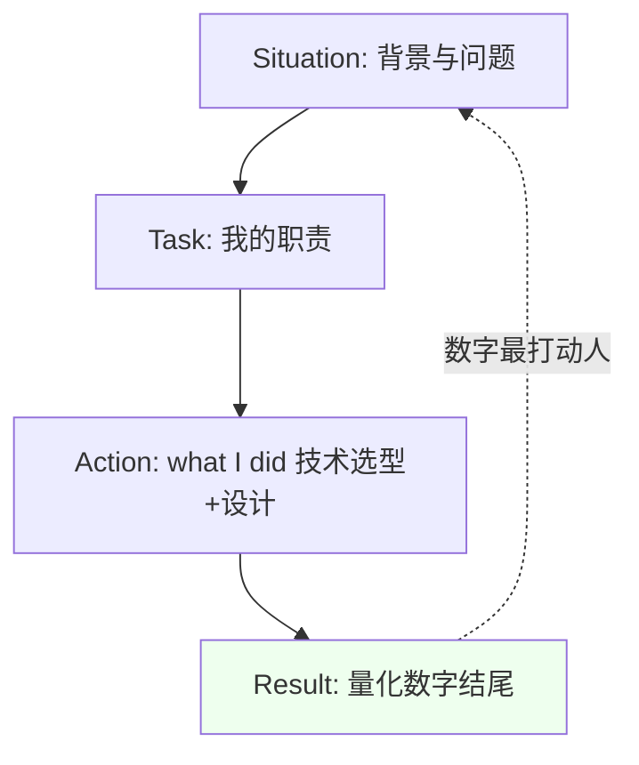
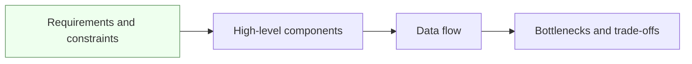
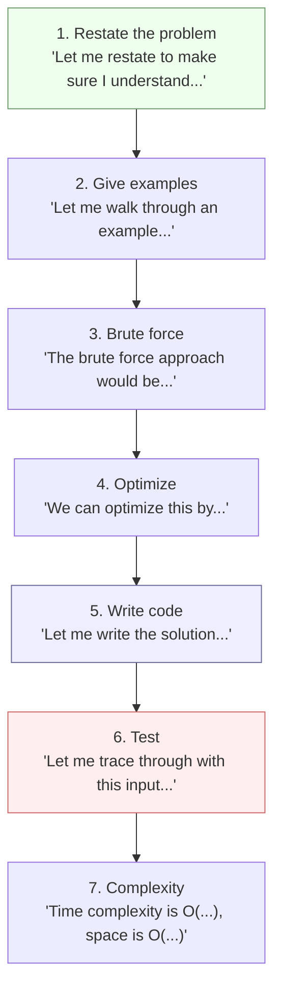

> 我的经历里 **XTransfer（跨境支付）+ 欧凡（海外直播电商）** 都吃"出海/国际化"这碗饭，面试外企或出海团队时，英文面概率明显更高。技术英语面试的核心不是"说得花"，而是**在压力下把技术逻辑说清楚**。本文给一套可复用框架 + 词汇表 + 训练法，直接套。

## 一、30 秒英文自我介绍

**结构**：当前角色/年限 → 技术专长 → 一个量化结果。

**模板**：
> "I'm a backend engineer with X years of experience, mainly working on Java and distributed systems."
> "I focus on payment reliability, data consistency, and performance tuning."
> "In my latest project, we improved fund success rate to 99.2% and achieved zero fund loss after redesigning the transaction pipeline."

**我的版本（贴合背景）**：
> "I'm a backend engineer with around 8 years of experience, focused on **cross-border payment** and **high-concurrency transaction systems**. At XTransfer I led the redesign of the inbound collection platform using state-machine + event-driven architecture, reaching 99.2% success rate with **zero fund loss**. I'm comfortable with Java/Spring, Dubbo, distributed transactions, and turning messy money flows into observable, compensable pipelines."

**【深度拓展】** 英文自我介绍最容易翻车的是「背稿感」——一旦面试官追问 "could you elaborate on the state machine part"，就接不住。所以版本要**模块化**：角色 / 专长 / 一个亮点数字 三块可独立重组。另一个深度点是**数字要敢说且能 defend**：99.2% / zero fund loss 是强钩子，但必须准备好被追问 "how did you measure that"——回答要落到 "before/after comparison: production incidents dropped 80%, and T+1 reconciliation closed the loop on fund consistency"。英文面不考语法华丽，考的是「压力下把因果链说圆」。

**【项目支撑】** 我的英文自我介绍全部取自 XTransfer 真实经历：state-machine + event-driven 是 2.0 重构的真实架构选型；zero fund loss 是真实 KPI（事前幂等 + 事中告警 + 事后 T+1 对账三道防线）；"observable, compensable pipelines" 对应任务补偿机制。海外电商（欧凡）的多币种/多时区经验也能补一句 "I've also built overseas e-commerce systems handling multi-currency and multi-timezone constraints"，强化出海匹配度。

## 二、用英文讲项目（STAR）

**顺序**：Situation → Task → Action → Result。

**模板**：
> "The main issue was high timeout rates and inconsistent fund state during peak traffic."
> "I was responsible for redesigning the transaction core."
> "I introduced a state machine + event sourcing, idempotent callbacks, and a task-compensation mechanism."
> "As a result, timeout errors dropped sharply and we hit zero fund loss with 99.2% success."

**中文思路 → 英文套壳**：每讲一个点，先说 problem，再说 what I did，最后给 number。数字最打动人，别光讲架构。

**【深度拓展】** STAR 在英文面里最忌「平均用力」——S 和 T 讲太久，A 和 R 没时间。建议配比：**S/T 占 20%，A 占 50%，R 占 30%**。面试官最想听的是 Action 里的**技术决策逻辑**（why this not that），而不是流程复述。R 一定要给「前后对比数字」而非形容词（"much better" 没用，"incidents down 80%" 才有用）。被追问细节时，用 "Let me drill down into the compensation part" 主动展开子模块，展示掌控力。

**【项目支撑】** 我讲 XTransfer 2.0 重构的英文 STAR：
- **S/T**："The legacy collection flow was scattered if/else with fund-state bugs and frequent production incidents; as domain owner I was tasked to make it evolvable and zero-loss."
- **A**："I introduced a state machine to reject illegal transitions, event-driven downstream via MQ, and a task-compensation framework for eventual consistency; product differences were externalized through SPI + config."
- **R**："Dev efficiency +30%, production incidents -80%, and zero fund loss. New collection products now land with near-zero change to the core."

**STAR 英文表达流程**：

## 三、系统设计讲解顺序（固定套路）

按这个顺序讲，面试官最好跟：
1. **Requirements & constraints**（需求与约束）
2. **High-level components**（高层组件）
3. **Data flow**（数据流）
4. **Bottlenecks & trade-offs**（瓶颈与取舍）

**模板**：
> "At a high level, the system has three parts: gateway, service layer, and storage."
> "Requests go through rate limiting first, then fan out to stateless services."
> "The key trade-off here is **consistency versus latency**—we chose eventual consistency for the read path."

**系统设计英文讲解顺序图**：

**英文系统设计完整回答模板**（可直接套用）：

> **Step 1 - Requirements**：
> "Let me start by clarifying the requirements. Are we designing for read-heavy or write-heavy workloads? What's the expected QPS and data volume? Do we need strong consistency or is eventual consistency acceptable?"
>
> **Step 2 - High-level design**：
> "At a high level, I'd structure the system into three layers: an API gateway for rate limiting and authentication, a service layer for business logic, and a storage layer with Redis for caching and MySQL for persistence."
>
> **Step 3 - Data flow**：
> "When a request comes in, it first hits the gateway for auth and rate limiting, then routes to the service layer. The service checks Redis first; if it's a cache miss, it queries the database and writes back to the cache. For write operations, we use async processing via Kafka to decouple and smooth out peaks."
>
> **Step 4 - Bottlenecks**：
> "The main bottlenecks I see are: first, the database under high concurrency — we can mitigate with read replicas and sharding. Second, cache consistency — we use the cache-aside pattern with a short TTL plus binlog subscription for eventual consistency. Third, single points of failure — we deploy multiple instances with health checks and auto-failover."
>
> **Step 5 - Trade-offs**：
> "The key trade-off here is consistency versus latency. For the payment path, we chose strong consistency with synchronous writes and distributed locks. For the read path, we chose eventual consistency with caching — it adds ~5ms latency on cache miss but improves throughput by 10x."
>
> **Step 6 - Scale up**：
> "If QPS grows 10x, I'd: horizontally scale stateless services, shard the database by merchant ID, add a CDN for static content, and use Kafka to buffer write spikes. The architecture should scale linearly with these changes."

**英文系统设计常用句式库**：

| 场景 | 英文句式 |
| --- | --- |
| 确认需求 | "Let me clarify the requirements first..." / "What's the expected QPS and data volume?" |
| 画架构图 | "Let me draw a high-level diagram..." / "The system consists of three main components..." |
| 讲数据流 | "When a request comes in, it first..." / "The data flows from X through Y to Z..." |
| 讲瓶颈 | "The main bottleneck I see is..." / "Under peak load, X might become a bottleneck..." |
| 讲取舍 | "The trade-off here is X versus Y..." / "We chose X at the cost of Y..." |
| 讲扩展 | "If we need to scale 10x, I would..." / "To handle higher throughput, we can..." |
| 讲容错 | "For fault tolerance, we..." / "If X fails, the system falls back to Y..." |
| 讲一致性 | "We use eventual consistency for..." / "Strong consistency is required for..." |
| 承认不确定 | "I'm not 100% sure about the exact number, but I'd estimate..." |
| 主动展开 | "Let me drill down into the X part..." / "I can elaborate on that if you'd like." |

## 四、取舍题（trade-off）英文框架

面试官更看重你的**决策逻辑**，不是选 A 还是 B。

**模板**：
> "Option A is simpler and faster to ship, but less flexible."
> "Option B has better long-term scalability, with higher initial complexity."
> "Given the current deadline and team size, I'd choose A first and plan a migration path to B later."

**我的支付例子**：
> "For idempotency, we could use a unique request key with a DB unique index (simple, strong), or a Redis token bucket (fast, but needs reconciliation). We chose the DB unique key as the source of truth, with Redis as a fast pre-check—balancing correctness and latency."

**【深度拓展】** Trade-off 题的英文表达关键是「**不说哪个选项对，只说权衡**」。句型库要熟练：
- "The trade-off is X versus Y — we picked X because of [constraint], at the cost of [downside]."
- "Option A is simpler to ship but less flexible; given the deadline we chose A first, with a migration path to B."
- "Under peak load we observed [symptom], so we mitigated it by [action], which added ~X ms but improved [metric]."

进阶：面试官常顺着你的选择追问 "what if the constraint changes"，所以要准备好「**什么时候会翻盘**」——比如 "if consistency must be strong, we'd switch the read path to the write model instead of eventual."

**【项目支撑】** 我准备了两套支付 trade-off 英文素材，都来自 XTransfer 真实决策：
1. **Compensation vs TCC**："For cross-domain fund flows we chose Saga/compensation over TCC. TCC needs three-phase intrusive code and long locks across risk/filing/accounting—bad availability when a channel callback is late. Compensation trades instant strong consistency for compensable, replayable, high-availability pipelines."（对应锚文第 5 节对比表）
2. **SPI vs Strategy**："For adding collection products, SPI auto-discovery beats explicit strategy registration—new products need zero core change, only an impl + config, aligning with the open-closed principle."（对应锚文第 4 节）

## 三-补、英文白板编程常用句式

> 英文白板编程最怕的不是算法不会，而是"知道怎么做但说不出来"。以下是白板编程全流程的英文句式库。

**英文白板编程流程图**：

**英文白板编程句式库（按阶段）**：

| 阶段 | 英文句式 |
| --- | --- |
| 复述题目 | "Let me restate the problem to make sure I understand: we need to..." / "So the input is X and the expected output is Y, right?" |
| 举测试用例 | "Let me walk through an example: given input [1,2,3], the expected output is [1,3,2]..." / "Let me also consider edge cases: empty input, single element, negative numbers..." |
| 说暴力解法 | "The brute force approach would be to iterate through all pairs, which is O(n²) time..." / "A naive solution would be..." |
| 说优化思路 | "We can optimize this by using a hash map to reduce the lookup to O(1)..." / "The key insight is that we can use a sliding window because..." |
| 边写边说 | "I'll use two pointers, left and right, starting from..." / "Here I'm maintaining a hash set to track seen elements..." / "After the loop, we return the result..." |
| 跑测试用例 | "Let me trace through with input [1,2,3]: first iteration..." / "Let me check the edge case where the array is empty..." |
| 说复杂度 | "The time complexity is O(n) because we traverse the array once. Space complexity is O(n) for the hash map." / "This runs in O(n log n) due to sorting, with O(1) extra space." |
| 发现 bug | "Wait, I see an issue here — if the input is empty, we'd get an index out of bounds. Let me add a check..." / "Actually, I need to handle the case where..." |
| 卡住了 | "Let me think about this for a second..." / "I'm considering two approaches: one using X and another using Y..." / "Can I think aloud for a moment?" |
| 主动说边界 | "I should also consider: what if the input is null? What if there are duplicates?" |

**英文白板编码实战示例**（LRU Cache）：

> **Restate**: "So we need to implement an LRU cache with get and put operations, both in O(1) time. The cache has a fixed capacity and should evict the least recently used item when full."
>
> **Approach**: "I'll use a HashMap combined with a doubly linked list. The HashMap gives us O(1) lookup by key, and the doubly linked list maintains the access order — most recently used at the head, least recently used at the tail."
>
> **Write code**: "Let me write the solution. First, I'll define a DLinkedNode class with key, value, prev, and next pointers. Then the LRUCache class with a HashMap, capacity, size, and head/tail sentinels..."
>
> **Test**: "Let me trace through: put(1,1), put(2,2), get(1) returns 1, put(3,3) evicts key 2, get(2) returns -1. That looks correct."
>
> **Complexity**: "Both get and put are O(1) — HashMap lookup is O(1), and linked list operations are O(1) since we have direct references to the nodes."

## 四-补、英文 BQ（行为面）题库 20 题 + 回答模板

> 外企/出海团队的行为面（Behavioral Interview）通常用英文问，考察的是「你在真实场景中怎么行动」。以下是 20 道高频 BQ 题及英文回答框架。

**BQ 回答通用框架**：用 STAR（Situation → Task → Action → Result），每题准备 2-3 分钟回答。

| # | 英文题目 | 考察点 | 回答要点 |
| --- | --- | --- | --- |
| 1 | Tell me about a time you faced a technical challenge. | 抗压/技术深度 | 讲支付系统重构中的真实难题+怎么解决 |
| 2 | Describe a conflict you had with a colleague. | 冲突处理 | 讲技术分歧→用数据/POC解决→disagree and commit |
| 3 | Tell me about a time you made a mistake. | 诚实/复盘 | 讲真实失误+学到了什么+怎么改进 |
| 4 | Describe a project you're most proud of. | 成就动机 | 讲XTransfer 2.0重构+量化结果 |
| 5 | Tell me about a time you had to learn something new quickly. | 学习能力 | 讲快速学新技术/业务并落地 |
| 6 | Describe a situation where you had to persuade others. | 影响力 | 讲用数据/POC说服团队采用某方案 |
| 7 | Tell me about a time you received critical feedback. | 接受反馈 | 讲收到反馈→改进→结果 |
| 8 | Describe a time you went above and beyond. | 主动性 | 讲主动发现问题+额外付出+结果 |
| 9 | Tell me about a time you dealt with ambiguity. | 适应力 | 讲需求不明确时怎么主动澄清+推进 |
| 10 | Describe a time you failed to meet a deadline. | 时间管理 | 讲原因→沟通→调整→学到什么 |
| 11 | Tell me about a time you took a calculated risk. | 判断力 | 讲技术决策中的权衡+结果证明是对的 |
| 12 | Describe how you handle pressure. | 抗压 | 讲具体应对方法（优先级/沟通/分解） |
| 13 | Tell me about a time you mentored someone. | 培养能力 | 讲怎么带新人成长 |
| 14 | Describe a time you disagreed with your manager. | 向上沟通 | 讲怎么表达→数据支撑→最终接受决策 |
| 15 | Tell me about a time you improved a process. | 改进能力 | 讲工程改进（如CR规范/自动化）+效果 |
| 16 | Describe a time you worked cross-functionally. | 跨团队协作 | 讲和产品/测试/风控的协作故事 |
| 17 | Tell me about a time you had to make a decision with limited info. | 决策力 | 讲在不完美信息下怎么做决策 |
| 18 | Describe a time you had to deliver bad news. | 沟通透明 | 讲主动同步风险→带方案→结果 |
| 19 | Tell me about a time you balanced quality and speed. | 权衡能力 | 讲在工期压力下怎么平衡质量和交付 |
| 20 | Why are you interested in this role? | 动机匹配 | 讲你的背景和这个岗位的匹配点 |

**BQ 回答英文模板（以 Q1 为例）**：

> **Situation**: "At XTransfer, we had a legacy collection system with scattered if/else fund flows that caused frequent production incidents and fund state inconsistencies."
>
> **Task**: "As the domain owner, I was tasked with redesigning the transaction core to make it evolvable and achieve zero fund loss."
>
> **Action**: "I introduced a state machine to reject illegal state transitions, event-driven downstream communication via Kafka, and a task-compensation framework for eventual consistency. Product differences were externalized through SPI plus configuration. I also established three lines of defense: pre-event idempotency, real-time alerting, and T+1 reconciliation."
>
> **Result**: "Dev efficiency improved by 30%, production incidents dropped by 80%, and we achieved zero fund loss across over 10 million settlement transactions. New collection products now land with near-zero changes to the core."

**【深度拓展】** 英文 BQ 面试官真正在听的：① **具体性**（有没有讲一个真实故事而不是泛泛而谈）；② **你的角色**（是"我"做了什么，不是"我们"做了什么）；③ **结果量化**（有没有数字证明）；④ **反思**（学到了什么）。常见错误：① S/T 讲太久（占 70%），A/R 没时间——应该 A 占 50%、R 占 30%、S/T 占 20%；② 只讲成功不讲失败——面试官想看你从失败中学习的能力；③ 用"we"而不是"I"——面试官想听**你**的贡献，不是团队的。

## 五、后端高频技术词汇表（中英对照）

### 5.1 分布式与微服务

| 中文 | 英文 |
| --- | --- |
| 幂等 | idempotent / idempotency |
| 吞吐量 | throughput |
| 延迟（p95/p99） | latency (p95/p99) |
| 一致性 | consistency (strong / eventual) |
| 可用性 | availability |
| 分区容错 | partition tolerance |
| 分库分表 | sharding / database sharding |
| 读写分离 | read-write separation / read replica |
| 缓存 | cache (cache-aside / write-through / write-back) |
| 击穿/穿透/雪崩 | cache breakdown / penetration / avalanche |
| 限流 | rate limiting / throttling |
| 熔断 | circuit breaker |
| 降级 | fallback / degradation |
| 重试 | retry (with backoff) |
| 负载均衡 | load balancing |
| 注册中心 | service registry (Nacos / ZooKeeper / Consul) |
| 配置中心 | configuration center |
| 服务发现 | service discovery |
| 序列化 | serialization (Protobuf / Hessian / JSON) |
| 反序列化 | deserialization |
| 消息队列 | message queue (Kafka / RocketMQ / RabbitMQ) |
| 分布式事务 | distributed transaction (TCC / Saga / 2PC) |
| 最终一致 | eventual consistency |
| 补偿 | compensation |
| 死锁 | deadlock |
| 活锁 | livelock |
| 饥饿 | starvation |
| 上下文切换 | context switch |
| 零拷贝 | zero-copy |
| 容器/编排 | container / orchestration (K8s / Docker) |
| 可观测性 | observability (metrics / logs / traces) |
| 服务网格 | service mesh (Istio / Linkerd) |
| API 网关 | API gateway |
| 反向代理 | reverse proxy |
| 灰度发布 | canary release / gray release |
| 蓝绿部署 | blue-green deployment |
| 滚动更新 | rolling update |
| 健康检查 | health check / liveness probe |
| 自动扩缩容 | auto-scaling / HPA |
| 服务降级 | service degradation |
| 热点 key | hot key |
| 大 key | large key |
| 布隆过滤器 | bloom filter |
| 一致性哈希 | consistent hashing |
| 虚拟节点 | virtual node / vnode |
| 分布式锁 | distributed lock |
| 看门狗 | watchdog (lock renewal) |
| 主从复制 | master-slave replication |
| 哨兵 | sentinel |
| 集群 | cluster |
| 分片 | shard / sharding |

### 5.2 数据库与存储

| 中文 | 英文 |
| --- | --- |
| 索引 | index (clustered / non-clustered) |
| 聚簇索引 | clustered index |
| 非聚簇索引 | secondary / non-clustered index |
| 覆盖索引 | covering index |
| 联合索引 | composite index |
| 最左前缀 | leftmost prefix |
| 回表 | table lookup / bookmark lookup |
| 事务隔离级别 | transaction isolation level |
| 脏读 | dirty read |
| 不可重复读 | non-repeatable read |
| 幻读 | phantom read |
| MVCC | multi-version concurrency control |
| 乐观锁 | optimistic lock |
| 悲观锁 | pessimistic lock |
| 行锁 | row lock |
| 表锁 | table lock |
| 间隙锁 | gap lock |
| 死锁检测 | deadlock detection |
| B+ 树 | B+ tree |
| 红黑树 | red-black tree |
| 跳表 | skip list |
| WAL | write-ahead log |
| binlog | binary log |
| redo log | redo log |
| undo log | undo log |
| 主从同步 | master-slave sync |
| 半同步 | semi-sync |
| GTID | global transaction identifier |
| 慢查询 | slow query |
| 执行计划 | execution plan |
| 连接池 | connection pool |
| 分区 | partition |

### 5.3 并发与 JVM

| 中文 | 英文 |
| --- | --- |
| 线程池 | thread pool |
| 核心线程数 | core pool size |
| 最大线程数 | maximum pool size |
| 队列 | queue (bounded / unbounded) |
| 拒绝策略 | rejection policy |
| CAS | compare-and-swap |
| AQS | AbstractQueuedSynchronizer |
| synchronized | synchronized (intrinsic lock) |
| ReentrantLock | reentrant lock |
| 读写锁 | read-write lock |
| 信号量 | semaphore |
| CountDownLatch | count-down latch |
| CyclicBarrier | cyclic barrier |
| volatile | volatile (visibility guarantee) |
| happens-before | happens-before relationship |
| 内存屏障 | memory barrier |
| 指令重排 | instruction reordering |
| ThreadLocal | thread-local variable |
| 协程 | coroutine / virtual thread |
| GC | garbage collection |
| Minor GC | minor GC / young GC |
| Full GC | full GC |
| STW | stop-the-world |
| G1 | G1 garbage collector |
| CMS | CMS garbage collector |
| ZGC | ZGC garbage collector |
| 堆 | heap |
| 栈 | stack |
| 方法区 | method area / metaspace |
| Eden 区 | Eden space |
| Survivor 区 | survivor space |
| 老年代 | old generation |
| 内存泄漏 | memory leak |
| 内存溢出 | OOM (OutOfMemoryError) |
| 堆转储 | heap dump |
| 线程转储 | thread dump |
| JIT | just-in-time compilation |

### 5.4 支付与业务

| 中文 | 英文 |
| --- | --- |
| 跨境支付 | cross-border payment |
| 收款 | inbound collection |
| 付款 | outbound payment / disbursement |
| 对账 | reconciliation |
| 差异 | discrepancy / variance |
| 幂等键 | idempotency key |
| 状态机 | state machine |
| 事件驱动 | event-driven |
| 事件溯源 | event sourcing |
| 回调 | callback |
| 掉单 | lost transaction / missing order |
| 冲正 | reversal |
| 退款 | refund |
| 冻结 | freeze / hold |
| 解冻 | unfreeze / release |
| 清算 | clearing / settlement |
| 结算 | settlement |
| 资损 | fund loss |
| 风控 | risk control |
| 合规 | compliance |
| 反洗钱 | AML (anti-money laundering) |
| 渠道 | channel / payment corridor |
| 商户 | merchant |
| 费率 | fee rate |
| 汇率 | exchange rate |
| 多币种 | multi-currency |
| 预授权 | pre-authorization |
| 授权 | authorization |
| 捕获 | capture |
| 三方协议 | tri-party agreement |

### 5.5 系统设计与架构

| 中文 | 英文 |
| --- | --- |
| 高可用 | high availability (HA) |
| 容灾 | disaster recovery (DR) |
| 异地多活 | multi-region active-active |
| 同城双活 | dual-active in same city |
| 故障转移 | failover |
| 熔断器 | circuit breaker |
| 限流器 | rate limiter (token bucket / leaky bucket) |
| 降级 | graceful degradation |
| 热点隔离 | hot spot isolation |
| 异步解耦 | async decoupling |
| 削峰填谷 | peak shaving |
| 背压 | backpressure |
| 幂等设计 | idempotent design |
| 重试策略 | retry strategy (exponential backoff) |
| 补偿事务 | compensating transaction |
| Saga 模式 | Saga pattern |
| TCC | try-confirm-cancel |
| 本地消息表 | local message table |
| 事务消息 | transactional message |
| CQRS | command query responsibility segregation |
| DDD | domain-driven design |
| 限界上下文 | bounded context |
| 聚合根 | aggregate root |
| 领域事件 | domain event |
| SPI | service provider interface |
| 策略模式 | strategy pattern |
| 模板方法 | template method |
| 观察者 | observer |
| 责任链 | chain of responsibility |
| 开闭原则 | open-closed principle (OCP) |

**句式储备**：
- "The bottleneck is…" / "The trade-off is…"
- "We mitigated this by…"
- "Under peak load, we observed…"
- "To avoid double-charging, we…"
- "This adds ~X ms latency but improves…"

**【项目支撑 · 支付场景句式实战】** 把这些句式直接套进我的真实经历，面试时能脱口而出：
- *(bottleneck)* "The bottleneck was scattered if/else fund flows causing illegal state transitions; we fixed it with a centralized state machine."
- *(mitigated)* "We mitigated double-charging by an idempotency key + task-compensation, so a retried callback hits a terminal state and is ignored."
- *(trade-off)* "The trade-off was strong consistency versus availability; for cross-channel collection we chose eventual consistency with compensation."
- *(double-charging)* "To avoid double-charging on channel retries, every callback is keyed by request id and the state machine rejects re-entry into a terminal state."
这些句子里的术语（idempotency / state machine / compensation / eventual consistency）都已在第五节词汇表，先背熟词汇再用句式组合，比背长稿稳得多。

## 六、每日 15 分钟训练法

1. **5 分钟**：录一段英文自我介绍（手机录音，听回放改发音/卡顿）。
2. **5 分钟**：用 STAR 讲一个项目（对着镜子或录音）。
3. **5 分钟**：回答一个 trade-off 问题（如"Redis vs DB 做幂等，你怎么选"）。

多数开发者 2–4 周会明显更顺。关键是**每天说，不是每天看**。

**4 周训练计划表**：

| 周次 | 训练重点 | 具体任务 | 验收标准 |
| --- | --- | --- | --- |
| 第1周 | 自我介绍+词汇 | 每天录自我介绍+背50个技术词汇 | 脱口而出30秒自我介绍 |
| 第2周 | STAR 讲项目 | 每天用 STAR 讲一个项目片段 | 3分钟内讲清一个项目 |
| 第3周 | 系统设计+Trade-off | 每天用英文讲一个系统设计+一个 trade-off | 能用英文画架构图并讲解 |
| 第4周 | BQ + Mock | 每天回答2道BQ题+找朋友Mock一场 | 15分钟全英文Mock不卡壳 |

**发音常见纠错表**（中国开发者高频错误）：

| 错误发音 | 正确发音 | 说明 |
| --- | --- | --- |
| cache /kætʃ/ | /kæʃ/ (cash) | 不发音的 e |
| queue /kjuː/ | /kjuː/ (Q) | 不是 /kjuːiː/ |
| git /gɪt/ | /gɪt/ | 不是 /dʒɪt/ (Jit) |
| Linux /ˈlɪnəks/ | /ˈlɪnəks/ | 不是 /laɪnəks/ |
| Docker /ˈdɒkə/ | /ˈdɒkər/ | 美 house r 音 |
| Kubernetes /kuːbəˈnɛtɪz/ | /kuːbəˈnɛtɪz/ | 不是 /kjuːbə/ |
| Redis /ˈrɛdɪs/ | /ˈrɛdɪs/ | 重音在第一音节 |
| NGINX /ˈɛndʒɪnˌɛks/ | /ˈɛndʒɪnˌɛks/ | 读字母 |
| REST /rɛst/ | /rɛst/ | 不是 /riːst/ |
| JSON /ˈdʒeɪsən/ | /ˈdʒeɪsən/ | J 读 /dʒeɪ/ |

## 七、常见误区

- 追求复杂语法 → 错。面试官要的是"逻辑清楚"，简单句 + 关键词就够了。
- 背长稿 → 错。一被追问就露馅，练"框架 + 关键词"更稳。
- 只练听说不练技术词 → 错。卡在 "幂等" 英文怎么说，比语法更致命，先把第五节词汇表背熟。
- 紧张就沉默 → 错。说 "Let me think aloud…" 边想边说，比冷场好。

**更多误区与纠正**：

| 误区 | 为什么错 | 纠正方法 |
| --- | --- | --- |
| 追求完美语法 | 面试官不考语法，考逻辑 | 用简单句+关键词，别用复杂从句 |
| 背长稿 | 一被追问就崩 | 练框架+关键词，随机组合 |
| 只练不录 | 听不到自己的问题 | 录音回听，改卡顿和发音 |
| 只看不说 | 看懂≠能说出来 | 每天必须开口说15分钟 |
| 怕犯错不敢说 | 冷场比说错更致命 | "Let me think aloud…" 边想边说 |
| 忽略技术词汇 | 卡在词汇比语法致命 | 先背熟第五节150+词汇表 |
| 语速太快 | 面试官听不清 | 放慢语速，每个词发清楚 |
| 不看面试官反应 | 不知道对方是否听懂 | 看对方表情，适时 "Does that make sense?" |
| 只准备技术不准备BQ | 外企BQ占比高 | 准备20道BQ题+英文STAR回答 |

> 英文面不是"英语考试"，是"用英语做技术交流"。把本博客的技术深度用上面的框架翻译成英文，就是你的答案。

---

> 相关阅读：[HR 面与薪酬谈判实战（含 Offer 选择）](/post/准备-HR面与薪酬谈判实战（含Offer选择）) · [面试全流程场景准备（从笔试到入职）](/post/准备-面试全流程场景准备（从笔试到入职）) · [大厂后端高频面试题汇总（2026）](/post/准备-大厂后端高频面试题汇总（2026）)

<!-- EXPANDED -->
