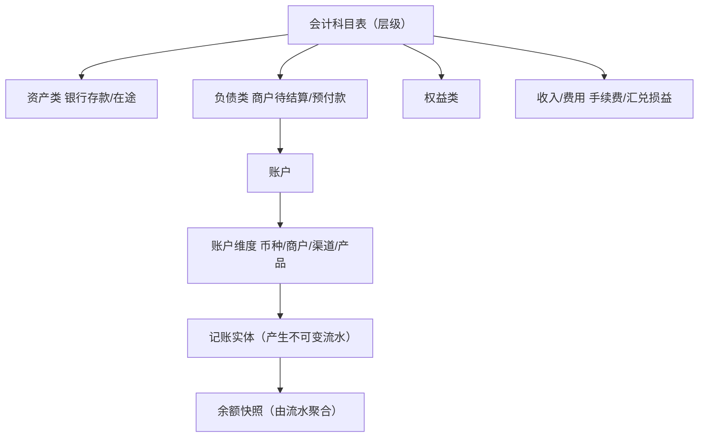
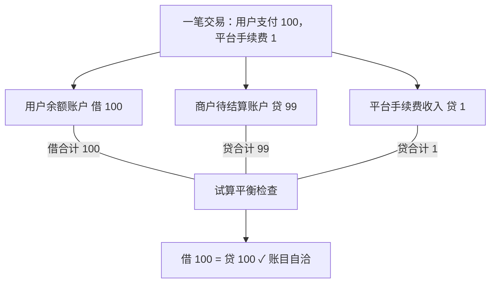
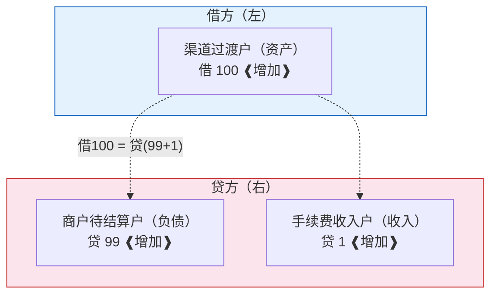
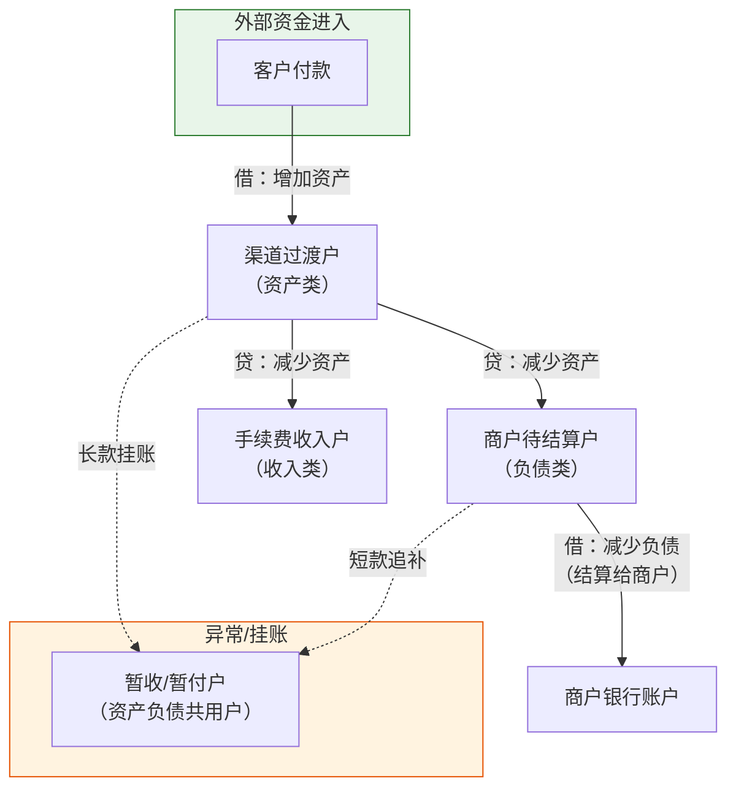
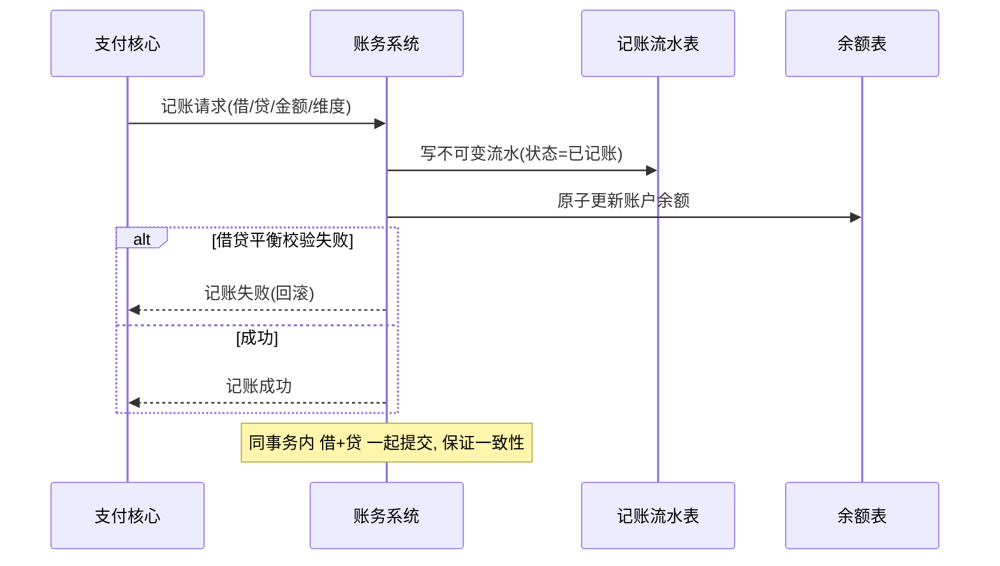
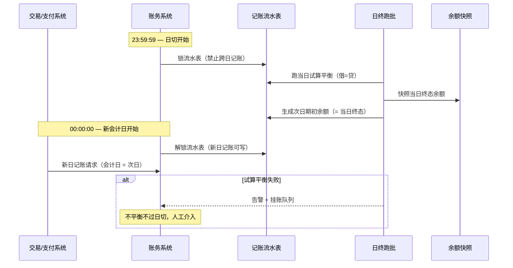
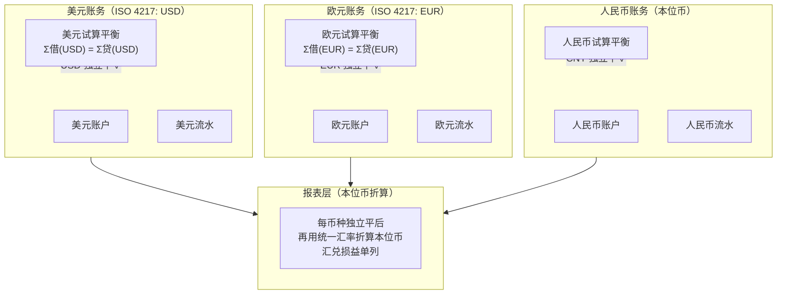
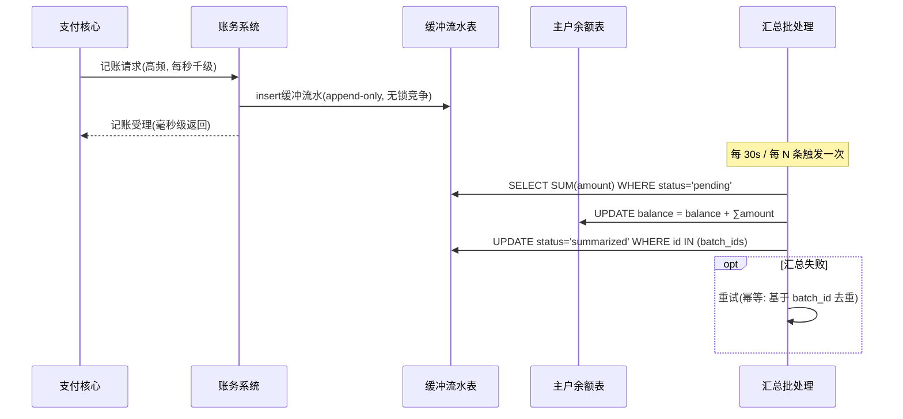

## 1. 为什么要有独立的账务系统

交易/支付系统关心「这笔钱怎么收」，账务系统关心「这笔钱记到谁账上、账目对不对」。
两者必须分离：账务是不可变的资金账本，任何业务变动都要通过记账请求进入账务，保证**资金可审计、可追溯、永远平**。

> 一句话：**支付管流动，账务管记录**。账务是支付系统的「会计」，是资金安全的最后一道账本。

## 2. 账户体系怎么设计

> 科目管"账怎么分"，账户管"钱在哪"，流水管"怎么变的"。三者一层套一层，是账务系统的骨架。



| 账户类型 | 作用 | 示例 |
| --- | --- | --- |
| 客户/商户账户 | 用户/商户的余额 | 商户待结算户、客户钱包户 |
| 渠道过渡户 | 渠道资金过渡，待清结算 | 微信渠道过渡户 |
| 内部过渡户 | 业务流转中间态 | 待清算户、在途户 |
| 手续费户 | 平台收入 | 手续费收入户 |
| 暂收/暂付户 | 差错、挂账 | 长款暂收户 |

账户核心字段：`account_no`、`account_type`、`balance`、`currency`、`status`、`frozen_amount`（冻结余额，如风控/ dispute）。

## 3. 复式记账原理

> 每笔业务至少影响两个科目，**有借必有贷，借贷必相等**。下面用"用户付 100、手续费 1"演示借贷平衡如何保证不资损。



会计铁律：**有借必有贷，借贷必相等**。

### 3.1 T型账户与借贷记账法的数学本质

> 借贷记账法不是死记"借增贷减"，而是**会计方程式的必然推导**。

会计恒等式是基石：**资产 = 负债 + 所有者权益**。两边同加"收入 - 费用"，得：

**资产 + 费用 = 负债 + 所有者权益 + 收入**

等式左边（资产/费用）的**增加**记为**借**，减少记为贷。等式右边（负债/权益/收入）的**增加**记为**贷**，减少记为借。这不是约定俗成，而是保证**每笔分录借贷金额必然相等**的数学必然。

用 T 型账户（T-Account）可视化一笔"用户支付 100、手续费 1"的完整分录流向：



> **记忆口诀**：左边（资产/费用）借增贷减；右边（负债/权益/收入）贷增借减。左右两边永远相等。

### 3.2 账户关系全景图

把所有账户类型和记账关系串起来，形成完整的"资金在账户间如何流转"的大图：



> 这张图就是账务系统的"资金流向地图"——任何一笔钱的进入、流转、结算、异常，都能在上面找到路径。面试时画出这张图，说明你真正理解"账务不是死记账，而是钱在账户间的有向流动"。

```text
一笔收款成功（渠道过渡户 → 商户待结算户）：
  借：渠道过渡户   100.00      （资产增加，钱从渠道进来）
  贷：商户待结算户 100.00      （负债增加，欠商户的钱）
```

- 资产类账户：借增贷减；负债/权益类：贷增借减；
- 每笔记账是一个**会计分录（entry）**，含至少一借一贷，借贷金额相等；
- 所有分录汇总后，全系统「借方总额 = 贷方总额」恒成立。

## 4. 记账流程

> 记账是"写不可变流水 + 原子更新余额"两步，且借贷必须在同一事务里一起落，失败整体回滚。



```text
业务事件(支付成功) → 生成记账请求(带幂等键)
  → 校验账户/余额/冻结
  → 写分录(借/贷)
  → 更新相关账户余额（行锁/乐观锁）
  → 落记账流水（不可变）
```

**记账必须幂等**：同一业务事件（幂等键 = 支付单号+场景）只记一次，重复请求直接返回原分录。

### 4.1 日切（会计日切换）工程细节

> 日切是账务系统最"脏"的工程问题——它决定了"一笔交易到底属于哪天"，直接影响试算平衡、对账和出报表。

日切发生在每天固定时刻（通常是 23:59:59），核心动作：



**日切的工程难题**：

#### 问题 1：跨日记账归属
23:59:59 发起的支付，会计日算当日还是次日？

**解法**：以"**支付完成时间**"为准而非"发起时间"，且日切窗口（23:59:50 ~ 00:00:10）内的请求排队，日切完成后再入账，标次日会计日。

```sql
-- 流水表结构：会计日独立于物理时间
CREATE TABLE accounting_journal (
  id            BIGINT PRIMARY KEY,
  accounting_date DATE NOT NULL,        -- 会计日（YYYY-MM-DD）
  physical_time   TIMESTAMP NOT NULL,   -- 物理时间（精确到毫秒）
  account_no      VARCHAR(32) NOT NULL,
  dr_cr           CHAR(1) NOT NULL,     -- D=借 C=贷
  amount          DECIMAL(20,4) NOT NULL,
  idempotent_key  VARCHAR(128) NOT NULL UNIQUE,
  INDEX idx_account_date (accounting_date, account_no)
);
```

#### 问题 2：多时区日切
跨境场景下，香港渠道按 HKT 日切、美国渠道按 EST 日切、我方账务按 CST 日切——同一笔交易在不同系统"属于不同天"。

**解法**：流水保留"渠道时区会计日"和"本地会计日"两字段，试算平衡按本地会计日跑，渠道对账按渠道会计日跑。

#### 问题 3：日切卡顿
日切跑批（试算平衡 + 余额快照）耗时超过秒级，会阻塞新日记账。

**解法**：① 分片跑批（按账户维度分片并行）；② 快照余额异步生成（先切日期、后补快照）；③ 极端场景用"双缓冲"——在日切前先预热次日数据结构。

## 5. 余额与不可变流水

- **流水不可变**：记账流水一旦写入不能修改/删除，只能「反向红冲」（再记一笔相反分录）；
- **余额是派生的**：余额 = 期初 + 所有有效流水的净额；可异步重算对账；
- **为什么不可变**：满足审计与可追溯，任何资金变动都能还原「谁、何时、因何、变了多少」。

## 6. 试算平衡（核心校验）

- **总账平衡**：Σ借方发生额 = Σ贷方发生额；
- **账证相符**：账户余额 = 关联流水的汇总；
- **日终核对**：跑批校验，不平衡立即告警 + 挂账追因；
- 这是「账务层」给整个支付系统的安全感来源。

### 6.1 多币种独立账务与分币试算平衡

> 跨境支付最隐蔽的坑——**混币轧差**：把 USD 和 EUR 放一起做试算平衡，汇率一波动，表面"借=贷"实际上币种不匹配，是隐形资损。



**核心原则**：
- **分币建账**：每个 ISO 4217 币种独立一套账户/流水/余额，互不交叉；
- **分币试算平衡**：每币种独立做 Σ借 = Σ贷，不平即告警；
- **本位币折算**：报表层用统一汇率折算为报表本位币（如 CNY），汇兑差异记"汇兑损益"科目，不混入业务试算平衡。

```sql
-- 多币种账务查询：按币种分组做试算平衡
SELECT
  currency,
  SUM(CASE WHEN dr_cr = 'D' THEN amount ELSE 0 END) AS total_debit,
  SUM(CASE WHEN dr_cr = 'C' THEN amount ELSE 0 END) AS total_credit,
  ABS(SUM(CASE WHEN dr_cr = 'D' THEN amount ELSE -amount END)) AS diff
FROM accounting_journal
WHERE accounting_date = '2026-07-10'
GROUP BY currency
HAVING ABS(SUM(CASE WHEN dr_cr = 'D' THEN amount ELSE -amount END)) > 0.0001;
-- 任意行出现 → 该币种不平，告警
```

## 7. 热点账户问题（高频难点）

**现象**：大商户/平台手续费户被高频记账，行锁竞争成瓶颈，TPS 上不去。
**解法**：

- **子账户拆分**：把大账户按维度拆成多个影子子账户，分散热点，定时汇总到主账户；
- **缓冲记账 / 汇总入账**：先把变动记缓冲流水，攒批后一次性更新主账户余额；
- **读写分离**：余额查询走从库/缓存，记账走主库。

> 这是账务领域最经典的「性能 vs 一致性」权衡，能讲出解法说明你真踩过坑。

### 7.1 缓冲记账（Buffer Accounting）方案详解

当单账户 QPS 超过行锁容量，缓冲记账是"用最终汇总一致换吞吐"的核心手段。



```java
// 缓冲记账伪代码
public void bufferAccounting(BufferEntry entry) {
    // 1. 先写缓冲流水——仅仅 insert，无行锁竞争
    bufferJournalDao.insert(entry);

    // 2. 异步触发汇总条件判断
    if (bufferJournalDao.countPending(entry.getAccountNo()) >= BATCH_SIZE
        || elapsedSinceLastBatch(entry.getAccountNo()) >= BATCH_INTERVAL_MS) {
        asyncBatchTrigger(entry.getAccountNo());
    }
}

// 汇总批处理——幂等可重跑
@Transactional
public void summarizeBuffer(String accountNo) {
    // 锁住本批次待汇总流水，防并发
    List<BufferEntry> pending = bufferJournalDao.lockPending(accountNo, BATCH_SIZE);

    if (pending.isEmpty()) return;

    BigDecimal totalAmount = pending.stream()
        .map(BufferEntry::getAmount)
        .reduce(BigDecimal.ZERO, BigDecimal::add);

    // 原子更新主户余额
    int affected = mainAccountDao.updateBalance(accountNo, totalAmount);
    if (affected == 0) {
        throw new OptimisticLockException("主户余额更新冲突, 重试");
    }

    // 标记已汇总
    bufferJournalDao.markBatchSummarized(pending);
}
```

```sql
-- 缓冲流水表 (append-only, 无主户行锁)
CREATE TABLE buffer_journal (
  id           BIGINT AUTO_INCREMENT PRIMARY KEY,
  account_no   VARCHAR(32) NOT NULL,
  amount       DECIMAL(20,4) NOT NULL,
  dr_cr        CHAR(1) NOT NULL,
  status       ENUM('pending','summarized') DEFAULT 'pending',
  batch_id     VARCHAR(64),  -- 汇总批次号
  created_at   TIMESTAMP DEFAULT CURRENT_TIMESTAMP,
  summarized_at TIMESTAMP NULL,
  INDEX idx_account_status (account_no, status)
);

-- 原子汇总更新主户余额（CAS 防并发）
UPDATE main_account
SET balance = balance + ?,
    version = version + 1,
    updated_at = NOW()
WHERE account_no = ? AND version = ?;
```

> 关键权衡：缓冲记账后，主户余额最差有 BATCH_INTERVAL_MS 延迟，所以**对客查询走缓存+实时子账户聚合，对账容忍延迟**。这是"最终汇总一致"的代价。

## 8. 与分布式事务的关系

- 记账本身是本地事务（分录 + 余额更新同库），靠**本地消息表**把「记账结果」可靠通知下游（结算/对账）；
- 跨系统（支付→账务）用「支付成功发消息 → 账务消费记账」+ 幂等，最终一致；
- 见 [分布式事务与一致性](./准备-分布式事务与一致性.md) 选型。

## 9. 项目结合（跨境收款）

我在 XTransfer 的账务层：用「渠道过渡户 + 商户待结算户 + 手续费户」三户模型，每笔收款生成一借两贷（渠道过渡借、商户贷、手续费贷），日终跑试算平衡，不平衡自动挂差错队列。热点商户用子账户拆分 + 批次汇总，把单账户记账从锁竞争瓶颈降到可水平扩展。

### 9.1 XTransfer 跨境账务的落地细节

> 跨境账务比境内多一个维度——**币种**。每一个币种就是一套完整的账务体系，不能混、不能串、不能简化为"汇率折算后合并"。

**实际工程中的分层结构**：

```text
┌─────────────────────────────────────────┐
│           账务层（按币种分）               │
│                                         │
│  USD 账务           EUR 账务    CNY 账务  │
│  ├ 渠道过渡户(USD)  ├ 渠道过渡户(EUR)     │
│  ├ 商户待结算(USD)  ├ 商户待结算(EUR)     │
│  ├ 手续费收入(USD)  ├ 手续费收入(EUR)     │
│  └ 汇兑损益(USD)    └ 汇兑损益(EUR)       │
│     ↓                 ↓                  │
│  试算平衡(USD)     试算平衡(EUR)           │
│     ↓                 ↓                  │
│  ┌──────────────────────────┐            │
│  │    报表折算层            │            │
│  │  USD→CNY / EUR→CNY      │            │
│  │  汇兑损益单列            │            │
│  └──────────────────────────┘            │
└─────────────────────────────────────────┘
```

**落地关键点**：
1. **汇率锁定策略**：收款时按清算时点汇率锁汇，记入"汇兑损益"科目，结算时如果实际汇率不同，差额补记；
2. **日切多时区**：USD 账户按 Eastern Time、EUR 按 CET、CNY 按 CST 分别日切，流水保留两字段——渠道会计日 + 本地会计日；
3. **0 资损验证**：每天各币种独立试算平衡通过 → 本位币折算后再做一次报表层交叉校验 → 两次都通过才出日报；
4. **热点处理**：跨境大商户按"币种 + 商户"双重维度拆子账户，避免跨币种子账户混淆。

```sql
-- 跨币种试算平衡：按币种分组，每组独立验平
SELECT
  currency,
  SUM(CASE WHEN dr_cr = 'D' THEN amount ELSE 0 END) AS total_debit,
  SUM(CASE WHEN dr_cr = 'C' THEN amount ELSE 0 END) AS total_credit
FROM accounting_journal
WHERE accounting_date = ?
GROUP BY currency
HAVING ABS(total_debit - total_credit) > 0.0001;
-- 任何行出现 → 该币种不平
```


---

## 面试高频问答（标准回答）

### Q1：为什么支付系统要做复式记账？和单式记账区别？

**标准回答**：单式记账只记「余额加减」，无法追溯「钱从哪来、到哪去」，且容易对不平。复式记账每笔变动一借一贷、借贷相等，天然保证账目自洽、可审计、可勾稽。支付涉及多方（渠道/商户/平台），必须知道资金的完整来龙去脉，所以账务层用复式。

**【深度拓展】** 复式记账的"自我校验"是资金系统最便宜的保险——它不依赖外部对账就能发现内部记账 bug：任意时刻全账户借方合计必须等于贷方合计，一旦不平立刻告警。单式记账（只记余额）做不到这点，余额悄悄错了你根本不知道，直到对账才发现已资损。权衡点是复式记账写入成本更高（每笔至少两条分录 + 借贷校验），但对资金系统这点开销远小于资损风险。面试官还可能追问"复式记账会不会记错方向（借成贷）"——会，所以借贷校验 + 试算平衡是双保险，方向记反会立刻破坏平衡被抓出。

**【项目支撑】** 我在 XTransfer 账务层用"渠道过渡户 + 商户待结算户 + 手续费户"三户模型，每笔收款生成一借两贷（渠道过渡借、商户贷、手续费贷），日终跑试算平衡，不平衡自动挂差错队列。这是 0 资损在账务层的落地。

### Q2：余额和流水是什么关系？为什么流水不可变？

**标准回答**：余额是流水的派生量（期初 + 有效流水净额），流水才是真相源。流水不可变是为了审计与可追溯——任何资金变动都要能还原。要更正只能「红冲」（记相反分录），不能改历史，这样账本永远可解释。

**【深度拓展】** "流水不可变"的更深理由是可**重算与对账**：余额只是流水的聚合视图，理论上随时可以从全量流水重算任意时点余额；如果流水可改，余额就失去锚点，对账和审计都无从谈起。实际工程里流水不可变 + 余额快照并存：余额保证 O(1) 查询与原子扣减（`UPDATE balance=balance-x WHERE balance>=x`），流水保证可追溯。红冲（记一笔相反分录）而不是删除，使"账本永远只追加（append-only）"，这和事件溯源（Event Sourcing）思想一致。面试官追问"改余额和写流水怎么保证原子"——同库同事务，且余额更新带 CAS/行锁，流水状态标记已记账。

**【项目支撑】** XTransfer 的贸易订单管理系统对"入账关联订单的额度"也用流水式处理（只增不减、可追溯），和账务流水同思路：额度变更像流水一样追加，保证精准、可审计，还能对汇损做补充。额度从不会"被改小"，只能靠新流水调增或调减，杜绝误操作导致额度错乱。

### Q3：怎么保证账务不记错（不资损）？

**标准回答**：三层——记账请求带幂等键（不重复记）；分录借贷必相等（写入前校验）；日终跑试算平衡（Σ借=Σ贷、账证相符），不平衡立即告警挂账。再配合对账系统的渠道/内部勾稽，做到「记错能被发现、发现能追因、追因能调账」。

**【深度拓展】** 这三层对应"资金安全三道防线"的入账侧：幂等键是**事前**防重复记账；借贷校验是**事中**实时拦截（不平直接回滚不落库）；试算平衡是**事后**兜底。但还有两个常被漏掉的细节：①**记账必须和支付成功事件对齐**——不能凭空记账，每笔记账都要能追溯到是哪个支付成功触发的（幂等键 = 支付单号 + 场景）；②**试算平衡失败要区分"真不平"和"并发中间态"**——跑批瞬间可能有未提交流水，要锁批次或按会计日切，避免误报。面试官追问"试算平衡每天跑几次"——日终必跑，高频/实时场景可叠加准实时核对（binlog 监听）。

**【项目支撑】** XTransfer 的对账体系用 binlog 监听做实时内部核对（支付核心 vs 账务），日终再跑全量试算平衡 + T+1 渠道三层对账，差异进差错队列。账务不平会触发 BCP（业务连续性）告警，这正是"资金安全三道防线"的事中告警一环。

### Q4：热点账户怎么解决？

**标准回答**：核心是「拆 + 缓」。把大账户按维度拆成多个子账户分散行锁热点，定时汇总到主户；或用缓冲记账，先把变动落缓冲流水、攒批后批量更新余额；查询走从库/缓存。本质是用「最终汇总一致」换「记账吞吐」。

**【深度拓展】** 热点账户的"代价"要讲清：拆子账户后，**查询余额要聚合多子账户**，单账户视图变慢；缓冲记账后，**余额有短暂延迟**，对账要能容忍。所以选型要按"账户类型"分：对客余额（用户感知）不能延迟太大，优先"拆桶 + 走从库/缓存"；平台手续费户（内部户）可接受批量汇总，优先"缓冲记账"。还有一个进阶招——**汇总账户 + 明细账户分离**（类似总账和明细账），高频写明细、低频汇总总账。面试官追问"子账户汇总时部分失败怎么办"——汇总跑批要幂等可重跑，失败只重算该账户，不影响其他。

**【项目支撑】** XTransfer 的热点商户用子账户拆分 + 批次汇总，把单账户记账从行锁竞争瓶颈降到可水平扩展。平台手续费户这种内部户则走缓冲记账攒批更新，既保吞吐又不资损（因为最终汇总有试算平衡兜底）。

### Q5：记账和支付怎么保证一致？

**标准回答**：支付成功不发同步调用账务（会耦合、会超时），而是发消息（本地消息表保证可靠），账务消费后按幂等键记账。支付层和账务层最终一致，由对账系统兜底勾稽。强一致在这里既没必要也不现实，AP + 最终一致是正确选择。

**【深度拓展】** 关键不是"用消息"本身，而是消息**不能丢**——这就是 Outbox（本地消息表）的价值：业务落库和消息写入同库同事务，再由中继投递 MQ，保证"支付成功"和"记账消息"原子。如果直接用"先落库再发 MQ"的非事务写法，进程在落库后、发 MQ 前崩溃，消息就丢了，账务永远收不到，靠对账事后才发现。所以支付→账务的一致性 = Outbox（不丢）+ 幂等消费（不重）+ 对账（兜底）。面试官追问"账务消费失败了消息怎么处理"——MQ 重试 + 死信，超过重试进差错队列人工/补偿，最终仍有对账兜底。

> 账务是支付系统的「会计」，也是资金安全最后一道账本。能讲清账户体系、复式记账、试算平衡、热点账户，面试官就知道你真的碰过钱。

---

## 更多高频追问（补充）

### Q6：什么是复式记账？为什么支付系统必须用它？

**考察点**：会计基本功 + 资金安全意识。

**标准回答**：复式记账指每笔业务同时记"借"和"贷"两条（或多条）分录，且**借贷金额恒相等**（有借必有贷、借贷必相等）。好处是天然自洽——任意时刻全账户借方合计=贷方合计，一旦不平就说明记账有 bug，能第一时间发现资损。单式记账（只记流水）无法自校验。支付/账务系统钱不能凭空多也不能少，复式记账 + 试算平衡是资金正确性的数学保证。

**【深度拓展】** 面试官可能让你手写一笔"用户支付 100、手续费 1"的分录——这是送分题但很多人写错借贷方向。记住资产类（渠道过渡户、银行存款）借增贷减，负债/权益/收入类（商户待结算户、手续费收入）贷增借减。这笔钱：借渠道过渡户 100（钱进来，资产增），贷商户待结算户 99 + 贷手续费收入 1（欠商户的钱增、平台收入增），借 100 = 贷 100，平。写错方向（把商户户写成借）会破坏平衡，立刻露怯。进阶追问"手续费为什么单独成户而不是从商户户直接减"——因为手续费是平台收入，要能独立核算、独立对账、独立报税，混在商户户里就分不清了。

### Q7：账户余额用"实时计算流水"还是"存快照余额"？

**标准回答**：两者结合。**存快照余额**（账户表存 balance 字段）保证查询 O(1)、扣款可用 `UPDATE balance=balance-x WHERE balance>=x` 做原子校验；同时**记明细流水**（每笔变动一条），余额=上次快照+期间流水，可对账校验。纯实时算流水在海量流水下太慢；纯存余额无法追溯，两者互补。热点账户（如平台备付金账户）再叠加"分桶/异步合并记账"缓解行锁竞争。

**【深度拓展】** 这条 `UPDATE ... WHERE balance>=x` 就是账务层的 CAS——它在数据库层面原子校验"余额够才扣"，天然防超扣、天然并发安全，和支付状态机的 CAS 是同一思想（都在数据库层用条件更新兜底，而非应用层 if 判断）。流水快照的"对账校验"指：定时用全量流水重算某账户余额，和快照余额比对，不一致即告警。这是"余额派生可验证"的工程体现。面试官追问"余额和流水谁先写"——同事务先写流水标记已记账、再更新余额（带行锁/CAS），任一步失败整体回滚，绝不出现"余额改了流水没记"的悬空态。

### Q8：热点账户（大商户/平台户）并发扣减怎么优化？

**标准回答**：单行 `UPDATE` 在高并发下行锁竞争严重。方案：① **账户拆分桶**——把一个热点账户拆成 N 个子账户/子余额，扣减时哈希到某个桶，查询时汇总；② **异步批量合并记账**——先入队/入 Redis 累加，定时批量落库；③ **读写分离 + 缓存**余额查询。代价是牺牲了强实时一致，需要对账兜底。这是"账务领域的分库分表"，是有深度的加分点。

**【深度拓展】** 拆分桶后"扣减落哪个桶"要稳定（按 user_id 或商户号 hash），否则查询汇总时漏桶。还有"余额不足跨桶"的边界——一个桶不够扣时，要么拒绝（简单），要么跨桶归集（复杂、易出一致性问题），工程上通常选"拒绝 + 总额度视角做额度管控"，把精度问题交给对账。这和电商库存扣减（欧凡用 Redis Lua 原子扣）思路不同：库存是强一致扣减（不能超卖），账务余额在热点下可接受最终汇总一致（靠对账兜）。面试官追问"拆分后怎么对账"——每个子账户都记流水，主账户余额 = Σ子账户余额，试算平衡按子账户维度跑。

**【项目支撑】** XTransfer 把热点商户按维度拆子账户，平台手续费户走缓冲记账攒批。对比欧凡直播电商的库存扣减（Redis + Lua 原子扣防超卖，强一致），账务热点账户因为"钱最终要平"而非"每笔实时精确"，所以选了"最终汇总一致 + 对账兜底"的更高压吞吐方案——同一公司不同场景的取舍差异，正说明我理解一致性强弱该按业务定。

---

## 延伸阅读（多博主视角 · 系统化补充）

账务与对账、架构全景联动，配套阅读：

- [支付对账体系与差错处理](/post/准备-支付对账体系与差错处理) — 隐墨星辰三层对账、内部户/过渡户、长短款处理
- [支付系统架构与核心链路全景](/post/准备-支付系统架构与核心链路全景) — 账务在支付分层中的定位、双路由、单据模型
- [清结算体系](/post/准备-清结算体系) · [分布式事务与一致性](/post/准备-分布式事务与一致性) · [支付风控与反欺诈体系](/post/准备-支付风控与反欺诈体系)

<!-- EXPANDED -->
