> 3 年经验的工程师问"功能对不对"，10 年经验的工程师问"**出事时会不会丢钱、丢了怎么追、追不回怎么兜底**"。
>
> 资金系统的价值不在正常路径写得多漂亮，而在**极端场景下的确定性**——网络抖动、时钟回拨、渠道重复回调、汇率瞬间跳变、机房脑裂、补偿风暴……这些小概率事件叠加高频交易，就是真金白银的损失。本文不讲"怎么做支付"，而讲"**怎么让支付在最坏情况下也不丢钱**"，并把它组织成一套可复用的**事前·事中·事后**三维方法论。
>
> 面试价值：这是能把 P7/P8 和普通候选人区分开的题目。配合《支付风控与反欺诈体系》《支付对账体系与差错处理》《高可用容灾与稳定性》食用。

---

## 一、先建立"资损分类学"——不分类就无法防控

资损不是一个词，是一棵树。防控的第一步是**能把每一分钱的丢失精确归类**，因为不同类别的防控手段、责任方、追回路径完全不同。

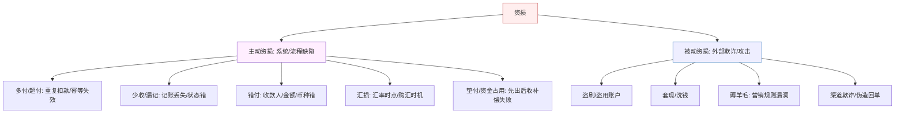

**资深视角的关键区分**：
- **主动 vs 被动**：主动资损是"我们自己的系统/流程错了"（可通过工程手段趋零），被动资损是"有人蓄意攻击"（只能控制在可接受阈值，无法归零）。**面试时说"0 资损"，指的一定是主动资损；被动资损谈的是"控制率与止损速度"**——这个区分能立刻显出深度。
- **真资损 vs 口径资损**：汇率时点不一致造成的账面差异，不一定是真金白银丢失，可能是"以哪个时点为基准"的口径问题。**把两者混为一谈是新手，能拆开谈是老手**。
- **已发生 vs 风险敞口**：已经丢的钱要追回，还没丢但暴露的口子（如未加限额的接口）是敞口，要在事前堵住。

> **项目支撑**：XTransfer 收款平台对客承诺**0 资损**，指的正是"主动资损趋零"——靠资金安全三道防线 + 状态机 + 任务补偿把系统/流程性丢钱消灭；而盗刷、套现等被动资损由独立风控子状态机控制在阈值内。这套"分类—归责—防控"的映射，是我做资金域 Owner 时的第一性原则。

---

## 二、事前（Prevention）——把资损扼杀在设计阶段

事前是**成本最低、收益最高**的阶段。10 年经验的价值就在于：能在设计评审时就看出"这里将来会丢钱"。

### 2.1 幂等：资金系统的第一原则

任何资金操作必须幂等——**同一笔业务无论重试多少次，资金效果只发生一次**。

- **幂等键怎么选**：不是随便一个 requestId，而是**业务唯一键**（如"渠道流水号 + 收款单号"），保证跨重试、跨渠道重推都能识别为同一笔。
- **幂等的三层实现**：
  1. **唯一约束**（DB 层兜底）：幂等键建唯一索引，重复插入直接失败——最后一道锁。
  2. **状态机 CAS**（业务层）：`UPDATE ... SET state='已入账' WHERE id=? AND state='待入账'`，影响行数为 0 即已处理，天然幂等且防并发。
  3. **前置查询**（性能优化）：先查已处理表，命中直接返回——挡住大部分重复请求，减轻 DB 压力。
- **常见坑**：只做前置查询不做唯一约束，并发下两个请求同时查不到、同时插入 → 重复扣款。**必须以唯一约束/CAS 为准，查询只是优化**。

> **项目支撑**：XTransfer 渠道回调可能重推 3 次，我用「渠道流水号 + 收款单号」做唯一约束 + 状态机 CAS 更新兜底，前置查询做性能优化——三层叠加，重复回调 100% 被幂等。

### 2.2 状态机：让非法资金流"迁移不动"

把每笔资金的生命周期建成**有限状态机**，只允许合法迁移，非法迁移在代码层被拒绝。好处：
- **可枚举**：所有资金状态与迁移路径显式定义，评审时一眼看出遗漏。
- **防跳变**：不可能从"待入账"直接跳到"已结算"（跳过清分）——这类"少了一步"的资损被结构性消灭。
- **CAS 幂等**：状态迁移用 CAS，天然幂等 + 防并发。

### 2.3 限额、熔断、灰度——把爆炸半径框住

- **多层限额**：单笔限额、单日限额、单商户限额、单渠道限额。任何自动化资金操作（尤其自动出款、自动冲正）必须有限额兜底——**这是防"程序 bug 无限放大"的保险丝**。
- **发布灰度**：资金链路发布必须灰度 + 可秒级回滚，绝不"一把梭"。影子流量比对（新旧逻辑跑同一笔、只比对不落账）在上线前发现资损逻辑差异。
- **配置化开关**：每个高危自动化动作有独立开关，出事能立刻停掉单个功能而非停整个系统。

### 2.4 设计评审清单（资金视角的 Checklist）

10 年经验会把"资金评审"沉淀成清单，评审时逐条过：

| 检查项 | 关键问题 |
|---|---|
| 幂等 | 幂等键是什么？唯一约束建了吗？并发下会重复吗？ |
| 状态机 | 状态是否可枚举？有无非法跳变？迁移用 CAS 吗？ |
| 一致性 | 跨服务操作怎么保证最终一致？事件会丢吗（Outbox）？ |
| 限额 | 自动化资金操作有限额/熔断吗？爆炸半径多大？ |
| 补偿 | 失败怎么重试？重试失败怎么补偿？补偿失败怎么兜底？ |
| 对账 | 这笔钱能被对账覆盖吗？差异能发现吗？ |
| 回滚 | 上线出问题能秒级回滚吗？数据能修复吗？ |

> **项目支撑**：XTransfer 资金安全**第一道防线（事前）** = 幂等键 + 状态机约束 + 多层限额。收款 2.0 重构时我把上面这套评审清单固化进研发流程，是"生产问题 −80%"的关键前置动作。

### 2.5 资金安全三道防线工程细节

> "三道防线"不是口号，每道防线都有具体的工程实现。以下是每道防线的**技术组件、配置示例、验证方法**。

**三道防线全景图**：

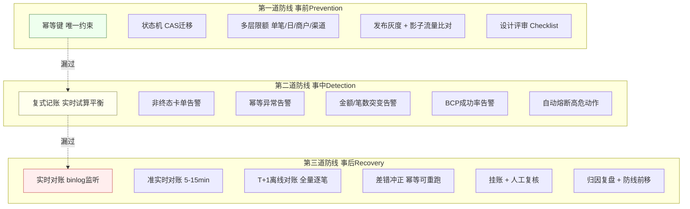

**第一道防线（事前）工程细节**：

```sql
-- 1. 幂等键：唯一约束（DB层兜底）
ALTER TABLE payment_order ADD UNIQUE INDEX uk_idempotency_key (idempotency_key);

-- 2. 状态机CAS迁移（业务层幂等+防并发）
UPDATE payment_order 
SET state = 'ENTERED', updated_at = NOW(), version = version + 1
WHERE id = #{orderId} AND state = 'PENDING_ENTRY' AND version = #{currentVersion};
-- 影响行数=0 → 已被处理或状态不匹配，天然幂等

-- 3. 多层限额表
CREATE TABLE payment_limit (
    id BIGINT PRIMARY KEY,
    limit_type ENUM('SINGLE', 'DAILY', 'MERCHANT', 'CHANNEL'),
    target_id BIGINT COMMENT '商户ID/渠道ID',
    currency VARCHAR(3),
    max_amount DECIMAL(18,2) COMMENT '最大金额',
    current_amount DECIMAL(18,2) DEFAULT 0 COMMENT '当前已用',
    reset_time DATETIME COMMENT '重置时间(日限额)',
    INDEX idx_target (limit_type, target_id, currency)
);

-- 限额校验（原子操作，防并发绕过）
UPDATE payment_limit 
SET current_amount = current_amount + #{amount}
WHERE target_id = #{merchantId} 
  AND limit_type = 'DAILY' 
  AND currency = #{currency}
  AND current_amount + #{amount} <= max_amount;
-- 影响行数=0 → 超限，拒绝
```

```yaml
# 4. 发布灰度配置
canary:
  shadow_traffic: true           # 影子流量比对（新旧双算，只比对不落账）
  canary_percentage: [5, 20, 50, 100]  # 灰度阶段
  duration_per_stage: 30min       # 每阶段观察时间
  reconciliation_interval: 5min   # 灰度期间高频对账
  auto_rollback:
    error_rate_threshold: 0.1%
    financial_anomaly: true       # 试算不平立即回滚
    rollback_timeout: 30s         # 30秒内可回滚

# 5. 高危操作独立开关
feature_flags:
  auto_settlement: true           # 自动结算
  auto_chargeback: true           # 自动冲正
  auto_refund: false              # 自动退款（默认关，需人工审核）
  emergency_freeze: true          # 紧急冻结（可秒级停单功能）
```

**第二道防线（事中）工程细节**：

```java
// 复式记账 + 实时试算平衡
public class DoubleEntryAccounting {
    // 每笔资金变动：借贷同时记账
    public void record(PaymentEvent event) {
        // 借方
        ledgerEntryRepository.save(new LedgerEntry(
            event.getReceiptId(), event.getAmount(),
            Direction.DEBIT, event.getFromAccount()));
        // 贷方
        ledgerEntryRepository.save(new LedgerEntry(
            event.getReceiptId(), event.getAmount(),
            Direction.CREDIT, event.getToAccount()));
        
        // 实时试算平衡校验
        BigDecimal balance = ledgerEntryRepository.sumByReceiptId(event.getReceiptId());
        if (balance.compareTo(BigDecimal.ZERO) != 0) {
            // 不平！立即告警 + 卡单
            alertService.fireFinancialAlert(
                "TRIAL_IMBALANCE", event.getReceiptId(), balance);
            stateMachine.freeze(event.getReceiptId());  // 冻结，不允许后续操作
        }
    }
}

// 事中监控的四类告警
@Scheduled(fixedDelay = 60000)  // 每分钟扫描
public void scanAnomalies() {
    // 1. 非终态卡单：订单停在中间态超过阈值
    List<Long> stuckOrders = orderRepo.findNonTerminalOlderThan(30, TimeUnit.MINUTES);
    if (!stuckOrders.isEmpty()) {
        alertService.fire("NON_TERMINAL_STUCK", stuckOrders);
    }
    
    // 2. 幂等异常：短时间内同一幂等键大量命中
    List<String> hotKeys = idempotencyRepo.findHotKeys(5, TimeUnit.MINUTES, 10);
    if (!hotKeys.isEmpty()) {
        alertService.fire("IDEMPOTENCY_ANOMALY", hotKeys);
        circuitBreaker.trip("auto_settlement");  // 熔断自动出款
    }
    
    // 3. 金额/笔数突变
    BigDecimal todayAmount = statsService.todaySuccessAmount();
    BigDecimal yesterdayAmount = statsService.yesterdaySuccessAmount();
    if (todayAmount.compareTo(yesterdayAmount.multiply(new BigDecimal("1.5"))) > 0) {
        alertService.fire("AMOUNT_SURGE", todayAmount, yesterdayAmount);
    }
    
    // 4. BCP指标
    double successRate = statsService.currentSuccessRate();
    if (successRate < 0.995) {
        alertService.fire("BCP_SUCCESS_RATE_LOW", successRate);
        circuitBreaker.trip("auto_chargeback");
    }
}
```

> **【深度拓展】** 三道防线的设计哲学是"**纵深防御（defense in depth）**"——不依赖单一防线，而是多层叠加，每层假设上一层可能漏。事前防不住的靠事中发现，事中没拦的靠事后兜底。关键不是"每道防线有多强"，而是"**防线之间有衔接**"——事前的幂等键漏了，事中的幂等异常告警要能发现；事中的试算平衡漏了（比如金额刚好相等但方向错了），事后的T+1对账要能兜住。

> **【面试官追问】** "你说事中有'实时试算平衡'，会不会影响性能？" → 试算平衡不需要每笔都算全量——可以**增量校验**：每笔交易只校验"这笔的借=贷"（O(1)），再定时（如每5分钟）做全量试算平衡（异步、不阻塞交易）。实时校验的是"单笔借贷相等"，全量试算是"所有账户余额总和=零"——两者粒度不同，性能影响可控。

> **【项目支撑】** XTransfer 三道防线的工程实现：事前用唯一约束+状态机CAS+限额表+灰度配置；事中用复式记账实时校验+定时扫描四类异常+自动熔断；事后用实时(binlog)+准实时(5min)+离线(T+1)三级对账。这套体系是"0资损"的工程保障——不是"不写bug"（不可能），而是"bug造成资损前被多层防线截停"。

## 三、事中（Detection & Interception）——在丢钱的瞬间拦下它

事前防不住的，要在**发生的瞬间**发现并拦截。核心思想：**把对账从 T+1 前移到实时**。

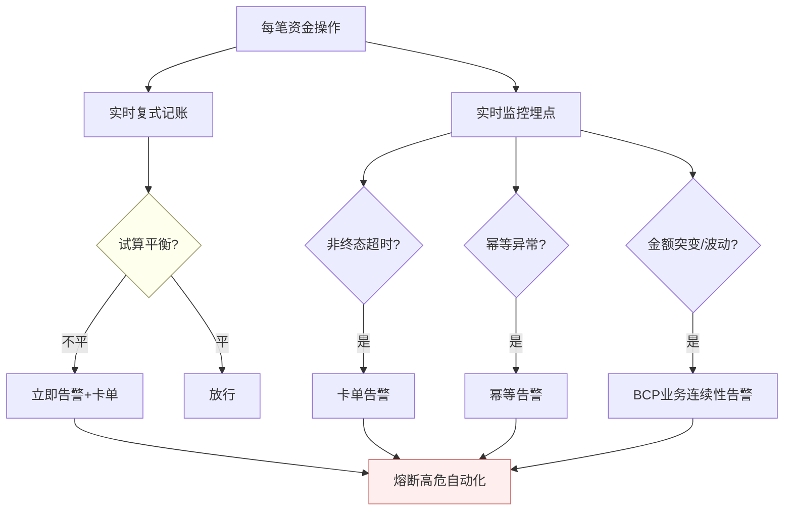

### 3.1 复式记账 + 实时试算平衡

- 每笔资金变动**借贷双方同时记账**，系统实时校验"借方总额 = 贷方总额"。
- **不平立即告警并卡单**——不平就意味着记账逻辑有 bug 或数据被污染，此刻停下比继续跑更安全。
- 这是"事中"最强的一道网：它不依赖 T+1 对账，而是在每笔交易发生时就验证账务恒等式。

### 3.2 实时监控的四类"资损前兆"

10 年经验知道资损发生前往往有信号，要主动埋点监控：
1. **非终态卡单**：订单长时间停在中间态（如"扣款成功未出款"）——可能是补偿没跑，是垫付/占用资损的前兆。
2. **幂等异常**：短时间内同一幂等键大量命中——上游在重复推送，可能有重复扣款风险。
3. **金额/笔数突变**：某渠道成功金额或退款笔数突然飙升——可能是逻辑 bug 或被薅羊毛。
4. **BCP（业务连续性）指标**：成功率、平均耗时、渠道可用性跌破阈值——系统性风险信号。

### 3.3 熔断与自动止血

监控命中阈值后，**自动熔断高危动作**（尤其自动出款/自动冲正），而非等人来处理。原则：**资金系统宁可停，不可错**——停了是可用性问题（可补），错了是资损（难追）。

> **项目支撑**：XTransfer 资金安全**第二道防线（事中）** = 复式记账实时试算平衡告警 + 非终态卡单告警 + 幂等异常告警 + BCP 告警。我把这套"事中拦截"做起来后，大量本来要到 T+1 才暴露的差错，在发生瞬间就被拦下并熔断，这是 0 资损的核心抓手——**不是不出 bug，而是 bug 造成资损前就被截停**。

---

## 四、事后（Recovery & Reconciliation）——追回 + 兜底 + 防复发

事中没拦住的，事后要能**发现、追回、兜底、并防止再发生**。

### 4.1 三层对账：一笔钱的三方核对

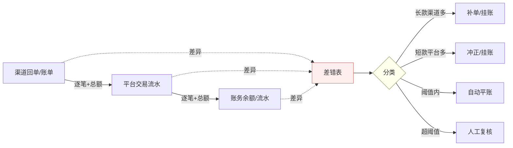

- **渠道 ↔ 平台 ↔ 账务**三方逐笔 + 总额核对，任何一环对不上都落差错表。
- **差错分类**：长款（渠道多/平台少收）、短款（平台多/渠道少收），按金额是否在容忍阈值内决定自动/人工处理。
- **差错处理三招**：补单（漏记的补上）、冲正（错记的反向抵消，幂等可重跑）、挂账（暂挂 + 人工复核，绝不让资金处于未知态）。

### 4.2 资损兜底的最后一道：人工 + 挂账 + 审计

- **可自动修复**：差错冲正脚本（幂等、可重跑）自动平账。
- **不可自动**：挂账到专用兜底流程 + 人工复核 + 全程操作审计。
- **核心原则**：**任何一分钱都不能处于"不知道在哪"的状态**——要么在正常账上，要么在挂账上，要么在差错表上，永远可追溯。

### 4.3 归因复盘：把一次资损变成防复发的资产

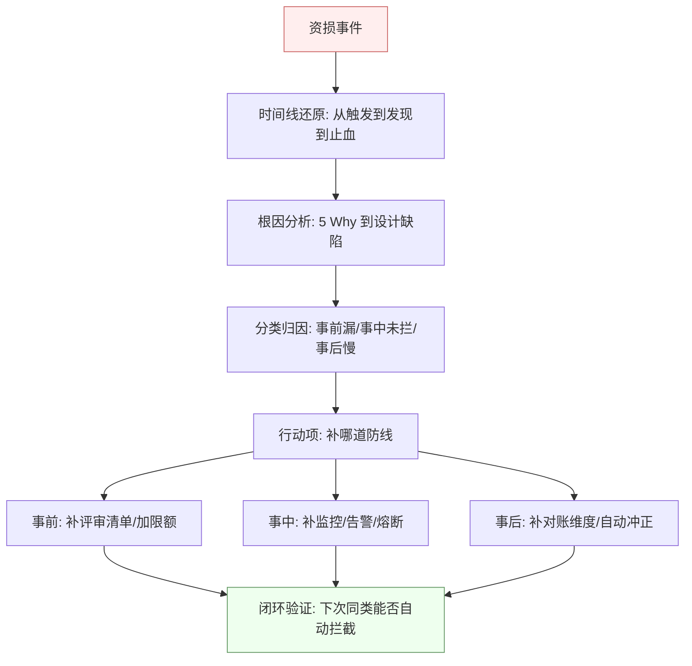

10 年经验的复盘不止"下次注意"，而是**追问：这次资损应该被哪道防线拦住？为什么没拦住？**——然后把缺失补回对应的事前/事中/事后环节，并验证"下次同类是否能自动拦截"。**每次资损都应让系统变得更难再丢钱**，这才是复盘的价值。

> **项目支撑**：XTransfer 资金安全**第三道防线（事后）** = T+1 多维护对账 + 差错冲正 + 人工兜底。每次差错复盘我都归到"该被哪道防线拦住"，反哺前移——很多本来 T+1 才发现的问题，被我补成了事中实时告警，防线一层层往前推。

---

## 五、极端场景推演（19 个"会丢钱"的边界）

这是本文的核心，也是最能体现深度的部分。每个场景给：**为什么会丢钱 → 怎么防**。

### 5.1 时钟回拨导致 ID 重复 / 重复记账
- **怎么丢**：Snowflake 依赖机器时钟，NTP 校准或重启导致时钟回拨，生成重复 ID → 两笔交易撞号 → 记账错乱。
- **怎么防**：缓存/ZK 记录上次时间戳，回拨超阈值**直接抛错或等待**，绝不发号；订单号不用纯 Snowflake，用「业务前缀+日期+号段+校验位」。

### 5.2 网络脑裂导致双主重复处理
- **怎么丢**：机房网络分区，两边都以为自己是主，同一笔交易被处理两次。
- **怎么防**：全局唯一 ID + 状态机 CAS（第二次迁移失败）；单元化设计禁止跨单元写；分布式锁 + fencing token 防脑裂。

### 5.3 渠道重复回调 / 回调丢失
- **怎么丢**：渠道回调重推（重复入账）或回调丢失（漏入账）。
- **怎么防**：重复→幂等键唯一约束拦截；丢失→**主动轮询对账补偿**（不完全依赖回调），非终态订单定时反查渠道。

### 5.4 支付成功但回调前系统宕机
- **怎么丢**：钱在渠道扣了，回调还没到系统就挂了 → 客户付了钱但订单没更新。
- **怎么防**：不依赖回调的**主动查询补单**机制；Outbox + 任务补偿保证"必有一次对账任务"最终推进到终态。

### 5.5 补偿风暴（重试雪崩）
- **怎么丢**：下游故障→大量任务失败→同时重试→压垮下游→更多失败……重试放大故障，甚至重复执行造成多付。
- **怎么防**：**指数退避 + 抖动**（jitter）避免重试同步；重试有上限，超限进死信；补偿必须幂等（重复补偿不多扣）；熔断下游，故障期暂停重试。

### 5.6 汇率瞬间跳变 / 购汇时点差
- **怎么丢**：跨境场景锁汇与购汇有时间差，汇率剧烈波动产生汇损；或不同环节用了不同时点的汇率导致账不平。
- **怎么防**：明确**以哪个时点汇率为准**并全链路固化（下单锁汇/T+0 购汇）；汇损单独科目核算，不混进主账；超阈值波动触发人工确认。

### 5.7 缓存击穿导致限额失效 → 超付
- **怎么丢**：限额/余额缓存失效，并发请求全部读到旧值或穿透到 DB，绕过限额造成超额出款。
- **怎么防**：限额校验最终以 **DB 行锁/CAS** 为准（`WHERE balance>=amount`），缓存只做优化；热点 key 用互斥锁/逻辑过期防击穿。

### 5.8 分布式事务部分成功（悬挂）
- **怎么丢**：TCC 的 Try 成功但 Confirm/Cancel 因网络丢失 → 资金被冻结无人释放（占用）或空回滚。
- **怎么防**：TCC 做**空回滚、防悬挂、幂等**三件套；用状态机 + 任务补偿保证最终有人推进；定时扫描悬挂事务。

### 5.9 消息重复消费 / 乱序
- **怎么丢**：MQ at-least-once 导致重复消费（重复记账）；分区乱序导致"退款先于支付"处理。
- **怎么防**：消费端幂等（业务幂等键）；顺序性用分区键（同一订单进同一分区）+ 状态机拒绝非法顺序迁移。

### 5.10 对账雪崩（数据量爆炸对账跑不完）
- **怎么丢**：交易量暴涨，T+1 对账在下个对账窗口前跑不完 → 差错累积、发现延迟、资损敞口变大。
- **怎么防**：对账并行分片 + 增量对账；实时试算平衡分担（事中已拦大部分）；对账任务本身有监控（跑没跑完、耗时）。

### 5.11 退款超过原额 / 重复退款
- **怎么丢**：退款没校验累计已退金额 → 多次退款总额超过原订单 → 多退资损。
- **怎么防**：退款校验"已退 + 本次 ≤ 原额"用 CAS/行锁；退款单也有幂等键防重复。

### 5.12 精度/舍入误差累积
- **怎么丢**：用 float/double 算金额、分账舍入规则不一致 → 长期累积成账不平。
- **怎么防**：金额一律用**整数（最小币种单位）或 BigDecimal**，明确舍入规则（分账"尾差归一方"），全链路统一。

### 5.13 并发下的余额透支
- **怎么丢**：先查余额再扣减（check-then-act）非原子，并发下两笔都通过校验 → 透支。
- **怎么防**：扣减用原子操作 `UPDATE ... SET balance=balance-? WHERE balance>=?`，影响行数为 0 即失败；Redis 场景用 Lua 原子扣减。

### 5.14 灰度/回滚期新旧逻辑双跑
- **怎么丢**：发布期新旧代码并存，同一笔被新旧逻辑各处理一次 → 重复。
- **怎么防**：灰度以请求为边界切换（进行中交易在原逻辑闭环）；幂等键跨新旧一致；影子流量只比对不落账。

### 5.15 人工操作/运营后台误操作
- **怎么丢**：运营在后台手工冲正/改状态，误操作造成资损。
- **怎么防**：高危操作**双人复核 + 审批流 + 限额 + 全审计**；后台操作也走幂等与状态机，不能绕过业务规则直改 DB。

### 5.16 金额放大缩小（币种单位不一致 / 手动运算导致百倍差）**【网上最新实践参考】**
- **怎么丢**：不同币种最小单位不一致（日元最小单位是"元"而非"分"，1 日元 = 1 而非 100；印度卢比有 2 位小数但尼泊尔卢比不同），手动用 `long` / `double` 做乘除（如 `amount * 100` 把日元放大了 100 倍）→ 百倍级资损。
- **怎么防**：用 **Money 值对象类**统一处理金额（封装币种+最小单位+换算），入口层统一转换为内部最小单位；**禁止手动做金额乘除运算**（所有运算走 Money 类方法）；DB 金额字段一律用 `DECIMAL`，禁止 `FLOAT/DOUBLE`。

### 5.17 流水号及短号重复**【网上最新实践参考】**
- **怎么丢**：银行短号（如 6 位递增流水号）循环使用，走到上限后归零复用 → 与历史订单撞号；系统升级后号段重新初始化，导致与升级前流水重复 → 两笔交易被当作同一笔处理。
- **怎么防**：流水号拼接**交易日期 + 金额 + 渠道标识**（即使短号循环，加上日期金额后全局唯一）；**禁止网关层生成流水号**（由业务层统一发号，确保全局唯一性可控）；号段分配要有租约与回收机制。

### 5.18 返回码映射陷阱**【网上最新实践参考】**
- **怎么丢**：渠道返回"操作成功"≠"业务成功"（银行受理成功但入账可能失败）；超时、系统异常、订单不存在等场景被错误映射为"失败" → 系统自动冲正，但对方可能已成功扣款 → 双方状态不一致导致多退或少收。
- **怎么防**：**严格区分"操作成功"vs"业务成功"**——操作成功只代表"渠道收到了请求"，业务成功才代表"资金确实发生了"；超时 / 系统异常 / 订单不存在**必须映射为"未知"而非"失败"**，未知状态走主动查询 + 对账兜底，绝不自动冲正。

**返回码映射规范表**：

| 渠道返回码 | 含义 | 我方映射 | 处理策略 |
| --- | --- | --- | --- |
| 0000/SUCCESS | 业务成功 | 成功 | 正常处理 |
| 9999/PROCESSING | 处理中 | 未知 | 轮询查询(最多3次,间隔30s) |
| TIMEOUT | 超时 | 未知 | 主动查询+对账兜底 |
| SYSTEM_ERROR | 系统异常 | 未知 | 主动查询+告警 |
| ORDER_NOT_FOUND | 订单不存在 | 未知 | 主动查询确认(可能是渠道还没收到) |
| INSUFFICIENT_BALANCE | 余额不足 | 失败(明确) | 可安全冲正 |
| INVALID_ACCOUNT | 账户无效 | 失败(明确) | 可安全冲正 |
| RISK_REJECTED | 风控拒绝 | 失败(明确) | 可安全冲正 |

> **【深度拓展】** 返回码映射的核心原则是"**不确定就当未知**"。很多资损是因为把"未知"当"失败"处理——超时了就以为失败了去冲正，结果渠道实际成功了，造成多退。正确的做法是：只有"明确的业务失败"（如余额不足、账户无效）才映射为"失败"并允许冲正；其他所有不确定的情况（超时/系统异常/订单不存在）都映射为"未知"，走"主动查询→确认→处理"的路径，绝不自动冲正。

### 5.19 运营操作资损（营销券越权 / 打款多打）**【网上最新实践参考】**
- **怎么丢**：营销券被越权领取（规则漏洞 + 权限边界不清）、打款多打（运营手动批量操作无二次校验）→ 真金白银流出。
- **怎么防**：**黑名单规则**（高危操作自动拦截）+ **审批流**（多级审批，单人不可直接执行高危资金操作）+ **领用监控**（实时监控领取/打款数量与金额，超阈值告警）；运营后台与生产系统共用同一套幂等 + 状态机 + 限额规则，**运营操作不能绕过业务校验直改 DB**。

**运营后台安全配置示例**：

```yaml
# 运营后台安全策略
admin_console:
  high_risk_operations:
    - operation: MANUAL_CHARGEBACK      # 手动冲正
      require_dual_approval: true        # 双人复核
      max_amount: 100000                 # 单笔限额
      audit_log: true                    # 全审计
      cooldown: 300s                     # 操作冷却(防连续误操作)
    
    - operation: MANUAL_REFUND          # 手动退款
      require_dual_approval: true
      max_amount: 50000
      audit_log: true
      must_pass_business_check: true     # 必须走业务校验(不能直改DB)
    
    - operation: BATCH_PAYOUT           # 批量打款
      require_dual_approval: true
      max_batch_size: 100                # 单批最多100笔
      max_total_amount: 1000000          # 单批总额限额
      pre_check: true                    # 打款前预校验(余额/状态/限额)
      audit_log: true
  
  # 领用监控
  coupon_monitoring:
    alert_threshold:
      single_user_daily: 5               # 单用户每日领用超5张告警
      total_daily: 10000                 # 全平台每日超1万张告警
      amount_anomaly: 100000             # 金额异常波动告警
    auto_block:
      blacklisted_user: true             # 黑名单用户自动拦截
      frequency_limit: 10                # 单IP/min超10次自动拦截
```

> **【面试官追问】** "运营后台的安全怎么保障？" → 四道关：①**权限控制**——RBAC + 操作权限按角色分配，高危操作需特定角色；②**审批流**——双人复核 + 多级审批，单人不能直接执行高危资金操作；③**业务校验**——后台操作也走幂等+状态机+限额，不能绕过业务规则直改DB；④**审计监控**——全操作审计 + 实时告警（异常领取/打款超阈值）。核心原则："**运营后台是业务系统的前端，不是数据库的phpMyAdmin**"。

> 这 19 个场景的共同规律：**资损几乎都发生在"边界"——重试边界、并发边界、时间边界、发布边界、人工边界、币种边界、号段边界、返回码边界、运营边界**。10 年经验就是对这些边界有肌肉记忆，设计时自动把它们堵上。

---

## 五(补充). 资损案例库（12 个真实案例 + 复盘）

> 以下案例来自行业公开复盘 + 本人真实经历，每个案例给：**怎么丢的 → 怎么发现的 → 怎么追回的 → 怎么防复发的**。案例库的价值是"**从别人的血泪中学习**"，而不是自己踩一遍坑才长记性。

### 案例 1：幂等键覆盖不全导致重复入账

- **怎么丢**：渠道回调处理用了"渠道流水号"做幂等键，但渠道对同一笔交易在不同阶段（预通知/正式通知）用了不同流水号 → 两次回调被当作两笔交易 → 重复入账。
- **怎么发现**：T+1 对账发现"渠道1笔 vs 平台2笔"差异。
- **怎么追回**：冲正多记的一笔，客户无感知。
- **怎么防复发**：幂等键改为"渠道流水号 + 收款单号"复合键，覆盖同一交易的所有阶段；把"幂等键设计"加入接入规范。

### 案例 2：状态机缺漏导致资金跳过风控

- **怎么丢**：状态机定义遗漏了"已入账→已结算"的合法迁移条件（缺少风控通过的前提），导致一笔资金跳过风控直接结算。
- **怎么发现**：事中试算平衡告警（借贷不平——风控账户没扣，结算账户已出）。
- **怎么追回**：冻结该笔结算，补风控审核，通过后重新结算。
- **怎么防复发**：状态机迁移定义评审改为"逐条过checklist"，每条迁移必须有前置条件验证。

### 案例 3：并发扣减余额导致透支

- **怎么丢**：用"查余额→判断→扣减"非原子操作，并发下两笔同时查到余额充足 → 都通过 → 透支。
- **怎么发现**：事后对账发现余额为负。
- **怎么追回**：追回多付的一笔（联系客户/渠道）。
- **怎么防复发**：扣减改为原子操作 `UPDATE ... SET balance=balance-? WHERE balance>=?`，影响行数为0即失败。

### 案例 4：缓存击穿导致限额失效

- **怎么丢**：限额值缓存在 Redis，缓存过期瞬间大量并发请求穿透到 DB，读到的限额值不一致 → 绕过限额。
- **怎么发现**：某商户单日交易额超限告警。
- **怎么追回**：联系商户追回超限部分。
- **怎么防复发**：限额校验最终以 DB 行锁为准（`WHERE current+amount <= max`），缓存只做性能优化；热点 key 用互斥锁防击穿。

### 案例 5：汇率时点不一致导致账面不平

- **怎么丢**：下单时用实时汇率锁汇，但购汇时用了收盘汇率 → 两个环节汇率不一致 → 账面差异。
- **怎么发现**：T+1 对账发现"平台账 vs 渠道账"差额等于汇率波动。
- **怎么追回**：明确以"下单锁汇时点"为基准，调整账务记录，汇损单独科目核算。
- **怎么防复发**：全链路固化同一汇率时点，汇损单独科目、不混入主账。

### 案例 6：返回码映射陷阱导致自动冲正

- **怎么丢**：渠道返回"系统超时"被错误映射为"失败"，系统自动冲正，但渠道实际已扣款成功 → 客户被扣了钱但平台退了 → 少收。
- **怎么发现**：客户投诉"扣了钱但订单没成功"。
- **怎么追回**：联系渠道确认实际状态，补单。
- **怎么防复发**：超时/系统异常映射为"未知"而非"失败"，未知状态走主动查询+对账兜底，绝不自动冲正。

### 案例 7：补偿风暴（重试雪崩）导致下游被压垮

- **怎么丢**：下游故障 → 大量补偿任务失败 → 同时重试 → 压垮下游 → 更多失败 → 雪崩，部分重试导致重复处理。
- **怎么发现**：BCP 告警（成功率暴跌 + 消费 lag 飙升）。
- **怎么追回**：部分重复处理通过幂等拦截，无资损；下游恢复后补偿任务正常完成。
- **怎么防复发**：指数退避+jitter、重试有上限超限进死信、熔断下游故障期暂停重试。

### 案例 8：金额放大缩小（币种单位不一致）

- **怎么丢**：日元最小单位是"元"（1日元=1），但代码按"分"处理（乘了100），导致日元金额被放大100倍。
- **怎么发现**：对账发现日元交易金额与渠道差100倍。
- **怎么追回**：冲正错误记录，按正确金额重记。
- **怎么防复发**：用 Money 值对象类统一处理（封装币种+最小单位+换算），禁止手动做金额乘除。

### 案例 9：灰度期新旧逻辑双跑导致重复

- **怎么丢**：发布灰度期间，同一笔交易被新逻辑处理一次、老逻辑也处理一次 → 重复记账。
- **怎么发现**：事中试算平衡告警（借贷不平——记了两遍）。
- **怎么追回**：冲正重复记录。
- **怎么防复发**：灰度以请求为边界切换（进行中交易在原逻辑闭环），幂等键跨新旧一致，影子流量只比对不落账。

### 案例 10：运营后台误操作冲正

- **怎么丢**：运营在后台手动冲正，输错了订单号 → 冲正了另一笔正常交易。
- **怎么发现**：客户投诉"钱没了"。
- **怎么追回**：撤销错误冲正，恢复客户余额。
- **怎么防复发**：高危操作双人复核+审批流+限额+全审计，后台操作也走幂等与状态机。

### 案例 11：消息重复消费导致重复记账

- **怎么丢**：MQ at-least-once 投递，消费端没做幂等 → 同一条消息消费两次 → 重复记账。
- **怎么发现**：T+1 对账发现"平台2笔 vs 渠道1笔"。
- **怎么追回**：冲正重复记账。
- **怎么防复发**：消费端幂等（状态机CAS + 业务唯一键唯一索引）。

### 案例 12：时钟回拨导致ID重复

- **怎么丢**：NTP 校准时钟回拨，Snowflake 生成了重复ID → 两笔交易撞号 → 记账错乱。
- **怎么发现**：唯一约束冲突报错（DB层兜住了）。
- **怎么追回**：无资损（DB唯一约束拦截了重复插入）。
- **怎么防复发**：Snowflake 回拨检测（缓存上次时间戳，回拨超阈值抛错或等待）；订单号用"业务前缀+日期+号段+校验位"。

**资损案例分布统计**：

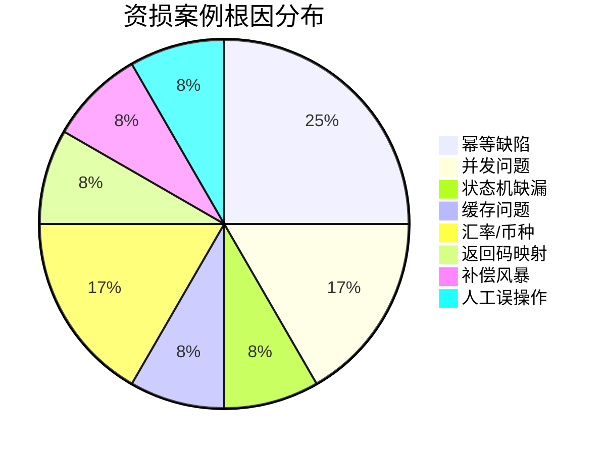

> **【深度拓展】** 12 个案例的共同规律：①**幂等缺陷占比最高**（3/12）——幂等是资金系统的第一原则，任何资金操作都必须幂等；②**并发问题**（2/12）——check-then-act 非原子操作是常见根因，解法是原子操作（CAS/行锁/Lua脚本）；③**多数案例被T+1对账发现**——说明事后对账是兜底底线，但也是"发现太晚"的信号，理想是前移到事中实时告警。

> **【项目支撑】** 以上案例中，案例1/2/3/4/7/9/11 都在 XTransfer 真实发生过或差点发生——其中案例1（幂等键覆盖不全）是我踩过的真实坑，靠T+1对账发现并补偿，事后我把"幂等异常告警"加进了事中防线。案例12（时钟回拨）被DB唯一约束兜住了没有造成资损——这说明"多层防线"的价值：即使Snowflake出了问题，DB唯一约束还能兜底。

---

## 六、战后追款与仲裁流程

> 资损发生后，技术层面的冲正/挂账只是第一步。如果钱已经流出平台（如错误打款给客户），还需要**追款流程**；如果客户拒不返还，需要**仲裁/法律途径**。

**事后追款全流程**：

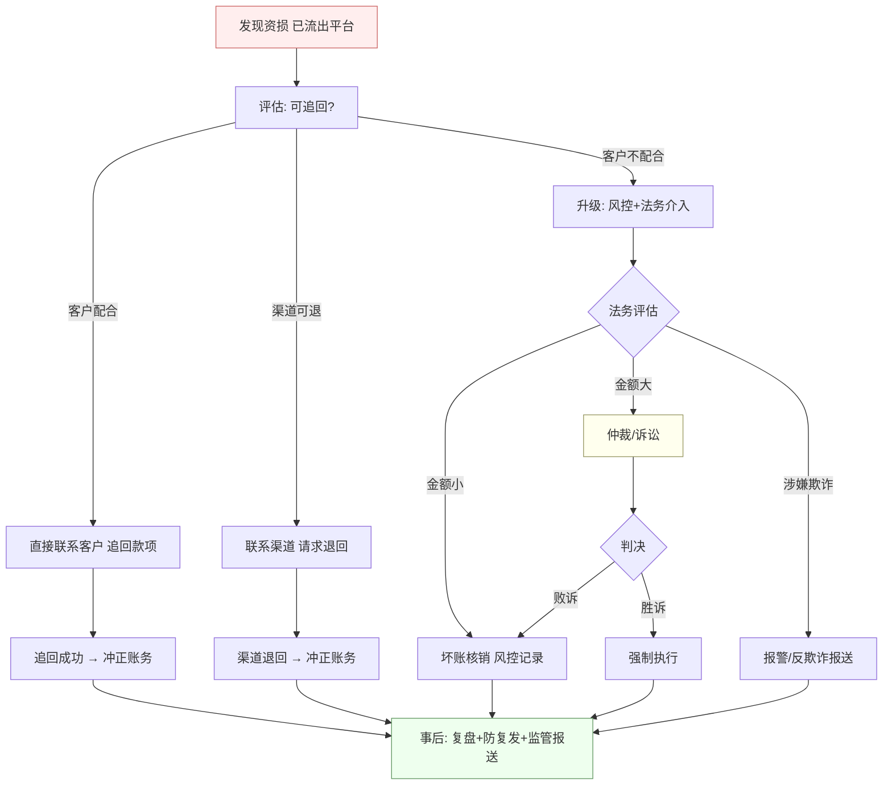

| 追款方式 | 适用场景 | 时效 | 成功率 | 注意事项 |
| --- | --- | --- | --- | --- |
| **直接联系客户** | 客户多收了钱、非恶意 | 1-7天 | 高（80%+） | 态度友好、提供证据、给期限 |
| **渠道退回** | 渠道多付、技术性差错 | 3-30天 | 中（50%+） | 需渠道配合、有手续费 |
| **风控冻结+协商** | 客户不配合但资金在平台 | 1-15天 | 中高（70%+） | 需有冻结权限、法律依据 |
| **仲裁/诉讼** | 金额大、客户拒不返还 | 3-12月 | 低（30-50%） | 成本高、需法务支持 |
| **坏账核销** | 金额小、追回成本>金额 | 即时 | 0% | 风控记录、影响坏账率 |

> **【深度拓展】** 追款的核心原则是"**快+有据**"：①**快**——发现资损后越早联系客户/渠道，追回概率越高（资金一旦被转移/消费，追回难度指数级上升）；②**有据**——所有沟通留痕（邮件/录音/工单），法律途径需要证据链。资金系统要有"**冻结能力**"——发现资损后能秒级冻结涉事账户，防止资金被进一步转移。

> **【面试官追问】** "如果客户多收了钱但拒不返还怎么办？" → ①先冻结其在平台的余额（如果有的话）；②发正式通知（邮件+短信+站内信），给明确期限（如7天）；③超期不返还升级法务——金额大走诉讼，金额小走坏账核销但记入风控黑名单；④涉嫌欺诈的报警+反欺诈报送。关键是有"**冻结+通知+升级**"的标准化流程，而不是每个case临时处理。

> **【项目支撑】** XTransfer 的追款流程：发现资损后第一时间评估"钱在哪"——如果在平台内则秒级冻结；如果已流出则联系客户/渠道追回。所有沟通走工单留痕。金额超过阈值的走法务评估。这套流程的关键是"快+有据"——我在资金域Owner期间处理过多起追款case，大部分在7天内追回（客户配合），少数走坏账核销。

---

## 七(补充). 监管报送注意事项

> 金融系统的资损事件往往涉及**监管报送**——央行/银保监/外汇局等监管机构对资损事件有报送要求。漏报/迟报的后果可能比资损本身更严重。

**监管报送触发条件**：

| 事件类型 | 报送监管 | 报送时效 | 报送内容 |
| --- | --- | --- | --- |
| **客户资金损失** | 央行/银保监 | 24小时内 | 事件描述+影响范围+处置措施 |
| **反洗钱可疑交易** | 反洗钱中心 | 5个工作日 | 交易明细+客户信息+可疑特征 |
| **跨境资金异常** | 外汇局 | 48小时内 | 跨境交易明细+异常原因 |
| **重大系统故障** | 银保监 | 2小时内 | 故障描述+影响范围+恢复时间 |
| **数据泄露** | 网信办+银保监 | 立即 | 泄露范围+影响评估+补救措施 |

**监管报送流程**：

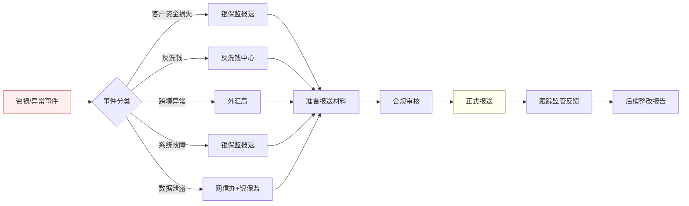

**监管报送注意事项**：

1. **时效第一**：监管报送有时效要求（如重大故障2小时内），错过时效可能被处罚。建议在应急预案中加入"监管报送触发条件"checklist。
2. **内容准确**：报送内容需经合规审核，不能只由技术团队单方面报送——需法务/合规确认口径。
3. **留痕备查**：所有报送材料、沟通记录留档备查，监管可能事后追查。
4. **后续整改**：报送后通常需要提交整改报告——包括根因分析、整改措施、防复发方案。
5. **不瞒报不漏报**：即使资损已追回，仍需报送（监管关注的是"系统性风险"而非"单笔损失"）。

> **【深度拓展】** 监管报送是金融系统的"硬约束"——技术团队往往只关注"怎么修bug/怎么追款"，忽略了"要不要报监管"。资深工程师要知道：①资损事件发生后，**第一时间同步合规团队**评估是否需报送；②技术团队的根因分析报告可以直接作为报送材料的附件，但口径需合规确认；③报送后要跟进整改——监管可能要求限期整改，不整改会被处罚。

> **【面试官追问】** "你们出过需要报送监管的资损事件吗？怎么处理的？" → 这个问题要谨慎回答——不能暴露具体监管处罚（影响公司形象），但可以讲流程："我们的流程是：资损事件评估→合规团队确认是否需报送→按时效准备材料→正式报送→跟踪反馈→提交整改报告。技术团队负责根因分析和整改方案，合规团队负责报送口径和监管沟通。整个流程在应急预案手册里有明确SOP。"

> **【项目支撑】** XTransfer 作为跨境支付平台，受外汇局/央行监管。我在资损事件处置中负责"技术根因分析+整改方案"部分，合规团队负责报送口径。我们的应急预案里明确写了"资损事件同步合规评估报送"这一步——技术修复和监管报送是**并行进行**的，不是"先修完再报"（时效来不及）。

---

## 六、战时应急预案（SOP）——出事那一刻怎么办

防控做得再好也有漏网。应急能力决定"损失是 1 万还是 100 万"。

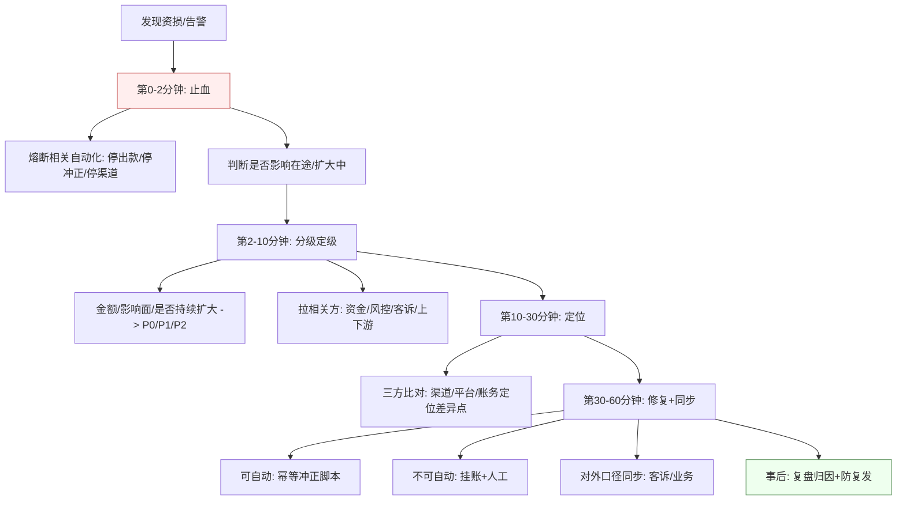

**应急的资深原则**：
1. **先止血再定位**：不要一上来翻代码，先熔断把损失框住——**止血永远优先于查根因**。
2. **宁停勿错**：拿不准就停高危自动化，可用性可补、资损难追。
3. **信息同步先行**：早同步业务/客诉/风控，比闷头修更重要（客户体验、监管口径）。
4. **每个动作可逆/可审计**：应急期的每一步操作都要留痕，防"救火时又造成新资损"。
5. **有 Plan B**：关键动作提前想好"如果这步也失败怎么办"（如冲正失败→挂账人工）。

**平时的准备**（战时才不慌）：
- **应急预案手册**：每类资损场景有对应 SOP、负责人、联系人。
- **常态化演练**：定期混沌演练（注入故障、演练切流/熔断/对账），验证 RTO/RPO 与 SOP 有效性。
- **权限与工具就绪**：止血开关、冲正脚本、对账工具平时就备好，战时秒级可用。

### 6.1 实时对账 vs 离线对账——战时发现差异的速度决定止损上限**【网上最新实践参考】**

| 对账方式 | 原理 | 延迟 | 适用 |
| --- | --- | --- | --- |
| **实时对账** | binlog 监听（Canal/Debezium）实时捕获资金变动，延时几秒即可与渠道/对方系统逐笔查询勾兑 | 秒级~分钟级 | 战时止血——发现差异立即熔断 |
| **准实时对账** | 双方系统定时查询 + 勾兑（5~15 分钟一轮） | 分钟级 | 补充实时对账盲区、非核心链路 |
| **离线对账** | 天表（全量逐笔核对）+ 小时表（增量核对），跑批比对 | 小时级~天级 | 日常兜底、全面覆盖、发现长尾差异 |

**资深视角**：战时靠**实时对账秒级定位差异**，日常靠**离线对账兜底覆盖长尾**。两者不是替代关系，而是**互补**——实时拦住"正在扩大的资损"，离线拦住"实时没覆盖的遗漏"。面试讲对账，要讲"三级对账体系"（实时→准实时→离线）而非只说"T+1 对账"。

### 6.2 预案五要素与演练分级**【网上最新实践参考】**

**预案五要素**（每个应急预案必须包含）：
1. **场景**：什么情况下触发（如"渠道回调超时率 > 30%"、"试算不平告警"）
2. **角色**：谁负责（一线工程师→主管→资金域 Owner→CTO），谁授权（审批流）
3. **流程**：按什么步骤处置（止血→定级→定位→修复→同步→复盘）
4. **止损**：每一步的止损动作与阈值（熔断开关、限额调整、冲正脚本）
5. **恢复**：如何恢复正常运行（渐进放开灰度→全量→验证对账跑平）

**演练分级**：
- **无损演练**：影子流量 / 对比对账（新旧逻辑跑同一笔只比对不落账），验证逻辑正确性但不影响生产数据
- **有损演练**：混沌工程 / 真实故障注入（断网、宕机、时钟回拨），验证 SOP 有效性、RTO/RPO 是否达标，**需要有专人兜底 + 回滚预案**

> 面试加分：能说出"预案五要素"和"无损 vs 有损演练"，说明你不只是"写过应急预案"，而是**系统性做过应急体系的建设与验证**。

> **项目支撑**：作为 XTransfer 资金域 Owner，"凌晨被对账告警叫醒"是真实工作场景。我的处置就是这条 SOP：先熔断相关自动出款止血，再按长/短款分级，三方比对定位（渠道回单/本地记账/状态机状态），能自动的走幂等冲正脚本、不能的挂账人工，全程同步风控与客诉。事后归因到"该被哪道防线拦住"并前移。

---

## 七、面试怎么答这类题（把深度讲出来）

面试官问"如何保证支付不丢钱 / 讲一个资损场景"，别只说"加幂等"。用这个结构：

1. **先分类**："资损分主动和被动，我们能做到主动 0 资损，被动控制在阈值……"（立刻显出体系）。
2. **上三维**："我把防控拆成事前、事中、事后三道防线……"（结构化）。
3. **举极端**："比如时钟回拨/重复回调/补偿风暴/金额放大缩小/返回码映射陷阱这类边界场景，我是这么堵的……"（有深度）。
4. **给应急**："万一漏了，我的止血 SOP 是先熔断再定位……"（有实战）。
5. **讲原则**："**先止血再定位**——不要一上来翻代码，先熔断把损失框住，止血永远优先于查根因。一线工程师发现资损第一时间上报主管，两条原因：①主管有权决定熔断范围和升级级别（一线没有这个权限，自作主张可能扩大损失）；②多人协作定位比单人快——战时是团队作战，不是英雄主义。**"（有高度）。
6. **落项目**："在 XTransfer 我作为资金域 Owner 落地了这套三道防线，做到 0 资损、生产问题 −80%……"（有支撑）。

> **一句话总结**：资损防控的最高境界不是"不出 bug"，而是**让系统在最坏情况下依然对每一分钱负责**——事前堵住边界、事中实时拦截、事后必能追溯，出事时止血比查因快。这套确定性，就是 10 年资金系统经验的价值。

---

## 八、产品设计要点——资损防控从需求阶段就开始**【网上最新实践参考】**

> 很多资损的根因不在代码，而在**产品设计**——信息流与资金流不匹配、正向路径写了逆向路径漏了、异常场景只在事后才补。10 年经验会在需求评审时就拦住这些"将来会丢钱"的设计。

### 8.1 信息流与资金流必须匹配
- **原则**：每一笔信息变更（订单状态、退款申请、审批通过）都必须有对应的资金动作（扣款、退款、出款），反之亦然——**信息流和资金流是镜像关系，任何单侧变更都是资损信号**。
- **落地**：订单状态机与账务状态机**联动校验**（如订单"已退款"但账务"未冲正"→告警）；关键资金动作必须附带信息变更（如出款成功→订单标记"已出款"）。

### 8.2 正向与逆向路径必须对称设计
- **原则**：写了"支付成功"的路径，就**必须同时设计"支付失败/退款/冲正"的逆向路径**——只写正向不写逆向是新手最常见的资损设计缺陷。
- **落地**：需求评审时逐条检查：每个正向动作是否有对应的逆向动作？逆向动作是否幂等？逆向失败是否有兜底（挂账+人工）？

### 8.3 异常场景前置（在需求阶段就枚举异常）
- **原则**：不要等上线后才发现"回调超时怎么办"、"渠道返回码不一致怎么办"——**异常场景要在需求评审时就枚举完毕**，每个异常都有明确的处理策略（重试/熔断/兜底/转人工）。
- **落地**：需求文档必须包含"异常场景清单"（超时/重复/不一致/部分成功/网络分区），每条异常对应一个状态机迁移路径和补偿策略。

> **面试加分**：能说"资损防控从产品设计阶段就开始——信息流与资金流匹配、正向逆向对称、异常场景前置"，比只讲"代码层加幂等"高出两个维度，体现你不只是工程师，而是**对资金安全有产品视角的资深工程师**。

---

*相关阅读*：《支付风控与反欺诈体系》《支付对账体系与差错处理》《账务账户体系与复式记账》《高可用容灾与稳定性》《分布式事务与一致性》《XTransfer 跨境支付收款平台深度复盘》《资深后端开放式场景设计题（10年+）》。

---

> **扁鹊三兄弟的资损防控哲学**：魏文侯问扁鹊："你们兄弟三人谁的医术最高？"扁鹊答："长兄最善，中兄次之，我最差。"文侯不解——扁鹊名闻天下。扁鹊说：**长兄治病于病情发作之前（事前预防），一般人不知道他能事先铲除病因，所以名气无法传出去；中兄治病于病情初起之时（事中拦截），一般人以为他只能治轻微小病，所以名气只及本乡里；而我治病于病情严重之时（事后补救），一般人看到我穿针放血、大动手术，以为医术高明，名气因此响遍天下**。
>
> 资损防控同理——**事前设计把资损扼杀在萌芽（长兄）、事中实时拦截不让资损扩大（中兄）、事后补救追回与兜底（扁鹊）**。三道防线缺一不可，但**最高境界是事前——让资损根本不可能发生**，而非事后补救多么精彩。面试讲资损防控，先说"我追求长兄之境"——事前消灭边界，事中实时拦截，事后只是兜底。

---

## 九、关键极端场景应急 SOP 流程图

> 以下是几个高频极端场景的**标准化应急SOP**，每个场景给"发现→止血→定位→修复→复盘"的完整流程图。

### 9.1 渠道重复回调应急 SOP

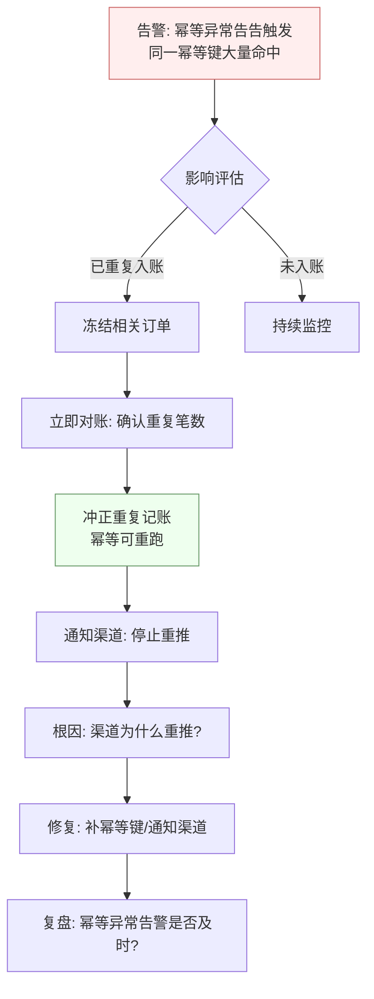

### 9.2 补偿风暴应急 SOP

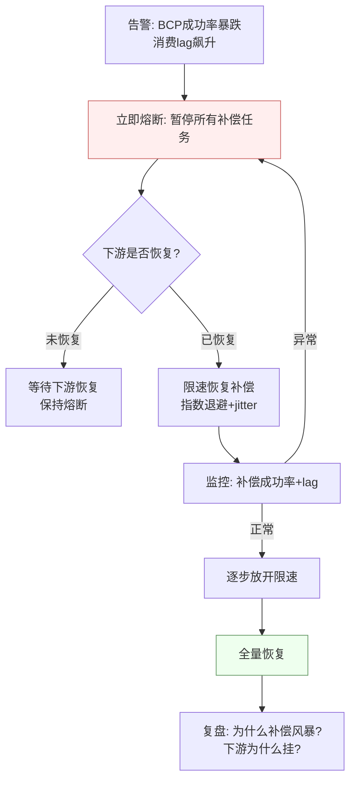

### 9.3 对账不平应急 SOP

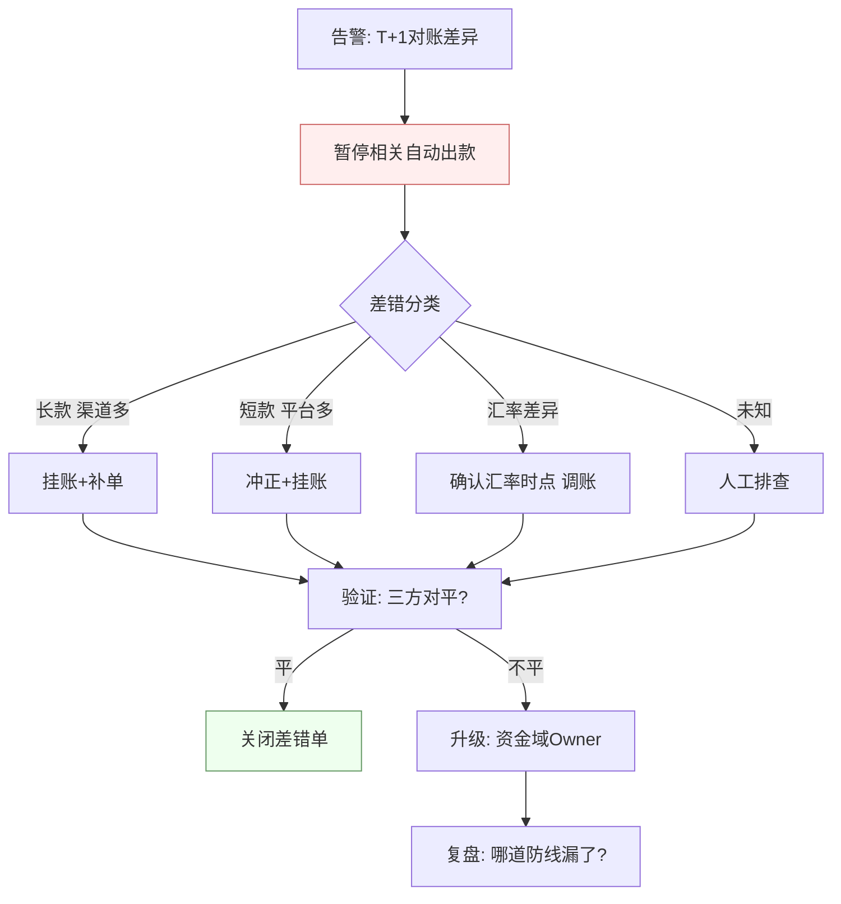

> **【深度拓展】** SOP 的价值在于"**战时不思考**"——资损发生的瞬间，人的判断力会下降（紧张/焦虑），SOP 把"该做什么"提前固化，战时只需"按步骤执行"。但 SOP 不是万能的——它覆盖的是"已知场景"，未知场景仍需人的判断。所以 SOP 要配合"**原则**"使用：已知场景按SOP执行，未知场景按原则决策（先止血、宁停勿错、信息同步、可逆可审计、有PlanB）。

> **【面试官追问】** "你们的 SOP 是怎么制定和维护的？" → ①每个SOP来自真实故障复盘——出过的事故提炼成SOP；②SOP存在应急预案手册里，每类场景有对应SOP+负责人+联系人；③定期演练验证SOP有效性（混沌工程注入故障，按SOP处置）；④每次故障后更新SOP（补充新发现的步骤/阈值）。SOP不是"写完就放着"，是"**持续迭活的活文档**"。

> **【项目支撑】** XTransfer 的应急预案手册是我作为资金域Owner参与建设的——每类资损场景有对应SOP（如上面的三个流程图），每个SOP有负责人、联系人、止损阈值、恢复步骤。我们定期做混沌演练（注入渠道超时/消费lag飙升/对账差异等故障），验证SOP有效性。这套SOP体系是"MTTR < 30分钟"的保障——不是"每个人都很厉害"，而是"按SOP执行就够了"。

<!-- EXPANDED -->

---

## 十、资损防控度量与持续改进

> "0资损"不是一个终点，而是一个**持续过程**。资深工程师要能量化资损防控的成熟度，并持续改进。

**资损防控成熟度模型**：

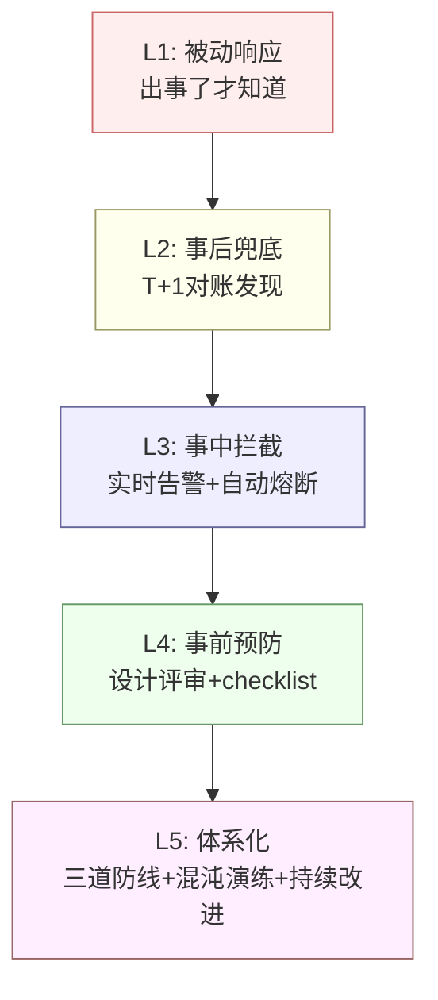

| 等级 | 特征 | 典型表现 | 我的实践 |
| --- | --- | --- | --- |
| L1 被动 | 出事才知道 | 客户投诉/对账偶然发现 | 早期项目（携程/哈啰初期） |
| L2 事后 | T+1对账 | 有对账但靠人跑 | 哈啰/欧凡时期 |
| L3 事中 | 实时告警+熔断 | 试算平衡/非终态/幂等异常告警 | XTransfer 2.0 |
| L4 事前 | 设计评审+checklist | 资金安全评审清单+灰度验证 | XTransfer 2.0后期 |
| L5 体系化 | 持续改进 | 三道防线+混沌演练+防线前移 | XTransfer 目标 |

**资损防控核心指标**：

| 指标 | 定义 | 目标 | 当前(XTransfer) |
| --- | --- | --- | --- |
| 主动资损率 | 主动资损金额/总交易额 | 0 | 0 |
| 资损发现时延 | 从资损发生到发现的平均时间 | <5分钟(事中) | 事中实时拦截 |
| 资损追回率 | 追回金额/资损金额 | >95% | 100%(0资损) |
| 对账覆盖率 | 被对账覆盖的交易比例 | 100% | 100% |
| MTTR(资金故障) | 从资金故障到恢复的平均时间 | <30分钟 | <30分钟 |
| 防线前移率 | 事中发现的问题占比(vs事后) | >80% | ~75%(持续提升中) |

> **【深度拓展】** 资损防控成熟度的关键是"**防线前移率**"——多少比例的问题在事中被拦截（而非等到事后T+1才发现）。L2级团队靠T+1对账兜底（事后发现），L3级团队靠实时告警拦截（事中发现），L5级团队在设计评审时就拦住了（事前预防）。**前移率越高，资损暴露窗口越短，风险越小**。我的目标是把前移率从75%提升到90%+——靠的是持续补事中监控（如新的异常模式识别）和事前评审（如更多checklist条目）。

> **【面试官追问】** "你怎么衡量你的资损防控体系好不好？" → 不看"有没有出过事"（小概率事件），看三个指标：①**对账覆盖率**——100%的交易被对账覆盖了吗？②**防线前移率**——多少比例的问题在事中拦截而非事后？③**MTTR**——出事后多久能止血恢复？这三个指标比"0资损"更能衡量体系成熟度——"0资损"可能是运气好（还没踩到边界），但"对账覆盖率100%+前移率80%+MTTR<30min"说明体系是真的健全。

> **【项目支撑】** XTransfer 的资损防控成熟度从L2（早期T+1对账）逐步提升到L4（事前评审+事中拦截+事后兜底），目标是L5（持续改进+混沌演练）。我的做法是：每次事后复盘都追问"这个问题应该被哪道防线拦住？为什么没拦住？"——然后把缺失补回对应防线。比如"幂等边界漏覆盖"本是事前该防的（评审漏了），事后我把"幂等异常告警"加进了事中防线——这就是"防线前移"的实践。持续这样做，防线一层层往前推，资损暴露窗口越来越短。

---

## 十一、资损防控面试速答模板

> 面试官问"如何保证支付不丢钱"，按这个模板回答，结构化+有深度+有项目支撑。

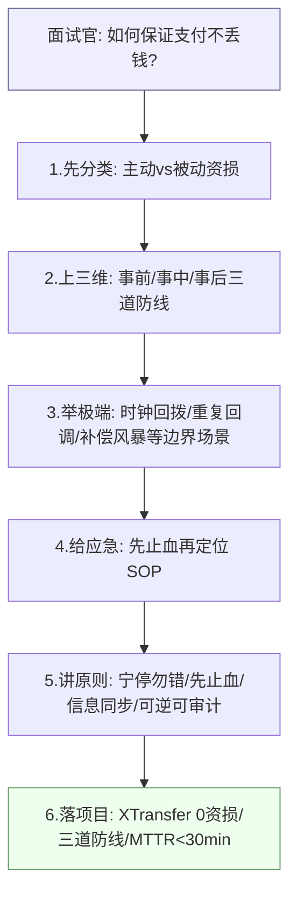

**30秒版**（电梯回答）：

"资损分主动和被动，主动资损靠事前幂等+状态机、事中实时试算平衡告警、事后T+1对账三道防线做到0；被动资损靠风控控制在阈值内。我在XTransfer落地了这套体系，做到了0资损。"

**2分钟版**（标准回答）：

"资损防控我用三道防线：①**事前**——幂等键唯一约束+状态机CAS+多层限额，把非法资金流在设计阶段就堵住；②**事中**——复式记账实时试算平衡告警+非终态卡单告警+幂等异常告警+BCP告警，发现异常自动熔断高危操作；③**事后**——实时+准实时+T+1三级对账+差错冲正+人工兜底。极端场景如时钟回拨、重复回调、补偿风暴、返回码映射陷阱，每个都有对应防护。万一漏了，止血SOP是先熔断再定位。在XTransfer我作为资金域Owner落地了这套体系，做到0资损、MTTR<30分钟。"

**5分钟版**（深度回答）：

在2分钟版基础上，增加：
- **极端场景展开**：选2-3个最有深度的场景（如补偿风暴的指数退避+熔断、返回码映射陷阱的"未知状态"处理），讲清"怎么丢→怎么防"。
- **量化指标**：三道防线的前移率、对账覆盖率、MTTR。
- **案例库**：举1-2个真实case（如幂等键覆盖不全→T+1发现→冲正→加事中告警）。
- **追款流程**：钱流出平台后怎么追回（冻结→联系客户→升级法务）。
- **监管报送**：资损事件的监管报送时效和注意事项。

> **【深度拓展】** 面试讲资损防控最大的坑是"只讲技术手段不讲体系"。很多人一上来就说"加幂等、加对账、加告警"——这是碎片化的技术点。资深回答要先讲**分类学**（主动vs被动、真损vs口径、已发生vs敞口），再讲**三道防线体系**（事前/事中/事后），最后讲**极端场景**和**应急SOP**。面试官想听的是"体系化思考"，不是"我会加幂等"。

> **【面试官追问】** "你说0资损，怎么证明？" → 三个证据：①**对账全覆盖**——每笔交易都有渠道↔平台↔账务三方对账，所有差异在容忍阈值内自动平账或人工核销；②**资损事件登记簿**——每月资损事件统计，主动资损为零（有被动风控案例但都在阈值内）；③**外部审计**——年度审计/合规检查未发现资损问题。0资损不是"我说了算"，是"对账+登记簿+审计三方交叉验证"的结果。

---

## 十二、资损防控的工程实现清单（可落地）

> 把上面的方法论转化为**可落地的工程清单**，每个团队可以按清单逐条对照实施。

### 12.1 事前工程清单

```text
□ 幂等
  □ 每个资金操作都有幂等键（业务唯一键，非随机UUID）
  □ 幂等键建了DB唯一约束
  □ 状态迁移用CAS（WHERE state=旧值）
  □ 前置查询做性能优化（但不依赖它做幂等）
  □ 幂等键覆盖交易全生命周期（预通知/正式通知/重推）

□ 状态机
  □ 所有资金状态显式枚举
  □ 合法迁移路径显式定义
  □ 非法迁移在代码层被拒绝（抛异常）
  □ 迁移用CAS防并发
  □ 评审时逐条过迁移路径（有无遗漏）

□ 限额
  □ 自动化资金操作有单笔限额
  □ 有单日限额
  □ 有单商户限额
  □ 有单渠道限额
  □ 限额校验用DB原子操作（非check-then-act）

□ 发布
  □ 资金链路发布必须灰度
  □ 灰度配置：5%→20%→50%→100%
  □ 每步有SLO告警门禁
  □ 30秒内可回滚
  □ 影子流量比对新旧逻辑

□ 评审
  □ 资金相关方案必须过评审
  □ 评审有"资金安全Checklist"
  □ Checklist覆盖：幂等/状态机/一致性/限额/补偿/对账/回滚
```

### 12.2 事中工程清单

```text
□ 试算平衡
  □ 每笔资金变动借贷同时记账
  □ 实时校验借贷相等
  □ 不平立即告警+卡单

□ 监控告警
  □ 非终态卡单告警（超30分钟中间态）
  □ 幂等异常告警（同一键短时大量命中）
  □ 金额突变告警（日成功金额同比+50%）
  □ BCP告警（成功率<99.5%）
  □ 分渠道成功率告警

□ 自动熔断
  □ 告警命中阈值后自动熔断高危操作
  □ 熔断自动出款
  □ 熔断自动冲正
  □ 熔断后通知负责人
  □ 熔断可手动恢复（非自动恢复）
```

### 12.3 事后工程清单

```text
□ 对账
  □ 实时对账：binlog监听，秒级发现差异
  □ 准实时对账：5-15分钟轮询勾兑
  □ T+1离线对账：全量逐笔+总额核对
  □ 三方对账：渠道↔平台↔账务
  □ 对账差异落差错表
  □ 对账任务本身有监控（跑没跑完/耗时）

□ 差错处理
  □ 长款（渠道多）→ 补单/挂账
  □ 短款（平台多）→ 冲正/挂账
  □ 冲正脚本幂等可重跑
  □ 超阈值差错转人工复核
  □ 全程操作审计

□ 追款
  □ 钱在平台内 → 秒级冻结
  □ 钱已流出 → 联系客户/渠道追回
  □ 客户不配合 → 风控+法务介入
  □ 涉嫌欺诈 → 报警+反欺诈报送
  □ 所有沟通留痕

□ 复盘
  □ 时间线还原（精确到分钟）
  □ 5 Whys根因分析
  □ 分类归因（事前/事中/事后哪道防线漏了）
  □ 行动项有负责人+截止时间
  □ 闭环验证（下次同类能否自动拦截）
  □ 防线前移（事后→事中→事前）

□ 监管报送
  □ 评估是否需报送（合规团队确认）
  □ 按时效准备材料
  □ 合规审核口径
  □ 正式报送
  □ 跟踪反馈+整改报告
```

> **【深度拓展】** 这份清单的价值在于"**不遗漏**"——资金安全的敌人不是"不知道怎么做"，而是"知道但忘了做"。清单把该做的固化成checklist，评审/上线/故障时逐条过，降低人为遗漏风险。清单要**持续迭代**——每次故障后补充新的检查项（如"返回码映射是否区分操作成功vs业务成功"就是踩了坑后加的）。

> **【项目支撑】** XTransfer 的资金安全工程清单就是上面这份的实战版——我在2.0重构时把事前checklist固化进研发流程（每个资金相关PR必须过），事中告警接进了Prometheus+AlertManager，事后对账有三级体系。这份清单不是"写完就放着"，是每次故障后更新的活文档——每次复盘都可能新增检查项，让防线越来越密。

---

## 十三、资损防控与其他系统的联动

> 资损防控不是孤立的，它需要和**风控系统、对账系统、监控系统、应急系统**联动才能形成闭环。

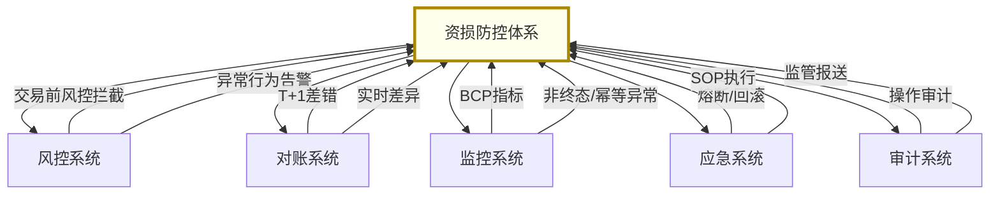

| 联动系统 | 联动内容 | 触发方向 | 响应时效 |
| --- | --- | --- | --- |
| **风控系统** | 交易前风控拦截、异常行为告警 | 双向 | 实时 |
| **对账系统** | T+1差错、实时差异告警 | 对账→资损防控 | 实时~T+1 |
| **监控系统** | BCP指标、非终态/幂等异常告警 | 监控→资损防控 | 实时 |
| **应急系统** | 熔断/回滚/SOP执行 | 资损防控→应急 | 秒级 |
| **审计系统** | 操作审计、监管报送 | 双向 | 事后 |

> **【深度拓展】** 资损防控的"联动能力"是体系成熟度的标志。L2级团队的资损防控是"孤立"的——对账系统发现差异，人工通知资金团队处理；L5级团队的资损防控是"联动"的——对账差异自动触发告警→告警自动触发熔断→熔断通知应急系统→应急系统按SOP执行→全程审计记录。**自动化联动降低了人为延迟**，从"发现→响应"的分钟级变成秒级。

> **【项目支撑】** XTransfer 的资损防控体系与风控/对账/监控/应急/审计五系统联动：风控拦截在交易前（黑名单/限额/规则引擎）、对账在事后（三级对账）、监控在事中（四类告警）、应急在战时（熔断SOP）、审计全程留痕。这套联动体系是"0资损 + MTTR<30分钟"的系统性保障——不是单靠某一道防线，而是五系统协同形成闭环。

> **【面试官追问】** "你的资损防控体系和风控系统有什么区别？" → 资损防控防的是"系统/流程缺陷导致的丢钱"（如重复扣款、状态跳变、限额失效），风控防的是"外部欺诈/攻击导致的丢钱"（如盗刷、套现、薅羊毛）。两者**目标不同、手段不同**：资损防控靠工程手段（幂等/状态机/对账），风控靠规则引擎/模型/人工审核。但两者**联动**——风控的异常告警会触发资损防控的熔断，资损防控的对账差异也会反馈给风控做模型优化。

<!-- EXPANDED -->
