> 10 年经验面试，考的早已不是"某个框架怎么用"，而是**在开放、模糊、约束冲突的场景下，你怎么想、怎么权衡、怎么兜底、怎么带团队把方案落地**。这类题没有标准答案，面试官盯的是：模型抽象能力、风险意识、演进思维、跨团队推动力、以及"被追问时是否站得住脚"。
>
> 本文按 5 大类整理 12 道高频开放式场景题，每题结构：**场景背景 → 面试官考察点 → 资深答题框架（固定套路）→ 追问变体 → 项目支撑（真实经历）**。配合《大厂后端高频面试题汇总》《面试高频考点深度追问》《支付系统全链路架构》食用更佳。

---

## 0. 通用答题框架（先背下来，应对一切开放题）

不管是设计题还是故障题，记住这条主线，比直接给方案更重要：

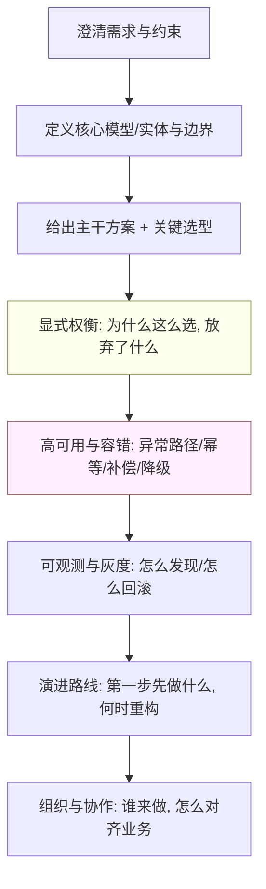

**一句话心法**：先问清楚"规模 / 一致性要求 / 可接受损失 / 时间窗"，再动手；**永远把异常路径讲满**，再讲正常路径；**先 deliver 一个能跑的最小闭环**，再谈演进。

### 答题模板五步法详解

上述框架可以进一步拆解为 **"需求确认 → 架构设计 → 瓶颈分析 → 取舍决策 → 演进路线"** 五步法，每步都有明确的交付物和验收标准：

| 步骤 | 核心动作 | 交付物 | 常见错误 |
|---|---|---|---|
| 1. 需求确认 | 问清规模/QPS/一致性/可用性/时间窗/预算 | 约束清单（功能+非功能） | 直接跳到方案，漏掉隐含约束 |
| 2. 架构设计 | 核心模型 + 分层 + 关键选型 + 数据流 | 架构图 + 模型定义 + 选型理由 | 画大饼不落地，缺少模型抽象 |
| 3. 瓶颈分析 | 容量估算 + 热点识别 + 单点排查 | 瓶颈清单 + 容量推演表 | 只讲正常路径，不分析极限 |
| 4. 取舍决策 | CAP 取舍 + 复杂度 vs 收益 + 时机判断 | 决策矩阵 + 权衡说明 | 面面俱到但无重点，不敢做取舍 |
| 5. 演进路线 | V1 最小闭环 → V2 优化 → V3 规模化 | 里程碑 + 验证指标 + 回滚方案 | 一步到位思维，缺少灰度与回滚 |

> **面试官视角**：10 年候选人如果跳过第 1 步直接画架构图，基本扣分；如果第 3、4 步讲不清瓶颈和取舍，说明缺乏大规模实战；如果第 5 步没有演进路线，说明只会"一次到位"不懂迭代。

### 评分标准：初级 / 高级 / 资深分档

面试官对不同级别候选人的期待完全不同，下表是通用评分维度，后续每题会给出题目专属的分档标准：

| 维度 | 初级（3-5 年） | 高级（5-8 年） | 资深（10 年+） |
|---|---|---|---|
| 需求澄清 | 被动确认 1-2 个约束 | 主动追问 3-5 个关键约束 | 主动暴露隐含约束 + 量化（QPS/SLA/资损容忍度） |
| 架构设计 | 能给出单机/单体方案 | 能做分层 + 选型 + 异步解耦 | 能做领域建模 + 六边形/CQRS + 演进式架构 |
| 异常处理 | 讲到 try-catch | 讲到幂等/重试/补偿 | 讲满兜底链路 + 死信 + 人工兜底 + 资金安全 |
| 取舍意识 | 很少主动谈取舍 | 能讲 1-2 个权衡 | 能做决策矩阵 + 显式记录"放弃了什么" |
| 规模意识 | 单机思维 | 知道分库分表/MQ | 自觉做容量推演 + 热点预判 + 单点排查 |
| 演进思维 | 一步到位 | 知道要灰度 | 给出 V1→V2→V3 路线 + 验证指标 + 回滚方案 |
| 协作推动 | 自己能写 | 能带 2-3 人 | 能跨团队对齐 + 用数据争取资源 + 带新人成长 |

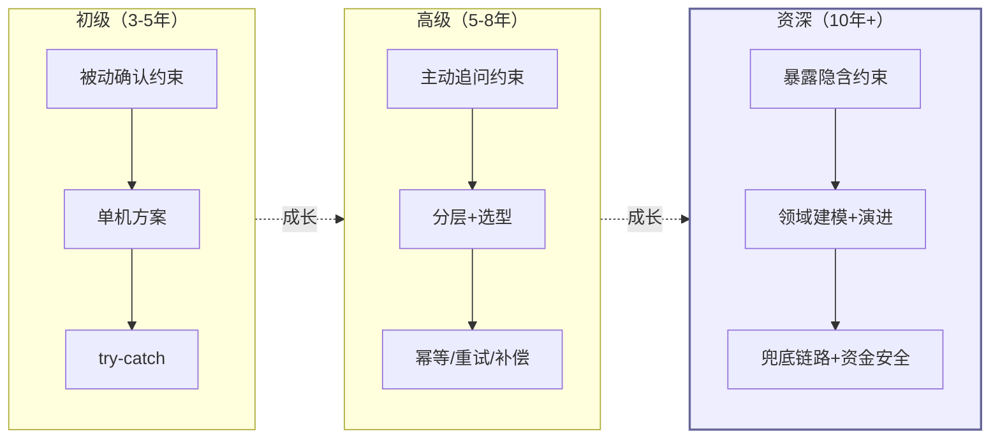

---

## 一、系统设计类（从 0 到 1 / 大规模重构）

### 1.1 设计跨境收款与多币种清结算资金平台

**场景背景**：公司要做一个面向中小外贸企业的跨境收款平台，支持海外买家通过本地收款账户（VA 虚拟账户）付款，资金入境后做清分、购汇、结算到国内对公户。预期峰值 **日千万笔对客结算、数百万客户**，核心硬约束是**资金 0 资损、强一致、可审计**。

**面试官考察点**：
- 能否把"支付"拆成**收款 → 记账 → 清结算 → 对账**清晰分层，而不是糊成一团；
- 如何处理**不可逆 + 高并发 + 强一致**这一组合（一个小 bug 就是真金白银损失）；
- 领域建模能力（账户、订单、交易、渠道的差异如何隔离）；
- 对**资金安全三道防线**是否有体系化认知。

**资深答题框架**：
1. **澄清约束**：先确认资金流向（VA 收款 → 渠道入账 → 平台清分 → 购汇 → 结算出款）、差错容忍度（0 资损）、合规要求（AML/KYC、贸易背景真实性）。
2. **核心模型**：以**状态机**驱动资金流——每笔收款单有 `待入账 → 已入账 → 已清分 → 已结算 → 完成` 等有限状态，所有金额变动必须伴随状态迁移；用 **CAS 更新**天然保证幂等（非法状态迁移直接被拒）。
3. **分层架构**：六边形（Ports & Adapters）+ CQRS + DDD。领域层只关心业务规则；渠道、账务、风控通过 **SPI/端口** 接入，新渠道零改核心（开闭原则）。**写模型**处理指令，**读模型**供运营/客户查询，读写分离缓解大查询压力。
4. **记账**：复式记账，每笔资金变动借贷双方同时落账；**实时试算平衡**，不平立即告警卡单。
5. **最终一致**：跨服务用**本地消息表 / Outbox** 保证事件不丢；长事务用**任务补偿**（本地事务写业务 + 任务表，异步重试 + 补偿脚本，死信转人工）。
6. **可观测**：全链路 traceId、资金流水只增不减、T+1 多维护对账 + 差错冲正 + 人工兜底。

**追问变体**：
- "100+ 海外渠道的 VA 开户差异巨大，你怎么不写崩核心？" → 渠道差异**外置 + 配置化 + 领域拆分**，标准化开户流程。
- "状态爆炸怎么治理？" → 子状态机拆分（如风控独立子状态机：免关联 / 关联 / 渠道调单）。
- "历史状态迁移怎么兼容老数据？" → 双写 + 灰度 + 对账，迁移脚本可重跑。

**项目支撑**：XTransfer 收款平台正是这套架构——我作为**收款领域 Owner**，主导 2.0 重构（六边形 + CQRS + DDD + SPI），从 0 到 1 主导「预入账」子领域；标准化 VA 开户覆盖 **100+ 渠道**；资金安全三道防线（事前幂等键 + 状态机约束 + 限额 / 事中复式记账实时试算平衡告警、非终态卡单 / 事后 T+1 多维护对账 + 差错冲正）。2.0 重构结果：**人效 +30%、生产问题 −80%、0 资损**。

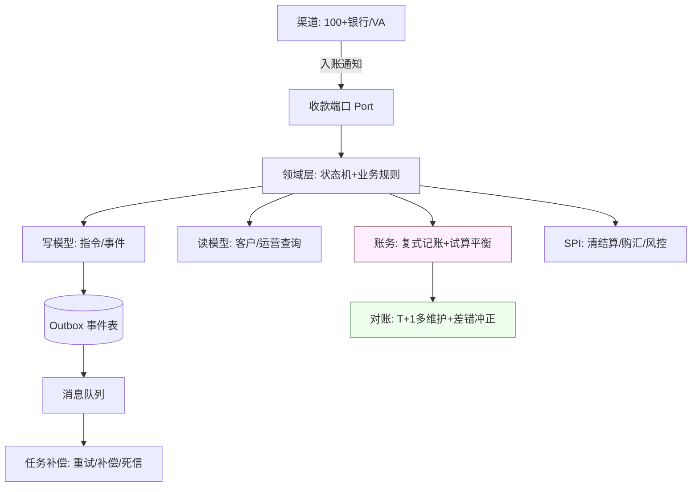

### 【追问链路】5 层深度追问

面试官不会只问一层，以下是这道题的典型追问链路，每层都比上一层更深：

| 追问层级 | 面试官追问 | 资深答法要点 |
|---|---|---|
| L1 | "100+ 海外渠道的 VA 开户差异巨大，你怎么不写崩核心？" | 渠道差异**外置 + 配置化 + SPI 扩展点**，核心只定义标准流程 |
| L2 | "SPI 的加载机制是什么？怎么做到新渠道零改核心？" | 类似 Java SPI/ServiceLoader + Spring Bean 动态注册；配置驱动渠道路由 |
| L3 | "状态爆炸怎么治理？比如风控有免关联/关联/渠道调单等子状态" | **子状态机拆分**——主状态机管资金流，风控独立子状态机，通过事件驱动联动 |
| L4 | "历史状态迁移怎么兼容老数据？灰度期间新老状态机并存怎么处理？" | **双写 + 灰度 + 对账**：新状态机旁路写，灰度切读，迁移脚本可重跑 + 幂等 |
| L5 | "如果某渠道突然改了入账通知格式，怎么不影响核心？" | 渠道适配层（Anti-Corruption Layer）做格式转换，核心领域模型不变；适配层有单测覆盖 |

### 【评分标准】本题专属分档

| 级别 | 评分要点 |
|---|---|
| 初级 | 能画出收款流程图，知道要防超卖/防重复记账 |
| 高级 | 能讲分层架构 + 状态机 + 幂等 + 补偿，知道对账要做 |
| 资深 | 能讲六边形/CQRS/DDD 选型理由，资金安全三道防线完整，状态机治理 + 子状态机拆分，SPI 渠道扩展 + 灰度迁移方案，0 资损的工程兜底 |

### 【深度拓展】资金状态机代码示例

```java
// 收款单状态机 —— 枚举 + CAS 保证合法迁移
public enum ReceiptStatus {
    PENDING_INCOMING,   // 待入账
    INCOMED,            // 已入账
    CLEARED,            // 已清分
    SETTLED,            // 已结算
    COMPLETED,          // 完成
    FAILED,             // 失败
    REVERSED;           // 已冲正

    // 合法迁移矩阵
    private static final Map<ReceiptStatus, Set<ReceiptStatus>> TRANSITIONS = Map.of(
        PENDING_INCOMING, Set.of(INCOMED, FAILED),
        INCOMED,          Set.of(CLEARED, REVERSED),
        CLEARED,          Set.of(SETTLED, REVERSED),
        SETTLED,          Set.of(COMPLETED, REVERSED),
        COMPLETED,        Set.of(),  // 终态
        FAILED,           Set.of(PENDING_INCOMING),  // 可重试
        REVERSED,         Set.of()   // 终态
    );

    public boolean canTransitTo(ReceiptStatus target) {
        return TRANSITIONS.getOrDefault(this, Set.of()).contains(target);
    }
}

// CAS 迁移 —— 天然幂等，非法迁移直接被拒
public boolean transit(Long receiptId, ReceiptStatus from, ReceiptStatus to) {
    // UPDATE receipt SET status=? WHERE id=? AND status=?
    int rows = receiptMapper.casUpdateStatus(receiptId, to, from);
    if (rows == 0) {
        // 可能是并发竞争或非法迁移 —— 记录告警，不抛异常
        monitor.alert("status_transition_failed", receiptId, from, to);
        return false;
    }
    // 发布领域事件（Outbox）
    eventPublisher.publish(new StatusChangedEvent(receiptId, from, to));
    return true;
}
```

### 【深度拓展】复式记账 SQL 示例

```sql
-- 复式记账：借贷同时落账，实时试算平衡
INSERT INTO account_entry (entry_id, account_id, direction, amount, biz_type, ref_no, created_at)
VALUES
  ('E001', 'ACCT_CUSTOMER_001', 'DEBIT',  1000.00, 'INCOMING',  'R20260710001', NOW()),
  ('E002', 'ACCT_CHANNEL_VA',   'CREDIT', 1000.00, 'INCOMING',  'R20260710001', NOW());

-- 试算平衡检查：借贷必须相等
SELECT
  SUM(CASE WHEN direction = 'DEBIT'  THEN amount ELSE 0 END) AS debit_total,
  SUM(CASE WHEN direction = 'CREDIT' THEN amount ELSE 0 END) AS credit_total,
  ABS(SUM(CASE WHEN direction = 'DEBIT' THEN amount ELSE 0 END) -
      SUM(CASE WHEN direction = 'CREDIT' THEN amount ELSE 0 END)) AS diff
FROM account_entry
WHERE ref_no = 'R20260710001';
-- diff != 0 → 立即告警 + 卡单
```

---

### 1.2 设计大促秒杀 / 直播带货的库存与下单系统

**场景背景**：电商大促或直播带货，某爆款库存 1 万，但瞬时涌入 50 万请求，要求**绝对不超卖、下单可回滚、峰值不把 DB 打挂**。

**面试官考察点**：
- 高并发下**库存扣减的一致性**（超卖是致命 bug）；
- 多级流量削峰（前端、网关、MQ、缓存）；
- 库存与订单的**最终一致**与**超时回补**；
- 热点 key 与回源风暴。

**资深答题框架**：
1. **澄清**：QPS 量级、库存量、是否允许超卖（一般不允许）、超时未支付是否回补。
2. **入口削峰**：前端按钮置灰 + 答题/随机等待；网关限流（令牌桶）；无效请求（已售罄）本地缓存直接挡。
3. **库存扣减原子化**：用 **Redis + Lua 脚本**在单线程内原子完成"判断库存 > 0 → 扣减 → 返回"，**杜绝超卖**；库存预热到 Redis，DB 只做最终落地。
4. **异步下单**：扣减成功后发 MQ，订单服务消费落库；订单创建与支付**超时（如 15 分钟）未支付则回补库存**，回补同样走 Lua 防并发。
5. **防超卖兜底**：Redis 扣减与 DB 库存用**binlog/ Canal** 对齐；DB 层加 `UPDATE stock SET cnt=cnt-1 WHERE id=? AND cnt>0` 行锁兜底，影响行数为 0 即失败。
6. **热点与回源**：本地缓存（Caffeine）挡热点读；库存变更走 binlog 同步本地缓存，**防回源风暴**。

**追问变体**：
- "Redis 挂了怎么办？" → 降级到 DB 行锁（性能降但安全），或 Redis 多副本 + 持久化。
- "Lua 脚本里要调外部服务吗？" → 绝对不要，Lua 必须纯内存操作，外部调用放到 MQ 异步。
- "库存和订单不一致怎么发现？" → 定时对账 + 差额告警 + 人工冲正。

**项目支撑**：欧凡网络（海外直播电商）的库存扣减正是用 **Lua 脚本在 Redis 原子扣减防超卖**；读链路用**本地 Caffeine + Redis 二级缓存**，通过 **Canal / binlog** 保证缓存与 DB 一致，规避热点回源风暴。这题我可以直接讲这套真实落地。

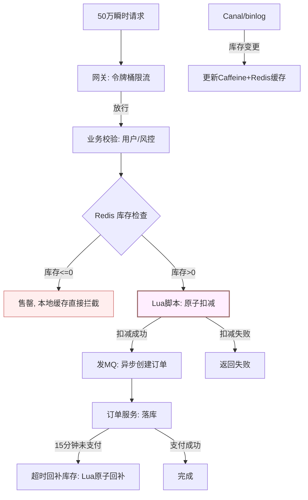

### 【追问链路】5 层深度追问

| 追问层级 | 面试官追问 | 资深答法要点 |
|---|---|---|
| L1 | "Redis 挂了怎么办？" | 降级到 DB 行锁（性能降但安全），Redis 多副本 + 持久化 + 哨兵自动切换 |
| L2 | "Lua 脚本里能调外部服务吗？" | 绝对不能，Lua 必须纯内存操作；外部调用放 MQ 异步 |
| L3 | "库存和订单不一致怎么发现？" | 定时对账 + binlog/Canal 实时对齐 + 差额告警 + 人工冲正 |
| L4 | "50 万 QPS 下 Redis 单节点扛不住怎么办？" | **库存分片**：10000 库存拆成 10 片 × 1000，路由到不同 Redis 节点；扣减时随机选片，回补时定向回补 |
| L5 | "分片后某一片卖完了怎么办？要不要从其他片借库存？" | **库存迁移**：异步将剩余分片的库存匀到卖完的分片；或前端动态调整路由权重，让流量打到库存充足的分片 |

### 【评分标准】本题专属分档

| 级别 | 评分要点 |
|---|---|
| 初级 | 知道用 Redis 做库存扣减，知道要防超卖 |
| 高级 | 能讲 Lua 原子操作 + MQ 异步下单 + 超时回补 + DB 行锁兜底 |
| 资深 | 能讲库存分片应对 Redis 单点瓶颈 + 分片间库存迁移 + 多级缓存一致性（binlog/Canal）+ 降级策略 + 容量推演（50万 QPS 的 Redis 分片规划） |

### 【深度拓展】Lua 原子扣减脚本

```lua
-- KEYS[1] = 库存key, ARGV[1] = 扣减数量, ARGV[2] = 请求ID(幂等)
local stock = tonumber(redis.call('GET', KEYS[1]))
local deduct = tonumber(ARGV[1])
local reqId = ARGV[2]

-- 幂等检查：如果该请求已处理过，直接返回上次结果
local existed = redis.call('HGET', KEYS[1] .. ':dedup', reqId)
if existed then
    return existed  -- 返回上次结果，幂等
end

if not stock or stock < deduct then
    redis.call('HSET', KEYS[1] .. ':dedup', reqId, '-1')  -- 记录失败
    return -1  -- 库存不足
end

local remaining = stock - deduct
redis.call('SET', KEYS[1], remaining)
redis.call('HSET', KEYS[1] .. ':dedup', reqId, tostring(remaining))
redis.call('EXPIRE', KEYS[1] .. ':dedup', 3600)  -- 幂等记录1小时过期
return remaining  -- 返回剩余库存
```

### 【面试官追问】常见陷阱

> **陷阱 1**：候选人只讲"用 Redis 扣减"但不讲 Lua 原子性 → 说明不理解 Redis 单线程模型的边界。
>
> **陷阱 2**：讲"用分布式锁防超卖" → 分布式锁性能差且不必要，Lua 原子操作更优；锁只用于跨服务协调，不用于库存扣减。
>
> **陷阱 3**：不讲超时回补 → 订单创建后未支付，库存不回补 = 变相超卖（用户买不到）。

---

### 1.3 设计实时数据化运营平台（百万 DAU）

**场景背景**：公司要建一个数据化运营平台，支撑百万级 DAU 的实时报表、即席查询、指标监控，数据来自埋点 + 业务库，要求口径统一、数据可信。

**面试官考察点**：
- 离线 + 实时**双链路**如何组织（Lambda / 流批一体）；
- 指标口径统一与**数据质量**治理（这是平台能不能活下来的关键）；
- OLAP 选型与查询性能；
- 数据资产与权限。

**资深答题框架**：
1. **分层架构**：采集（埋点 SDK + 业务库 CDC）→ 计算（Flink 实时 + Spark 离线）→ 存储（数仓分层 ODS/DWD/DWS/ADS + OLAP 如 ClickHouse/Doris）→ 服务（报表 / API / 看板）。
2. **口径治理**：指标统一定义在**指标中台 / 字典**，一处定义多处复用；维度退化、退化到 ADS 层，避免各处自己算导致口径漂移。
3. **数据质量**：上线前做**数据质量校验**（空值、波动、主键唯一、血缘监控）；异常自动告警、可回溯。
4. **查询性能**：大宽表 + 物化视图 + 预聚合；即席查询走 OLAP 列存；限制查询粒度防全表扫描。
5. **演进**：先离线跑通口径，再叠实时；不要一上来就流批一体（复杂度高）。

**追问变体**：
- "实时和离线结果对不上谁为准？" → 以离线（T+1 校准）为基准，实时做修正对齐，暴露差异阈值。
- "指标口径被业务方质疑怎么办？" → 指标血缘可追溯到字段级，提供对比 SQL，让质疑可验证。

**项目支撑**：携程数据化运营平台正是这条链路——**采集（埋点/业务库）→ 计算（Flink/Spark 离线+实时）→ 存储（数仓/OLAP）→ 服务（报表/API/看板）**；我重点做**口径统一、数据质量、指标治理**，这是平台被业务信任的前提。

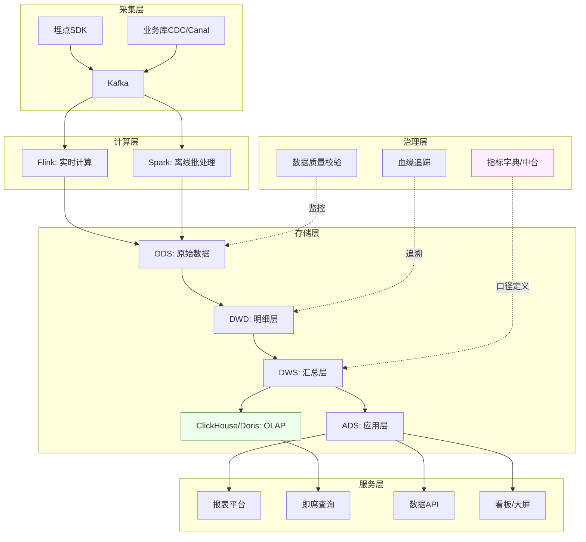

### 【追问链路】4 层深度追问

| 追问层级 | 面试官追问 | 资深答法要点 |
|---|---|---|
| L1 | "实时和离线结果对不上谁为准？" | 以离线（T+1 校准）为基准，实时做修正对齐，暴露差异阈值（如 ±0.1%） |
| L2 | "指标口径被业务方质疑怎么办？" | 指标血缘可追溯到字段级，提供对比 SQL，让质疑可验证；口径变更走审批流程 |
| L3 | "Flink 作业挂了，实时报表断了怎么办？" | 作业自动重启 + Checkpoint 恢复；断流期间用离线 T-1 数据兜底；告警通知业务方"实时数据可能有延迟" |
| L4 | "百万 DAU 下埋点数据量巨大，Kafka 怎么扛？" | 按业务域拆 Topic + 分区并行；热数据 7 天过期 + 冷数据归档到 S3/HDFS；消费端做批量写入 OLAP |

### 【评分标准】本题专属分档

| 级别 | 评分要点 |
|---|---|
| 初级 | 能画出数据采集→计算→存储→展示链路 |
| 高级 | 能讲 Lambda 架构 + 指标口径治理 + OLAP 选型理由 |
| 资深 | 能讲流批一体的取舍 + 数据质量工程化（血缘/校验/告警）+ 指标中台设计 + 实时断流兜底 + 容量推演 |

### 【深度拓展】指标口径治理方案

指标口径不统一是数据平台最常见的"信任杀手"。治理方案：

1. **统一定义**：指标在**指标中台**一处定义，包含名称、口径 SQL、归属业务域、负责人、版本号
2. **血缘追踪**：指标 → DWS 表 → DWD 字段 → ODS 源头，全链路可追溯
3. **变更审批**：口径变更走审批流，影响面评估 + 通知下游消费方
4. **对比验证**：提供"新旧口径并行查询"能力，让业务方自行验证差异

```yaml
# 指标定义示例（指标中台）
metric:
  id: M001
  name: "日活DAU"
  domain: "用户增长"
  owner: "zhangsan"
  version: "2.1"
  sql: |
    SELECT COUNT(DISTINCT user_id)
    FROM dws_user_active_daily
    WHERE dt = '${biz_date}'
  dimensions: [channel, platform, country]
  frequency: "daily"
  sla: "T+1 08:00 前产出"
  quality_checks:
    - type: "null_check"
      field: "user_id"
      threshold: 0
    - type: "fluctuation_check"
      max_change: 0.2  # 环比变化不超过20%
  lineage:
    upstream: "dws_user_active_daily"
    downstream: ["ads_growth_dashboard", "api_dau_query"]
```

---

### 1.4 设计分布式任务调度与补偿平台

**场景背景**：系统里有大量跨服务、跨系统的长流程（如清结算、对账、出款），需要可靠的调度、重试、补偿，要求**最终一致、可重跑、可观测、失败可兜底**。

**面试官考察点**：
- 分布式调度 vs 本地调度；
- **任务补偿**模型（Saga / 本地消息表 / 重试策略）；
- 幂等、死信、人工兜底；
- 可观测（任务到哪里了、为什么卡住）。

**资深答题框架**：
1. **模型**：每个长流程拆成**可补偿的步骤**，每步有 `待执行 → 执行中 → 成功/失败 → 补偿中 → 已补偿`。
2. **调度**：用调度中心触发，**本地事务写业务 + 任务表**（同库，强一致），任务表记录状态、重试次数、下次触发时间。
3. **执行与重试**：Worker 拉取待执行任务，幂等执行（幂等键）；失败按**指数退避**重试，超过阈值进**死信队列**转人工。
4. **补偿**：反向执行补偿步骤（如"已扣款未出款"→ 冲正扣款）；补偿本身也要幂等可重跑。
5. **可观测**：任务大盘（堆积 / 失败率 / 平均耗时）、traceId 串起整条流程、告警到 Owner。

**追问变体**：
- "补偿也失败了且人工也处理不了？" → 极端情况下挂起到**资金安全专用兜底流程**（人工复核 + 临时挂账），绝不让资金处于未知态。
- "任务重跑了两次会怎样？" → 幂等键保证重复执行安全；调度中心做**取锁 + 状态机**防并发抢同一任务。

**项目支撑**：XTransfer 的**任务补偿**机制就是这套——本地事务写业务 + 任务表，异步重试 + 补偿脚本，死信转人工；配合 Outbox 保证事件不丢，是我做收款 2.0 时落地"最终一致 + 0 资损"的核心抓手。

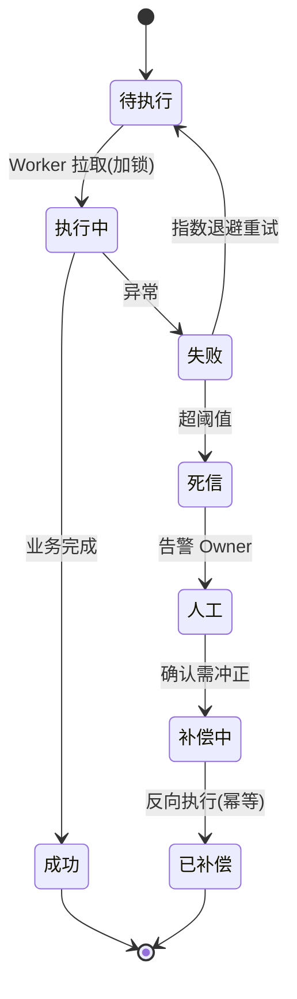

### 【追问链路】5 层深度追问

| 追问层级 | 面试官追问 | 资深答法要点 |
|---|---|---|
| L1 | "补偿也失败了且人工也处理不了？" | 极端情况挂起到**资金安全专用兜底流程**（人工复核 + 临时挂账），绝不让资金处于未知态 |
| L2 | "任务重跑了两次会怎样？" | 幂等键保证重复执行安全；调度中心做**取锁 + 状态机**防并发抢同一任务 |
| L3 | "任务表和业务表在同一个事务里，如果业务表很大会不会有性能问题？" | 任务表只存轻量元数据（ID/状态/重试次数/下次执行时间），不存业务负载；业务数据通过 ID 关联查询 |
| L4 | "指数退避的上限怎么定？超过上限进死信后多久告警？" | 退避上限一般 5-10 分钟（避免过短导致雪崩）；死信立即告警（电话 + IM），SLA 要求 15 分钟内人工介入 |
| L5 | "如果要支持 10 万级并发任务，调度中心怎么扩展？" | 调度中心无状态 + 分片调度（类似 Elastic-Job）；Worker 水平扩容 + 心跳注册 + 负载均衡；任务表按时间分片避免热点 |

### 【评分标准】本题专属分档

| 级别 | 评分要点 |
|---|---|
| 初级 | 知道用定时任务 + 重试，会写 cron |
| 高级 | 能讲本地消息表 + 幂等 + 指数退避 + 死信队列 |
| 资深 | 能讲任务状态机设计 + 补偿幂等 + 分片调度扩展 + 死信告警 SLA + 与资金安全兜底流程联动 + 可观测大盘（堆积/失败率/平均耗时） |

### 【深度拓展】任务补偿代码示例

```java
// 任务调度 Worker —— 幂等执行 + 指数退避 + 死信
public class TaskWorker {

    @Transactional
    public void execute(Task task) {
        // 1. 幂等检查：防止重复执行
        if (task.getStatus() == TaskStatus.SUCCESS) {
            return;  // 已成功，跳过
        }

        // 2. 加锁：防止并发抢同一任务（乐观锁 CAS）
        int rows = taskMapper.casUpdateStatus(
            task.getId(), TaskStatus.RUNNING, TaskStatus.PENDING
        );
        if (rows == 0) return;  // 被其他 Worker 抢走

        try {
            // 3. 执行业务逻辑（幂等）
            businessService.process(task.getBizId(), task.getIdempotentKey());
            // 4. 标记成功
            taskMapper.updateStatus(task.getId(), TaskStatus.SUCCESS);
        } catch (Exception e) {
            // 5. 失败：记录重试次数 + 指数退避
            int retryCount = task.getRetryCount() + 1;
            if (retryCount >= MAX_RETRY) {
                // 超阈值 → 死信
                taskMapper.updateStatus(task.getId(), TaskStatus.DEAD_LETTER);
                alertService.notifyUrgent("任务进入死信", task);
            } else {
                // 指数退避：1min, 2min, 4min, 8min, 16min
                long delay = (long) Math.pow(2, retryCount) * 60_000;
                taskMapper.updateForRetry(task.getId(), retryCount,
                    new Date(System.currentTimeMillis() + delay));
            }
        }
    }

    // 补偿执行 —— 反向操作，同样幂等
    public void compensate(Task task) {
        // 反向执行：如"已扣款未出款" → 冲正扣款
        businessService.reverse(task.getBizId(), task.getIdempotentKey());
        taskMapper.updateStatus(task.getId(), TaskStatus.COMPENSATED);
    }
}
```

### 【深度拓展】任务可观测大盘指标

| 指标 | 告警阈值 | 说明 |
|---|---|---|
| 待执行任务堆积量 | > 5000 | 堆积过多说明 Worker 不够或执行慢 |
| 任务失败率 | > 5% | 失败率突增说明业务异常 |
| 死信任务数 | > 0 | 死信 = 需人工介入，立即告警 |
| 平均执行耗时 | > 30s | 单任务过慢可能阻塞 Worker |
| 补偿成功率 | < 99% | 补偿失败 = 资金风险，需立即排查 |

---

### 2.1 核心支付链路做单元化多活改造

**场景背景**：核心支付链路目前是单机房，要改成**单元化多活**（每个单元自包含、就近接入、故障可切流），要求迁移过程**0 资损、可灰度、可秒级回滚**。

**面试官考察点**：
- 单元化（单元封闭、路由规则、数据不跨单元）；
- 灰度与回滚策略（资金系统不能"一把梭"）；
- 数据同步与脑裂；
- 容灾演练。

**资深答题框架**：
1. **单元划分**：按用户/商户维度分片，每个单元**自包含**（应用 + 本单元数据），请求按路由规则进固定单元，**禁止跨单元写**。
2. **灰度**：先迁只读/低风险的查询流量，再迁小部分写流量（影子流量比对），最后全量；每步可观测、可回滚。
3. **数据同步**：单元间异步同步做**容灾副本**（不用于实时读，只用于故障接管）；用全局唯一 ID + 版本防脑裂。
4. **切流与回滚**：流量调度层支持秒级切流；保留旧单元一段时间"热备"，异常一键回滚。
5. **演练**：定期**混沌演练**（杀节点、断网、延迟注入），验证 RTO/RPO 达标。

**追问变体**：
- "切流过程中出现部分成功部分失败？" → 以**状态机 + 幂等**保证每笔交易最终一致，切流只在请求边界发生，进行中交易在源单元完成。
- "怎么证明多活真的有效？" → 常态化容灾演练 + 切换 SOP + 演练指标（RTO/RPO）纳入考核。

**项目支撑**：XTransfer 高可用设计里，资金安全三道防线 + 任务补偿 + 状态机，天然为多活打底——每笔交易状态机驱动、幂等、可补偿，切流时"在途交易在原单元闭环"正是这套模型的延伸。详见《高可用跨境支付系统设计》《高可用容灾与稳定性》。

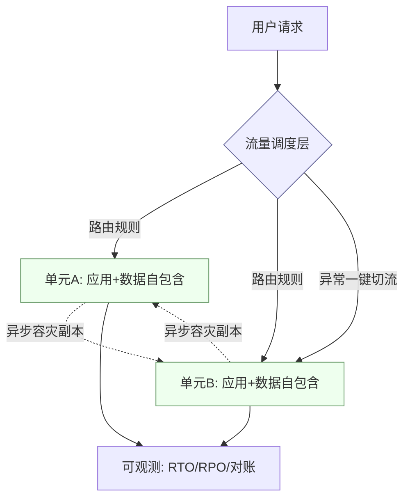

### 【追问链路】5 层深度追问

| 追问层级 | 面试官追问 | 资深答法要点 |
|---|---|---|
| L1 | "切流过程中出现部分成功部分失败？" | 以**状态机 + 幂等**保证每笔交易最终一致，切流只在请求边界发生，进行中交易在源单元完成 |
| L2 | "怎么证明多活真的有效？" | 常态化容灾演练 + 切换 SOP + 演练指标（RTO/RPO）纳入考核 |
| L3 | "两个单元同时写入同一用户的数据怎么办（脑裂）？" | 路由规则保证**同一用户只路由到一个单元**（禁止跨单元写）；即使路由错误，用全局唯一 ID + 版本号 + CAS 防覆盖 |
| L4 | "单元间异步同步延迟 5 秒，故障切换时这 5 秒的数据怎么办？" | RPO = 同步延迟窗口；切换前先确认同步追上（延迟 < 1s）；极端情况用 binlog 回补丢失数据 |
| L5 | "成本太高，老板只批 1.5 活（一个主 + 一个半活），怎么做？" | 核心**交易链路**做双活，**非核心**（报表/搜索/对账）只做主活 + 异步备份；按业务分级做差异化容灾 |

### 【评分标准】本题专属分档

| 级别 | 评分要点 |
|---|---|
| 初级 | 知道要多机房部署，听过"同城双活" |
| 高级 | 能讲单元化概念 + 路由规则 + 灰度切流 + 数据同步 |
| 资深 | 能讲脑裂防护 + RTO/RPO 量化 + 分级容灾（核心双活/非核心主备）+ 混沌演练常态化 + 成本与可用性的取舍 |

### 【深度拓展】单元化路由配置示例

```yaml
# 单元化路由配置
cell:
  cells:
    - id: "cell-a"
      region: "cn-east-1"
      weight: 50  # 50%流量
      shardRange: "0-4999"  # 用户ID哈希分片范围
    - id: "cell-b"
      region: "cn-south-1"
      weight: 50
      shardRange: "5000-9999"

  routing:
    key: "userId"  # 路由键
    algorithm: "hash"  # 一致性哈希
    fallback: "cell-a"  # 路由失败默认单元

  sync:
    mode: "async"  # 异步容灾同步
    delay_threshold_ms: 1000  # 延迟告警阈值
    conflict_resolution: "version"  # 版本号解决冲突

  failover:
    rto_target_sec: 30   # 恢复时间目标
    rpo_target_sec: 5    # 数据丢失目标
    auto_switch: false   # 自动切流需人工确认（资金系统）
    drill_interval: "monthly"  # 每月演练
```

### 【深度拓展】资金系统多活的特殊考量

> 资金系统做单元化多活，比普通业务系统多几条硬约束：
> 1. **禁止自动切流**——资金链路切流必须人工确认，自动切流可能放大故障
> 2. **在途交易不迁移**——切流时，进行中的交易在原单元闭环完成，新交易路由到目标单元
> 3. **对账前置于切换**——切换前必须确认两边数据同步追上，对账无差异
> 4. **切换后强对账**——切换后立即触发一次 T+0 对账，确认资金无差异

---

**场景背景**：凌晨 T+1 对账跑出"平台账务余额与渠道实际余额差了 X 元"，你作为**资金域 Owner** 被叫醒，要求 30 分钟内定位并止血。

**面试官考察点**：
- **冷静的分诊思路**（先止血再排查，不是先翻代码）；
- 对账体系与差错分类（长款 / 短款 / 挂账）；
- 资金安全的兜底机制是否健全；
- 事后复盘与防复发。

**资深答题框架**：
1. **第 0 分钟·止血**：先确认是否影响**在途交易与出款**——若不影响，暂停相关自动出款/自动冲正，避免扩大；影响则立刻熔断对应渠道。
2. **第 5 分钟·分级**：差错是**长款（渠道多）还是短款（平台多）**？金额是否落在**容忍阈值**内？是否单笔大头还是海量小额。
3. **第 10 分钟·定位**：拉差异明细，按"渠道回单 / 本地记账 / 状态机状态"三方比对，定位是**漏记 / 重复记 / 状态错 / 汇率时点不一致**。
4. **第 20 分钟·修复**：可自动修复的走**差错冲正脚本**（幂等、可重跑）；不可自动的**挂账 + 人工复核**。
5. **第 30 分钟·同步**：给业务/风控/客诉同步口径，准备客户告知。
6. **事后**：复盘写入故障库，补监控（如非终态卡单告警、幂等异常告警），下次同类自动拦截。

**追问变体**：
- "差异是汇率时点不一致造成的，算资损吗？" → 不算真金白银丢失，但属**汇损/口径问题**，需明确以哪个时点为基准并固化。
- "怎么避免再发生？" → 把对账从"T+1 才发现"前移到"事中实时试算平衡 + 非终态卡单告警"。

**项目支撑**：这正是 XTransfer **资金安全第三道防线**（事后 T+1 多维护对账 + 差错冲正 + 人工兜底）的真实形态；而我把防线前移——**事中**靠复式记账实时试算平衡告警、非终态卡单、幂等异常、BCP 告警，让大部分差错在发生瞬间就被拦下，而非 T+1 才暴露。

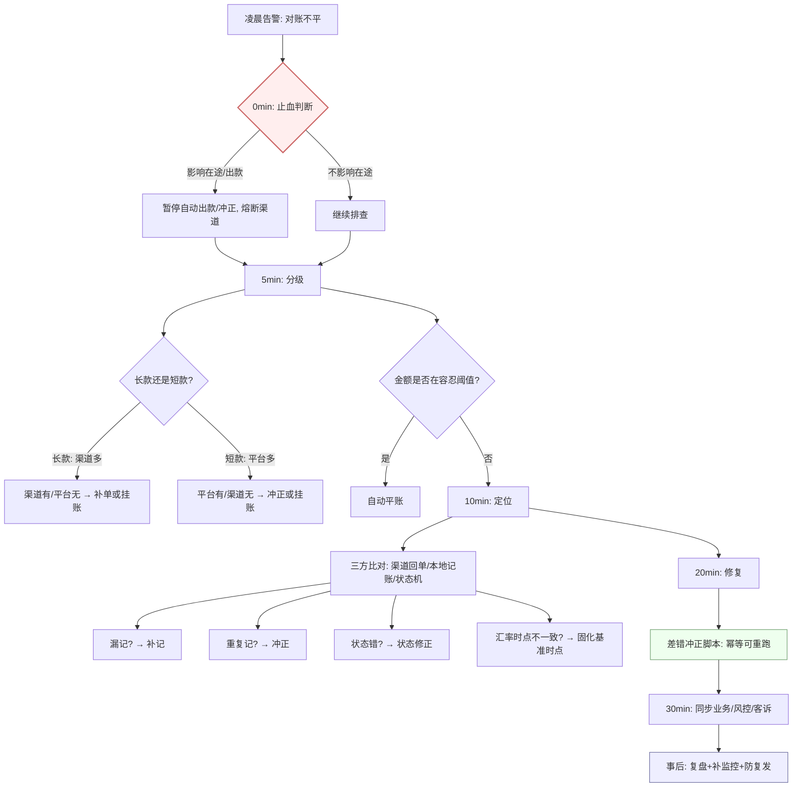

### 【追问链路】4 层深度追问

| 追问层级 | 面试官追问 | 资深答法要点 |
|---|---|---|
| L1 | "差异是汇率时点不一致造成的，算资损吗？" | 不算真金白银丢失，但属**汇损/口径问题**，需明确以哪个时点为基准并固化 |
| L2 | "怎么避免再发生？" | 把对账从"T+1 才发现"前移到"事中实时试算平衡 + 非终态卡单告警" |
| L3 | "如果差异金额特别大（百万级），你的处理方式有什么不同？" | 立即升级 P1 故障，通知 CTO/财务负责人；冻结相关渠道出款；召集跨团队作战室；30 分钟内只做"定位 + 止血"，不做"修复"（大金额修复必须人工复核） |
| L4 | "怎么让对账从 T+1 前移到准实时？" | **实时对账流水**：每笔交易完成后立即与渠道回单做增量核对（非终态 → 5 分钟超时告警）；**准实时试算平衡**：每 1 分钟做一次借贷平衡检查 |

### 【评分标准】本题专属分档

| 级别 | 评分要点 |
|---|---|
| 初级 | 知道要看日志、查数据库，会写排查 SQL |
| 高级 | 能讲分诊思路（先止血再排查）+ 差错分类（长款/短款）+ 冲正流程 |
| 资深 | 能讲 30 分钟 SOP + 三方比对定位法 + 大金额升级流程 + 对账前移到准实时 + 事后复盘防复发体系 |

### 【深度拓展】差错处理决策矩阵

| 差错类型 | 金额特征 | 自动/人工 | 处理方式 | SLA |
|---|---|---|---|---|
| 长款（渠道有/平台无） | < 100 元 | 自动 | 挂账 + 自动补单 | T+1 内 |
| 长款 | >= 100 元 | 人工 | 挂账 + 人工复核补单 + 通知客户 | 2 小时内 |
| 短款（平台有/渠道无） | < 100 元 | 自动 | 自动冲正 | T+1 内 |
| 短款 | >= 100 元 | 人工 | 冻结 + 人工冲正 + 财务确认 | 1 小时内 |
| 汇率差异 | 任意 | 自动 | 固化基准时点 + 自动平账 | T+1 内 |
| 状态不一致 | 任意 | 半自动 | 状态修正脚本（幂等）+ 人工确认 | 30 分钟内 |

---

### 2.3 老系统频繁生产事故，作为资深 Owner 如何系统性治理

**场景背景**：你接手一个历史老系统，三个月出了 5 次 P2 以上事故（慢查询、脏数据、发布回滚失败），老板要你"把稳定性搞上去"。

**面试官考察点**：
- 是否有**体系化稳定性治理**思路（不是头痛医头）；
- 优先级判断（先止血高频，再治本）；
- 用数据驱动（MTTR / 故障分类）；
- 推动改造的资源与节奏把控。

**资深答题框架**：
1. **建账**：拉近半年故障，按**类型 / 频率 / 影响**分类（慢查询、并发、发布、数据不一致），量化 MTTR，找到 Top 3 根因。
2. **止血（0–1 月）**：加监控与告警（慢 SQL、线程池、GC、接口成功率）；高危操作加灰度与回滚；补核心链路幂等与校验。
3. **治本（1–3 月）**：分库分表 / 缓存 / 异步化解慢查询；重构最烂的模块（用绞杀者模式，不整体重写）；发布流水线加自动化测试 + 金丝雀。
4. **防复发**：故障复盘模板 + 行动项闭环；混沌/压测常态化；稳定性纳入发布准入。
5. **节奏**：用**小步快跑 + 可回滚**控制风险，每步有指标验证（如"慢查询 −70%"）。

**追问变体**：
- "老板要你两周内不出事故，但根因要三个月，怎么沟通？" → 先交付"止血清单"（监控 + 灰度 + 回滚 + 高危校验）快速降低暴露面，再用数据证明治本计划的价值，争取资源。
- "整体重写还是绞杀者重构？" → 除非架构已无药可救，否则**绞杀者模式**更安全、可验证、风险可控。

**项目支撑**：我在 XTransfer 主导收款 2.0 重构即用**渐进式**（绞杀者 + 双写灰度），而非推倒重来，结果**生产问题 −80%**；哈啰工单/薪资系统的批量并发与对账，也是先加校验与对账"止血"，再优化链路。

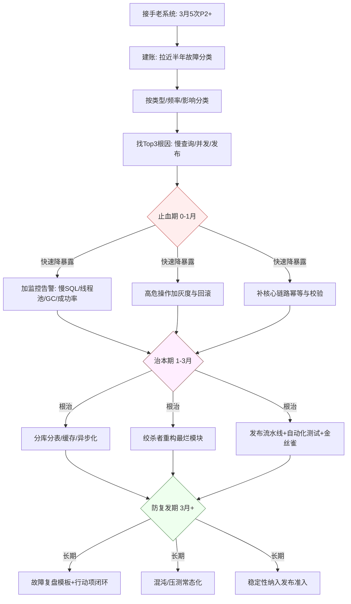

### 【追问链路】4 层深度追问

| 追问层级 | 面试官追问 | 资深答法要点 |
|---|---|---|
| L1 | "老板要你两周内不出事故，但根因要三个月，怎么沟通？" | 先交付"止血清单"（监控 + 灰度 + 回滚 + 高危校验）快速降低暴露面，再用数据证明治本计划的价值，争取资源 |
| L2 | "整体重写还是绞杀者重构？" | 除非架构已无药可救，否则**绞杀者模式**更安全、可验证、风险可控 |
| L3 | "团队只有 3 个人，既要止血又要治本，怎么分配？" | **70/30 原则**：70% 精力止血（快速见效），30% 治本（长期价值）；用止血成果争取扩 HC |
| L4 | "重构过程中又出了新事故，老板质疑重构方案怎么办？" | 先承认风险，用数据证明"重构前 vs 重构后"的事故频率/影响对比；如果是迁移过程中的问题，检查灰度策略是否执行到位 |

### 【评分标准】本题专属分档

| 级别 | 评分要点 |
|---|---|
| 初级 | 能定位具体 bug 并修复 |
| 高级 | 能讲止血→治本→防复发三阶段 + 绞杀者模式 |
| 资深 | 能讲故障分类量化（MTTR/Top3 根因）+ 资源争取策略（70/30 原则）+ 用数据驱动改造决策 + 团队稳定性文化建设 |

### 【深度拓展】故障复盘模板

```markdown
## 故障复盘：[P2] 收款对账不平导致出款延迟

### 故障概要
- 时间：2026-07-10 02:00 ~ 02:45（45 分钟）
- 影响：32 笔出款延迟，涉及金额 ¥128,000
- 级别：P2（影响客户体验，无资金损失）

### 时间线
| 时间 | 事件 | 负责人 |
|---|---|---|
| 02:00 | 对账告警触发 | 值班同学 |
| 02:05 | 确认影响范围，暂停自动出款 | 资金域 Owner |
| 02:15 | 定位根因：汇率快照服务超时导致记账金额不一致 | 资金域 Owner |
| 02:30 | 执行差错冲正脚本（幂等） | 资金域 Owner |
| 02:40 | 对账恢复平衡，恢复出款 | 资金域 Owner |
| 02:45 | 全量恢复，通知业务方 | 值班同学 |

### 根因分析（5 Whys）
1. 为什么对账不平？→ 记账金额与渠道回单不一致
2. 为什么不一致？→ 汇率快照服务超时，用了 fallback 汇率
3. 为什么 fallback 汇率有偏差？→ fallback 用的是上次成功汇率，未标记"非实时"
4. 为什么超时没有告警？→ 汇率服务超时阈值设为 5s，但下游等不了 5s
5. 为什么下游等不了？→ 同步调用链路过长，未做异步化

### 行动项
| 行动项 | 负责人 | 截止日期 | 状态 |
|---|---|---|---|
| 汇率快照超时降为 1s + 异步刷新 | 张三 | 07-15 | 进行中 |
| fallback 汇率标记"非实时" + 告警 | 李四 | 07-12 | 完成 |
| 对账前移到准实时（5分钟增量核对） | 王五 | 07-20 | 待开始 |
| 汇率调用链路异步化 | 赵六 | 07-30 | 待开始 |
```

---

## 三、数据 / 一致性类

### 3.1 分库分表后，跨分片一致性与热点分片

**场景背景**：订单表到了单表 10 亿，要做分库分表；但业务既有"按用户查"又有"按商户/时间聚合查"，还要全局唯一 ID，且某些大商户是**热点分片**。

**面试官考察点**：
- 分片键选择（避免跨分片查询与热点）；
- 全局唯一 ID 方案；
- 跨分片聚合（不优雅但必须会）；
- 热点与大商户隔离。

**资深答题框架**：
1. **分片键**：优先选**最高频等值查询维度**做分片键（如用户 ID）；跨维度查询用**异构索引表 / ES** 冗余，避免跨分片 join。
2. **全局 ID**：`业务前缀 + 日期 + 号段 + 校验位`（趋势递增、防遍历、利于路由）；号段双 buffer 预取缓解 DB 依赖；不用纯 Snowflake（怕时钟回拨）。
3. **跨分片聚合**：轻量聚合在应用层/中间件合并；重聚合走**实时数仓 / OLAP**，业务库不扛。
4. **热点分片**：大商户**单独分片 / 独立库**，或按"用户 ID + 商户热度"二级路由；读用缓存挡，写用行锁兜底。
5. **一致性**：跨分片事务尽量**避免**，用**最终一致（事务消息 / Saga）**；强一致场景用**单分片内事务 + 补偿**。

**追问变体**：
- "分片键选错了想改怎么办？" → 双写迁移（旧键 + 新键同时写），灰度读新键，校验一致后切读、下线旧键——可重跑、可回滚。
- "热点商户把单分片打满？" → 商户级限流 + 独立分片 + 读写分离，必要时业务降级（如延迟非核心统计）。

**项目支撑**：XTransfer 收款单号用「业务前缀 + 日期 + 号段 + 校验位」结构，既防遍历又利于**分库分片路由与人工排查**；支付相关跨服务一致一律走最终一致 + 任务补偿，不强求跨分片强事务。详见《分布式事务与一致性》《支付系统高频面试题集》。

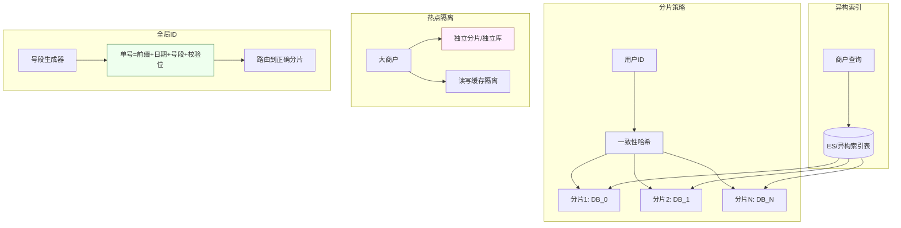

### 【追问链路】5 层深度追问

| 追问层级 | 面试官追问 | 资深答法要点 |
|---|---|---|
| L1 | "分片键选错了想改怎么办？" | 双写迁移（旧键 + 新键同时写），灰度读新键，校验一致后切读、下线旧键——可重跑、可回滚 |
| L2 | "热点商户把单分片打满？" | 商户级限流 + 独立分片 + 读写分离，必要时业务降级（如延迟非核心统计） |
| L3 | "全局唯一 ID 用 Snowflake 还是号段模式？" | 号段模式更可靠（不依赖时钟），Snowflake 怕时钟回拨；混合方案：号段为主 + Snowflake 降级 |
| L4 | "号段模式的双 buffer 怎么工作？" | 当前号段用到 20% 时异步预取下一号段；两个 buffer 交替使用，避免 DB 不可用时发号中断 |
| L5 | "分库分表后 DDL（如加字段）怎么做？" | **分批 Online DDL**（pt-online-schema-change / gh-ost），每个分片单独执行，灰度推进；避免全量锁表 |

### 【评分标准】本题专属分档

| 级别 | 评分要点 |
|---|---|
| 初级 | 知道要分库分表，会选分片键 |
| 高级 | 能讲分片策略 + 全局 ID + 异构索引 + 跨分片聚合方案 |
| 资深 | 能讲热点隔离策略 + 号段双 buffer + 分片键变更迁移方案 + DDL 灰度 + 容量推演（10 亿行 → N 个分片 × M 行） |

### 【深度拓展】号段模式 ID 生成器代码

```java
// 号段模式 ID 生成器 —— 双 buffer 预取
public class SegmentIdGenerator {

    private volatile Segment current;   // 当前号段
    private volatile Segment next;      // 预取的下一号段
    private final Object lock = new Object();

    public long nextId(String bizTag) {
        if (current == null || !current.hasNext()) {
            synchronized (lock) {
                if (current == null || !current.hasNext()) {
                    // 当前号段用完，切换到下一号段
                    if (next != null) {
                        current = next;
                        next = null;
                    } else {
                        // 下一号段也没准备好（极端情况），同步从 DB 获取
                        current = loadSegment(bizTag);
                    }
                    // 异步预取下一号段
                    asyncLoadNext(bizTag);
                }
            }
        }
        return current.next();
    }

    // 异步预取：当前号段用到 20% 时触发
    private void asyncLoadNext(String bizTag) {
        if (next == null && current.getUsedRatio() > 0.2) {
            executor.submit(() -> {
                next = loadSegment(bizTag);
            });
        }
    }

    // 从 DB 加载号段
    private Segment loadSegment(String bizTag) {
        // UPDATE id_alloc SET max_id=max_id+step WHERE biz_tag=?
        // 返回 max_id（更新后的值）和 step
        long[] result = allocMapper.updateMaxId(bizTag, STEP);
        long maxId = result[0];
        int step = (int) result[1];
        return new Segment(maxId - step + 1, maxId, step);
    }
}
```

### 【深度拓展】分片容量推演

| 指标 | 数值 | 推演 |
|---|---|---|
| 当前单表行数 | 10 亿 | 假设每行 500 字节，约 500GB |
| 目标单分片行数 | 2000 万 | 约 10GB，B+ 树 3-4 层，查询性能可控 |
| 需要分片数 | 50 | 10 亿 / 2000 万 = 50 |
| 物理库数 | 10 | 每库 5 个分片（逻辑分片 → 物理库映射） |
| 未来 3 年增长 | 3 倍 | 30 亿行 → 150 个逻辑分片 → 30 个物理库 |
| 大商户独立分片 | 5 个 | Top 5 大商户各独立一个物理库 |

---

### 3.2 多数据源最终一致：对账 + 差错处理闭环

**场景背景**：系统里有 A（交易库）、B（账务库）、C（渠道回单）三个数据源，如何保证三者最终一致，并能在不一致时**自动发现、自动/半自动修复**。

**面试官考察点**：
- 最终一致的实现手段（事务消息 / 本地消息表 / 对账）；
- 对账的**三层模型**（渠道 ↔ 平台 ↔ 账务）；
- 差错分类与处理（挂账、冲正、补单）；
- 可观测与人工兜底。

**资深答题框架**：
1. **先保证可追**：每笔资金变动带**全局流水号 + 幂等键**，三库都能按流水号关联。
2. **实时层**：通过事务消息 / Outbox 保证"交易成功必有记账、必有对账任务"。
3. **准实时层**：非终态订单定时扫描（卡单告警），超时未到终态的人工/自动推进。
4. **T+1 对账层**：渠道 ↔ 平台 ↔ 账务**三层逐笔 + 总额**核对，差异落差错表，按长款/短款分类。
5. **差错处理**：长款（渠道多）→ 补单/挂账；短款（平台多）→ 冲正/挂账；差异在容忍阈值内自动平账，超阈值人工。
6. **兜底**：人工复核后台 + 操作审计 + 可重跑脚本。

**追问变体**：
- "对账发现一笔钱渠道有、平台没有，但客户说已经付款了？" → 长款，先**挂账保客户体验**，再补单并通知客户，最后财务核销。
- "三库时钟不一致怎么对账？" → 用**业务流水号 + 状态**而非时间对齐；对账以"终态 + 流水"为基准，时间戳只做辅助。

**项目支撑**：XTransfer 的**三层对账 + 差错冲正 + 人工兜底**是资金安全第三道防线；事中靠复式记账实时试算平衡、非终态卡单告警把大部分差错前移拦截。详见《支付对账体系与差错处理》《账务账户体系与复式记账》。

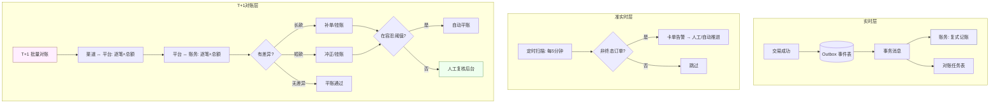

### 【追问链路】4 层深度追问

| 追问层级 | 面试官追问 | 资深答法要点 |
|---|---|---|
| L1 | "对账发现一笔钱渠道有、平台没有，但客户说已经付款了？" | 长款，先**挂账保客户体验**，再补单并通知客户，最后财务核销 |
| L2 | "三库时钟不一致怎么对账？" | 用**业务流水号 + 状态**而非时间对齐；对账以"终态 + 流水"为基准，时间戳只做辅助 |
| L3 | "对账任务本身挂了怎么办？" | 对账任务幂等可重跑；任务表记录批次状态，失败从断点续跑；对账超时告警 → 人工触发 |
| L4 | "如果对账发现有 1 万笔差异（批量问题），怎么快速处理？" | 先按根因聚类（同一根因的批量修复）；批量冲正脚本（幂等 + 可重跑 + 灰度执行）；先修复再验证再通知客户 |

### 【评分标准】本题专属分档

| 级别 | 评分要点 |
|---|---|
| 初级 | 知道要对账，能写比对 SQL |
| 高级 | 能讲三层对账模型 + 事务消息 + 差错分类处理 |
| 资深 | 能讲实时/准实时/T+1 三层防线 + 批量差错聚类处理 + 对账任务幂等可重跑 + 容忍阈值策略 + 人工兜底审计 |

### 【深度拓展】对账差异处理 SQL

```sql
-- T+1 对账：渠道回单 vs 平台流水 vs 账务记录
-- Step 1: 找出渠道有、平台无的记录（长款）
SELECT c.ref_no, c.amount, c.channel_time, 'LONG' AS diff_type
FROM channel_receipt c
LEFT JOIN platform_flow p ON c.ref_no = p.ref_no
WHERE p.ref_no IS NULL
  AND c.channel_date = DATE_SUB(CURDATE(), INTERVAL 1 DAY);

-- Step 2: 找出平台有、渠道无的记录（短款）
SELECT p.ref_no, p.amount, p.created_at, 'SHORT' AS diff_type
FROM platform_flow p
LEFT JOIN channel_receipt c ON p.ref_no = c.ref_no
WHERE c.ref_no IS NULL
  AND p.created_at >= DATE_SUB(CURDATE(), INTERVAL 1 DAY)
  AND p.status = 'COMPLETED';  -- 只对已完成的

-- Step 3: 金额不一致
SELECT c.ref_no, c.amount AS channel_amount,
       p.amount AS platform_amount,
       ABS(c.amount - p.amount) AS diff,
       'AMOUNT_MISMATCH' AS diff_type
FROM channel_receipt c
JOIN platform_flow p ON c.ref_no = p.ref_no
WHERE ABS(c.amount - p.amount) > 0.01  -- 差异超过1分钱
  AND c.channel_date = DATE_SUB(CURDATE(), INTERVAL 1 DAY);

-- Step 4: 试算平衡 —— 借贷总额必须相等
SELECT
  'TRIAL_BALANCE' AS check_type,
  SUM(CASE WHEN direction='DEBIT' THEN amount ELSE 0 END) AS debit_total,
  SUM(CASE WHEN direction='CREDIT' THEN amount ELSE 0 END) AS credit_total,
  ABS(SUM(CASE WHEN direction='DEBIT' THEN amount ELSE 0 END) -
      SUM(CASE WHEN direction='CREDIT' THEN amount ELSE 0 END)) AS diff
FROM account_entry
WHERE created_at >= DATE_SUB(CURDATE(), INTERVAL 1 DAY);
```

---

## 四、技术决策 / 团队协作类（考察 leadership）

### 4.1 单体拆微服务：定边界、定节奏、控风险、说服业务

**场景背景**：一个 50 万行的单体，迭代慢、故障互相影响，CTO 想拆微服务，但业务方担心"拆了更慢、更容易出事"。你作为资深工程师牵头，怎么做？

**面试官考察点**：
- 拆分的**边界划分方法论**（DDD 限界上下文 / 康威定律）；
- 节奏与风险（不梭哈）；
- **向上/向下/横向沟通**与说服能力；
- 怎么用数据争取资源。

**资深答题框架**：
1. **先问为什么**：拆分的真实诉求是"解耦""独立扩容""团队自治"还是"跟风"？明确目标才能定边界。
2. **边界**：用 **DDD 限界上下文** + 康威定律（团队结构决定服务边界）划分；按**变更频率 / 数据耦合度 / 扩容诉求**拆，不按"层"拆。
3. **节奏**：**绞杀者模式**——在单体旁长出新服务，流量逐步迁移，旧模块逐步退化；每步可回滚。先拆最痛、边界最清的（如账务、通知）。
4. **控风险**：服务间契约测试、分布式追踪、统一网关；先解决"分布式事务/一致性"再大拆。
5. **说服业务**：用**数据**说话（当前发布频率、故障互相影响次数、新需求等待时长），承诺"迁移期不降速"，给里程碑与回滚预案。

**追问变体**：
- "拆完发现两个服务耦合太深要合并？" → 正常，服务边界是**演进**出来的；合并成本远低于一开始就过度拆分。
- "小团队也该微服务吗？" → 不一定，先**模块化单体**（清晰的 module 边界），规模和团队到了再拆，避免分布式复杂度提前到来。

**项目支撑**：XTransfer 收款域就是用**六边形 + 限界上下文 + SPI** 把渠道/账务/风控隔离，新渠道零改核心；这种"先划清边界、再加端口"的思路，正是单体到微服务的安全路径。我在 2.0 重构中主导的领域拆分，使**人效 +30%**。详见《XTransfer 跨境支付收款平台深度复盘》。

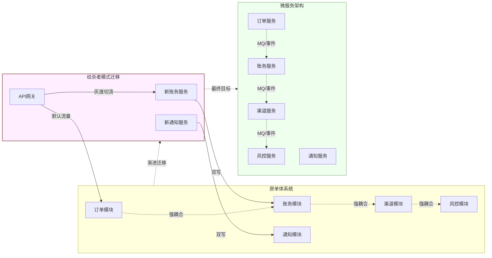

### 【追问链路】5 层深度追问

| 追问层级 | 面试官追问 | 资深答法要点 |
|---|---|---|
| L1 | "拆完发现两个服务耦合太深要合并？" | 正常，服务边界是**演进**出来的；合并成本远低于一开始就过度拆分 |
| L2 | "小团队也该微服务吗？" | 不一定，先**模块化单体**（清晰的 module 边界），规模和团队到了再拆，避免分布式复杂度提前到来 |
| L3 | "拆分后分布式事务怎么处理？" | 优先**最终一致**（事务消息/Outbox/Saga）；强一致场景用 TCC 但成本高；大部分业务场景最终一致足够 |
| L4 | "迁移期间数据一致性怎么保证？" | **双写 + 对账**：新旧双写，灰度切读，对账验证一致后下线旧库；迁移脚本幂等可重跑 |
| L5 | "拆分后团队怎么组织？按服务还是按职能？" | **康威定律**：按服务边界组小队（全栈小队 3-5 人），每个小队 own 一个或多个服务；避免"前端组 + 后端组"的职能型组织 |

### 【评分标准】本题专属分档

| 级别 | 评分要点 |
|---|---|
| 初级 | 知道微服务概念，能说出"按业务拆" |
| 高级 | 能讲 DDD 限界上下文 + 绞杀者模式 + 双写迁移 |
| 资深 | 能讲边界划分方法论（变更频率/数据耦合/扩容诉求）+ 康威定律团队组织 + 向上用数据争取资源 + 迁移期数据一致性保障 + 说服业务的沟通策略 |

### 【深度拓展】微服务拆分决策矩阵

| 维度 | 拆分信号 | 不拆信号 |
|---|---|---|
| 变更频率 | 模块 A 每周发布，模块 B 每月发布 → 拆 | 所有模块同步发布频率 → 不拆 |
| 数据耦合 | A 和 B 共享表但读写分离 → 可拆 | A 和 B 共享表且交叉写 → 先解耦再拆 |
| 扩容诉求 | A 需要高峰扩容 10 倍，B 平稳 → 拆 | 所有模块负载均衡 → 不拆 |
| 团队规模 | > 8 人 → 拆 | < 4 人 → 不拆（模块化单体） |
| 故障隔离 | A 挂了不该影响 B → 拆 | A 和 B 必须同时可用 → 不拆或弱拆 |

---

### 4.2 从 0 到 1 主导一个子领域（预入账）

**场景背景**：业务要做一个新子领域"预入账"（收款先预存再做后续清结算），你是**唯一的技术负责人**，要从产品研讨一路负责到上线。

**面试官考察点**：
- 端到端 owner 意识（产品 → 架构 → 项目 → 上线 → 复盘）；
- 技术选型的方法论（不盲目追新）；
- 项目管理（排期、风险、跨团队）；
- 上线后的度量与迭代。

**资深答题框架**：
1. **对齐需求**：和产品、风控、财务、合规**共创**边界与规则（预入账什么能做什么不能做、资金权属）。
2. **架构设计**：复用主域的**状态机 + 记账 + 补偿**能力，新子域只补差异；明确与其他域的接口与一致性边界。
3. **选型**：优先**复用现有基础设施**（MQ、ID、配置中心），新引入的组件要能说服自己"非它不可"。
4. **项目推进**：拆里程碑，每里程碑有可演示产出；识别关键路径与风险（如合规评审卡点）提前排雷。
5. **上线**：灰度 + 监控 + 回滚；上线后盯**核心指标**（接入量、差错率、耗时）并复盘。

**追问变体**：
- "上线后指标不及预期？" → 先分是"设计问题"还是"接入/运营问题"，用数据定位，小步迭代；不轻易推翻架构。
- "多个团队抢资源，排期冲突？" → 用**价值/风险矩阵**排优先级，关键路径资源锁死，非关键路径协商让路。

**项目支撑**：我在 XTransfer **从 0 到 1 主导「预入账」子领域**——产品研讨、架构设计、项目管理、落地全流程 owner；复用主域状态机/记账/补偿能力，把新子域风险压到最低，是"端到端主导"的真实样本。详见《XTransfer 跨境支付收款平台深度复盘》《项目管理与工程实践》。

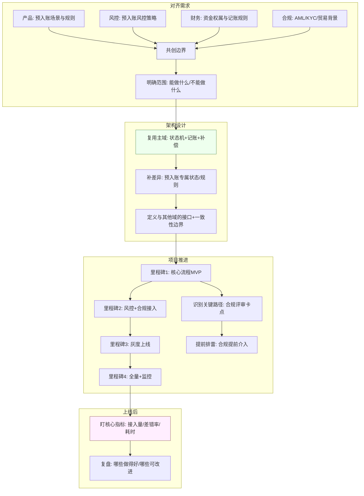

### 【追问链路】4 层深度追问

| 追问层级 | 面试官追问 | 资深答法要点 |
|---|---|---|
| L1 | "上线后指标不及预期？" | 先分是"设计问题"还是"接入/运营问题"，用数据定位，小步迭代；不轻易推翻架构 |
| L2 | "多个团队抢资源，排期冲突？" | 用**价值/风险矩阵**排优先级，关键路径资源锁死，非关键路径协商让路 |
| L3 | "预入账和主域的状态机怎么联动？" | 预入账有独立子状态机，通过**事件驱动**与主域状态机联动：预入账完成 → 发布事件 → 主域监听 → 触发清分 |
| L4 | "如果预入账上线后发现资金权属定义有误，怎么改？" | 资金权属是**不可逆决策**，不能简单修改；先挂账隔离影响范围，重新与财务/合规对齐规则，灰度迁移 + 对账验证 |

### 【评分标准】本题专属分档

| 级别 | 评分要点 |
|---|---|
| 初级 | 能设计一个子模块的流程和接口 |
| 高级 | 能讲选型方法论 + 里程碑拆分 + 灰度上线 |
| 资深 | 能讲跨团队共创边界 + 复用主域能力降风险 + 关键路径识别排雷 + 上线后数据驱动迭代 + 不可逆决策的兜底策略 |

### 【深度拓展】子领域接入的项目管理清单

```yaml
# 子领域上线 checklist
领域设计:
  - [x] 与产品共创业务边界与规则
  - [x] 与风控确认风控策略与阈值
  - [x] 与财务确认资金权属与记账规则
  - [x] 与合规确认 AML/KYC 要求
  - [x] 状态机设计（子状态机 + 与主域联动）
  - [x] 接口定义（与其他域的 API + 一致性边界）

技术实现:
  - [x] 复用主域状态机/记账/补偿能力
  - [x] 新增预入账专属规则与状态
  - [x] 幂等设计（幂等键 + CAS）
  - [x] Outbox 事件表 + 事务消息
  - [x] 对账任务（预入账专属对账规则）
  - [x] 监控告警（接入量/差错率/耗时/卡单）

灰度上线:
  - [x] 灰度策略（按商户维度 1% → 10% → 50% → 100%）
  - [x] 回滚方案（一键关闭预入账开关，不影响主流程）
  - [x] 数据对账（灰度期间每日对账验证）
  - [x] 客户告知（灰度期间通知涉及的客户）

上线后:
  - [ ] 核心指标看板（接入量/差错率/耗时/资损）
  - [ ] 每日对账无差异（连续 7 天）
  - [ ] 复盘会议（上线后 2 周内）
  - [ ] 文档更新（架构图/API文档/运维手册）
```

---

## 五、踩坑复盘类（行为面试）

### 5.1 讲一个你做错的架构决策，如何复盘与补救

**场景背景**：行为面试经典题——"说一个你职业生涯里做错的架构/技术决策，你是怎么发现的、怎么补救的、学到了什么。"

**面试官考察点**：
- **诚实与复盘能力**（不甩锅、不美化）；
- 是否有"线上验证 → 发现偏差 → 纠正"的闭环；
- 学到的**可迁移方法论**（而不只是"下次注意"）；
- 自我认知与成长。

**资深答题框架（STAR + 反思）**：
- **Situation**：当时背景与约束（时间紧 / 信息不全 / 团队能力）。
- **Decision**：你做的决策（如过早微服务化 / 选用了不适合的存储 / 忽略幂等）。
- **Result（偏差）**：上线后出现的问题（延迟、复杂度、故障），用数据量化。
- **Action（补救）**：如何止血、如何迁移（绞杀者 / 双写）、如何和团队对齐。
- **Lesson（可迁移）**：抽象成方法论——如"架构决策先验证约束再选型""不为未来过度设计""可回滚优先于完美"。

**追问变体**：
- "如果重来你会怎么做？" → 具体讲会先做的"验证动作"（如先压测、先小流量、先补监控）。
- "你从中学到的最重要的原则？" → 我个人的：**任何不可逆的架构决策，必须设计可回滚路径；先用最小闭环验证核心假设，再扩展**。

**项目支撑（诚实表述）**：在 XTransfer 2.0 重构早期，我曾倾向"先把所有渠道能力抽象成一套统一模型"，结果发现**渠道差异极大、强抽象反而增加分支复杂度**。我及时用**SPI + 配置化把差异外置**（而非压进核心），并保留渠道子域独立演进空间——这是一次"过早过度抽象"的纠偏，最终让新渠道接入做到零改核心。详见《XTransfer 跨境支付收款平台深度复盘》中"标准化 VA 开户 100+ 渠道"一节。

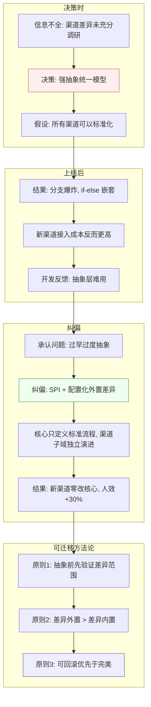

### 【追问链路】4 层深度追问

| 追问层级 | 面试官追问 | 资深答法要点 |
|---|---|---|
| L1 | "如果重来你会怎么做？" | 具体讲会先做的"验证动作"：先调研 10+ 渠道的差异范围，画出差异矩阵，再决定抽象粒度 |
| L2 | "你从中学到的最重要的原则？" | **任何不可逆的架构决策，必须设计可回滚路径；先用最小闭环验证核心假设，再扩展** |
| L3 | "你怎么说服团队接受纠偏方案？" | 用数据说话：对比"强抽象 vs SPI 外置"的分支复杂度、新渠道接入耗时；承认自己判断有误，用技术分析而非权威推动 |
| L4 | "过度抽象和过度设计有什么区别？怎么判断边界？" | 过度抽象 = 把不同形态强塞进一个模型（如把 100 种渠道硬抽象成一套）；过度设计 = 为未来不存在的需求预设能力。判断边界：**当前是否有 3+ 个实例需要这个抽象？没有就别抽象** |

### 【评分标准】本题专属分档

| 级别 | 评分要点 |
|---|---|
| 初级 | 能讲出一个 bug 故事，说"下次注意" |
| 高级 | 能讲 STAR + 补救措施 + 学到的教训 |
| 资深 | 能讲 STAR + 反思 + 可迁移方法论 + 主动暴露决策过程中的信息盲区 + 团队沟通策略 + 诚实的自我认知（不甩锅、不美化） |

### 【面试官追问】行为题的高分信号与红灯

| 维度 | 高分信号 | 红灯信号 |
|---|---|---|
| 诚实度 | 主动说"这是我的判断失误" | 全程说"团队决定""领导要求" |
| 复盘深度 | 能讲到"信息盲区在哪""为什么没提前验证" | 只讲"技术上选错了"不挖根因 |
| 可迁移性 | 抽象成原则/方法论 | 只讲"下次注意这个具体场景" |
| 纠偏能力 | 主动发现 + 主动纠偏 + 用数据说服团队 | 被别人发现问题才改 |
| 成长 | 从纠偏中提炼出团队规范/检查清单 | 只是个人的"经验教训" |

### 【深度拓展】架构决策检查清单

```markdown
## 架构决策检查清单（Decision Checklist）

### 决策前
- [ ] 是否充分调研了现有方案的差异范围？（至少 3+ 个实例）
- [ ] 是否验证了核心假设？（用最小闭环/POC 验证）
- [ ] 是否评估了不可逆性？（这个决策能回滚吗？）
- [ ] 是否考虑了团队当前能力？（团队 hold 得住吗？）
- [ ] 是否有退路？（如果方案不 work，B 方案是什么？）

### 决策时
- [ ] 是否记录了"为什么这么选"而不只是"选了什么"？（ADR）
- [ ] 是否显式列出了"放弃了什么"？（Trade-off 记录）
- [ ] 是否设定了验证指标和检查点？（何时判断方案是否 work）

### 决策后
- [ ] 是否设计了灰度验证路径？（小流量先跑）
- [ ] 是否有回滚方案？（一键回滚 or 绞杀者模式）
- [ ] 是否设置了复查节点？（上线后 2 周复盘，是否需要纠偏）
- [ ] 纠偏时是否用数据而非权威推动？（对比分析）
```

---

## 附：面试官打分暗线（10 年 vs 3 年）

| 维度 | 3 年候选常被期待 | 10 年候选必须展现 |
|---|---|---|
| 方案 | 能给出可用方案 | 能讲清**为什么这么选、放弃了什么** |
| 异常 | 正常路径正确 | **异常路径 + 兜底 + 回滚** 讲满 |
| 规模 | 单机思维 | **分布式边界、热点、容量** 自觉 |
| 风险 | 少谈风险 | **主动暴露风险 +  mitigation** |
| 协作 | 自己能写 | **能带人、能说服、能对齐业务** |
| 复盘 | 答"下次注意" | **抽象成可迁移方法论** |

### 附：12 题速查表（题目 → 考察维度 → 项目支撑）

| 题号 | 场景题 | 主要考察维度 | 项目支撑来源 |
|---|---|---|---|
| 1.1 | 跨境收款与多币种清结算资金平台 | 领域建模 + 资金安全 + 分层架构 | XTransfer 收款 2.0 |
| 1.2 | 秒杀/直播带货库存与下单 | 高并发 + 原子操作 + 削峰 | 欧凡海外直播电商 |
| 1.3 | 实时数据化运营平台 | 数据架构 + 口径治理 + OLAP | 携程数据化运营平台 |
| 1.4 | 分布式任务调度与补偿 | 补偿模型 + 幂等 + 可观测 | XTransfer 任务补偿机制 |
| 2.1 | 核心支付单元化多活 | 单元化 + 灰度切流 + 容灾 | XTransfer 高可用设计 |
| 2.2 | 资金对账不平 30 分钟止血 | 分诊 + 差错处理 + SOP | XTransfer 资金安全防线 |
| 2.3 | 老系统频繁事故系统性治理 | 稳定性治理 + 绞杀者 + 节奏 | XTransfer 2.0 重构 + 哈啰 |
| 3.1 | 分库分表跨分片与热点 | 分片策略 + 全局 ID + 热点隔离 | XTransfer 收款单号设计 |
| 3.2 | 多数据源最终一致对账闭环 | 对账三层模型 + 差错处理 | XTransfer 三层对账 |
| 4.1 | 单体拆微服务定边界 | DDD + 绞杀者 + 说服业务 | XTransfer 领域拆分 |
| 4.2 | 从 0 到 1 主导子领域 | 端到端 Owner + 选型 + 项目管理 | XTransfer 预入账子领域 |
| 5.1 | 架构决策复盘 | 诚实 + 复盘 + 可迁移方法论 | XTransfer SPI 纠偏 |

### 附：答题节奏控制建议

| 面试时长 | 建议节奏 | 重点 |
|---|---|---|
| 15 分钟（电话面） | 选 1 题，讲框架不深入 | 需求确认 → 主干方案 → 关键取舍 |
| 30 分钟（技术面） | 选 1 题深入 | 需求确认 → 架构 → 瓶颈 → 取舍 → 异常兜底 |
| 45 分钟（终面） | 选 1-2 题 | 完整五步法 + 追问链路 + 项目支撑 + 演进路线 |
| 60 分钟（系统设计面） | 1 题白板设计 | 完整五步法 + 画图 + 代码示例 + 容量推演 |

> **最后一句**：开放题没有满分答案，但一定有"站得住脚"的答案——**模型清晰、权衡显式、兜底完整、有真实落地**。本文 12 题背后是同一套能力，练熟这套，比背 100 道题更有用。

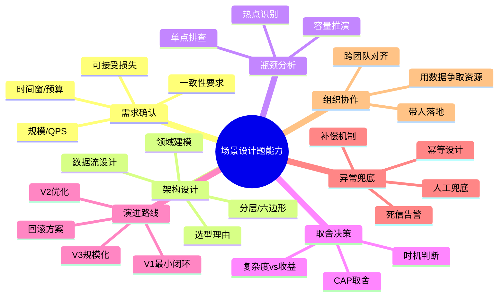

---

*相关阅读*：系统设计见《高可用跨境支付系统设计》《分布式事务与一致性》；项目经历见《XTransfer 跨境支付收款平台深度复盘》《哈啰工单与薪资系统实战》《欧凡海外直播电商系统实战》《携程数据化运营平台实战》；追问训练见《面试高频考点深度追问》。

<!-- EXPANDED -->
