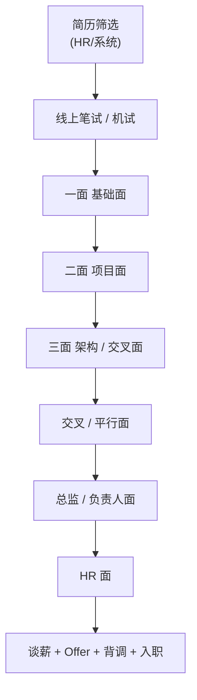
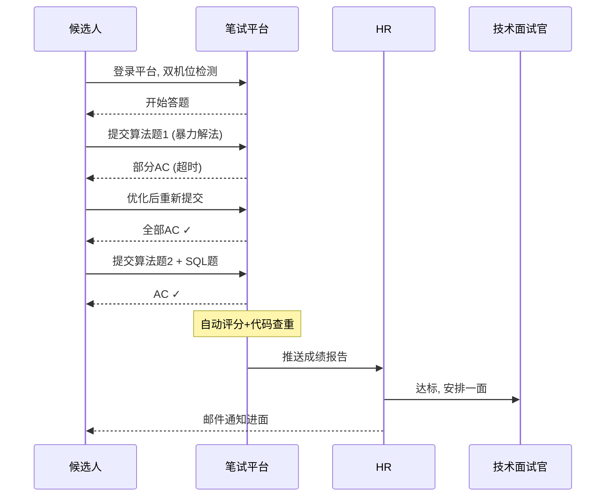
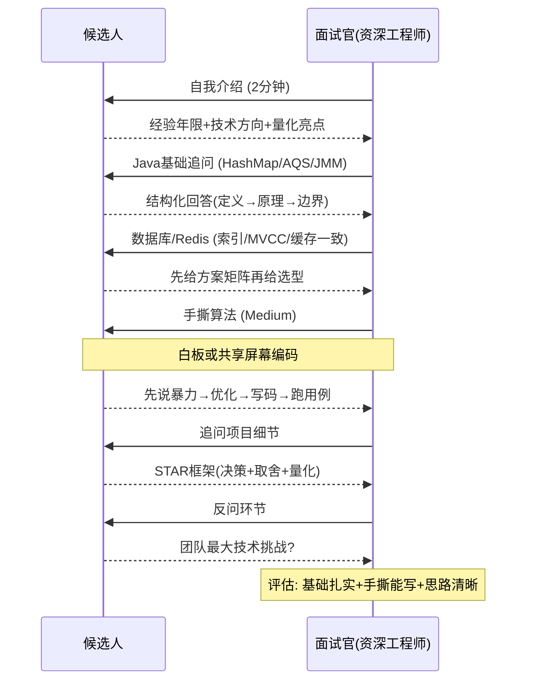
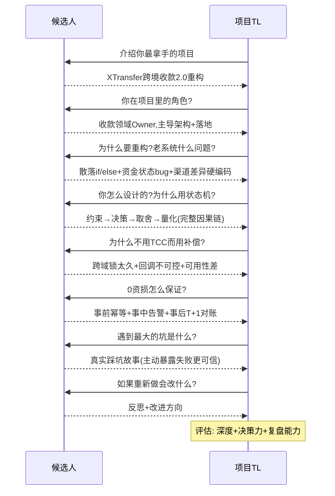
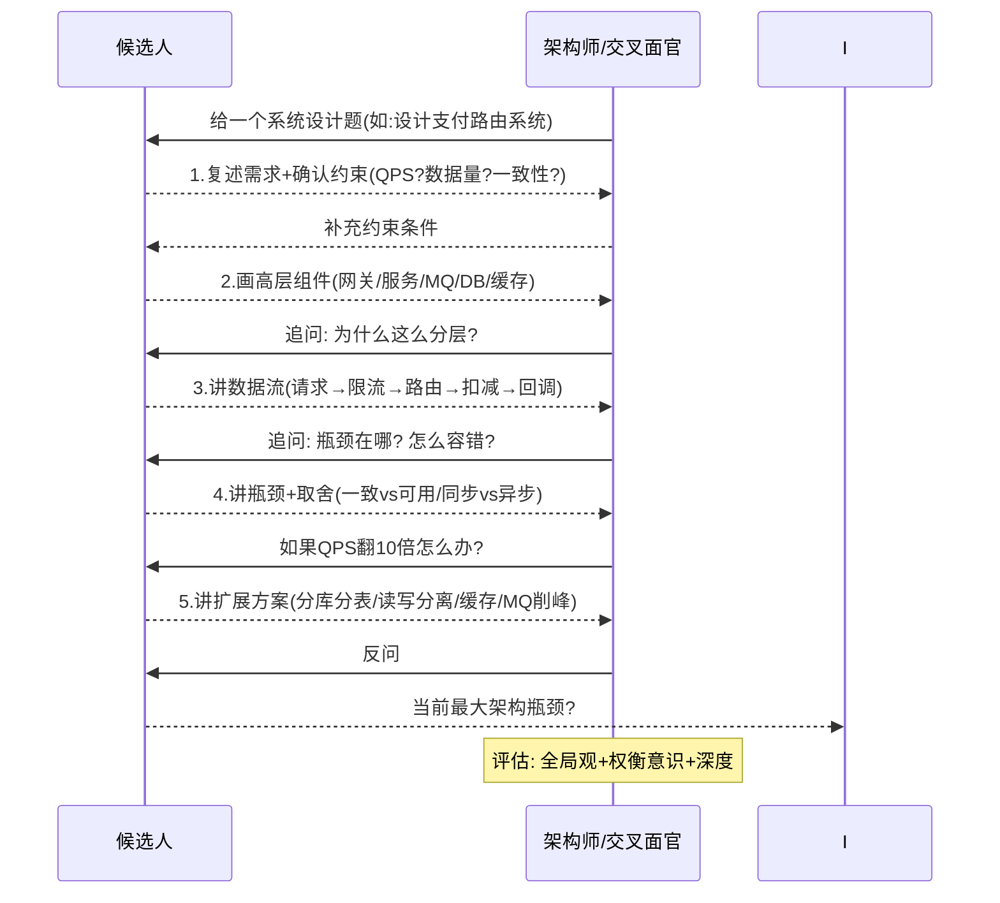
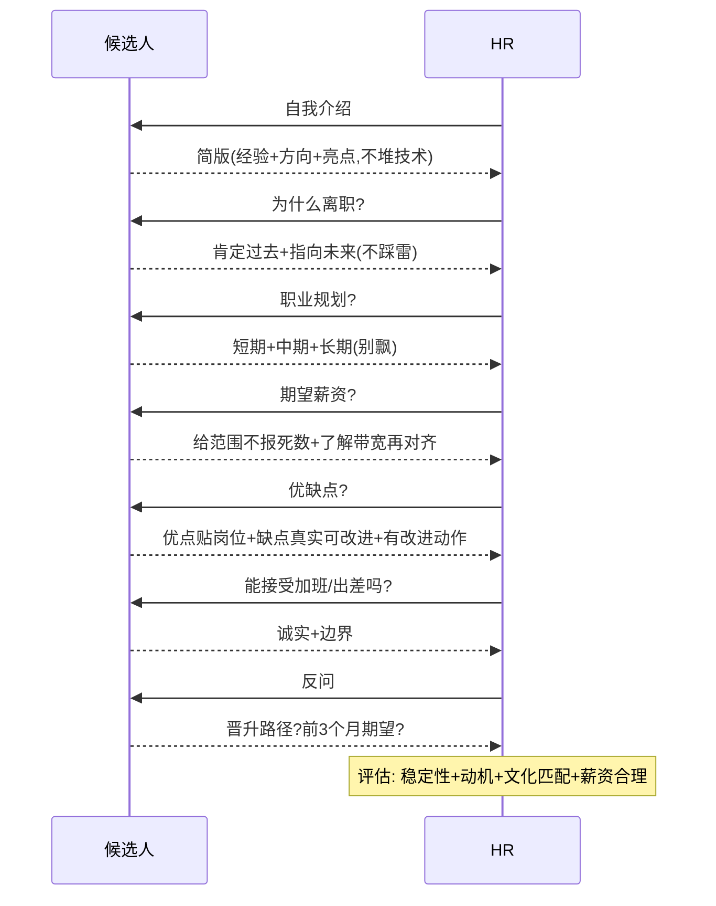
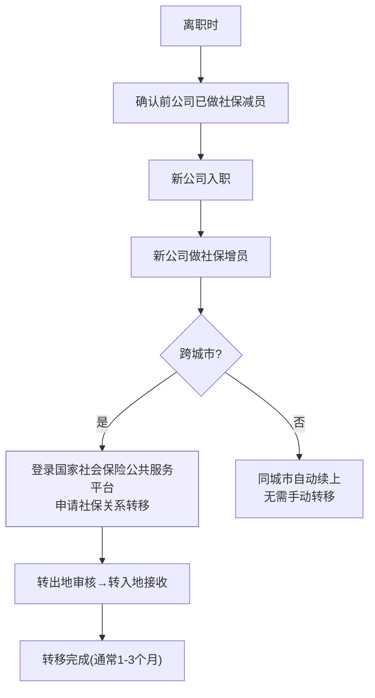
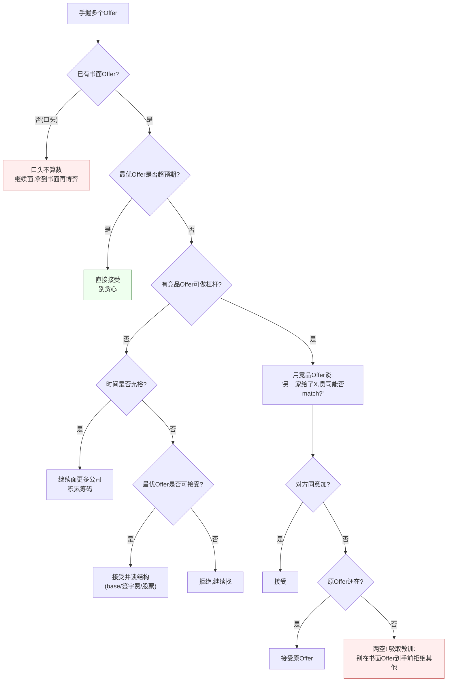
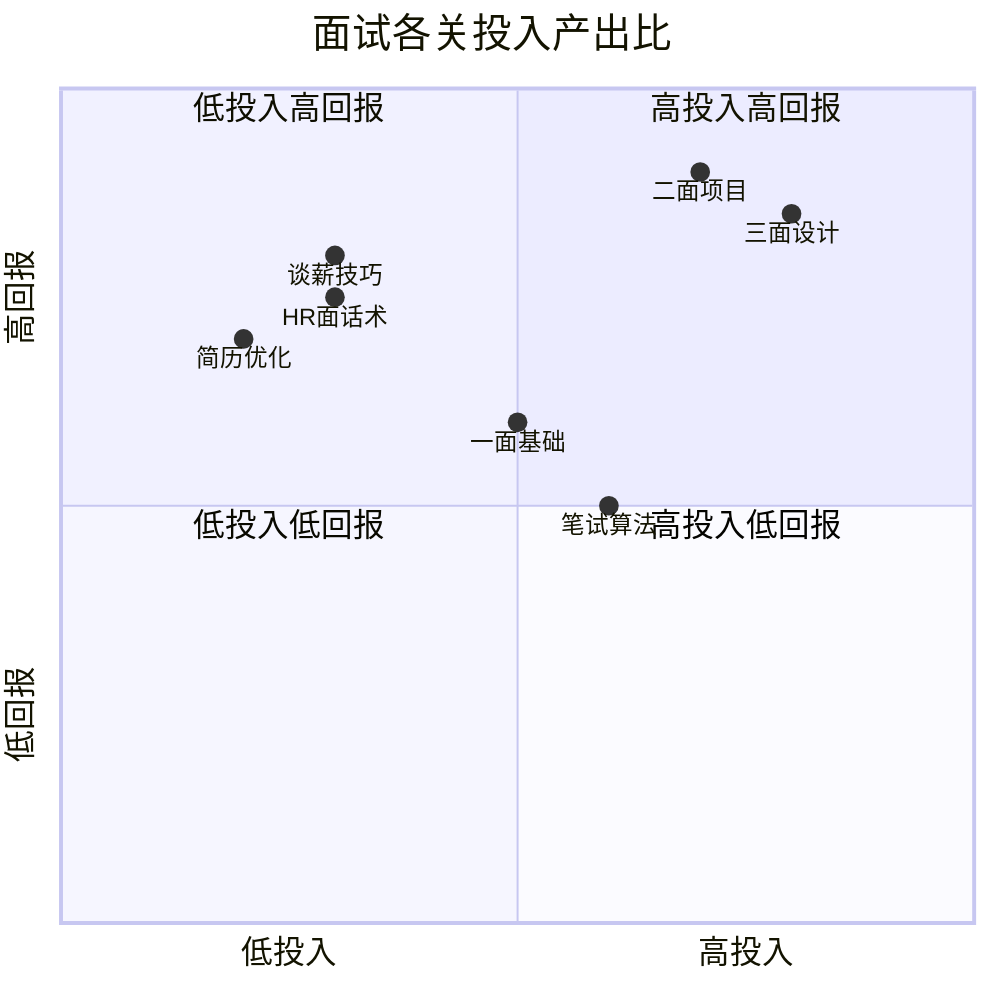

> 很多人把"面试"等同于"被问八股"。但真实招聘是一条**漏斗**：每一关的面试官身份不同、筛选逻辑不同、关注点完全不同。搞清楚"这一关到底在筛谁"，比多背两道题重要得多。这篇是面试**流程维度**的"总导览"，配合本博客的技术深度文档一起用。

## 0. 先看全局：面试是一条分关漏斗

> 每一关淘汰一批人，越往后越"贵"（面试官级别越高）。先看清漏斗形状，就知道哪一关该投入最多精力。



```
简历筛选 → 线上笔试/机试 → 技术一面(基础) → 技术二面(项目)
→ 技术三面(架构/交叉) → 总监/负责人面 → HR面(行为+薪资意向)
→ 谈薪 + Offer选择 + 背调 + 入职
```

每一关的"死亡原因"各不相同：

| 关卡 | 面试官 | 核心筛选逻辑 | 最常见死法 |
| --- | --- | --- | --- |
| 简历 | HR/系统 | 匹配度、关键词、量化 | 项目流水账、无数据 |
| 笔试 | 系统/HR | 编码基本功、细心 | 输入输出格式错、边界漏 |
| 一面 | 同组资深 | 基础扎实、手撕能写 | 八股背了但一追就崩 |
| 二面 | 项目 TL | 项目深度、决策力 | 只讲做了啥，不讲为什么 |
| 三面 | 架构/交叉 | 全局观、广度、取舍 | 只会局部，没权衡意识 |
| 总监 | 负责人 | 潜力、业务理解、软实力 | 只聊技术，不懂业务 |
| HR | HR | 稳定性、动机、匹配 | 离职原因踩雷、薪资飘 |
| 谈薪 | HR/老板 | 价值共识、谈判力 | 只盯 base、被画饼 |

下面逐关展开。

## 1. 第 0 关：简历筛选（最容易卡的地方）

**筛选逻辑**：HR 用关键词 + 量化结果初筛，大厂还有 ATS（简历解析系统）先机器过一遍。

**必做**：
- **一页原则**（社招 1–2 页），项目用 STAR + 量化：别说"负责支付系统"，说"主导 XTransfer 跨境收款重构，资金成功率 99.2%、0 资损"。
- **关键词命中**：JD 里的技术栈（Dubbo/Spring Cloud、Kafka、分布式事务、DDD…）要在简历里出现，且是真用过。
- **内推 > 海投**：内推进人才库优先级高、能 bypass 部分机筛。我这几段经历（XTransfer/哈啰/欧凡/携程）都尽量走内推。
- **项目区分度**：4 段经历别写成一样的结构，每段突出一个"主打标签"（支付重构 / IOT 工单 / 海外电商 / 数据平台），对应不同岗位方向。

> 简历 PDF 我已经在《XTransfer/哈啰/欧凡/携程项目复盘》里深挖过，关键就是把"做了什么"改写成"带来了什么结果"。

**【深度拓展】** 简历机筛（ATS）本质是「关键词 + 同义归一 + 时间线」三件事：系统先把 PDF 解析成纯文本，再按 JD 里的技能词做命中率打分，所以「Dubbo / 分布式事务 / DDD / Kafka」这类词必须和 JD 对齐出现，且要放在项目描述里（不是只在技能清单堆砌）。量化不是「编数字」，而是「前后对比呈现」——面试官真正买账的是「改造前 vs 改造后」的差值，而不是孤立的大数。另一层深度是**区分度**：4 段经历若都用同一套「负责/主导/优化」模板，HR 会当成一段重复经历，区分度来自每段一个主打标签。

**【项目支撑】** 我的 4 段经历天然带量化锚点，可直接写进简历：
- XTransfer：主导跨境收款 2.0 重构，**开发人效 +30%、域内生产问题 -80%、实现 0 资损**；从 0 到 1 主导「预入账」子领域；平台服务**超 1000w 笔对客结算、数百万客户、100+ 渠道**接入。
- 哈啰：工单系统日处理 **200w+** 工单；薪资系统日维护 **1w+ 人**、处理薪资金额 **600w+**、正确率 **95%+**。
- 欧凡：商品 ES 搜索**召回率 >90%、p99<200ms**、**5w+ 商品**、库存 Redis+Lua 原子扣减防超卖。
- 携程：数据化运营平台用 OpenTSDB/Kylin/Presto 把查询平均响应压到**秒内**。

这些数字都来自我真实经历，讲的时候必须能经得起追问（怎么量的、口径是什么）。

## 2. 第 1 关：线上笔试 / 机试（手撕的前哨）

**形式**：牛客 / 赛码 / 自建平台，常要求**双机位**（手机侧拍）、禁止切屏、代码查重。

**考什么（占比经验值）**：
- 算法题 60–70%（数组/字符串/二叉树/DP，难度 Easy~Medium 居多）
- SQL 10–15%（连表、窗口函数、分组聚合）
- 选择/填空 15–25%（计网、OS、语言基础、数据库）

**易错点（真实踩坑）**：
- **输入输出格式**：多组用例、换行、空格、大数据用 `long`——本地能跑线上 WA 多半是这里。
- **边界条件**：空数组、n=1、负数、整数溢出。
- **复杂度**：O(n²) 在 10⁵ 数据下必超时，先想 O(n log n)。
- **粘贴翻车**：在本地 IDE 调好再粘，注意别把调试 `print` 留进去。
- **防作弊**：切屏/手机消息会判违规，环境提前清场。

**策略**：先易后难保 AC，小数据自测 → 大数据想复杂度 → 最后才追求最优解。算法准备见《算法刷题路线》。

**笔试完整时序图**：



**笔试各题型时间分配建议**：

| 题型 | 建议时间 | 策略 |
| --- | --- | --- |
| Easy 算法 | 10 分钟 | 快速 AC，别纠结最优 |
| Medium 算法 | 20 分钟 | 先暴力拿部分分，再优化 |
| Hard 算法 | 25 分钟 | 拿部分分优先，别死磕 |
| SQL | 10 分钟 | 先写逻辑再优化 JOIN |
| 选择填空 | 5 分钟 | 不确定先标记，最后回看 |

**【面试官追问】**：
- **追问1**：「笔试没 AC 但进了面，面试官会问吗？」→ 答：会。面试官能看到笔试代码，可能问「你这题为什么超时」「你觉得怎么优化」。所以即使没 AC 也要会讲思路和复杂度分析。
- **追问2**：「线上笔试能切屏查资料吗？」→ 答：不能。牛客/赛码有切屏检测，超过次数自动判违规。提前准备好纸笔在旁边。
- **追问3**：「笔试用 Java 还是用 Python？」→ 答：算法题用 Python 更快（代码量少），但如果岗位是 Java 后端，建议用 Java 体现语言功底。可提前确认平台是否支持多语言切换。

## 3. 第 2 关：技术一面（基础面）

**面试官**：同组资深工程师，刚熬过晋升、对细节敏感。
**关注**：语言基础、数据结构、八股、现场手撕。

**准备映射（本博客）**：
- 计算机基础 → 《基础知识大全》《并发 JMM》《网络 TCP》《MySQL·Redis》
- Java 深度 → 《Java 与 Spring 深度准备》（含 JVM 排查 SOP）
- 手撕 → 《算法刷题路线》

**应对**：一面被追问别慌，用"确认问题 → 分层给方案 → 落到项目 → 承认边界"的框架（见《面试高频考点深度追问》）。

**技术一面完整时序图**：



**一面高频考点清单**（按出现频率排序）：

| 排名 | 考点 | 频率 | 典型问法 |
| --- | --- | --- | --- |
| 1 | HashMap 原理 | ★★★★★ | "HashMap 底层结构？为什么用红黑树？" |
| 2 | 线程安全/锁 | ★★★★★ | "synchronized 和 ReentrantLock 区别？" |
| 3 | JVM 内存模型 | ★★★★ | "JVM 内存区域？OOM 怎么排查？" |
| 4 | MySQL 索引 | ★★★★ | "B+ 树为什么适合做索引？聚簇/非聚簇？" |
| 5 | Redis 数据结构 | ★★★★ | "Redis 有哪些数据结构？zset 底层？" |
| 6 | 手撕算法 | ★★★★ | "写一个 LRU / 反转链表 / 两数之和" |
| 7 | Spring IOC/AOP | ★★★ | "IOC 容器初始化过程？AOP 实现原理？" |
| 8 | 网络基础 | ★★★ | "TCP 三次握手？为什么不是两次？" |

## 4. 第 3 关：技术二面（项目面）

**面试官**：项目负责人 / TL，最懂业务。
**关注**：项目深度、技术决策、难点、复盘能力。

**准备映射**：《XTransfer 复盘》《哈啰实战》《欧凡实战》《携程实战》《支付项目亮点沉淀》《支付体系全景/路由/对账/风控》。

**关键动作**：讲项目用 **"决策 + 取舍 + 量化结果"** 三件套，别只罗列功能。被问"为什么不用 X"时，能说出对比和当时的约束（工期/团队/合规）才是加分。

**技术二面完整时序图**：



**二面项目讲述评分标准**：

| 维度 | 差(1分) | 一般(3分) | 优秀(5分) |
| --- | --- | --- | --- |
| 项目深度 | 只讲做了什么 | 讲了怎么做 | 讲了为什么这么做+踩了什么坑 |
| 技术决策 | 没讲选型 | 给了方案 | 对比多方案+讲清取舍逻辑 |
| 量化结果 | 无数据 | 有数据但模糊 | 前后对比+量化+口径清晰 |
| 复盘能力 | 没反思 | 讲了不足 | 主动暴露失败+给改进方向 |
| 被追问 | 一追就崩 | 能答但浅 | 追到源码级仍能展开 |

**【深度拓展】** 「决策 + 取舍 + 量化」不是三个独立动作，而是一条因果链：先讲**当时面对的约束**（工期紧、合规强、下游不可控），再讲**在候选方案里为什么选了这一个**（和替代方案的对比），最后用**量化结果**证明决策有效。面试官听不腻的是「为什么」——比如被问「为什么用补偿而不是 TCC」，光答「最终一致」不够，要展开「跨风控/申报/账务锁太久、可用性差、下游渠道回调不可控」才是真正有说服力的取舍逻辑。一个常被忽略的进阶点：**主动暴露失败/踩坑**，比只讲成功更真实可信。

**【项目支撑】** 二面讲 XTransfer 2.0 重构时，我的主线就是这条因果链：
- **约束**：老系统是散落的 if/else 资金流，资金安全靠人盯，渠道/产品差异散落各处，新需求改动面大、生产问题多。
- **决策与取舍**：用「状态机 + 事件驱动 + 任务补偿」替代同步调用（取舍：放弃瞬时强一致，换来可补偿、可重放、可用性高）；用「SPI + 配置化」把渠道/产品差异外置（取舍：引入一点框架复杂度，换来新增产品零改核心）。
- **量化**：人效 +30%、生产问题 -80%、0 资损。被追问「0 资损怎么保证」就落到「事前幂等 + 事中告警 + 事后 T+1 对账」三道防线，每一道都能展开。

## 5. 第 4 关：技术三面（架构 / 交叉面）

**面试官**：架构师或跨团队负责人。
**关注**：系统设计全局观、技术广度、权衡意识。

**准备映射**：《高可用跨境支付系统设计》《分布式事务》《RPC 与微服务治理》《高可用容灾》《大厂后端高频题汇总（含 6 道场景设计题）》。

**关键动作**：先复述需求与约束 → 画高层组件 → 讲数据流 → 主动讲瓶颈与取舍。深度 > 广度，一个点讲透胜过十个名词。

**技术三面完整时序图**：



**三面系统设计评分标准**：

| 维度 | 差(1分) | 一般(3分) | 优秀(5分) |
| --- | --- | --- | --- |
| 需求分析 | 直接开写 | 确认基本需求 | 确认约束+QPS+数据量+一致性要求 |
| 架构设计 | 单机思维 | 能画组件图 | 分层清晰+数据流完整+瓶颈分析 |
| 权衡取舍 | 只有一个方案 | 给2个方案 | 对比多方案+讲清为什么选这个+什么时候翻盘 |
| 容错设计 | 没考虑 | 提了但浅 | 限流/熔断/降级/幂等/对账全覆盖 |
| 可扩展性 | 固定思维 | 提了扩展 | 给出10倍增长的扩展路径+量化 |

**【面试官追问】**：
- **追问1**：「你这套方案上线了吗？遇到什么问题？」→ 答：讲真实落地的踩坑——「上线后发现渠道回调延迟比预期高，加了延时查单+主动补偿才闭合」比纯讲设计更有说服力。
- **追问2**：「如果让你重新设计，你会改什么？」→ 答：展现反思能力——「会把状态机和事件驱动做得更彻底，减少同步调用的耦合点」。
- **追问3**：「这套方案的成本是多少？」→ 答：展现工程思维——「日活 X 万，QPS Y，需要 Z 台 4C8G 机器，月成本约 W 元，对比业务收益 ROI 合理」。

## 6. 第 5 关：交叉面 / 平行面

**关注**：跨团队视角、协作能力、软实力。"你和别的团队怎么打交道？需求冲突怎么办？"

**应对**：准备 1–2 个"跨团队协作"故事（参考《项目管理与工程实践》里的冲突处理、关键路径）。技术之外，体现"好共事"。

**交叉面高频问题清单**：

| 问题 | 考察点 | 回答框架 |
| --- | --- | --- |
| 你和别的团队怎么协作？ | 协作能力 | 讲一个真实跨团队项目+你的角色+结果 |
| 需求冲突怎么处理？ | 冲突处理 | 用"共同目标+数据驱动+向上协调"框架 |
| 别人不配合你怎么办？ | 影响力 | 先理解对方约束→找共赢点→必要时向上 |
| 你推过什么跨团队项目？ | 主动性 | STAR 讲一个你主动发起的改进 |
| 你怎么和产品/测试协作？ | 全链路协作 | 讲需求评审→开发→联调→上线的协作流程 |

## 7. 第 6 关：总监 / 负责人面

**关注**：技术判断力、业务理解、向上管理、潜力。
**准备映射**：《团队管理与技术领导力》《项目管理与工程实践》。

**关键动作**：能跳出代码谈业务价值（支付成功率、资损、合规），能讲"我如何带人/带项目"，能回答"你未来 3 年想成为什么样的人"。

**【深度拓展】** 总监面最怕两种人：一是「只聊技术不懂业务」——讲了一堆架构但说不清这套系统为公司省了多少钱、挡了多少资损、支撑了多少 GMV；二是「只会执行不会判断」——给不出对行业/技术趋势的自己的看法。加分做法是**用业务语言翻译技术结果**，并展现「技术决策 → 业务结果」的链条。另外「未来 3 年」别空谈「成为架构师」，要结合真实经历讲你想补的能力短板（比如从「带一个领域」到「带一条业务线」）。

**【项目支撑】** 总监面我会用两条真实故事撑起「业务价值 + 带人带项目」：
1. **预入账子领域从 0 到 1**：这是端到端主导的专项——从产品研讨（解决「钱先到、贸易背景后补」的预入账场景）到架构设计、项目管理、落地，我既是技术负责人也是项目 owner，直接对应「我如何带项目」。
2. **收款领域 Owner**：作为领域 Owner 负责日常开发与维护、参与重大架构决策，对域内稳定性与 0 资损负责——这能直接回答「你怎么对业务结果负责」。我会把 0 资损翻译成业务语言：「资金账实一致，避免公司真金白银的赔付与合规风险」。

## 8. 第 7 关：HR 面（行为 + 薪资意向）

**关注**：稳定性、动机、文化匹配、薪资期望。**不是技术面，别炫技。**
**准备**：详见《HR 面与薪酬谈判实战（含 Offer 选择）》，覆盖自我介绍/优缺点/离职原因/职业规划/期望薪资/反问等全套话术。

**HR 面完整时序图**：



**HR 面常见死法与避坑**：

| 死法 | 原因 | 避坑 |
| --- | --- | --- |
| 离职原因踩雷 | 骂前公司/说钱少/说加班多 | 用"发展/业务匹配"叙事 |
| 期望薪资报死数 | 被锚定下限 | 给范围+先问带宽 |
| 跳槽频繁被质疑 | <1年就跳 | 讲清每跳的逻辑(业务/成长) |
| 说不接受加班 | 显得不能吃苦 | "项目攻坚期没问题,但更重效率" |
| 说没缺点 | 显得没自我认知 | 给真实缺点+改进动作 |
| 反问说"没有" | 显得没兴趣 | 至少问1-2个好问题 |

## 9. 第 8 关：谈薪 + Offer 选择 + 背调 + 入职

- **谈薪**：拿到书面 offer 再谈，看总包结构（base/年终/股票/补贴/公积金），别只盯 base。详见《HR 面与薪酬谈判实战》。
- **Offer 选择**：钱只是一维，成长/业务/团队/老板/WLB/城市都要加权。原博客主题"面试后 offer 的选择"就在这里闭环。
- **背调**：提前和前同事打好招呼当证明人；简历时间线别对不上。
- **入职**：竞业协议、保密、试用期目标、离职交接节奏。

### 9.1 背调注意事项（背调挂了等于白面）

**背调流程时序图**：

```mermaid
sequenceDiagram
    participant C as 候选人
    participant H as 新公司HR
    participant B as 背调公司
    participant F as 前公司HR/同事
    H->>C: 发起背调授权书
    C-->>H: 签字授权
    H->>B: 委托背调
    B->>C: 收集信息(身份证/学历/经历)
    C-->>B: 提供资料+证明人联系方式
    B->>F: 核实在职时间/职位/离职原因
    F-->>B: 确认/否认
    B->>B: 学历认证/犯罪记录/涉诉查询
    B-->>H: 背调报告(绿/黄/红灯)
    Note over H: 绿灯→发Offer; 黄灯→追加核实; 红灯→取消Offer
```

**背调常见红灯项**：

| 红灯项 | 说明 | 规避方法 |
| --- | --- | --- |
| 时间线造假 | 简历写的在职时间和社保对不上 | 简历时间精确到月，和社保记录一致 |
| 职位造假 | 写"高级"实际是"中级" | 如实写，面试时展现实力 |
| 学历造假 | 野鸡大学/专升本写本科 | 如实写，学历只是门槛 |
| 离职原因造假 | 说主动离职实际被裁 | 如实说"业务调整被优化"，比背调查出好 |
| 薪资造假 | 虚报当前薪资 | 不虚报，但可以说"总包含股票/年终" |
| 犯罪记录 | 有刑事记录未告知 | 如实告知，看公司是否介意 |
| 证明人串通 | 找朋友冒充前同事 | 找真实合作过的同事，提前打招呼 |

**【深度拓展】** 背调的本质不是"查你有没有撒谎"，而是「**验证风险可控**」。背调公司查的是「客观事实」（在职时间、职位、学历、犯罪记录），而不是「主观评价」（前同事觉得你怎么样）——主观部分只作为参考。最大风险是「**时间线对不上**」：很多人简历上把两段经历衔接得太紧（中间没空档），但社保记录显示有空档——背调公司一查社保就露。另一个坑是「**竞业协议未到期就入职竞品**」：如果前东家签了竞业且在竞业期内，入职竞品公司会被前东家追责（要求返还竞业补偿金+赔偿），新公司也可能因此撤回 offer。

### 9.2 竞业协议注意事项

**竞业协议关键条款**：

| 条款 | 说明 | 注意事项 |
| --- | --- | --- |
| 竞业范围 | 不得入职哪些公司（竞品名单或行业） | 看范围是否合理，过宽可主张无效 |
| 竞业期限 | 最长不超过 2 年（法律规定） | 多数 6 个月~1 年 |
| 竞业补偿 | 前东家按月支付（通常为离职前月薪 30%~50%） | 不支付则竞业协议可解除 |
| 违约金 | 违反竞业需赔偿（通常为补偿金的 3~10 倍） | 看金额是否合理，过高可主张降低 |
| 解除条件 | 什么情况下竞业协议失效 | 前东家 3 个月不支付补偿可单方解除 |

**【项目支撑】** 支付/金融行业的竞业尤其严格——XTransfer 作为跨境支付公司，核心岗位很可能签了竞业。如果下一家也是支付/金融公司，入职前务必确认：① 竞业范围是否覆盖目标公司；② 竞业补偿是否在正常支付；③ 如果竞业未到期，是否可以和新公司协商「等竞业到期再入职」或「新公司代付竞业违约金」（部分大厂愿意）。

### 9.3 社保 / 公积金转移注意事项

**社保转移流程**：



**社保/公积金转移注意**：

| 事项 | 说明 | 建议 |
| --- | --- | --- |
| 社保断缴 | 离职到入职间隔超 1 个月可能断缴 | 影响买房/落户/医保，尽量无缝衔接 |
| 公积金转移 | 跨城市需手动转移 | 在新城市开立账户后申请转入 |
| 年度医保额度 | 断缴后重新计算 | 年中断缴可能损失医保统筹额度 |
| 社保基数变更 | 新公司按新基数缴纳 | 影响未来养老金/生育津贴/工伤赔偿 |
| 居住证/落户 | 依赖连续社保 | 如在办落户/居住证，务必不断缴 |

### 9.4 多 Offer 博弈策略

> 手握多个 Offer 是谈薪最强杠杆，但博弈有风险——操作不当可能鸡飞蛋打。

**多 Offer 博弈决策树**：



**多 Offer 博弈话术模板**：

| 场景 | 话术 | 注意 |
| --- | --- | --- |
| 拖时间等更好 Offer | 「我正在做最终决定，需要 X 天和家人商量一下」 | 别超过 1 周，否则对方认为你没诚意 |
| 用竞品 Offer 谈薪 | 「很感谢贵司的 offer，我也非常想来。另一家给了 Y，贵司能否在 base/股票上 match 一下？」 | 态度真诚，不是威胁 |
| 拒绝 Offer 留后路 | 「非常感谢认可，这次因为方向/时机不太匹配暂不接。希望未来有机会再合作」 | 圈子很小，别撕破脸 |
| 逼对方加快流程 | 「我手上有其他 offer 在催回复，贵司这边最快什么时候能给结果？」 | 真有 offer 才说，别虚张声势 |

**【深度拓展】** 多 Offer 博弈的核心原则是「**永远在拿到书面 offer 后再拒绝其他**」。口头 offer 不算数——HR 说「你没问题，走流程就行」可能因 HC 冻结/领导审批不通过/内部优先级变化而黄掉。所以即使 90% 确定能拿，也别在书面 offer 到手前拒绝其他机会。另一个原则是「**真诚 > 技巧**」：用竞品 offer 谈薪时，态度是「我很想来你们这，但另一家确实给得更多，你们能否考虑一下」，而不是「不给加我就去别人家」——前者让人想帮你争取，后者让人反感。

**【面试官追问】**：
- **追问1**：「你说有其他 offer，能说是哪家吗？」→ 答：可以模糊说「另一家也是头部大厂/独角兽」，不必具体到公司名（保密协议/职业操守）。
- **追问2**：「你同时面了好几家，是不是不够专一？」→ 答：面多家是正常的市场行为，不等于不专一。「我对贵司的意向很高，但作为求职者同时评估多个机会是合理的决策过程。最终我选择贵司是因为方向最匹配。」
- **追问3**：「你拒绝了我们的 offer 后来又想回来？」→ 答：这种情况很尴尬，但可以诚实说「之前因为 X 原因做了其他选择，但实际体验后发现贵司的方向更适合我，不知道是否还有机会」——态度诚恳，看对方是否还有 HC。

## 10. 贯穿全程的四件事

### (1) 反问环节（每轮都有，别只说"没有"）
好问题体现思考深度，按轮次准备：
- 一面：「团队目前最大的技术挑战是什么？」
- 二面：「这个岗位接手后，前 3 个月最希望我解决什么？」
- 三面：「系统当前最大的架构瓶颈在哪？」
- HR：「这个岗位的晋升路径和周期大概是怎样的？」

**【深度拓展】** 反问不是「走流程」，而是**双向筛选**——你在判断这家值不值得去。好反问有三个层次：① 信息层（岗位/团队现状）；② 价值层（我的工作如何被衡量、怎么算成功）；③ 关系层（老板的管理风格、团队决策机制）。避免问「能查到的事」（如公司做啥业务）和「只关心自己」的问题（如几点下班）。一个进阶技巧：用反问**补强你的卖点**——比如二面问「前 3 个月最希望解决什么」，对方回答后你可以接「这类问题我在 XTransfer 用状态机+补偿正好解决过」，把反问变成二次推销。

**【项目支撑】** 结合我的跨境支付背景，反问会更有针对性：对出海/支付团队，我会问「当前资金安全/对账的痛点是什么」「多币种多时区的复杂度怎么收敛」——这些问题本身就暴露我对 XTransfer 0 资损、多币种（欧凡）经验的熟悉，反向加分。

### (2) 视频 / 线上面试礼仪
- 环境：安静、背景干净、光线打脸；网络用有线或近路由器。
- 共享屏幕编码：提前开好 IDE、关通知、放大字号。
- 眼神：看摄像头而非屏幕，显得在"对视"。
- 卡顿：主动确认"您那边能听清吗"，别自顾自说。

### (3) 心态与紧张应对
- 把面试当"技术交流"而不是"考试"，面试官也在找能共事的人。
- 不会的题：承认 + 给思路（"这个我没深入用过，但如果是我我会先…"），比硬编强。
- 冷场：用框架填空（需求→方案→权衡），别沉默。

### (4) 面试复盘（面完即记）
- 面完 30 分钟内记：被问到什么、哪题卡住、哪些能更好。
- 沉淀进《面试高频考点深度追问》的"追问库"，下场不踩同坑。
- 感谢信/跟进：终面后可发一封简短感谢邮件，礼貌且不油腻。

**面试复盘模板**：

```text
日期: 2026-07-10
公司: XXX
岗位: 高级Java后端
轮次: 技术二面

【被问到的问题】
1. 分布式锁怎么实现? 看门狗续期机制?
2. 项目里状态机怎么设计的? 为什么要用状态机?
3. 0资损怎么保证? 对账流程是什么?
4. 手撕: 合并两个有序链表

【卡住的题】
- 看门狗续期的具体实现(Redisson源码没看过)
- 对账差异的归因逻辑讲得不够深

【答得好的】
- 状态机设计: 用"约束+事件+补偿"三件套讲清了
- 0资损: 事前幂等+事中告警+事后对账三道防线

【下场改进】
- 补 Redisson 看门狗源码
- 准备对账差异归因的完整故事链
- 手撕链表题默写到肌肉记忆
```

### (5) 感谢信模板（终面后可选发）

```text
Subject: 感谢 XXX 面试机会

XXX 您好，

感谢您今天抽出时间和我交流。通过这次面试，我对贵司的 [具体业务/技术方向] 
有了更深入的了解，也更加确信我的 [具体技能/经验] 能够为团队带来价值。

关于面试中讨论的 [某个具体话题]，我补充一点 [额外见解]，
希望对您评估有帮助。

期待您的反馈，如有需要补充的信息请随时联系。

此致
XXX
```

> 感谢信不是必须的，但如果面试聊得很好、你很想拿这个 offer，发一封简短感谢信能加深印象。注意：不超过 100 字、不油腻、不催结果。

## 11. 我的 30 天冲刺节奏（结合《复习总览》）

```
第 1 周  基础扫盲：基础大全/并发/网络/MySQL·Redis + 简历定稿 + 内推启动
第 2 周  算法硬刚：每日 2 题（按《算法刷题路线》分类） + JVM 排查 SOP 背熟
第 3 周  系统设计与项目：6 道场景题 + 4 段项目复盘串讲 + 支付体系
第 4 周  模拟 + HR/谈薪 + 英文面试：Mock 2 场 + HR 话术 + 英文自我介绍
```

**30 天冲刺详细排期表**：

| 阶段 | 天数 | 任务 | 产出物 |
| --- | --- | --- | --- |
| 第1周 基础 | D1-2 | 计算机基础（OS/网络） | 笔记+速记卡 |
| | D3-4 | Java/Spring 深度 | JVM 排查 SOP 背熟 |
| | D5 | MySQL/Redis | 索引/MVCC/缓存一致笔记 |
| | D6-7 | 简历定稿+内推启动 | 简历PDF+内推名单 |
| 第2周 算法 | D8-12 | 每日2题（分类刷） | 错题本更新 |
| | D13-14 | LeetCode Top50 高频题 | AC记录+复杂度分析 |
| 第3周 项目 | D15-16 | XTransfer/哈啰复盘 | STAR故事卡 |
| | D17-18 | 欧凡/携程复盘 | STAR故事卡 |
| | D19-20 | 6道场景设计题 | 架构图+回答模板 |
| | D21 | 支付体系全景串讲 | 一页纸架构图 |
| 第4周 冲刺 | D22-23 | Mock面试2场 | 录音复盘 |
| | D24 | HR话术准备 | 离职原因/期望薪资话术 |
| | D25 | 英文自我介绍+STAR | 英文版逐字稿 |
| | D26-27 | 查漏补缺 | 薄弱点清单 |
| | D28-30 | 正式面试 | 面试复盘记录 |

> 面试是"准备出来的"，不是"面出来的"。每一关想清楚"他在筛什么"，把本博客深度文档 + 这篇流程导览 + HR/英文两篇专项结合起来，就能从"会做题"变成"会拿 offer"。

**各关准备优先级矩阵**：



> 从矩阵看：**二面项目深度**和**三面系统设计**是高投入高回报的核心战场；**HR面话术**和**谈薪技巧**是低投入高回报的性价比之王；**简历优化**同样低投入高回报但常被忽视。

---

> 相关阅读：[HR 面与薪酬谈判实战（含 Offer 选择）](/post/准备-HR面与薪酬谈判实战（含Offer选择）) · [英文面试与技术英语表达](/post/准备-英文面试与技术英语表达) · [复习总览与进度看板](/post/准备-复习总览与进度看板) · [面试高频考点深度追问](/post/准备-面试高频考点深度追问)

<!-- EXPANDED -->
