> 博客里高频出现的技术名词，单独成篇逐一拆解。每条给出 **定义 → 原理/要点 → 面试常考角度**，方便随时对照复习。建议配合《面试高频考点深度追问》一起看。

**术语知识域全景（九大域）**：

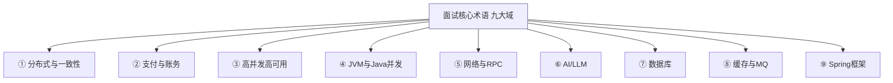
```mermaid
graph TD
    Root[面试核心术语 九大域] --> A[① 分布式与一致性]
    Root --> B[② 支付与账务]
    Root --> C[③ 高并发高可用]
    Root --> D[④ JVM与Java并发]
    Root --> E[⑤ 网络与RPC]
    Root --> F[⑥ AI/LLM]
    Root --> G[⑦ 数据库]
    Root --> H[⑧ 缓存与MQ]
    Root --> I[⑨ Spring框架]
    style Root fill:#eef,stroke:#669
```

---

## 一、分布式与一致性

### CAP 定理
- **定义**：分布式系统最多同时满足一致性（Consistency）、可用性（Availability）、分区容错性（Partition tolerance）中的两个。
- **要点**：网络分区（P）在分布式环境下**必然发生**，所以实际只能选 **CP 或 AP**。CP 牺牲可用性保证强一致（如 ZooKeeper、etcd 选主期间不可写）；AP 牺牲强一致保证可用（如 Cassandra、Eureka）。
- **常考**：为什么不能三者兼得？支付核心账务必须 CP 吗？营销/Feed 为什么可以 AP？

**CAP 三角取舍图解**：

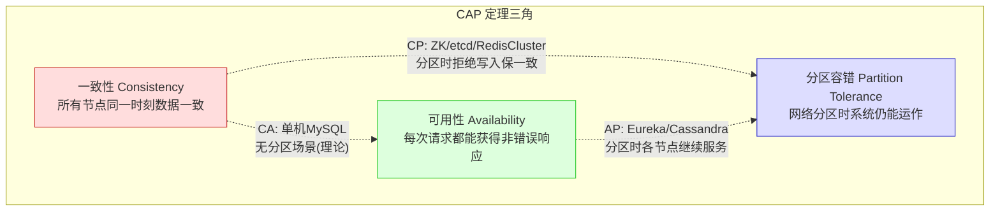
```mermaid
graph TD
    subgraph CAP三角["CAP 定理三角"]
        C["一致性 Consistency<br/>所有节点同一时刻数据一致"]
        A["可用性 Availability<br/>每次请求都能获得非错误响应"]
        P["分区容错 Partition Tolerance<br/>网络分区时系统仍能运作"]
    end
    C -.->|"CP: ZK/etcd/RedisCluster<br/>分区时拒绝写入保一致"| P
    A -.->|"AP: Eureka/Cassandra<br/>分区时各节点继续服务"| P
    C -.->|"CA: 单机MySQL<br/>无分区场景(理论)"| A
    style C fill:#fdd,stroke:#c33
    style A fill:#dfd,stroke:#3c3
    style P fill:#ddf,stroke:#33c
```

**CAP 在支付系统中的分层实战案例**：

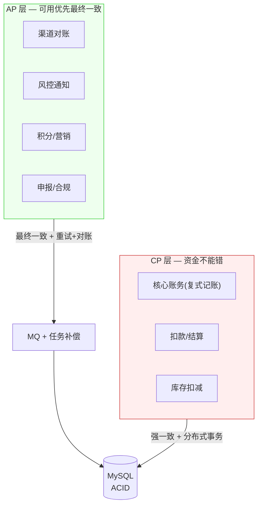
```mermaid
flowchart TD
    subgraph CP层["CP 层 — 资金不能错"]
        T1["核心账务(复式记账)"]
        T2["扣款/结算"]
        T3["库存扣减"]
    end
    subgraph AP层["AP 层 — 可用优先最终一致"]
        A1["渠道对账"]
        A2["风控通知"]
        A3["积分/营销"]
        A4["申报/合规"]
    end
    CP层 -->|"强一致 + 分布式事务"| DB[("MySQL<br/>ACID")]
    AP层 -->|"最终一致 + 重试+对账"| MQ["MQ + 任务补偿"]
    MQ --> DB
    style CP层 fill:#fee,stroke:#c33
    style AP层 fill:#efe,stroke:#3c3
```

> **【深度拓展】** CAP 中的 C 是线性一致性（Linearizability），不是 ACID 的 C（事务一致性）。很多面试者混淆这两者。线性一致性要求"读一定能看到最新的写"，代价是分区时必须拒绝部分请求。而 ACID 的 C 是"事务前后约束不破坏"，靠应用+数据库约束保证。
>
> **【项目支撑】** XTransfer 按模块分层 CAP 取舍：核心账务/扣款走 CP（强一致 + 分布式事务 + 复式记账），渠道对账/通知走 AP（BASE，最终一致）。这是 0 资损的方法论基础。
>
> **【面试官追问】**
> - "分区时 CP 系统怎么表现？" → 选主期间不可写（如 ZK 的 leader 选举），请求超时或拒绝。
> - "AP 系统分区时数据不一致怎么收敛？" → 最终一致：异步消息重试 + 定时对账 + 补偿（TCC/Saga）。
> - "你能举一个从 AP 改成 CP 的真实案例吗？" → 某系统最初用 Eureka（AP）做服务发现，但对配置中心要求强一致后换 etcd（CP）。

### BASE 理论
- **定义**：Basically Available（基本可用）、Soft state（软状态）、Eventually consistent（最终一致）。是对 CAP 中 AP 方案的落地思路。
- **常考**：BASE 与 ACID 的对立统一；哪些业务用 BASE（对账、积分、通知）。

**BASE 理论落地流程图解**：

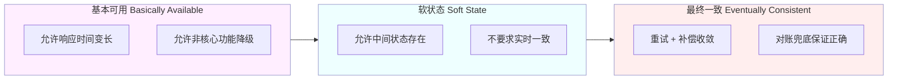
```mermaid
flowchart LR
    subgraph BA["基本可用 Basically Available"]
        BA1["允许响应时间变长"]
        BA2["允许非核心功能降级"]
    end
    subgraph SS["软状态 Soft State"]
        SS1["允许中间状态存在"]
        SS2["不要求实时一致"]
    end
    subgraph EC["最终一致 Eventually Consistent"]
        EC1["重试 + 补偿收敛"]
        EC2["对账兜底保证正确"]
    end
    BA --> SS --> EC
    style BA fill:#fef,stroke:#99c
    style SS fill:#eff,stroke:#99c
    style EC fill:#fee,stroke:#99c
```

**ACID vs BASE 对比表**：

| 维度 | ACID | BASE |
|------|------|------|
| 一致性 | 强一致（立即） | 最终一致（延迟收敛） |
| 可用性 | 分区时降低 | 优先保证 |
| 适用场景 | 单机事务/核心账务 | 分布式跨服务/对账通知 |
| 代价 | 锁等待、吞吐受限 | 复杂补偿逻辑、短暂不一致 |
| 兜底 | undo log 回滚 | 重试 + 对账 + 人工 |

> **【深度拓展】** BASE 的「最终一致」必须配「对账兜底」才安全——否则「最终」可能永远收敛不到正确值。关键问题：怎么证明「最终」会一致？靠三个机制：① 消息可靠投递（Outbox/事务消息）；② 消费端幂等（重复安全忽略）；③ 定时对账差异告警。三者缺一不可。
>
> **【项目支撑】** XTransfer 渠道对账、风控通知、申报走 BASE，靠任务补偿 + T+1 对账收敛。补偿失败死信转人工 + 资金安全告警，绝不静默。
>
> **【面试官追问】**
> - "最终一致的『最终』有多久？" → 取决于重试间隔和消息延迟，通常秒级到分钟级；超时告警人工介入。
> - "如果消息永远投不进去怎么办？" → 死信队列 + 人工处理 + 对账兜底发现差异。

### ACID
- **定义**：原子性（Atomicity）、一致性（Consistency）、隔离性（Isolation）、持久性（Durability）。单机事务四特性。
- **常考**：原子性靠 undo log，持久性靠 redo log，隔离性靠锁+MVCC，一致性是目标（由应用+约束保证）。

### 最终一致性（Eventual Consistency）
- **定义**：不要求节点实时一致，经过一段时间（同步/重试）后所有副本达到一致。
- **实现手段**：异步消息、定时对账、补偿（TCC/Saga）、版本号/向量时钟。
- **常考**：如何证明"最终"会一致？超时/消息丢失怎么办？

### 幂等性（Idempotency）
- **定义**：同一请求执行一次与执行多次效果相同。`f(f(x)) == f(x)`。
- **实现**：唯一键（订单号+业务类型）、去重表、Token+Redis、状态机（只允许特定状态流转）、乐观锁版本号。
- **常考**：前端重复提交、MQ 重复消费、网关重试，分别怎么防？

**幂等性实现方案对比图解**：

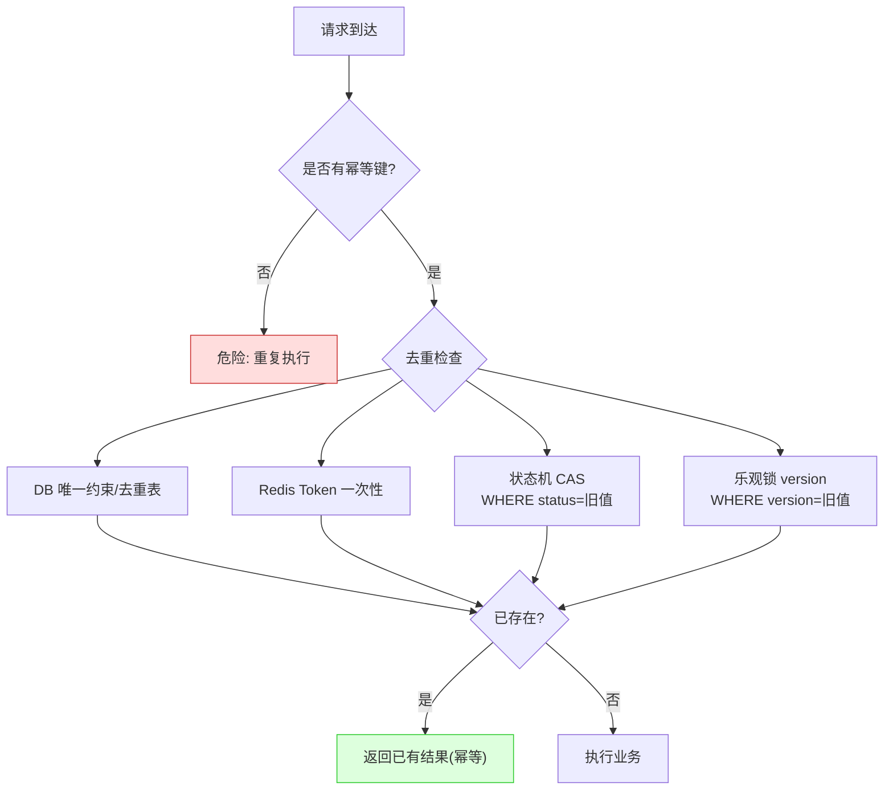
```mermaid
flowchart TD
    REQ["请求到达"] --> ID{"是否有幂等键?"}
    ID -- 否 --> DANG["危险: 重复执行"]
    ID -- 是 --> CHK{"去重检查"}
    CHK --> DB["DB 唯一约束/去重表"]
    CHK --> REDIS["Redis Token 一次性"]
    CHK --> STATE["状态机 CAS<br/>WHERE status=旧值"]
    CHK --> VER["乐观锁 version<br/>WHERE version=旧值"]
    DB --> HIT{"已存在?"}
    REDIS --> HIT
    STATE --> HIT
    VER --> HIT
    HIT -- 是 --> RET["返回已有结果(幂等)"]
    HIT -- 否 --> EXEC["执行业务"]
    style DANG fill:#fdd,stroke:#c33
    style RET fill:#dfd,stroke:#3c3
```

**幂等方案代码示例**：

```java
// 方案一：状态机 CAS（支付核心链路首选）
@Transactional
public void confirmPay(String payOrderId, String channelSeqNo) {
    // 幂等键：渠道流水号 + 支付单号，DB 唯一约束兜底
    PaymentRecord record = payRecordRepo.findByChannelSeqNo(channelSeqNo);
    if (record != null && record.isFinalState()) {
        return; // 已终态，幂等返回
    }
    // 状态机 CAS：只有 PENDING→SUCCESS 才能更新
    int affected = payOrderRepo.updateStatus(
        payOrderId, Status.PENDING, Status.SUCCESS);
    if (affected == 0) {
        // 并发冲突或状态已变更，查最新状态决定
        PayOrder latest = payOrderRepo.findById(payOrderId);
        if (latest.isFinalState()) return;
        throw new ConcurrentUpdateException("状态流转冲突");
    }
    // 记录渠道流水（唯一约束防重复）
    payRecordRepo.insert(record);
}

// 方案二：Redis Token（前端防重）
public void submitOrder(String token, OrderDTO dto) {
    // Token 一次性使用，DEL 返回 0 说明已用过
    Long deleted = redis.del("order:token:" + token);
    if (deleted == 0) throw new RepeatSubmitException("请勿重复提交");
    createOrder(dto);
}
```

> **【深度拓展】** 幂等不是「只处理第一次」，而是「重复安全地被忽略」。关键区分：**去重**（识别重复请求）vs **幂等**（重复执行结果不变）。去重是手段，幂等是目标。最易漏的是消费端幂等——没有它，事务消息/Saga 最终一致无法收敛。
>
> **【项目支撑】** XTransfer 用「渠道流水号 + 收款单号」唯一约束 + 状态机 CAS 更新双兜底；哈啰 Kafka 消费心跳用「同车辆同窗口去重键」保证幂等；欧凡优惠券「用户+活动」唯一约束防重复领。
>
> **【面试官追问】**
> - "唯一键冲突了但旧记录状态是『处理中』怎么办？" → 状态机支持「处理中→终态」收敛，冲突时查旧状态，未终态则主动查单确认。
> - "Token 方案和唯一键方案怎么选？" → Token 适合前端防重（轻量但非强保证），唯一键适合后端兜底（强保证但需 DB 写入）。生产建议两层都做。

### 分布式事务
- **定义**：跨多个服务/数据库的事务一致性保障。
- **模式**：2PC（强一致、阻塞、单点）、TCC（Try-Confirm-Cancel，业务侵入）、Saga（长事务、补偿）、本地消息表/事务消息/Outbox（最终一致）。
- **常考**：各自适用场景、空回滚/防悬挂/幂等（TCC 三问题）、与 Seata 的关系。详见《分布式事务与一致性》。

**分布式事务方案对比决策图**：

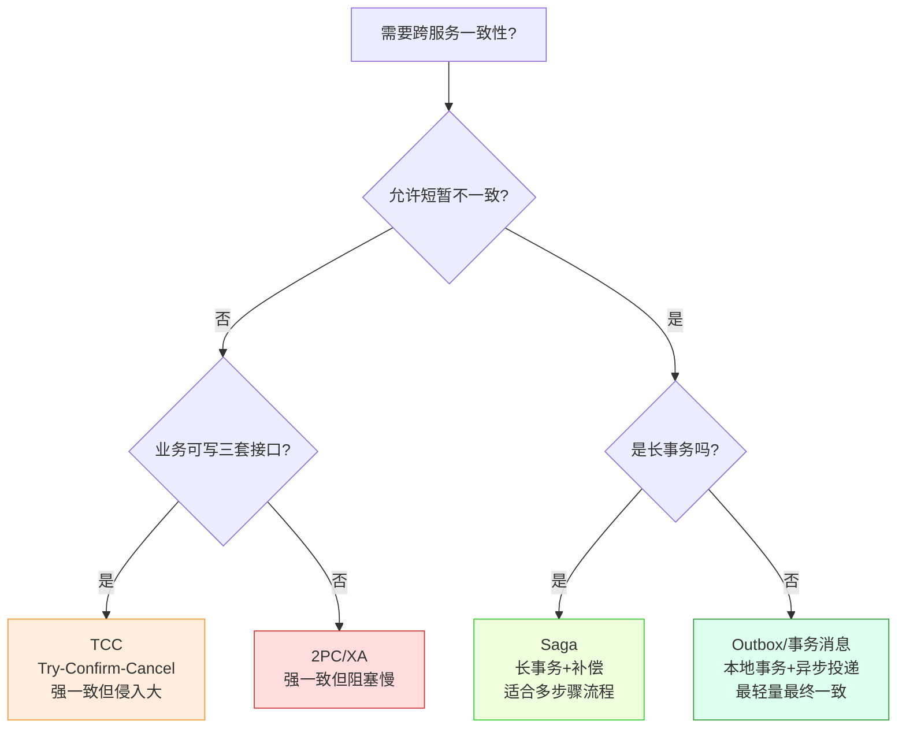
```mermaid
flowchart TD
    START["需要跨服务一致性?"] --> Q1{"允许短暂不一致?"}
    Q1 -- 否 --> Q2{"业务可写三套接口?"}
    Q1 -- 是 --> Q3{"是长事务吗?"}
    Q2 -- 是 --> TCC["TCC<br/>Try-Confirm-Cancel<br/>强一致但侵入大"]
    Q2 -- 否 --> PC["2PC/XA<br/>强一致但阻塞慢"]
    Q3 -- 是 --> SAGA["Saga<br/>长事务+补偿<br/>适合多步骤流程"]
    Q3 -- 否 --> OUTBOX["Outbox/事务消息<br/>本地事务+异步投递<br/>最轻量最终一致"]
    style TCC fill:#fed,stroke:#e93
    style PC fill:#fdd,stroke:#c33
    style SAGA fill:#efd,stroke:#3c3
    style OUTBOX fill:#dfe,stroke:#393
```

**四种分布式事务方案对比表**：

| 方案 | 一致性 | 性能 | 侵入性 | 适用场景 | 典型框架 |
|------|--------|------|--------|----------|----------|
| 2PC/XA | 强一致 | 慢（阻塞） | 低 | 跨库短事务 | Seata XA |
| TCC | 强一致 | 中 | 高（三套接口） | 资金扣减 | Seata TCC |
| Saga | 最终一致 | 快 | 中（补偿逻辑） | 长流程 | Seata Saga |
| Outbox/事务消息 | 最终一致 | 最快 | 低 | 领域事件驱动 | RocketMQ/Debezium |

> **【深度拓展】** 分布式事务的 CAP 取舍：2PC/TCC 偏 CP（强一致但可用性低），Saga/Outbox 偏 AP（最终一致可用性高）。支付系统通常混合使用：核心扣款用 TCC 或本地事务+补偿，非核心通知用 Outbox。
>
> **【项目支撑】** XTransfer 主选「状态机 + 任务补偿（Saga）」而非 2PC，因为收款跨风控/申报/账务且渠道回调晚，强一致锁太久不可用。补偿失败死信转人工 + 资金安全告警。
>
> **【面试官追问】**
> - "TCC 的三问题是什么？怎么解决？" → 空回滚（Try 没到 Cancel 先到，记事务状态表）、防悬挂（已 Cancel 后 Try 才到，查状态表拒绝）、幂等（Confirm/Cancel 重试安全）。
> - "Saga 和 TCC 怎么选？" → Saga 适合长流程多步骤（如跨境支付），TCC 适合短流程强一致（如扣库存+扣余额）。

### 2PC / 两阶段提交
- **定义**：Prepare（投票）+ Commit（提交）两阶段，协调者统一决策。
- **缺点**：同步阻塞、协调者单点、数据不一致风险（Commit 阶段网络分区）。
- **常考**：为什么很少直接用 2PC 做业务？XA 与业务 TCC 的区别？

### TCC
- **定义**：Try（预留资源）、Confirm（确认）、Cancel（释放）。每个接口要写三套。
- **三问题**：空回滚（Try 没收到 Cancel 先到）、防悬挂（Try 在网络恢复后才到，但已 Cancel）、幂等。
- **常考**：和 2PC 比优势？Confirm 失败怎么办（重试+告警+人工）？

**TCC 三问题与解决方案图解**：

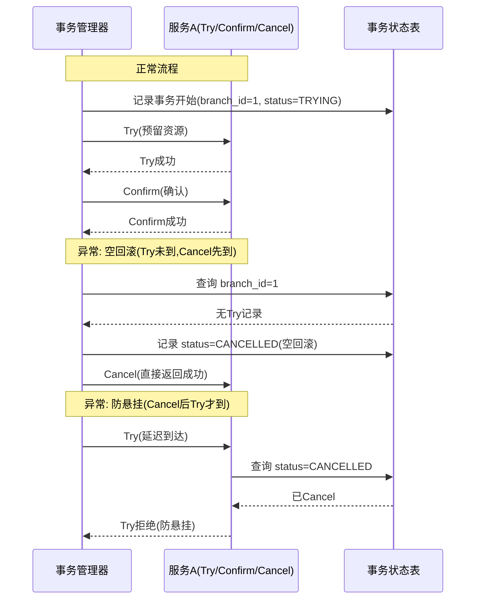
```mermaid
sequenceDiagram
    participant TM as 事务管理器
    participant A as 服务A(Try/Confirm/Cancel)
    participant ST as 事务状态表
    Note over TM,A: 正常流程
    TM->>ST: 记录事务开始(branch_id=1, status=TRYING)
    TM->>A: Try(预留资源)
    A-->>TM: Try成功
    TM->>A: Confirm(确认)
    A-->>TM: Confirm成功
    Note over TM,A: 异常: 空回滚(Try未到,Cancel先到)
    TM->>ST: 查询 branch_id=1
    ST-->>TM: 无Try记录
    TM->>ST: 记录 status=CANCELLED(空回滚)
    TM->>A: Cancel(直接返回成功)
    Note over TM,A: 异常: 防悬挂(Cancel后Try才到)
    TM->>A: Try(延迟到达)
    A->>ST: 查询 status=CANCELLED
    ST-->>A: 已Cancel
    A-->>TM: Try拒绝(防悬挂)
```

> **【深度拓展】** TCC 的三问题本质都是「网络延迟导致操作乱序」。事务状态表是核心解法：Try 前记录 TRYING，Cancel 先查状态表，无 Try 记录即空回滚，已 Cancel 则 Try 拒绝（防悬挂）。
>
> **【项目支撑】** XTransfer 在 TCC 可选处必须处理三问题，但主选 Saga 是因为收款流程长且渠道回调不确定时间，TCC 的 Try 资源预留太久不现实。
>
> **【面试官追问】** "Confirm 失败了怎么办？" → 不断重试（Confirm 是幂等的），重试到阈值告警转人工，资源靠定时对账校验。

### Saga
- **定义**：把长事务拆成一系列本地事务，每个有对应的补偿操作；失败则逆序补偿。
- **两种编排**：编排式（Choreography，靠事件驱动，难追踪）、协同式（Orchestration，有中央协调器，易观测）。
- **常考**：和 TCC 区别？补偿失败怎么处理（人工+告警）？

### 事务消息 / 本地消息表 / Outbox
- **定义**：用"本地事务 + 消息表 + 异步投递"实现业务与消息的原子性，再靠消费端幂等达成最终一致。RocketMQ 事务消息、Kafka + Debezium CDC 的 Outbox 模式都属此类。
- **常考**：半消息、回查、消息状态；为什么不直接在业务事务里发 MQ？

### 一致性哈希（Consistent Hashing）
- **定义**：哈希环上分布节点与 key，顺时针找最近节点；节点增减只影响相邻数据，缓解普通取模扩容时大面积迁移。
- **虚拟节点**：解决数据倾斜。
- **常考**：用在哪（Redis Cluster/Cassandra 分片、负载路由）？为什么需要虚拟节点？

**一致性哈希环图解**：

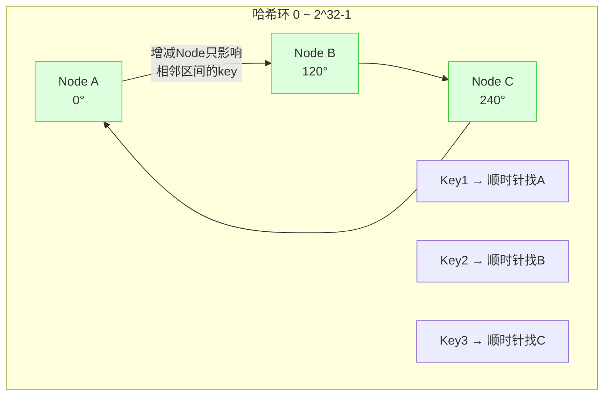
```mermaid
graph TD
    subgraph Ring["哈希环 0 ~ 2^32-1"]
        N1["Node A<br/>0°"]
        N2["Node B<br/>120°"]
        N3["Node C<br/>240°"]
        K1["Key1 → 顺时针找A"]
        K2["Key2 → 顺时针找B"]
        K3["Key3 → 顺时针找C"]
    end
    N1 -->|"增减Node只影响<br/>相邻区间的key"| N2
    N2 --> N3
    N3 --> N1
    style N1 fill:#dfd,stroke:#3c3
    style N2 fill:#dfd,stroke:#3c3
    style N3 fill:#dfd,stroke:#3c3
```

**虚拟节点解决数据倾斜**：

```text
问题：3个物理节点，Node B 机器性能好但哈希位置不均匀 → 数据倾斜
解决：每个物理节点映射 150 个虚拟节点（Node A-1, A-2, ..., A-150）
     虚拟节点均匀散布在环上 → 数据分布均匀
     扩容时新增节点的虚拟节点只"抢走"各自相邻区间 → 迁移量 ≈ 1/N
```

> **【深度拓展】** Redis Cluster 用的是 16384 槽（CRC16(key) % 16384），不是经典一致性哈希环，但思想类似——扩缩容时只迁移部分槽。一致性哈希的优势是「节点增减时数据迁移量最小化」。
>
> **【项目支撑】** XTransfer 用一致性哈希做渠道/分片路由，避免扩缩容时全量重映射。
>
> **【面试官追问】** "为什么需要虚拟节点？" → 物理节点少时哈希位置不均匀导致数据倾斜，虚拟节点把一个物理节点拆成多个虚拟点均匀分布。

### Quorum / NWR
- **定义**：N 副本数、W 写成功数、R 读成功数；`W+R > N` 即可读到最新。
- **常考**：如何用它调一致性与可用性（如 DynamoDB/Cassandra）。

---

> **【深度拓展与项目支撑】**（分布式与一致性域）这些术语不是孤立即名词，而是「一致性取舍」的工具箱。CAP 告诉你「P 必然发生所以只能 CP/AP」；BASE 是 AP 的落地；ACID 是单机强一致；最终一致靠「重试 + 补偿 + 对账」收敛。面试官最看重的不是定义，而是「你怎么按业务分层选 CP/AP」。
> **项目支撑**：XTransfer 按模块分层——核心账务/扣款走 CP（强一致 + 分布式事务 + 复式记账），渠道对账/通知走 AP（BASE，最终一致）。分布式事务主选「状态机 + 任务补偿（Saga）」而非 2PC，因为收款跨风控/申报/账务且渠道回调晚，强一致锁太久不可用；空回滚/防悬挂/幂等三问题在 TCC 可选处必须处理。一致性哈希用于渠道/分片路由，避免扩缩容全量重映射。

**分布式一致性术语关联图**：

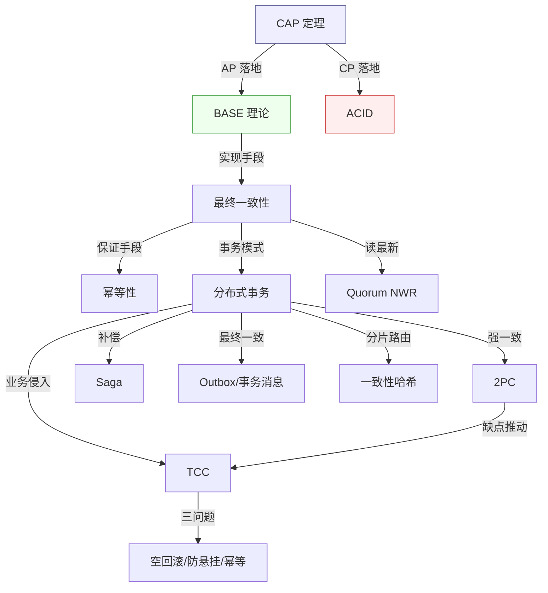
```mermaid
graph TD
    CAP["CAP 定理"] -->|"AP 落地"| BASE["BASE 理论"]
    CAP -->|"CP 落地"| ACID["ACID"]
    BASE -->|"实现手段"| EC["最终一致性"]
    EC -->|"保证手段"| IDEM["幂等性"]
    EC -->|"事务模式"| DT["分布式事务"]
    DT -->|"强一致"| TWOPC["2PC"]
    DT -->|"业务侵入"| TCC["TCC"]
    DT -->|"补偿"| SAGA["Saga"]
    DT -->|"最终一致"| OUTBOX["Outbox/事务消息"]
    TWOPC -->|"缺点推动"| TCC
    TCC -->|"三问题"| THREE["空回滚/防悬挂/幂等"]
    DT -->|"分片路由"| CH["一致性哈希"]
    EC -->|"读最新"| QM["Quorum NWR"]
    style CAP fill:#eef,stroke:#669
    style BASE fill:#efe,stroke:#393
    style ACID fill:#fee,stroke:#c33
```

**术语 → 面试题映射表（分布式与一致性域）**：

| 术语 | 高频面试题 | 考察深度 |
|------|-----------|----------|
| CAP | 支付系统选 CP 还是 AP？凭什么分层？ | 架构决策 |
| BASE | 最终一致的「最终」靠什么保证？ | 机制理解 |
| ACID | 四个特性各靠什么实现？redo/undo 分工？ | 原理 |
| 幂等性 | 唯一键冲突但旧记录处理中怎么办？ | 边界处理 |
| 分布式事务 | Saga 和 TCC 怎么选？各自适用场景？ | 方案对比 |
| TCC | 空回滚/防悬挂怎么实现？ | 异常处理 |
| Saga | 补偿失败怎么处理？和 TCC 区别？ | 容错 |
| 一致性哈希 | 为什么需要虚拟节点？扩容迁移量？ | 原理 |
| Quorum | W+R>N 怎么保证读到最新？ | 算法 |

> **【面试官追问】** "你能把 CAP、BASE、幂等、分布式事务串起来讲一遍吗？" → 这是在考你术语之间的逻辑关系：CAP 定理决定分布式系统必须选 CP/AP → BASE 是 AP 的落地方法论 → 最终一致靠「重试+补偿+对账」收敛 → 重试要求幂等（否则重复执行） → 幂等的实现（唯一键/状态机/CAS） → 分布式事务模式（2PC/TCC/Saga/Outbox）是最终一致的不同实现路径。能串起来讲说明你理解了「一致性取舍」的全景。

## 二、支付与账务

### 支付全链路（交易 / 支付 / 清结算 / 账务 / 对账 / 资金）
- **定义**：一笔钱从用户发起，到内部记账、渠道清算、资金结算入账的完整分层架构（参考陈天宇宙《支付之门》）。
- **分层职责**：交易层（订单/收银台）→ 支付层（渠道路由/渠道调用）→ 清结算层（清算/结算）→ 账务层（复式记账）→ 对账系统 → 资金处理层（银行头寸）。
- **常考**：交易单和支付单为什么 1:N？哪一层做幂等？详见《支付系统全链路架构》。

**支付全链路分层架构图解**：

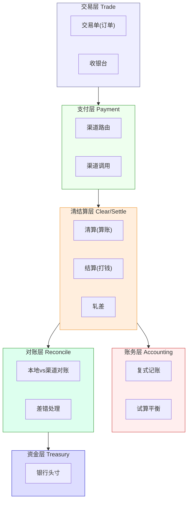
```mermaid
flowchart TD
    subgraph 交易层["交易层 Trade"]
        ORDER["交易单(订单)"]
        CASHIER["收银台"]
    end
    subgraph 支付层["支付层 Payment"]
        ROUTE["渠道路由"]
        CALL["渠道调用"]
    end
    subgraph 清结算层["清结算层 Clear/Settle"]
        CLEAR["清算(算账)"]
        SETTLE["结算(打钱)"]
        NET["轧差"]
    end
    subgraph 账务层["账务层 Accounting"]
        DE["复式记账"]
        TB["试算平衡"]
    end
    subgraph 对账层["对账层 Reconcile"]
        RECON["本地vs渠道对账"]
        DIFF["差错处理"]
    end
    subgraph 资金层["资金层 Treasury"]
        BANK["银行头寸"]
    end
    交易层 --> 支付层 --> 清结算层 --> 账务层
    清结算层 --> 对账层 --> 资金层
    style 交易层 fill:#eef,stroke:#669
    style 支付层 fill:#efe,stroke:#393
    style 清结算层 fill:#fed,stroke:#e93
    style 账务层 fill:#fee,stroke:#c33
    style 对账层 fill:#dfe,stroke:#393
    style 资金层 fill:#ddf,stroke:#33c
```

**交易单 vs 支付单 1:N 关系图解**：

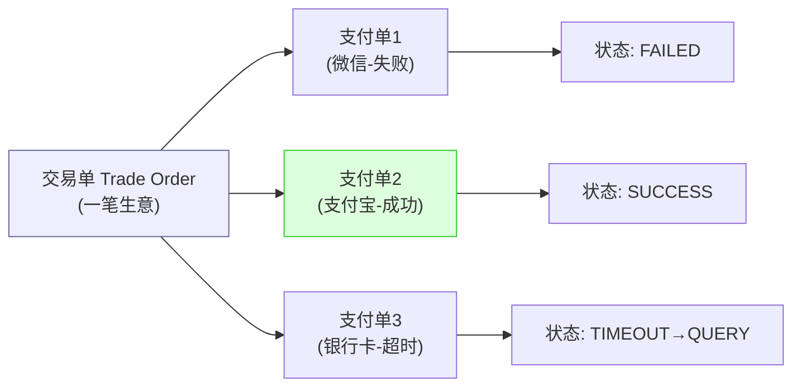
```mermaid
graph LR
    T["交易单 Trade Order<br/>(一笔生意)"] --> P1["支付单1<br/>(微信-失败)"]
    T --> P2["支付单2<br/>(支付宝-成功)"]
    T --> P3["支付单3<br/>(银行卡-超时)"]
    P1 --> S1["状态: FAILED"]
    P2 --> S2["状态: SUCCESS"]
    P3 --> S3["状态: TIMEOUT→QUERY"]
    style T fill:#eef,stroke:#669
    style P2 fill:#dfd,stroke:#3c3
```

> **【深度拓展】** 交易单和支付单拆分的原因：一次下单可能因余额不足/渠道故障/超时等多次尝试不同渠道，每次尝试生成一个支付单，最终只有一个成功。这种 1:N 建模让「重试/换渠道」变成正常业务流程而非异常处理。
>
> **【项目支撑】** XTransfer 全链路正是这套——交易单/支付单 1:N 严谨建模；复式记账 + 实时试算平衡做事中告警；热点账户用子账户拆分抗写热点。
>
> **【面试官追问】**
> - "哪一层做幂等？" → 每一层都要做，但入口层（支付层渠道回调）和账务层（记账）最关键，前者靠渠道流水号+支付单号唯一约束，后者靠复式记账借贷平衡校验。
> - "清算是信息流，结算是资金流，为什么不合并？" → 合并意味着每次交易都实时打钱，成本高且风险大（跨行转账费+资金在途）。分离后可以轧差批量结算，减少资金流动笔数。

### 交易单 vs 支付单
- **定义**：交易单是"一笔生意"（一次下单），支付单是"一次扣款尝试"（可能多次重试/换渠道）。一对多。
- **常考**：为什么要拆？怎么用状态机管理支付单生命周期？

### 收银台（Cashier）
- **定义**：聚合所有支付方式（微信/支付宝/银行卡/余额）的前端入口，做样式聚合与风控前置。
- **常考**：收银台和渠道路由的关系？前端收银台与后端支付网关职责边界？

### 渠道路由（Channel Routing）
- **定义**：按成本、成功率、限额、地域、币种选最优支付通道。
- **常考**：路由策略有哪些（静态/动态/智能）？成功率下降如何熔断切换？

### 清算（Clearing） vs 结算（Settlement）
- **定义**：清算是**算账**（信息流，算出谁该给谁多少钱）；结算是**打钱**（资金流，实际跨行/跨机构转账）。
- **常考**：为什么两者要分离？T+0/T+1 是什么？差错怎么处理？详见《清结算体系》。

### 轧差（Netting）
- **定义**：把多笔应收应付对冲，只结算净额，减少资金流动笔数与在途资金。
- **常考**：双边轧差 vs 多边轧差；轧差的法律与风控前提（协议）。

### 复式记账（Double-entry Bookkeeping）
- **定义**：每笔账务必有借有贷，借贷相等；记录"钱的来龙去脉"。
- **要点**：账户体系（客户/渠道过渡/手续费/暂收暂付）、不可变流水、余额由流水派生、试算平衡校验。
- **常考**：为什么支付系统要独立账务系统？单式记账为什么不够？详见《账务账户体系与复式记账》。

**复式记账 T 字账图解**：

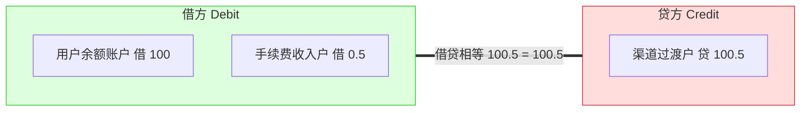
```mermaid
flowchart LR
    subgraph 借方["借方 Debit"]
        D1["用户余额账户 借 100"]
        D2["手续费收入户 借 0.5"]
    end
    subgraph 贷方["贷方 Credit"]
        C1["渠道过渡户 贷 100.5"]
    end
    借方 ===|"借贷相等 100.5 = 100.5"| 贷方
    style 借方 fill:#dfd,stroke:#3c3
    style 贷方 fill:#fdd,stroke:#c33
```

**复式记账 SQL 示例**：

```sql
-- 每笔流水都有借贷方向，借贷必须相等
-- 扣款：用户余额减少（贷），渠道过渡户增加（借），手续费收入户增加（借）
INSERT INTO accounting_entry (entry_id, batch_no, account_id, direction, amount, biz_ref)
VALUES
  ('E001', 'B001', 'user_balance_001',   'CREDIT', 100.00, 'PAY_20260710001'),  -- 用户余额 -100
  ('E002', 'B001', 'channel_transit_01', 'DEBIT',  100.00, 'PAY_20260710001'),  -- 渠道过渡 +100
  ('E003', 'B001', 'fee_income_001',     'DEBIT',    0.50, 'PAY_20260710001');  -- 手续费 +0.5
-- 借方合计 = 100.50, 贷方合计 = 100.00 ... 需补一笔差额

-- 试算平衡校验（定时跑）
SELECT batch_no,
       SUM(CASE direction WHEN 'DEBIT' THEN amount ELSE 0 END) AS debit_total,
       SUM(CASE direction WHEN 'CREDIT' THEN amount ELSE 0 END) AS credit_total
FROM accounting_entry
GROUP BY batch_no
HAVING debit_total != credit_total;  -- 不平衡的批次 → 告警
```

> **【深度拓展】** 复式记账的核心价值是「可审计性」——每笔钱都有来龙去脉（谁给谁、为什么），试算平衡是自动校验机制。单式记账只记余额变动，无法追溯资金路径，支付系统不可接受。
>
> **【项目支撑】** XTransfer 账务侧用复式记账 + 实时试算平衡做事中告警；不可变流水借鉴 MVCC「只增不改」思想保证可追溯。
>
> **【面试官追问】** "试算平衡了就一定没错吗？" → 不一定。借贷同错（都多记或少记相同金额）会被掩盖。所以还要对账（本地 vs 渠道）兜底。

### 试算平衡（Trial Balance）
- **定义**：所有账户的借方合计 = 贷方合计，作为账务正确性的底线校验。
- **常考**：试算平衡了就绝对没错吗（不一定，借贷同错会被掩盖）？

### 热点账户（Hot Account）
- **定义**：高频更新的账户（如平台手续费汇总户、大促营销户），单点写入成为瓶颈。
- **解法**：子账户拆分 + 汇总、缓冲记账（先记明细后异步归并）、合并入账。
- **常考**：拆分后怎么保证总额准确与一致性？

### 二清（二次清算）合规
- **定义**：无牌照机构替商户归集资金再结算给商户，属违规资金池。
- **解法**：银行/持牌机构"大商户+子商户"模式、分账到平台托管户。
- **常考**：你的系统怎么规避二清风险？

---

> **【深度拓展与项目支撑】**（支付与账务域）这一域是面试「支付岗」的分水岭。交易单 vs 支付单 1:N、清算（算账）vs 结算（打钱）分离、复式记账（借贷相等 + 不可变流水）、热点账户（拆分 + 缓冲记账）是四个必清概念。试算平衡即使平衡也可能「借贷同错」被掩盖，所以还要对账。
> **项目支撑**：XTransfer 全链路正是这套——交易单/支付单 1:N 严谨建模；复式记账 + 实时试算平衡做事中告警；热点账户（平台过渡户）用「子账户拆分 + 先记明细后异步归并」抗写热点；二清规避靠持牌「大商户+子商户」模式、资金流信息流分离；轧差在清结算层减少在途资金。VA 开户 100+ 渠道、贸易订单额度流水式只增不减，都是这套账务思想的延伸。

## 三、高并发与高可用

### 限流（Rate Limiting）
- **定义**：控制单位时间请求量，保护系统不被打垮。
- **算法**：计数器（固定/滑动窗口）、漏桶（恒定速率）、令牌桶（允许突发）。
- **维度**：QPS、并发数、连接数；单机 vs 集群（Redis + Lua）。
- **常考**：漏桶 vs 令牌桶区别？集群限流怎么算？

**限流算法对比图解**：

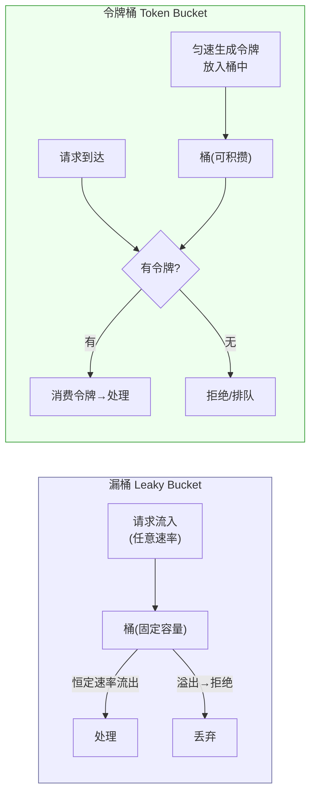
```mermaid
flowchart LR
    subgraph 漏桶["漏桶 Leaky Bucket"]
        L1["请求流入<br/>(任意速率)"] --> L2["桶(固定容量)"]
        L2 -->|"恒定速率流出"| L3["处理"]
        L2 -->|"溢出→拒绝"| L4["丢弃"]
    end
    subgraph 令牌桶["令牌桶 Token Bucket"]
        T1["匀速生成令牌<br/>放入桶中"] --> T2["桶(可积攒)"]
        REQ2["请求到达"] --> T3{"有令牌?"}
        T2 --> T3
        T3 -- 有 --> T4["消费令牌→处理"]
        T3 -- 无 --> T5["拒绝/排队"]
    end
    style 漏桶 fill:#eef,stroke:#669
    style 令牌桶 fill:#efe,stroke:#393
```

**集群限流 Redis+Lua 实现**：

```lua
-- 滑动窗口限流：zset 存请求时间戳
local key = KEYS[1]
local now = tonumber(ARGV[1])
local window = tonumber(ARGV[2])  -- 窗口大小(ms)
local limit = tonumber(ARGV[3])   -- 窗口内最大请求数

-- 1. 删除窗口外的时间戳
redis.call('ZREMRANGEBYSCORE', key, 0, now - window)
-- 2. 统计当前窗口内请求数
local count = redis.call('ZCARD', key)
if count >= limit then
    return 0  -- 限流
end
-- 3. 记录本次请求
redis.call('ZADD', key, now, now .. math.random())
redis.call('PEXPIRE', key, window)
return 1  -- 放行
```

> **【深度拓展】** 漏桶 vs 令牌桶的核心区别：漏桶恒定速率流出（平滑但不允许突发），令牌桶可积攒令牌（允许突发但可控）。支付渠道调用多用令牌桶（应对用户集中支付高峰），而保护下游脆弱服务用漏桶（平滑输出）。
>
> **【项目支撑】** XTransfer 支付网关用 Spring Cloud Gateway 做统一鉴权 + 按渠道限流（令牌桶应对集中支付高峰）。
>
> **【面试官追问】** "滑动窗口怎么用 Redis 实现且原子？" → zset 存请求时间戳，窗口外删除+计数，用 Lua 脚本保证"删+加+数"原子，避免并发多记。

### 熔断（Circuit Breaker）
- **定义**：依赖故障率超阈值时快速失败，避免雪崩；有 Closed/Open/Half-Open 三态。
- **框架**：Hystrix（已停更）、Resilience4j、Sentinel。
- **常考**：和降级的区别？半开状态干嘛？熔断阈值怎么定？

**熔断器三态转换图解**：

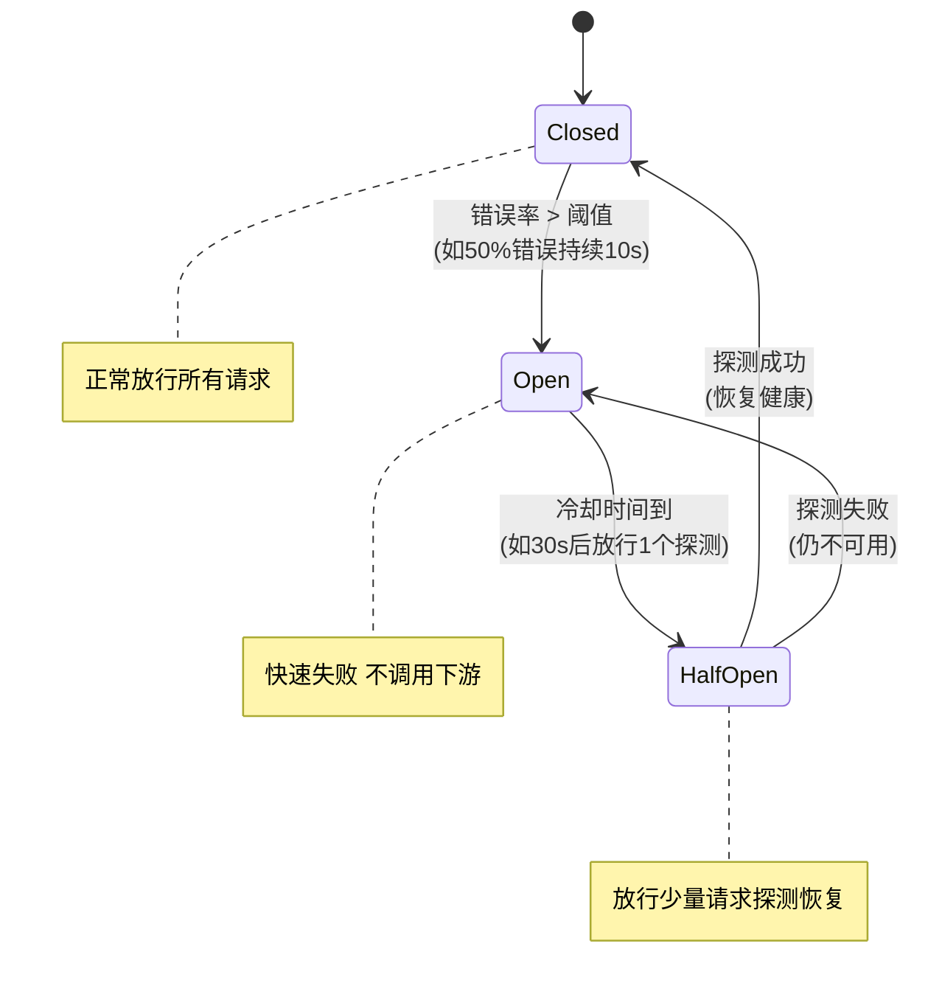
```mermaid
stateDiagram-v2
    [*] --> Closed
    Closed --> Open: 错误率 > 阈值<br/>(如50%错误持续10s)
    Open --> HalfOpen: 冷却时间到<br/>(如30s后放行1个探测)
    HalfOpen --> Closed: 探测成功<br/>(恢复健康)
    HalfOpen --> Open: 探测失败<br/>(仍不可用)
    note right of Closed: 正常放行所有请求
    note right of Open: 快速失败 不调用下游
    note right of HalfOpen: 放行少量请求探测恢复
```

> **【深度拓展】** 熔断阈值不能拍脑袋——应基于「错误率 + 响应时间 + 最小请求数」三维度。只有请求数达到最小阈值（如 20 次）才统计错误率，否则小样本误判。半开状态的探测请求要限量（如 1 个），避免恢复期被大流量二次打垮。
>
> **【项目支撑】** XTransfer 内部 Dubbo 调用配熔断降级；资金安全 BCP 告警是熔断/降级的监控延伸。
>
> **【面试官追问】** "熔断和降级是一回事吗？" → 不是。熔断是「依赖不可用」的应对（快速失败避免雪崩），降级是「资源不够」的应对（关非核心保主链路）。二者常配合：熔断后走降级逻辑返回兜底数据。

### 降级（Degradation）
- **定义**：异常时关闭非核心功能，保证主链路。如评论/推荐降级、返回兜底数据。
- **常考**：熔断、降级、限流三者差别与配合？

### 舱壁隔离（Bulkhead）
- **定义**：像船舱一样隔离资源（线程池/连接池/信号量），一个依赖耗尽不影响其他。
- **常考**：Resilience4j 的线程池隔离 vs 信号量隔离？

### SLO / SLI / 错误预算（Error Budget）
- **定义**：SLI 是度量指标（延迟/成功率/饱和度）；SLO 是目标（如 99.95% 请求 < 300ms）；错误预算 = 1 - SLO，用来决定能否发版/做实验。
- **常考**：错误预算烧完怎么办（暂停发版、优先稳定性）？

### 压测（Pressure Test）
- **定义**：全链路压测（影子库/流量染色）评估容量；单接口压测易失真。
- **常考**：怎么mock第三方渠道？影子表怎么隔离？

### 多活 / 异地容灾
- **定义**：单元化（把用户路由到固定机房）、同城双活、两地三中心、异地多活。
- **常考**：跨机房数据一致性？脑裂怎么防（租约/多数派）？

**异地多活架构层级图解**：

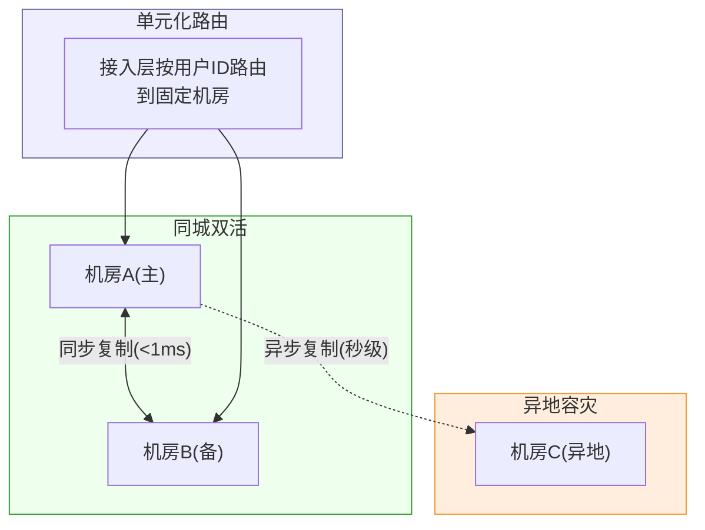
```mermaid
graph TD
    subgraph L1["单元化路由"]
        R["接入层按用户ID路由<br/>到固定机房"]
    end
    subgraph L2["同城双活"]
        DC1["机房A(主)"]
        DC2["机房B(备)"]
        DC1 <-->|"同步复制(<1ms)"| DC2
    end
    subgraph L3["异地容灾"]
        DC1 -.->|"异步复制(秒级)"| DC3["机房C(异地)"]
    end
    R --> DC1
    R --> DC2
    style L1 fill:#eef,stroke:#669
    style L2 fill:#efe,stroke:#393
    style L3 fill:#fed,stroke:#e93
```

> **【深度拓展】** 脑裂是异地多活的核心风险：两个机房网络分区后各自认为自己是主，同时写入导致数据冲突。防护：租约机制（Lease，主节点定期续约，超时自动降级）或多数派（Raft/Paxos，需要 N/2+1 节点同意才能写）。
>
> **【面试官追问】** "跨机房数据一致性怎么保证？" → 同城用同步复制（强一致但延迟低），异地用异步复制（最终一致但延迟高）。核心数据走同步，非核心走异步。

---

> **【深度拓展与项目支撑】**（高并发与高可用域）限流/熔断/降级是「分层防护」：网关限流挡峰值 → 熔断挡依赖故障 → 降级保主链路 → 多级缓存扛读。SLO/错误预算决定「敢不敢发版」。多活/容灾要防脑裂（租约/多数派）。
> **项目支撑**：XTransfer 支付网关用 Spring Cloud Gateway 做统一鉴权 + 按渠道限流（令牌桶应对集中支付高峰），内部 Dubbo 调用配熔断降级；资金安全 BCP 告警属于「熔断/降级」的告警延伸。欧凡直播大促用 Caffeine 二级缓存 + Redis 抗热点，配合熔断兜底返回兜底数据，商品核心接口 p99<200ms。哈啰工单超时升级/重派是「降级 + SLA」思想。

## 四、JVM 与 Java 并发

### JMM（Java 内存模型）
- **定义**：规定线程何时能看到其他线程的写，定义 happens-before 规则。
- **常考**：happens-before 有哪些（程序次序、volatile、锁、线程 start/join、传递性）？

**JMM 内存模型图解**：

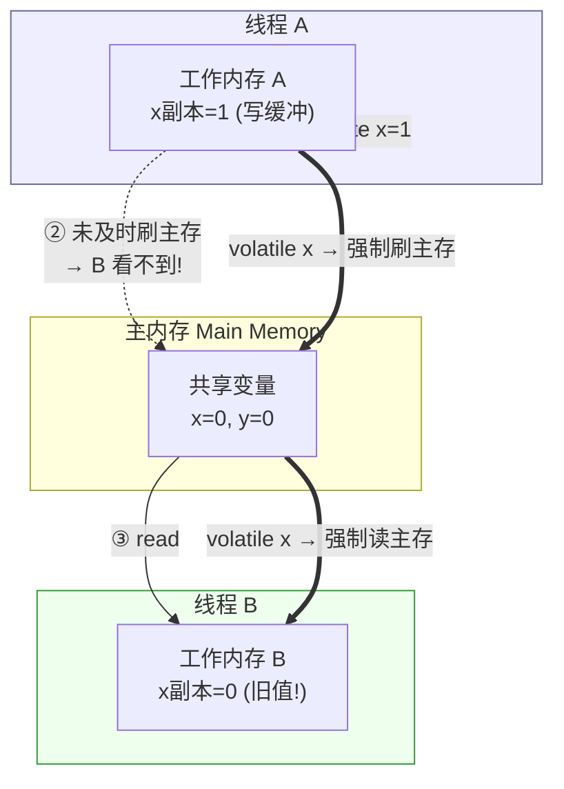
```mermaid
graph TD
    subgraph 主内存["主内存 Main Memory"]
        SHARED["共享变量<br/>x=0, y=0"]
    end
    subgraph 线程A["线程 A"]
        WA["工作内存 A<br/>x副本=1 (写缓冲)"]
    end
    subgraph 线程B["线程 B"]
        WB["工作内存 B<br/>x副本=0 (旧值!)"]
    end
    线程A -->|"① write x=1"| WA
    WA -.->|"② 未及时刷主存<br/>→ B 看不到!"| SHARED
    SHARED -->|"③ read"| WB
    WA ==>|"volatile x → 强制刷主存"| SHARED
    SHARED ==>|"volatile x → 强制读主存"| WB
    style 线程A fill:#eef,stroke:#669
    style 线程B fill:#efe,stroke:#393
```

> **【深度拓展】** JMM 的核心问题是「可见性」——每个线程有自己的工作内存（CPU 缓存/寄存器），变量的修改先发生在本地，再异步同步主内存。不加 volatile 或锁，线程 B 可能永远看不到线程 A 的写。
>
> **【面试官追问】** "i++ 为什么不是线程安全的？" → i++ 是「读-改-写」三步复合操作，即使加了 volatile 只保证可见性，三个步骤之间仍有并发窗口。需要 synchronized 或 AtomicInteger（CAS）保证原子性。

### happens-before
- **定义**：若 A happens-before B，则 A 的结果对 B 可见且有序。是可见性与有序性的"保证书"。
- **常考**：为什么 DCL 单例要 volatile（防止指令重排导致拿到半初始化对象）？

**happens-before 规则关系图**：

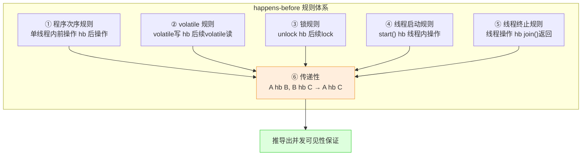
```mermaid
graph TD
    subgraph HB["happens-before 规则体系"]
        R1["① 程序次序规则<br/>单线程内前操作 hb 后操作"]
        R2["② volatile 规则<br/>volatile写 hb 后续volatile读"]
        R3["③ 锁规则<br/>unlock hb 后续lock"]
        R4["④ 线程启动规则<br/>start() hb 线程内操作"]
        R5["⑤ 线程终止规则<br/>线程操作 hb join()返回"]
        R6["⑥ 传递性<br/>A hb B, B hb C → A hb C"]
    end
    R1 --> R6
    R2 --> R6
    R3 --> R6
    R4 --> R6
    R5 --> R6
    R6 --> CONC["推导出并发可见性保证"]
    style R6 fill:#fed,stroke:#e93
    style CONC fill:#dfd,stroke:#3c3
```

> **【深度拓展】** happens-before 不是说「时间上先执行」，而是「前一个操作的结果对后一个可见」。编译器可以重排，只要不违反 happens-before 保证。这是区分背八股和真懂的分水岭。
>
> **【项目支撑】** XTransfer 状态机流转用 `UPDATE...WHERE status=旧值` 在数据库层原子完成，比在 Java 内存里用 volatile/synchronized 更可靠（跨进程）。
>
> **【面试官追问】** "为什么 DCL 单例要 volatile？" → `instance = new Singleton()` 分三步：①分配内存 ②初始化对象 ③引用赋值。不加 volatile 可能重排为 ①→③→②，另一线程在 ③ 后、② 前看到 instance 非 null 但拿到半初始化对象。volatile 禁止重排保证 ②在③前。

### volatile
- **定义**：保证可见性（写立即刷主存、读从主存取）+ 禁止重排序；**不保证原子性**。
- **常考**：i++ 为什么不是线程安全的？volatile 适用场景（状态标志、DCL）？

### synchronized
- **定义**：JVM 内置锁，保证原子性、可见性、有序性；可重入。
- **升级**：无锁 → 偏向锁 → 轻量级锁（CAS 自旋）→ 重量级锁（操作系统互斥）。
- **常考**：锁升级过程？和 Lock 的区别？

**synchronized 锁升级完整过程图解**：

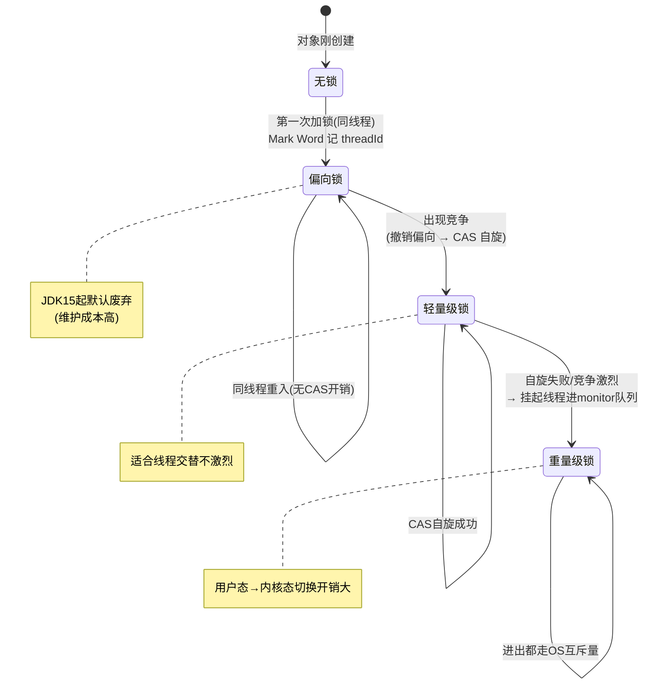
```mermaid
stateDiagram-v2
    [*] --> 无锁: 对象刚创建
    无锁 --> 偏向锁: 第一次加锁(同线程)<br/>Mark Word 记 threadId
    偏向锁 --> 偏向锁: 同线程重入(无CAS开销)
    偏向锁 --> 轻量级锁: 出现竞争<br/>(撤销偏向 → CAS 自旋)
    轻量级锁 --> 轻量级锁: CAS自旋成功
    轻量级锁 --> 重量级锁: 自旋失败/竞争激烈<br/>→ 挂起线程进monitor队列
    重量级锁 --> 重量级锁: 进出都走OS互斥量
    note right of 偏向锁: JDK15起默认废弃<br/>(维护成本高)
    note right of 轻量级锁: 适合线程交替不激烈
    note right of 重量级锁: 用户态→内核态切换开销大
```

**对象头 Mark Word 锁状态变化**：

```text
| 锁状态   | Mark Word 存储内容              | 标志位 |
|---------|-------------------------------|--------|
| 无锁    | hashCode, 分代年龄              | 01     |
| 偏向锁  | threadId, epoch, 分代年龄       | 01(偏向)|
| 轻量级锁 | 指向栈中锁记录的指针              | 00     |
| 重量级锁 | 指向 monitor 对象的指针          | 10     |
| GC标记  | 空                             | 11     |
```

> **【深度拓展】** 锁升级不可逆（不能从重量级降回轻量级）。JDK15 起偏向锁默认废弃——因为在现代多线程应用中，偏向锁的撤销开销（STW）反而拖累性能。这告诉我们「优化是场景相关的」：偏向锁在「单线程重入」场景最优，但在「多线程竞争」场景反而有害。
>
> **【项目支撑】** XTransfer 任务补偿/状态机并发控制不用 synchronized 重量锁，而用状态机 CAS 更新（无锁乐观）+ 必要时 Redisson 分布式锁。
>
> **【面试官追问】** "偏向锁在高并发下为什么反而慢？" → 偏向锁撤销需要 STW（Stop The World），高并发下频繁撤销导致 STW 开销远超偏向带来的收益。JDK15 后默认废弃就是基于这个原因。

### CAS（Compare And Swap）
- **定义**：无锁原子操作：比较并交换，失败重试。CPU 指令级（cmpxchg）。
- **ABA 问题**：值从 A→B→A，CAS 误判未变；解决用版本号/AtomicStampedReference。
- **常考**：CAS 自旋开销？ABA 怎么解决？

**CAS 与 ABA 问题图解**：

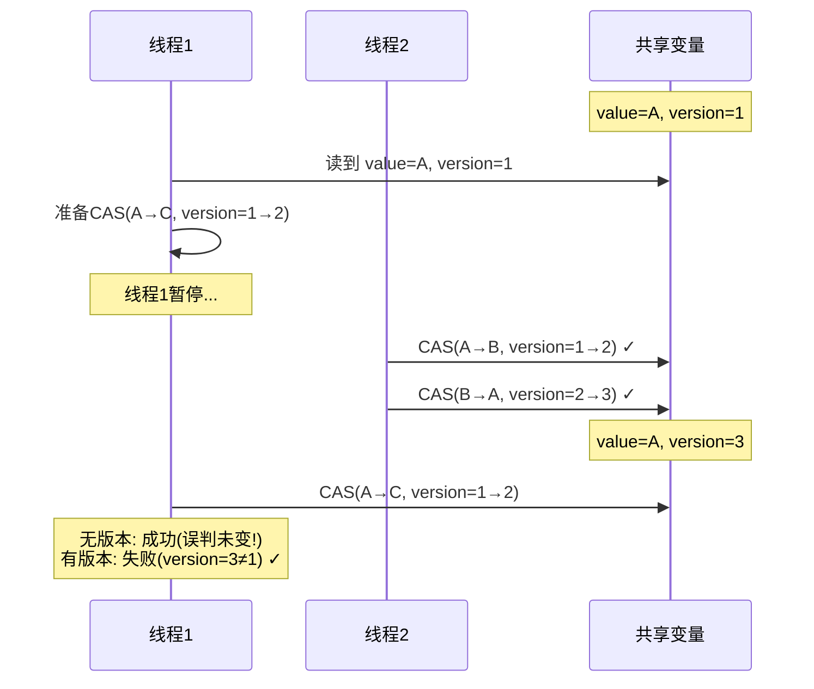
```mermaid
sequenceDiagram
    participant T1 as 线程1
    participant T2 as 线程2
    participant MEM as 共享变量
    Note over MEM: value=A, version=1
    T1->>MEM: 读到 value=A, version=1
    T1->>T1: 准备CAS(A→C, version=1→2)
    Note over T1: 线程1暂停...
    T2->>MEM: CAS(A→B, version=1→2) ✓
    T2->>MEM: CAS(B→A, version=2→3) ✓
    Note over MEM: value=A, version=3
    T1->>MEM: CAS(A→C, version=1→2)
    Note over T1: 无版本: 成功(误判未变!)<br/>有版本: 失败(version=3≠1) ✓
```

> **【深度拓展】** CAS 的三大问题：① ABA（用版本号解决）；② 自旋开销（高竞争下 CPU 空转，限制自旋次数或退化加锁）；③ 只保证单变量原子（多变量用 AtomicReference 封装对象或加锁）。LongAdder 用「分段 Cell + 最终累加」降低热点竞争，但 sum() 不是精确快照——计数可接受，金额不可。
>
> **【面试官追问】** "支付账户余额扣减用 CAS 还是锁？" → 单机用 AtomicLong/LongAdder（计数场景）；跨节点必须用分布式锁或账务流水。支付金额不可用 LongAdder（sum 不精确），用 DB 乐观锁 version（本质是带版本的 CAS）。

### AQS（AbstractQueuedSynchronizer）
- **定义**：Java 并发锁与同步器的基石（ReentrantLock、Semaphore、CountDownLatch 都基于它）。CLH 队列 + state + CAS。
- **常考**：公平/非公平锁？独占/共享模式？

### 线程池（ThreadPoolExecutor）
- **定义**：7 参数（核心/最大线程、队列、空闲回收、拒绝策略、线程工厂、存活时间）。
- **执行流程**：核心满 → 入队 → 队满 → 开非核心 → 达最大 → 拒绝。
- **拒绝策略**：Abort（抛异常）/ Discard / DiscardOldest / CallerRuns（调用者线程执行）。
- **常考**：为什么不建议用 Executors 快捷创建（Fixed 队列无界可能 OOM）？

### ThreadLocal
- **定义**：线程私有变量，常用于上下文传递（traceId、用户身份）。
- **内存泄漏**：key 是弱引用、value 强引用，线程复用（线程池）下 value 不回收；用完要 remove()。
- **常考**：为什么用 static？为什么必须 remove？InheritableThreadLocal 干嘛？

**ThreadLocal 内存泄漏原理图解**：

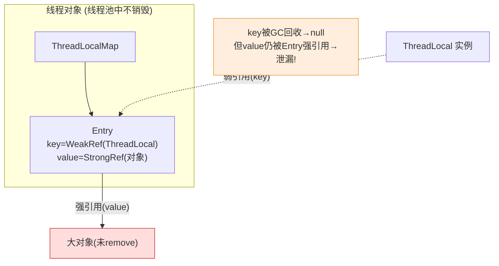
```mermaid
graph TD
    subgraph Thread["线程对象 (线程池中不销毁)"]
        MAP["ThreadLocalMap"]
        ENTRY["Entry<br/>key=WeakRef(ThreadLocal)<br/>value=StrongRef(对象)"]
        MAP --> ENTRY
    end
    TL["ThreadLocal 实例"] -.->|"弱引用(key)"| ENTRY
    ENTRY -->|"强引用(value)"| OBJ["大对象(未remove)"]
    NOTE["key被GC回收→null<br/>但value仍被Entry强引用→泄漏!"]
    style OBJ fill:#fdd,stroke:#c33
    style NOTE fill:#fed,stroke:#e93
```

> **【深度拓展】** key 设计成弱引用是为了防止 ThreadLocal 对象本身无法被回收。但弱引用只解决 key，没解决 value：只要线程活着（线程池！），value 就一直被 Entry 拽着。跨线程/线程池传上下文（如 traceId）用 TransmittableThreadLocal（TTL），普通 InheritableThreadLocal 只在创建子线程时传一次，池化场景失效。
>
> **【项目支撑】** XTransfer 支付链路全链路追踪最初踩过这个坑：InheritableThreadLocal 在线程池里 traceId 串了（A 请求漏到 B）。后来换 TTL 解决。
>
> **【面试官追问】** "为什么 ThreadLocal 建议用 static？" → 如果非 static，每次 new 一个 ThreadLocal 实例，Map 里会积累大量 Entry，即使 key 是弱引用也增加哈希冲突和扫描开销。static 保证全局一个实例。

### AQS（AbstractQueuedSynchronizer）
- **定义**：Java 并发锁与同步器的基石（ReentrantLock、Semaphore、CountDownLatch 都基于它）。CLH 队列 + state + CAS。
- **常考**：公平/非公平锁？独占/共享模式？

> **【深度拓展】** AQS 的精髓是「把资源状态(state)+ 排队(CLH)+ 阻塞/唤醒(park/unpark)抽成模板方法」。state 在不同工具中有不同含义：ReentrantLock 记重入次数、Semaphore 记许可数、CountDownLatch 记计数。AQS 默认非公平（吞吐优先），新来的线程可能抢先。
>
> **【面试官追问】** "公平锁和非公平锁的区别？性能差多少？" → 公平锁按 FIFO 队列顺序获取（无饥饿但吞吐低），非公平锁允许新来线程抢占（吞吐高但可能饥饿）。非公平通常快 10-20%。

### 伪共享（False Sharing）
- **定义**：多核缓存行（64B）共享，一核改导致其他核缓存行失效，性能骤降。
- **解法**：@Contended（JDK8+）填充对齐、long 填充。
- **常考**：@Contended 默认要 -XX:-RestrictContended 开启？

### 虚拟线程（Virtual Threads，Loom）
- **定义**：JDK21 用户态轻量线程，由 JVM 调度，可海量创建（百万级），阻塞不占平台线程。
- **常考**：和平台线程区别？pinned（synchronized 临界区内阻塞）问题？适合 IO 密集型。

**虚拟线程 vs 平台线程对比**：

```mermaid
graph TD
    subgraph PT["平台线程 (OS线程)"]
        PT1["1:1 映射OS线程"]
        PT2["栈空间 ~1MB"]
        PT3["阻塞=占住OS线程"]
        PT4["上限: 数千"]
    end
    subgraph VT["虚拟线程 (JVM调度)"]
        VT1["M:N 调度到载体线程"]
        VT2["栈空间 ~KB级(可扩)"]
        VT3["阻塞=卸载载体线程"]
        VT4["上限: 百万级"]
    end
    PT -->|"瓶颈: IO阻塞占线程"| BAD["海量连接→线程耗尽"]
    VT -->|"优势: 阻塞不占线程"| GOOD["同步写法=异步吞吐"]
    style BAD fill:#fdd,stroke:#c33
    style GOOD fill:#dfd,stroke:#3c3
```

> **【深度拓展】** 虚拟线程不是银弹——只解决「线程数量受限」问题，不解决「计算量」问题。CPU 密集型任务不会更快。关键约束 pinning：synchronized 块内阻塞会钉住载体线程，热点 synchronized 要换成 ReentrantLock。
>
> **【面试官追问】** "虚拟线程和 Go goroutine 区别？" → 理念一致（M:N 调度），但 Java 虚拟线程由 JVM 调度，Go 由 runtime 调度。生态位置不同，Java 可以无缝复用现有 Thread API。

---

> **【深度拓展与项目支撑】**（JVM 与 Java 并发域）这些是「并发正确性」根基。volatile 不保证原子性、CAS 有 ABA、synchronized 锁升级、线程池 7 参数与拒绝策略、ThreadLocal 必须 remove——每个都能问到坑。ConcurrentHashMap 1.8 用 CAS + synchronized 锁头节点，读几乎无锁。
> **项目支撑**：XTransfer 任务补偿框架、哈啰薪资批处理都用线程池（IO 密集 2N + 有界队列防 OOM，支付核心用 CallerRuns 反向压背而非丢请求）；幂等键/状态机 CAS 更新是 CAS 思想在资金流的应用（比较并交换状态，失败即并发冲突/重复）；ThreadLocal 传 traceId 做全链路追踪，必须 remove 防线程池复用串号。

## 五、网络与 RPC

### TCP 三次握手 / 四次挥手
- **定义**：握手同步序列号、确认双向可达；挥手因全双工需各自关闭。
- **常考**：为什么三次不是两次（防历史连接、同步双方初始序号）？TIME_WAIT 干嘛（等 2MSL 防旧包、保证对端收到 ACK）？

**TCP 状态机完整图解**：

```mermaid
stateDiagram-v2
    [*] --> CLOSED
    CLOSED --> SYN_SENT: 主动连接(send SYN)
    CLOSED --> LISTEN: 服务端监听
    LISTEN --> SYN_RCVD: 收到SYN,回SYN+ACK
    SYN_SENT --> ESTABLISHED: 收到SYN+ACK,回ACK
    SYN_RCVD --> ESTABLISHED: 收到ACK
    ESTABLISHED --> FIN_WAIT_1: 主动关闭(send FIN)
    FIN_WAIT_1 --> FIN_WAIT_2: 收到ACK
    FIN_WAIT_2 --> TIME_WAIT: 收到FIN,回ACK
    TIME_WAIT --> CLOSED: 等待2MSL
    ESTABLISHED --> CLOSE_WAIT: 收到FIN,回ACK
    CLOSE_WAIT --> LAST_ACK: 发FIN
    LAST_ACK --> CLOSED: 收到ACK
    note right of TIME_WAIT: 主动关闭方<br/>等2MSL: ①保ACK到达<br/>②旧报文消亡
    note right of CLOSE_WAIT: 被动关闭方<br/>收到FIN但没close()<br/>→连接泄漏!比TIME_WAIT危险
```

> **【深度拓展】** 面试官最关心两个状态：TIME_WAIT（主动关闭方，高并发下端口耗尽）和 CLOSE_WAIT（被动关闭方，代码 bug 导致连接泄漏）。CLOSE_WAIT 比 TIME_WAIT 更危险——它说明代码收到 FIN 但没调 close()，是连接泄漏。
>
> **【项目支撑】** XTransfer 支付回调/渠道调用走长连接 + 连接池，从源头规避大量 TIME_WAIT。
>
> **【面试官追问】** "服务端大量 TIME_WAIT 正常吗？" → 服务端是被动关闭方，通常进 CLOSE_WAIT 而非 TIME_WAIT。如果服务端大量 TIME_WAIT，说明服务端在主动关闭连接，应改为让客户端关闭或用长连接。

### TIME_WAIT
- **定义**：主动关闭方进入，持续 2MSL。
- **问题**：高并发短连接下端口耗尽；解法：端口复用（SO_REUSEADDR）、time_wait 复用、长连接。
- **常考**：服务器大量 TIME_WAIT 怎么调？

### epoll / I/O 多路复用
- **定义**：select/poll 轮询（O(n)）、epoll 事件驱动（O(1)，红黑树+就绪链表）。
- **模式**：LT（水平触发，默认，不易漏）vs ET（边缘触发，高效但必须一次读完）。
- **常考**：Netty 为什么用 epoll（ET）+ 主从 Reactor？

### HTTP/2 多路复用
- **定义**：单连接上多个 stream 并发，二进制帧、HPACK 头部压缩，解决队头阻塞（应用层）。
- **常考**：HTTP/2 还有队头阻塞吗（TCP 层有）？

### HTTP/3 / QUIC
- **定义**：基于 UDP，0-RTT/1-RTT 建连，内置加密（TLS1.3），解决 TCP 队头阻塞与移动切换重连。
- **常考**：为什么用 UDP？对支付/弱网场景的好处？

### TLS 1.3
- **定义**：1-RTT 握手（0-RTT 恢复），废弃不安全套件，前向安全。
- **常考**：握手过程？0-RTT 重放风险？

### Protobuf / Thrift
- **定义**：二进制序列化，体积小、解析快、强 schema；对比 JSON 体积可小 5~10 倍。
- **常考**：向后兼容（加字段用新 tag、不重用旧 tag）？和 JSON 取舍？

### RPC
- **定义**：远程过程调用，屏蔽网络细节；含序列化、传输、服务发现、负载均衡、容错。
- **常考**：和 HTTP API 区别？gRPC vs Dubbo 区别？

---

> **【深度拓展与项目支撑】**（网络与 RPC 域）TCP 握手/挥手、epoll、HTTP/2、HTTP/3/QUIC、TLS1.3、Protobuf、RPC 是「通信正确性 + 性能」基础。为什么三次握手（防历史连接 + 同步序号）、TIME_WAIT（2MSL）、QUIC 用 UDP（解决 TCP 队头阻塞 + 移动切换）都常追问。
> **项目支撑**：XTransfer 支付回调/渠道调用强依赖可靠 transport，验签（TLS/签名）是防篡改底线；欧凡用「签名防篡改（HMAC）」保护活动/优惠券接口不被改金额。RPC 内部用 Dubbo（SPI + 注册中心 + 负载均衡 + 容错），支付网关 Gateway 转内部 Dubbo，和「API 网关 vs Nginx/BFF」边界一致。海外场景用 HTTP/3/QUIC 思路优化弱网（与欧凡海外直播同源）。

## 六、AI / LLM

### LLM（大语言模型）
- **定义**：基于 Transformer 自回归预测下一个 token 的模型（GPT 类）。
- **常考**：自回归是什么？训练目标（next-token prediction）？

### Transformer / Attention
- **定义**：自注意力机制，Q·K^T/√d 算注意力，多头并行；位置编码（RoPE 主流）补顺序信息。
- **常考**：Self-Attention 复杂度 O(n²)？KV Cache 干嘛？

### RAG（检索增强生成）
- **定义**：先检索知识库相关片段，拼进 prompt 再让 LLM 回答，缓解幻觉、注入私有知识。
- **链路**：切片 → Embedding → 向量库 → 检索 → 重排 → 拼接 → 生成。
- **常考**：和微调区别？幻觉怎么治？切片粒度怎么定？详见《向量检索与RAG实践》。

**RAG 完整链路图解**：

```mermaid
flowchart LR
    subgraph 离线["离线索引构建"]
        DOC["文档库"] --> SLICE["切片(512 token)"]
        SLICE --> EMB["Embedding 向量化"]
        EMB --> VDB["向量库(Milvus/FAISS)"]
    end
    subgraph 在线["在线检索生成"]
        Q["用户问题"] --> QEMB["问题向量化"]
        QEMB --> RET["向量检索 Top-K"]
        RET --> RERANK["Cross-Encoder 重排"]
        RERANK --> PROMPT["拼入 Prompt"]
        PROMPT --> LLM["LLM 生成回答"]
        LLM --> ANS["带引用的回答"]
    end
    VDB -.-> RET
    style 离线 fill:#eef,stroke:#669
    style 在线 fill:#efe,stroke:#393
```

> **【深度拓展】** RAG 和微调的区别是高频考点：RAG 适合「知识更新频繁」（换文档库即可），微调适合「风格/格式固定」（让模型学会特定输出格式）。RAG 缓解但不根治幻觉——检索错/拼错/模型仍可能编。
>
> **【项目支撑】** 我做过 LLM+RAG 内部对账知识库（对账规则/差错案例检索增强），但生产交易链路绝不让 AI 直接决策。
>
> **【面试官追问】** "检索质量差怎么提升？" → 混合检索（向量+BM25）、Cross-Encoder 重排、查询改写/扩展、切片粒度调优、元数据过滤、评测集驱动迭代。

### Embedding / 向量
- **定义**：把文本映射为稠密向量，语义相近向量距离近；用余弦相似度检索。
- **常考**：为什么用余弦不用欧氏？维度怎么选？

> **【深度拓展】** 余弦相似度衡量方向（语义相似），欧氏距离衡量绝对距离（受向量模长影响）。文本 Embedding 的模长无意义（只关心方向），所以用余弦。维度选择：768/1024 是主流（BGE、text-embedding-3），维度越高表达力越强但检索越慢。
>
> **【面试官追问】** "向量检索为什么用 ANN 不用精确最近邻？" → 精确 NN 要遍历全量向量 O(n)，百万级数据不可接受。ANN（HNSW/IVF）牺牲少量精度换百倍速度，召回率 95%+ 时性能快 1000 倍。

### 向量检索（ANN）
- **定义**：近似最近邻，HNSW（图，快）、IVF（倒排聚类，省内存）、Flat（暴力，准但慢）。
- **常考**：HNSW 原理？召回率 vs 性能权衡？

### 幻觉（Hallucination）
- **定义**：模型生成与事实不符的内容。
- **缓解**：RAG、引用溯源、约束解码、人工复核、事实校验。
- **常考**：支付场景为什么 AI 只建议不决策？

### 微调（Fine-tuning） / LoRA / QLoRA
- **定义**：在预训练模型上继续训练适配任务；LoRA 只训低秩矩阵、省资源；QLoRA 再量化底座。
- **常考**：RAG vs 微调怎么选（知识更新选 RAG，风格/格式选微调）？

### 推理优化
- **定义**：量化（INT8/4-bit）、KV Cache、投机解码（小模型草稿+大模型验证）、MoE（稀疏激活）、批处理（continuous batching）。
- **常考**：量化掉点怎么办？投机解码加速前提？

### MCP（Model Context Protocol）
- **定义**：模型连外部工具/数据源的开放协议，让 LLM 调用 API、查库、用工具，类似"AI 的 USB-C"。
- **常考**：和 Function Calling 区别？在支付/运维里能做什么？

### Agent
- **定义**：LLM + 规划 + 工具调用 + 记忆，自主完成多步任务。
- **常考**：和单次 RAG 区别？如何保证可控与可观测？

---

> **【深度拓展与项目支撑】**（AI / LLM 域）这些术语是 2026 面试新增量。RAG 缓解但不根治幻觉（检索错/拼错仍可能编），支付强合规下「AI 只建议不决策」。Transformer 自注意力 O(n²)、KV Cache、HNSW 向量检索、微调 vs RAG 取舍、Agent 可控性都是高频。
> **项目支撑**：我做过 LLM + RAG 内部对账知识库（对账规则/差错案例检索增强），但生产交易链路坚决不让 AI 直接决策扣款/放行——XTransfer 风控是「独立子状态机 + 确定性规则 + 人工复核」。AI 只做风控评分建议、对账差异归因、客诉分类，符合金融强合规（见《支付系统高频面试题集》AI 题）。

## 七、数据库

### B+ 树索引
- **定义**：多路平衡树，非叶存键、叶存数据且链表相连；矮、范围查询友好、IO 少。
- **常考**：为什么不用哈希/红黑树？聚簇 vs 非聚簇？最左前缀？

### 聚簇索引（Clustered）
- **定义**：索引即数据，InnoDB 主键即聚簇，叶子存整行；二级索引叶子存主键。
- **常考**：为什么二级索引回表？覆盖索引怎么避免回表？

### MVCC
- **定义**：多版本并发控制，靠 undo log + 隐藏事务 id + ReadView 实现快照读，读写不阻塞。
- **常考**：RR 怎么解决幻读（Next-Key Lock + 快照）？RC 和 RR 的 ReadView 区别？

**MVCC 版本链与 ReadView 可见性图解**：

```mermaid
graph TD
    subgraph 版本链["undo log 版本链"]
        V3["trx_id=300<br/>x=30 (最新)"]
        V2["trx_id=200<br/>x=20"]
        V1["trx_id=100<br/>x=10 (最初)"]
        V3 -->|"roll_pointer"| V2
        V2 -->|"roll_pointer"| V1
    end
    subgraph RV["ReadView (当前事务 trx_id=250)"]
        M["m_ids=[200, 300]<br/>(活跃未提交)"]
        MIN["min_trx_id=200"]
        MAX["max_trx_id=350"]
    end
    V3 -->|"trx_id=300 在m_ids中<br/>→不可见"| SKIP1["跳过"]
    V2 -->|"trx_id=200 在m_ids中<br/>→不可见"| SKIP2["跳过"]
    V1 -->|"trx_id=100 < min_trx_id<br/>→可见!"| READ["读 x=10"]
    style READ fill:#dfd,stroke:#3c3
    style SKIP1 fill:#fdd,stroke:#c33
    style SKIP2 fill:#fdd,stroke:#c33
```

> **【深度拓展】** RC 和 RR 的 ReadView 区别是核心考点：RC 每次快照读都生成新 ReadView（所以能看到最新提交的数据，不可重复读）；RR 事务首次快照读生成 ReadView 后复用（所以可重复读）。这就是为什么 RR 能解决不可重复读。
>
> **【项目支撑】** XTransfer 复式记账不可变流水借鉴 MVCC「只增不改」思想保证可追溯。
>
> **【面试官追问】** "RR 完全无幻读吗？" → 快照读无幻读（MVCC），但当前读（`SELECT...FOR UPDATE`）仍可能幻读，靠 Next-Key Lock 兜。所以「RR 完全无幻读」是不准确的。

### 执行计划（EXPLAIN）
- **定义**：看 SQL 怎么执行（type、key、rows、Extra）。
- **常考**：type 从好到坏？Using filesort/index 含义？

**EXPLAIN 各字段深度解读表**：

| 字段 | 含义 | 好坏判断 |
|------|------|----------|
| type | 访问类型 | system > const > eq_ref > ref > range > index > ALL（到 range 以上算合格） |
| key | 实际使用的索引 | NULL=没走索引（全表扫） |
| key_len | 索引使用长度 | 越长说明联合索引用到的列越多 |
| rows | 预估扫描行数 | 越少越好 |
| Extra | 额外信息 | Using index（覆盖索引）= 最优；Using filesort（额外排序）= 需优化；Using temporary（临时表）= 需优化 |

```sql
-- EXPLAIN 实战：对账查询优化
EXPLAIN SELECT * FROM settlement_record
WHERE merchant_id = 'M001' AND created_at BETWEEN '2026-07-01' AND '2026-07-10'
ORDER BY created_at DESC LIMIT 20;

-- 优化前: type=ALL, rows=5000000, Extra=Using where; Using filesort
-- 加联合索引后:
-- CREATE INDEX idx_merchant_time ON settlement_record(merchant_id, created_at);
-- 优化后: type=ref, key=idx_merchant_time, rows=150, Extra=Using index condition
```

> **【深度拓展】** EXPLAIN 只是起点。慢的真正原因要分层看：① 没走索引（type=ALL）；② 走了索引但回表多；③ 排序触发 filesort；④ 锁等待（`show processlist`）；⑤ 统计信息过期导致优化器选错计划（`analyze table` 刷新）。
>
> **【面试官追问】** "Using filesort 一定慢吗？" → 不一定。如果数据量小（< sort_buffer_size），在内存排序很快。但数据量大时落临时文件排序就很慢。优化方向：让排序走索引（ORDER BY 列在联合索引中且方向一致）。

---

> **【深度拓展与项目支撑】**（数据库域）B+ 树索引、聚簇/二级索引回表、MVCC（undo log + ReadView 快照读）、Next-Key Lock 防幻读、redo/undo 两阶段提交、EXPLAIN 是「SQL 正确性 + 性能」基础。长事务/大事务是资金系统大忌。
> **项目支撑**：XTransfer 用「状态机 CAS 更新 `UPDATE...WHERE status=旧值`」正是乐观锁/行锁思想的体现；CQRS 读写分离、哈啰工单「按时间分表 + 读写分离 + 冷数据进数仓」都是针对大表/高并发的库表治理；复式记账不可变流水借鉴 MVCC「只增不改」思想保证可追溯。对账跑批走从库/离线数仓，绝不拖垮在线主库。

## 八、缓存与消息队列

### 缓存穿透 / 击穿 / 雪崩
- **穿透**：查不存在的 key，打到 DB；解：布隆过滤器、缓存空值。
- **击穿**：热点 key 失效瞬间高并发打 DB；解：互斥重建、逻辑过期、永不过期+异步刷新。
- **雪崩**：大量 key 同时失效/Redis 挂；解：过期打散、多级缓存、高可用集群。
- **常考**：三者区别与各自解法？

**缓存三连对比图解**：

```mermaid
flowchart TD
    subgraph 穿透["穿透 — 查不存在的key"]
        P1["请求 key=X(不存在)"] --> P2["Redis miss"]
        P2 --> P3["打 DB(浪费)"]
        P3 --> P4["DB也无 → 空返回"]
        P4 --> P5["下次还打DB..."]
    end
    subgraph 击穿["击穿 — 热点key过期"]
        H1["热点key突然过期"] --> H2["大量并发同时miss"]
        H2 --> H3["全打DB(可能打垮)"]
    end
    subgraph 雪崩["雪崩 — 大量key同时过期"]
        S1["大量key同一时刻过期"] --> S2["DB瞬间被大量请求淹没"]
        S2 --> S3["DB可能崩溃"]
    end
    style 穿透 fill:#fee,stroke:#c33
    style 击穿 fill:#fed,stroke:#e93
    style 雪崩 fill:#fdd,stroke:#c33
```

| 问题 | 成因 | 解法 | 一句话 |
|------|------|------|--------|
| 穿透 | 查不存在数据 | 布隆过滤器 + 缓存空值 | 挡住不存在的请求 |
| 击穿 | 热点 key 过期 | 互斥锁重建 + 逻辑过期 | 只让一个线程重建 |
| 雪崩 | 大量 key 同时过期 | 过期打散 + 多级缓存 + 集群 | 别让它们一起死 |

> **【深度拓展】** 缓存三连最易混淆的是「击穿 vs 穿透」。击穿是「存在的 key 过期了」，穿透是「查根本不存在的 key」。解法完全不同：击穿靠互斥重建（只让一个线程查 DB），穿透靠布隆过滤器（挡住不存在的请求）。
>
> **【项目支撑】** 欧凡「延迟双写 + Caffeine 二级 + 热点识别」是缓存三连 + 多级缓存标准解法（大促 p99<200ms）。
>
> **【面试官追问】** "布隆过滤器说『可能存在』，误判怎么办？" → 误判（假阳性）只是多查一次 DB，不会数据错误。且可通过增加 bit 数组和哈希函数数量降低误判率。不支持删除，要删除用 Counting Bloom Filter。

### 布隆过滤器（Bloom Filter）
- **定义**：bit 数组 + 多个哈希，判断"一定不存在/可能存在"，有误判无漏判。
- **常考**：为什么有误判？怎么降低（更多 bit/哈希）？支持删除吗（Counting Bloom）？

**布隆过滤器原理图解**：

```mermaid
graph LR
    subgraph BF["布隆过滤器"]
        INPUT["输入元素 x"] --> H1["哈希函数1 → 位置3"]
        INPUT --> H2["哈希函数2 → 位置7"]
        INPUT --> H3["哈希函数3 → 位置11"]
        H1 --> BIT["bit数组[0,0,1,0,0,0,0,1,0,0,0,1,0,0,0]"]
        H2 --> BIT
        H3 --> BIT
    end
    BIT --> CHECK{"所有位置都是1?"}
    CHECK -- "全为1" --> MAYBE["可能存在(可能误判)"]
    CHECK -- "有0" --> NOPE["一定不存在(无漏判)"]
    style MAYBE fill:#fed,stroke:#e93
    style NOPE fill:#dfd,stroke:#3c3
```

> **【深度拓展】** 布隆过滤器的数学原理：误判率 ≈ (1 - e^(-kn/m))^k，其中 k=哈希函数数，n=元素数，m=bit 数组大小。增大 m 或减小 n 都能降误判。典型配置：100万元素、1% 误判率需要约 1.2MB。
>
> **【面试官追问】** "布隆过滤器怎么初始化？" → 启动时从 DB 加载所有存在的 key 批量写入。新增数据时同步写入布隆过滤器。

### 本地缓存 vs 分布式缓存
- **定义**：Caffeine（堆内，快，容量小）vs Redis（集中，容量大，网络开销）。多级缓存（本地→Redis→DB）。
- **常考**：一致性怎么保证（消息失效、TTL）？

### Kafka / RocketMQ
- **定义**：高吞吐分布式日志/消息队列；分区有序、副本同步、消费组。
- **常考**：如何不丢（acks=all+副本）、不重（幂等+事务）、不乱序（单分区）？exactly-once 真相？

**Kafka 可靠性保障三要素图解**：

```mermaid
flowchart TD
    subgraph 生产端["生产端不丢"]
        P1["acks=all"] --> P2["重试+幂等生产者"]
        P3["事务消息(跨分区原子)"]
    end
    subgraph Broker["Broker 不丢"]
        B1["多副本(min.insync.replicas≥2)"]
        B2["ISR 同步后才确认"]
    end
    subgraph 消费端["消费端不丢不重"]
        C1["先处理再提交offset"]
        C2["消费幂等(唯一键去重)"]
        C3["单分区有序(业务键路由)"]
    end
    生产端 --> Broker --> 消费端
    style 生产端 fill:#eef,stroke:#669
    style Broker fill:#efe,stroke:#393
    style 消费端 fill:#fee,stroke:#c33
```

> **【深度拓展】** exactly-once 端到端很难真正实现。Kafka 的事务/幂等生产者只保证「单分区内不重不丢」，跨系统（如 Kafka→MySQL）仍需消费端幂等。工程上用「at-least-once + 消费幂等」近似等价。
>
> **【项目支撑】** XTransfer 用 MQ 领域事件驱动状态流转，Outbox 模式保证事件不丢，消费端状态机+唯一约束保证幂等。
>
> **【面试官追问】** "先提交 offset 再处理会怎样？" → 如果提交后、处理前崩溃，消息丢失。所以必须「先处理再提交 offset」。但这样可能重复消费（处理了但提交前崩溃），所以消费端必须幂等。

### 消息积压
- **定义**：消费跟不上生产，lag 增长。
- **解法**：扩容消费者、提升单机吞吐、跳过非重要、批量消费。
- **常考**：怎么快速消积压？消费太慢怎么定位？

> **【深度拓展】** 消息积压的快速处理优先级：① 先扩消费者数量（如果分区数够）；② 提升单机吞吐（批量消费、异步处理）；③ 临时跳过非重要消息（如降级通知类）；④ 实在不行临时换大实例。根因排查：消费慢是 CPU 瓶颈还是下游依赖慢？
>
> **【面试官追问】** "分区数不够，扩消费者没用怎么办？" → Kafka 消费者数不能超过分区数。解法：① 增加分区数（但破坏有序性）；② 单消费者内多线程处理（但要自己保证分区内有序）；③ 用 RocketMQ 支持并发消费。

---

> **【深度拓展与项目支撑】**（缓存与 MQ 域）缓存三连（穿透/击穿/雪崩）、布隆过滤器、本地 vs 分布式、Kafka/RocketMQ 不丢不重不乱序、消息积压是「读性能 + 可靠消息」基础。exactly-once 端到端难，工程用 at-least-once + 幂等近似。
> **项目支撑**：欧凡「延迟双写 + Caffeine 二级 + 热点识别」抗直播大促热点（p99<200ms），是缓存三连 + 多级缓存的标准解法；Redis+Lua 原子扣减库存防超卖（秒杀同源）。XTransfer 用 MQ 领域事件驱动状态流转，Outbox 保证事件不丢、消费端幂等（状态机 + 唯一约束）保证最终一致；哈啰 Kafka 消费心跳做工单补偿，幂等 + 周期回扫补触发。

## 九、Spring 框架

### IoC / DI
- **定义**：控制反转（对象创建交给容器），依赖注入（容器把依赖填进来）。
- **常考**：IoC 解决什么（解耦、可测）？构造器注入 vs 字段注入？

### AOP
- **定义**：面向切面，横切关注点（日志、事务、鉴权）织入；JDK 动态代理（接口）vs CGLIB（子类）。
- **常考**：JDK 和 CGLIB 区别？final 方法能被代理吗（不能，CGLIB 失败）？

### 循环依赖
- **定义**：A 依赖 B，B 依赖 A。Spring 用**三级缓存**解决单例 setter/field 注入。
- **三级缓存**：singletonObjects → earlySingletonObjects → singletonFactories（放 ObjectFactory 提前暴露半成品）。
- **常考**：为什么需要三级不是两级？构造器注入能解决吗（不能，报 BeanCurrentlyInCreationException）？

**Spring 三级缓存解决循环依赖图解**：

```mermaid
sequenceDiagram
    participant L1 as 一级缓存<br/>singletonObjects(成品)
    participant L2 as 二级缓存<br/>earlySingletonObjects(半成品)
    participant L3 as 三级缓存<br/>singletonFactories(工厂)
    participant A as BeanA
    participant B as BeanB
    A->>L3: A实例化后,放入ObjectFactory
    A->>B: 属性填充,需要B
    B->>L3: B实例化后,放入ObjectFactory
    B->>A: 属性填充,需要A
    B->>L3: 从三级缓存取A的工厂
    L3->>L2: 调用工厂getObject()→A半成品放入二级
    L2->>B: 拿到A半成品,B完成初始化
    B->>L1: B放入一级缓存(成品)
    L1->>A: 拿到B成品,A完成初始化
    A->>L1: A放入一级缓存(成品)
```

> **【深度拓展】** 为什么需要三级不是两级？三级缓存放的是 ObjectFactory（工厂），它的作用是**延迟决定是否需要创建代理对象**。如果 A 需要 AOP 代理，三级缓存的工厂会在被调用时才生成代理（而不是实例化时就生成）。如果只有两级缓存，则必须在实例化后立即生成代理，无法区分「需要代理」和「不需要代理」的情况。
>
> **【面试官追问】** "构造器注入为什么不能解决循环依赖？" → 构造器注入在「实例化」阶段就需要完整依赖，而三级缓存是在实例化后「属性填充」阶段暴露半成品。构造器注入时还没到属性填充阶段就互相等待了 → 抛 BeanCurrentlyInCreationException。

### 事务传播（Propagation）
- **定义**：7 种（REQUIRED/SUPPORTS/MANDATORY/REQUIRES_NEW/NOT_SUPPORTED/NEVER/NESTED）。
- **常考**：REQUIRED vs REQUIRES_NEW 区别？NESTED（保存点回滚）vs REQUIRES_NEW（独立事务）？

**事务传播行为对比表**：

| 传播行为 | 当前有事务 | 当前无事务 | 典型场景 |
|---------|-----------|-----------|----------|
| REQUIRED（默认） | 加入当前事务 | 新建事务 | 绝大多数业务方法 |
| REQUIRES_NEW | 挂起当前,新建独立事务 | 新建事务 | 日志/审计（不受外层回滚影响） |
| NESTED | 在当前事务内建保存点 | 新建事务 | 部分失败可回滚到保存点 |
| SUPPORTS | 加入当前事务 | 非事务执行 | 查询方法 |
| NOT_SUPPORTED | 挂起当前事务 | 非事务执行 | 不需要事务的操作 |
| MANDATORY | 加入当前事务 | 抛异常 | 必须在事务内调用 |
| NEVER | 抛异常 | 非事务执行 | 不能在事务内调用 |

```java
// 支付核心链路的事务传播实践
@Service
public class PaymentService {
    @Transactional(propagation = Propagation.REQUIRED)  // 主事务
    public void pay(PayOrder order) {
        orderRepo.update(order);           // 跟随主事务
        logService.record(order);          // REQUIRES_NEW: 日志独立事务,主事务回滚也保留日志
        compensateService.tryCompensate(); // NESTED: 补偿失败可回滚保存点不影响主流程
    }
}

@Service
public class LogService {
    @Transactional(propagation = Propagation.REQUIRES_NEW)  // 独立事务
    public void record(PayOrder order) {
        // 即使 pay() 回滚, 日志也保留
        logRepo.insert(order.toLog());
    }
}
```

> **【深度拓展】** REQUIRED vs REQUIRES_NEW 是最高频考点。REQUIRED 加入当前事务（共用一个事务，一起回滚），REQUIRES_NEW 挂起当前事务并新建独立事务（外层回滚不影响内层）。NESTED 是「嵌套事务」靠 savepoint 实现，部分回滚不影响外层，但外层回滚会连带内层。
>
> **【项目支撑】** XTransfer 补偿任务与业务事务边界用 REQUIRED/REQUIRES_NEW 控制，避免自调用失效。
>
> **【面试官追问】** "REQUIRES_NEW 和 NESTED 的区别？" → REQUIRES_NEW 是物理隔离（两个独立事务，各自提交回滚）；NESTED 是逻辑嵌套（同一物理事务，靠 savepoint 实现部分回滚）。

### 自动装配（Auto-configuration）
- **定义**：`@SpringBootApplication` 含 `@EnableAutoConfiguration`，按 `META-INF/spring/org.springframework.boot.autoconfigure.AutoConfiguration.imports` 按条件（@ConditionalOnXxx）加载 Bean。
- **常考**：starter 原理？怎么自定义 starter？条件注解有哪些？

### 事务失效场景
- **定义**：自调用（同类方法调事务方法，代理不生效）、非 public、异常被 catch、异常类型不匹配（默认 RuntimeException）、数据源/事务管理器不对。
- **常考**：为什么同类调用事务不生效（没走代理）？怎么解决（注入自己/用 AopContext）？

---

> **【深度拓展与项目支撑】**（Spring 框架域）IoC/DI 解耦可测、AOP 横切（事务/鉴权）、三级缓存解决循环依赖、事务传播、自动装配条件注解、事务失效场景是「框架原理 + 踩坑」基础。同类自调用事务不生效是最高频坑。
> **项目支撑**：XTransfer 六边形架构「领域层不依赖 Spring」正是 IoC/DI + 端口适配的极致——领域核心可脱离容器单测；AOP 做幂等/审计/事务切面；事务用 REQUIRED/REQUIRES_NEW 控制补偿任务与业务事务边界，避免自调用失效（拆 Bean/注入自己）。哈啰规则引擎、欧凡 RBAC 鉴权都用了 Spring AOP + 条件注解做横切。

## 面试高频问答（标准回答）

**Q：这么多术语，面试时被问到不熟悉的怎么办？**
> 考察点：诚实与边界感、沟通。回答思路：① 先给能确定的定义与不确定的边界；② 用类比（如"TCC 类似预订酒店，Try 锁房、Confirm 入住、Cancel 退订"）展示理解框架；③ 明确说"这块我实践不多，但我理解它的取舍是…"；④ 主动拉回自己熟悉的领域。忌编造、忌背诵不懂的词。

**【深度拓展】** 面试官问「不熟悉的点」其实是压力测试——看你是「诚实有框架」还是「硬编露怯」。最稳的是「先讲确定的部分 + 给推理框架 + 拉回熟悉领域」。忌编造，因为一追问就崩。
**【项目支撑】** 我准备面试时对每个术语都补了「项目在哪用、踩过什么坑」，这样被问到分布式事务/状态机/CQRS 都能直接落到 XTransfer 真实设计，比背定义加分得多。

**Q：如何证明你真的懂一个术语，而不是背的？**
> 考察点：是否用过、能否权衡。回答思路：① 讲它解决什么**问题**；② 讲它付出的**代价**（性能/复杂度/一致性）；③ 讲你项目里**在哪用、踩过什么坑、怎么调**。术语只是入口，决策与权衡才是重点。

**【深度拓展】** 「真懂」的标志是能讲清「为什么用 + 代价 + 项目里的取舍」。比如讲状态机，不只说「管状态」，还讲「CAS 更新天然幂等、非法迁移被拒、初期建模成本」，再落到 XTransfer 超 1000w 笔结算的真实治理。
**【项目支撑】** 我把每个高频术语都映射到一个真实案例：分布式事务→XTransfer 任务补偿；缓存三连→欧凡二级缓存；分表→哈啰工单按时间分表；规则引擎→哈啰 aviator。面试时这些就是「我真的用过」的证据。

**Q：CAP 和 BASE 到底怎么用在支付里？**
> 见上"CAP/BASE"词条 + 《支付系统全链路架构》《分布式事务与一致性》。核心：核心账务要强一致（CP+分布式事务），渠道对账/通知可最终一致（AP+BASE）。

**【深度拓展】** 分层决策是核心：不能一刀切说「全 CP」（可用性崩）或「全 AP」（钱错）。账务/扣款/结算 CP，通知/对账/营销 AP。且 AP 的风险要靠「最终一致 + 对账兜底」压到可接受低。
**【项目支撑】** XTransfer 核心账务 CP + 复式记账；渠道回调、风控通知、申报走 AP 最终一致，靠任务补偿 + T+1 对账收敛。2.0 做到 0 资损就是这套分层取舍跑通。

**Q：幂等和分布式事务是什么关系？**
> 幂等是"重复安全地被忽略"，分布式事务是"跨服务一致"；最终一致方案（事务消息/Saga）都依赖消费端**幂等**才能收敛。两者是搭档。

**【深度拓展】** 没有幂等，最终一致方案根本无法收敛——消息重投、回查重发都会重复执行。所以幂等是「最终一致的地基」。TCC 的 Confirm/Cancel 也必须幂等，否则重试会重复扣/重复解冻。
**【项目支撑】** XTransfer 任务补偿框架的每个动作都落「任务表 + 状态」，重试靠幂等（状态机 + 唯一约束）保证只生效一次；MQ 领域事件消费端同样幂等。这正是 0 资损里「最终一致能收敛」的保证。

**Q：缓存三连和限流熔断怎么配合？**
> 限流/熔断挡住流量峰值，缓存扛住读；雪崩时熔断兜底返回默认值、限流保护 Redis 不被打挂。分层防护：网关限流 → 熔断 → 多级缓存 → DB。

**【深度拓展】** 分层防护的顺序有意义：先挡峰值（限流）再挡依赖故障（熔断）再扛读（缓存）最后保 DB。雪崩时熔断+降级返回兜底，限流防 Redis 被打挂，多级缓存防 DB 被打挂。
**【项目支撑】** 欧凡直播大促：网关+应用限流 → Redis 熔断降级兜底 → Caffeine 二级缓存扛热点读 → DB 只承接必要写，核心接口 p99<200ms。XTransfer 支付网关按渠道限流 + 内部熔断降级，资金安全 BCP 告警是这套防护的监控延伸。

---

## 更多高频追问（补充）

**Q：一句话解释 ACID 和 BASE 的区别？**
> ACID（原子/一致/隔离/持久）是**单机/强一致**事务的保证；BASE（基本可用/软状态/最终一致）是**分布式系统**为了可用性而放松一致性的取舍。前者"要么全对要么全错、立即一致"，后者"允许中间不一致，最终收敛"。核心账务用 ACID，跨服务扩散用 BASE。

**【深度拓展】** ACID 与 BASE 不是二选一，而是「同一系统内不同模块的取舍」。核心账务要 ACID（CP），跨服务扩散用 BASE（AP）。BASE 的「最终一致」必须配「对账兜底」才安全，否则「最终」可能永远收敛不到正确值。
**【项目支撑】** XTransfer 账务侧用 ACID（复式记账 + 本地事务），跨风控/申报/账务的扩散用 BASE（任务补偿最终一致），T+1 对账兜底。哈啰薪资批处理「可分片、可重跑、可对账」也是 BASE 思想。

**Q：一句话说清乐观锁和悲观锁的适用场景？**
> 悲观锁（`SELECT ... FOR UPDATE`）假设"一定会冲突"，先加锁再操作，适合**写多、冲突频繁**；乐观锁（版本号/CAS，`UPDATE ... WHERE version=?`）假设"很少冲突"，提交时才校验，适合**读多写少、冲突低**。冲突高时乐观锁大量重试反而更慢。支付扣减用乐观锁 + `stock>=0` 约束。

**【深度拓展】** 选锁看冲突率，更要看「冲突后的代价」。乐观锁冲突高会大量重试甚至失败，但吞吐好；悲观锁串行但确定。资金系统偏好乐观锁 + 约束（如 XTransfer 状态机 `WHERE status=旧值` 本质 CAS），因为不同用户不同账户冲突低；热点账户则拆分子账户降冲突。
**【项目支撑】** XTransfer 状态机 CAS 更新（比较并交换状态）是乐观锁在资金流的典型应用；欧凡库存用 Redis+Lua（原子 CAS 思想）扣减；热点账户（平台过渡户）用「子账户拆分 + 缓冲记账」降冲突，而非盲目加锁。

**Q：同步、异步、阻塞、非阻塞怎么区分？**
> 同步/异步说的是**结果通知方式**（同步=调用方主动等结果；异步=结果回调/通知）；阻塞/非阻塞说的是**等待时线程状态**（阻塞=线程挂起等；非阻塞=立即返回、轮询）。四者可组合，如"同步阻塞"（传统 BIO）、"同步非阻塞"（轮询）、"异步非阻塞"（NIO/Netty，最高效）。别把"异步"和"非阻塞"混为一谈。

**【深度拓展】** 这组概念常混淆。关键：异步≠非阻塞。异步是「结果怎么通知」，非阻塞是「等待时线程状态」。IO 密集用异步非阻塞（Netty/NIO）才高效。支付回调处理要「快速 ACK + 异步处理业务」正是把阻塞业务挪到异步线程，不让渠道等。
**【项目支撑】** XTransfer 渠道回调入口「验签→落库→快速 ACK→异步发领域事件驱动状态机」，把同步阻塞的业务处理转异步，避免渠道重推打挂系统；哈啰 Kafka 消费心跳也是异步解耦。

**Q：正向代理和反向代理的区别？**
> 正向代理代理**客户端**（如翻墙、公司出口代理），服务端不知道真实客户端是谁；反向代理代理**服务端**（如 Nginx），客户端不知道背后真实服务器是谁，用于负载均衡、隐藏后端、SSL 卸载。一句话：正向代理"藏客户端"，反向代理"藏服务端"。

**【深度拓展】** 反向代理（Nginx/Gateway）在支付里是「流量入口 + 安全边界」：SSL 卸载、限流、鉴权、路由。正向代理多用于出网/合规审计。理解两者边界才能讲清「API 网关 vs Nginx vs BFF」。
**【项目支撑】** XTransfer 支付网关用 Spring Cloud Gateway（反向代理 + 业务拦截器链）做统一鉴权、按渠道限流、转内部 Dubbo；Nginx 在前做 L4/L7 入口与 SSL 卸载，分工清晰。

**Q：POST 和 PUT、幂等性上有什么区别？**
> POST 语义是"新建"，**非幂等**（重复调会建多条）；PUT 语义是"整体替换/更新指定资源"，**幂等**（重复调结果一样）。GET/DELETE 也是幂等的。这关系到重试策略——只有幂等接口才能安全自动重试，POST 类接口重试必须配唯一键去重。

**【深度拓展】** 这直接关系到「哪个接口能自动重试」。网关/RPC 的自动重试只应对幂等接口安全；POST 新建类重试必须带唯一键（商户订单号）去重，否则重复建单/重复扣。这也是为什么支付接口设计强调幂等键。
**【项目支撑】** XTransfer 所有对外/渠道接口都定义清晰的幂等语义，非幂等操作（如发起扣款）强制带幂等键 + 状态机 + 唯一约束，网关重试不会重复生效。重试策略与接口语义强绑定，是支付可靠性的基础。

---

## 术语→面试题全景映射表（九大域汇总）

> 将每个术语域的核心术语映射到面试中最高频的问题，方便快速定位复习。

| 术语域 | 核心术语 | 最高频面试题 | 难度 |
|--------|---------|-------------|------|
| 分布式一致性 | CAP/BASE | 支付系统怎么分层选 CP/AP？ | ★★★★★ |
| 分布式一致性 | 幂等性 | 唯一键冲突但旧记录处理中怎么办？ | ★★★★★ |
| 分布式一致性 | TCC | 空回滚/防悬挂怎么实现？ | ★★★★ |
| 分布式一致性 | Saga | 补偿失败怎么处理？ | ★★★ |
| 支付账务 | 交易单vs支付单 | 为什么 1:N？哪层做幂等？ | ★★★★ |
| 支付账务 | 复式记账 | 试算平衡了就一定没错吗？ | ★★★ |
| 支付账务 | 热点账户 | 拆分后怎么保证总额正确？ | ★★★★ |
| 高并发高可用 | 限流 | 漏桶vs令牌桶？集群限流怎么实现？ | ★★★★ |
| 高并发高可用 | 熔断vs降级 | 两者区别？阈值怎么定？ | ★★★ |
| JVM并发 | happens-before | DCL为什么volatile？ | ★★★★★ |
| JVM并发 | synchronized | 锁升级完整过程？ | ★★★★ |
| JVM并发 | AQS | 公平/非公平？独占/共享？ | ★★★★ |
| JVM并发 | 线程池 | 为什么先队列后扩容？拒绝策略选哪个？ | ★★★★★ |
| 网络RPC | TCP握手 | 为什么三次不是两次？ | ★★★★ |
| 网络RPC | TIME_WAIT | 太多怎么办？2MSL为什么？ | ★★★★ |
| 网络RPC | epoll | 和select本质区别？ET/LT怎么选？ | ★★★★ |
| 网络RPC | HTTP/3 | QUIC为什么用UDP？ | ★★★ |
| AI/LLM | RAG | 能根治幻觉吗？检索质量怎么提升？ | ★★★ |
| 数据库 | B+树 | 为什么不用B树/红黑树/哈希？ | ★★★★ |
| 数据库 | MVCC | RC和RR的ReadView区别？ | ★★★★ |
| 数据库 | EXPLAIN | type从好到坏？filesort怎么消除？ | ★★★★ |
| 缓存MQ | 缓存三连 | 三者区别与各自解法？ | ★★★★★ |
| 缓存MQ | 布隆过滤器 | 为什么有误判？支持删除吗？ | ★★★ |
| 缓存MQ | Kafka | 不丢不重不乱序怎么保证？ | ★★★★ |
| Spring | 循环依赖 | 为什么三级不是两级？构造器注入呢？ | ★★★★★ |
| Spring | 事务传播 | REQUIRED vs REQUIRES_NEW？ | ★★★★ |
| Spring | 事务失效 | 自调用为什么不生效？ | ★★★★★ |

> **【面试官追问】** "你怎么准备这些术语的？" → 不是背定义，而是给每个术语补「项目在哪用、踩过什么坑、怎么调」。面试时被问到分布式事务/状态机/CQRS 都能直接落到 XTransfer 真实设计，比背定义加分得多。

---

#### 【故障复盘】真实事故案例库

> 术语答错往往不是"不会"，而是"把概念讲反/讲满"被追问露馅。下面两个典型案例，是面试现场翻车的高发区。

**案例一：把"最终一致"讲成"强一致"，被追问露馅**

- **背景**：面试中被问"你们的支付对账怎么保证一致"，候选人张口"我们强一致，绝对不会错"。
- **触发原因**：把**最终一致（BASE/AP）**说成**强一致（ACID/CP）**，混淆了 CAP 里 C 的两种含义（线性一致性 vs 事务一致性）。
- **影响面（拟真面试）**：面试官连追三问——"分区时你怎么强一致？""消息重投你怎么保证只生效一次？""对账兜底还要不要？"——答不上来，评级从"可"降到"弱"。
- **定位（自我复盘）**：回看项目发现 XTransfer 核心账务走 CP（强一致 + 复式记账），但**渠道对账/通知走 AP（最终一致 + 任务补偿）**，是分层而非一刀切。
- **止血**：立刻纠正框架——"核心资金 CP，非核心扩散 AP + 对账兜底收敛"。
- **根因修复**：把术语按"模块分层"组织，而非孤立背定义；准备一句话点明"CAP 的 C 是线性一致性，ACID 的 C 是事务一致性，不是一回事"。
- **长效预防**：每个一致性术语配一张"分层关系图"，被问先画域再讲点。

**案例二：CAP 取舍讲反（AP 系统说成牺牲一致性没问题）**

- **背景**：被问"Eureka 是 AP 还是 CP，分区时数据不一致怎么办"。
- **触发原因**：只背了"AP 牺牲一致性"，却说不清**怎么收敛**（最终一致靠重试 + 补偿 + 对账），被追问"那数据错了怎么办"答不上。
- **影响面（拟真面试）**：暴露"只知名词不知机制"，对分布式系统理解被打上"表面"标签。
- **定位**：复盘中意识到 AP 不是"不要一致"，而是"暂不一致 + 最终收敛"，关键在收敛三件套（可靠投递 / 消费幂等 / 定时对账）。
- **止血**：补一句"AP 的代价靠最终一致 + 对账兜底压到可接受低，否则‘最终’可能永远不收敛"。
- **根因修复**：把"BASE 落地三件套"和"CAP 分层"串成一条链路再讲。
- **长效预防**：易混术语成对记忆（强一致↔最终一致、幂等↔防重、悲观↔乐观、BASE↔ACID）。

```mermaid
flowchart TD
    A["被问: 支付怎么保证一致?"] --> B{"分层回答"}
    B -->|"核心账务/扣款"| CP["CP: 强一致+分布式事务+复式记账"]
    B -->|"渠道对账/通知"| AP["AP: 最终一致+任务补偿"]
    AP --> C["收敛三件套:<br/>可靠投递+消费幂等+定时对账"]
    CP --> D["0资损底线"]
    C --> D
    style CP fill:#fee,stroke:#c33
    style AP fill:#efe,stroke:#3c3
    style D fill:#dfd,stroke:#3c3
```

```mermaid
sequenceDiagram
    participant I as 面试官
    participant C as 候选人
    I->>C: 你们支付一致吗?
    C->>I: 强一致, 绝对不会错
    I->>C: 分区时呢? 消息重投呢?
    C-->>I: (卡壳)...
    Note over C: 翻车: 把最终一致讲成强一致
    C->>I: 更正-核心CP,非核心AP+对账兜底
    I->>C: 这就对了,继续
```

---

#### 【横向对比】技术选型决策

> 术语不是孤岛，成对对比才能体现"懂取舍"。下面四组易混术语对比 + 决策树。

**对比一：强一致 vs 最终一致**

| 维度 | 强一致（CP/ACID） | 最终一致（AP/BASE） |
|------|------------------|-------------------|
| 读可见性 | 写后立即可读到 | 延迟后收敛 |
| 可用性 | 分区时拒写 | 分区时仍可用 |
| 实现 | 2PC/事务/行锁 | 消息+补偿+对账 |
| 适用 | 核心账务/扣款 | 通知/对账/营销 |
| 代价 | 锁等待/吞吐受限 | 短暂不一致/补偿复杂 |

**对比二：幂等 vs 防重**

| 维度 | 幂等 | 防重 |
|------|------|------|
| 目标 | 重复执行结果不变 | 识别并拦截重复请求 |
| 层次 | 结果正确性 | 入口拦截 |
| 实现 | 状态机 CAS / 唯一约束 | Token / 去重表 |
| 关系 | 防重是手段，幂等是目标 | — |

**对比三：悲观锁 vs 乐观锁**

| 维度 | 悲观锁 | 乐观锁 |
|------|--------|--------|
| 假设 | 必冲突，先加锁 | 少冲突，提交才校验 |
| 实现 | `SELECT...FOR UPDATE` | version/CAS |
| 冲突高时 | 串行但确定 | 大量重试/失败 |
| 适用 | 写多冲突频 | 读多写少（支付账户） |

**对比四：BASE vs ACID**

| 维度 | ACID | BASE |
|------|------|------|
| 一致性 | 强一致（立即） | 最终一致（延迟） |
| 可用性 | 分区时降低 | 优先保证 |
| 适用 | 单机/核心账务 | 分布式/对账通知 |
| 兜底 | undo 回滚 | 重试+对账+人工 |

```mermaid
flowchart TD
    START{"要一致吗?"} -->|"核心资金"| CP["强一致 CP<br/>ACID+分布式事务"]
    START -->|"非核心扩散"| Q1{"冲突频繁?"}
    Q1 -->|"是"| P["悲观锁 FOR UPDATE"]
    Q1 -->|"否"| O["乐观锁 version/CAS"]
    CP --> E["收敛: 对账兜底"]
    P --> E
    O --> E
    E --> F["幂等保证只生效一次"]
    style CP fill:#fee,stroke:#c33
    style E fill:#dfd,stroke:#3c3
    style F fill:#dfd,stroke:#3c3
```

**trade-off 一句话**：核心账务 CP + ACID（钱不能错），跨服务扩散 AP + BASE（可用优先 + 对账兜底）；锁看冲突率（高冲突悲观、低冲突乐观）；幂等是最终一致的地基，没有它就无法收敛。

---

#### 【量化指标】SLA 设计与成本收益

> 术语的价值要用 SLA 数字量化，否则就是空话。下面给口径。

**用 SLA 数字量化术语（避免"讲满"）**

| 术语 | 量化口径 | 面试可说 |
|------|---------|---------|
| 最终一致窗口 | 重试间隔 + 消息延迟 | "渠道回调最终一致窗口 < 1s，超时告警人工" |
| 强一致 | 事务提交即见 | "核心账务 ACID，单笔 < 50ms 内强一致" |
| 幂等 | 重复请求命中率 | "幂等键命中率 99.99%，重复请求零副作用" |
| 可用性 SLA | 99.95% / 四个9 | "支付网关 SLA 99.95%，错误预算月 21 分钟" |
| 限流阈值 | QPS / 并发 | "单渠道令牌桶 500 QPS，突发 200" |

**关键 SLI / SLA（术语落地到数字）**

| 指标 | 目标 | 监控 | 告警 |
|------|------|------|------|
| 支付成功率 | 99.95% | (成功/总量) | < 99.5% 立即 |
| 最终一致窗口 | < 1s | 回调→状态终态耗时 | > 3s 告警 |
| 幂等命中 | 100% 安全忽略 | 重复请求计数 | 出现副作用即 P0 |
| 对账差异 | 0 | T+1 对账 | 任意差异告警 |

**容量评估（一致性设计的代价）**

```
强一致(CP)成本:
  2PC 提交延迟 ≈ 2×网络RTT + 锁持有时间
  → 若跨3个服务, 每次多 30~50ms, 吞吐受限
最终一致(AP)成本:
  短暂不一致窗口 < 1s, 需对账兜底人力
  → 资金安全告警 + 人工复核 0.1 人日/月
取舍: 核心账务愿付锁延迟换强一致; 非核心用AP省延迟
```

**成本收益（分层一致性的人工/机器账）**

- XTransfer 分层后：核心账务 CP 保证 0 资损；非核心 AP + 对账，资金安全告警 **< 5 起/月**，人工复核成本 < 0.5 人日/月。
- 若全 CP：跨服务锁等待使支付 RT 从 50ms 涨到 200ms+，吞吐降 40%，大促扛不住。
- 若全 AP：资损风险不可接受。分层是"用最小一致性代价换最大可用性"。

**告警阈值建议（一致性维度）**

1. 最终一致窗口 > 3s 预警（可能补偿卡住）；
2. 对账差异 > 0 立即告警（资损红线）；
3. 幂等键冲突但旧记录"处理中"占比突增 → 查下游慢；
4. 强一致链路 RT > SLA 80% 预警。

```mermaid
flowchart LR
    subgraph 量化["术语→数字"]
        T1["最终一致窗口<1s"] --> M["监控: 回调→终态耗时"]
        T2["成功率99.95%"] --> M2["(成功/总量)"]
        T3["幂等命中99.99%"] --> M3["重复请求计数"]
    end
    M --> A[">3s告警"]
    M2 --> A2["<99.5%告警"]
    M3 --> A3["副作用即P0"]
    style A fill:#fdd,stroke:#c33
    style A2 fill:#fdd,stroke:#c33
    style A3 fill:#fdd,stroke:#c33
```

---

#### 【答题框架】面试表达模板

**一、分层回答套路（术语 → 画关系图 → 落到项目）**

- **术语定义**：一句话给准确定义（别讲满，留边界）。
- **画关系图**：先画一张术语关系图（如 CAP→BASE→最终一致→幂等→分布式事务的链路），展示逻辑而非孤立名词。
- **落到项目**：立刻接 XTransfer 真实设计（核心 CP / 非核心 AP + 对账）。
- **边界权衡**：讲代价与不适用（全 CP 吞吐崩、全 AP 资损风险）。

**二、STAR 叙事（针对"讲一个一致性设计"）**

- **S**：跨境收款跨风控/申报/账务，渠道回调晚且不确定。
- **T**：资金 0 资损，同时高可用扛大促。
- **A**：核心账务 CP + 复式记账；非核心 AP + 状态机 CAS 补偿（Saga）；幂等键 + 唯一约束保证收敛。
- **R**：2.0 做到 0 资损，生产问题 -80%，对账差异归零。

**三、白板先画什么图**

- 被问 CAP/BASE：先画 **CAP 三角**（P 必然发生 → 只能 CP/AP）+ **分层实战图**（CP 层资金 / AP 层通知）。
- 被问幂等/分布式事务：先画 **术语关联图**（CAP→BASE→最终一致→幂等→TCC/Saga/Outbox）。
- 被问锁：先画 **悲观 vs 乐观** 对比，再点冲突率决定选型。
- 被问一致窗口：先画 **最终一致收敛链路**（消息→重试→补偿→对账）。

**四、逃生话术（术语被追问到不会）**

1. **框架法**："CAP 我理解核心是 P 必然发生所以只能 CP/AP，具体到 XXX 的取舍我回去会补案例。"
2. **类比法**："TCC 像预订酒店——Try 锁房、Confirm 入住、Cancel 退订，Cancel 重了也不怕因为幂等。"
3. **拉回法**："这让我想到我们 XTransfer 核心账务走 CP、渠道对账走 AP，靠任务补偿收敛……"
4. **禁忌**：别把最终一致说成强一致；别把 CAP 的 C 和 ACID 的 C 混为一谈；别把幂等和防重当成一件事；别张口"绝对不会错"。

```mermaid
flowchart TD
    Q["术语面试题"] --> D["定调: 准确术语定义"]
    D --> G["画关系图(术语链路)"]
    G --> L["落到XTransfer项目"]
    L --> B{"被追问不会?"}
    B -->|"是"| E["框架+类比+拉回<br/>(不编造/不讲满)"]
    B -->|"否"| OK["高分回答"]
    style E fill:#fed,stroke:#e93
    style OK fill:#dfd,stroke:#3c3
```

<!-- EXPANDED -->
