> 面试不是背完即止，而是**被追问**。本文把博客里的关键知识点，逐一列出"面试官还会怎么往下挖"。每条给：**问题 → 考察点 → 回答思路 → 易错坑**。配合《面试核心术语详解》食用更佳。

**追问应对策略（答题公式）**：

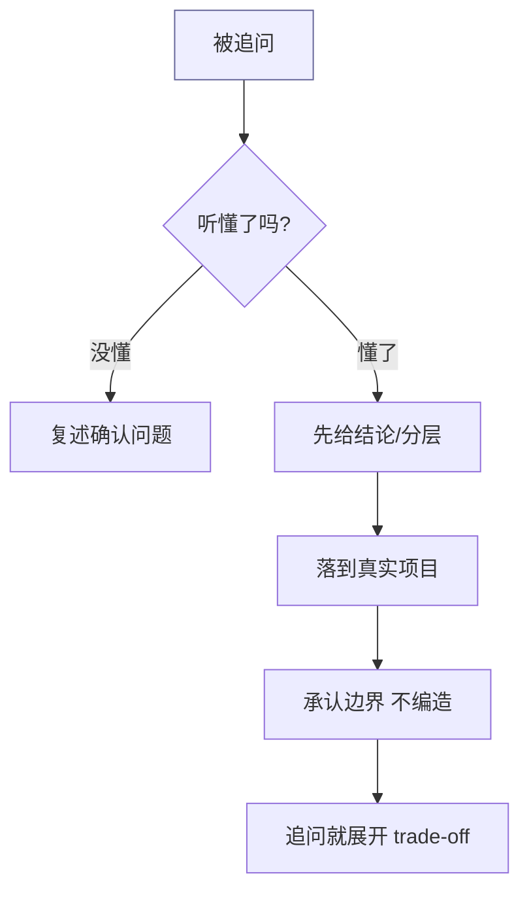
```mermaid
flowchart TD
    Q[被追问] --> C{听懂了吗?}
    C -->|没懂| A[复述确认问题]
    C -->|懂了| S[先给结论/分层]
    S --> P[落到真实项目]
    P --> E[承认边界 不编造]
    E --> D[追问就展开 trade-off]
    style Q fill:#eef,stroke:#669
```

---

## 一、幂等性

**问题**：MQ 重复消费、网关重试、前端重复点击，你怎么保证只生效一次？
- **考察点**：是否真正理解幂等=安全的重复处理，而非"只处理一次"。
- **回答思路**：① 先分类触发源（用户重复提交/网络重试/MQ at-least-once）；② 给方案分层——**去重表/唯一索引**（订单号+业务类型）、**状态机**（已支付不再处理）、**Token+Redis**（按钮防重点）、**乐观锁版本号**；③ 落到支付：支付回调用"渠道流水号+本地支付单号"做唯一约束，重复回调直接返回已处理。
- **易错坑**：把"幂等"等同于"拦截第一次之后的"——其实核心是不管来几次结果一致；忽略消费端幂等导致最终一致方案失效。

**幂等性方案选择决策图**：

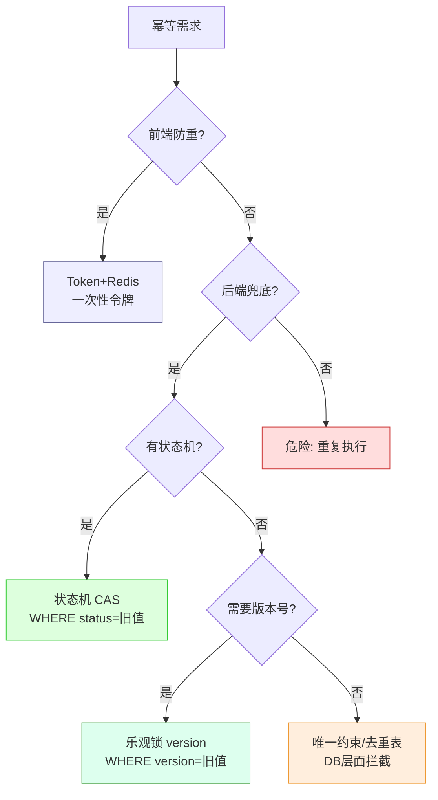
```mermaid
flowchart TD
    START["幂等需求"] --> Q1{"前端防重?"}
    Q1 -- 是 --> TOKEN["Token+Redis<br/>一次性令牌"]
    Q1 -- 否 --> Q2{"后端兜底?"}
    Q2 -- 是 --> Q3{"有状态机?"}
    Q3 -- 是 --> CAS["状态机 CAS<br/>WHERE status=旧值"]
    Q3 -- 否 --> Q4{"需要版本号?"}
    Q4 -- 是 --> VER["乐观锁 version<br/>WHERE version=旧值"]
    Q4 -- 否 --> UK["唯一约束/去重表<br/>DB层面拦截"]
    Q2 -- 否 --> DANG["危险: 重复执行"]
    style TOKEN fill:#eef,stroke:#669
    style CAS fill:#dfd,stroke:#3c3
    style VER fill:#dfe,stroke:#393
    style UK fill:#fed,stroke:#e93
    style DANG fill:#fdd,stroke:#c33
```

**STAR 回答模板（幂等性）**：
```text
S (Situation): 支付渠道回调可能因网络重试重复到达，重复入账会导致资损
T (Task): 需要保证同一笔回调只生效一次
A (Action): 三层幂等——① DB唯一约束(渠道流水号+支付单号)
           ② 状态机CAS(只有PENDING→SUCCESS才更新)
           ③ MQ消费端幂等(状态机+唯一约束双兜底)
R (Result): XTransfer超1000w笔结算0资损，重复回调命中终态直接忽略
```

**追问**：如果唯一键冲突了但旧记录状态是"处理中"怎么办？
- **思路**：状态机要支持"处理中→成功/失败"的幂等收敛；冲突时查旧记录状态，已终态直接返回，未终态要设计补偿/查询渠道确认（主动查单）。

> **【深度拓展与项目支撑】**（幂等性）幂等的本质是「重复安全地被忽略」，不是「只处理第一次」。分层：唯一索引/防重表兜底、状态机语义层兜底、Token 防前端、乐观锁版本号。最易漏的是「消费端幂等」——没有它，事务消息/Saga 最终一致无法收敛。追问「唯一键冲突但旧记录处理中」的答案是：状态机支持「处理中→终态」收敛，冲突时查旧状态，未终态则主动查单确认。
> **项目支撑**：XTransfer 用「渠道流水号 + 收款单号」唯一约束 + 状态机 CAS 更新双兜底；哈啰 Kafka 消费心跳用「同车辆同窗口去重键」保证幂等；欧凡优惠券「用户+活动」唯一约束防重复领。
>
> **【面试官追问 · 逃生路线图】** 如果被问到幂等实现细节答不上来：
> ```text
> 不会答时 → 别硬编，按这个路线圆回来：
> ① "我理解幂等的核心是 f(f(x))=f(x)" → 先给定义锚定
> ② "最简单的实现是数据库唯一约束" → 给最基础方案
> ③ "我们在支付里用状态机CAS做兜底" → 拉回项目
> ④ "细节我可以回去查证补充" → 承认边界
> ```
> **【项目支撑】** AI模拟追问方法：把幂等场景喂给 LLM 让它扮演面试官不断追问，训练自己「被追问时的反应框架」。关键不是背答案，而是训练「确认问题→分层给方案→落到项目→承认边界」的反应习惯。

## 二、分布式事务最终一致性

**问题**：你用 TCC/Saga/事务消息，怎么保证最终一致？中途失败了呢？
- **考察点**：对"最终"二字的理解——失败、超时、消息丢失怎么兜底。
- **回答思路**：① 强调"最终一致靠重试+对账兜底，不是靠一次成功"；② TCC：Confirm 失败**重试至成功+告警+人工**；Cancel 同理；空回滚/防悬挂/幂等三问题必须处理；③ 事务消息：半消息+回查+消费幂等；④ **离线对账**是最后兜底（差异告警+人工调账）。
- **易错坑**：以为发 MQ 就一致了；没做消费幂等；Confirm 失败只重试不管最终人工。

**分布式事务最终一致收敛流程图**：

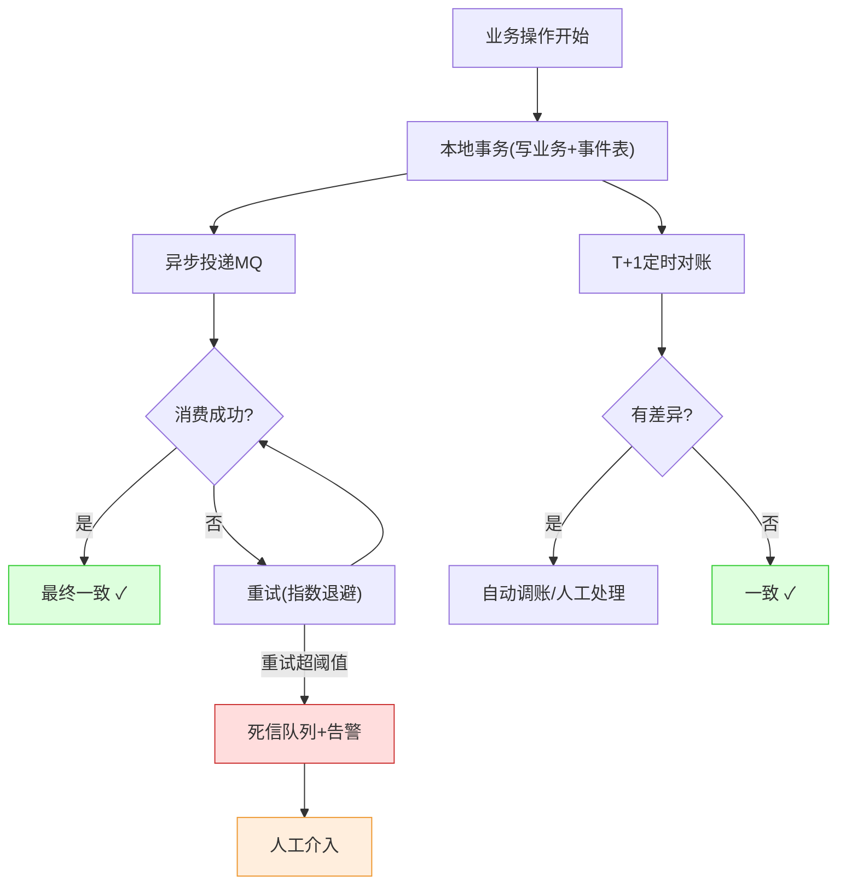
```mermaid
flowchart TD
    START["业务操作开始"] --> STEP1["本地事务(写业务+事件表)"]
    STEP1 --> STEP2["异步投递MQ"]
    STEP2 --> STEP3{"消费成功?"}
    STEP3 -- 是 --> DONE["最终一致 ✓"]
    STEP3 -- 否 --> RETRY["重试(指数退避)"]
    RETRY --> STEP3
    RETRY -->|"重试超阈值"| DLQ["死信队列+告警"]
    DLQ --> MANUAL["人工介入"]
    STEP1 --> RECON["T+1定时对账"]
    RECON --> DIFF{"有差异?"}
    DIFF -- 是 --> FIX["自动调账/人工处理"]
    DIFF -- 否 --> OK["一致 ✓"]
    style DONE fill:#dfd,stroke:#3c3
    style OK fill:#dfd,stroke:#3c3
    style DLQ fill:#fdd,stroke:#c33
    style MANUAL fill:#fed,stroke:#e93
```

**STAR 回答模板（分布式事务最终一致）**：
```text
S: 跨境收款涉及风控/申报/账务多服务，渠道回调时间不确定
T: 需要保证跨服务最终一致，不能锁太久影响可用性
A: ① 选Saga而非2PC(避免长时间阻塞)
   ② 状态机+任务补偿(每个步骤有补偿动作)
   ③ 消费端幂等(唯一约束+状态机CAS)
   ④ T+1对账兜底(差异自动分类→差错队列)
   ⑤ 补偿失败死信转人工+资金安全告警
R: 0资损,超1000w笔结算,可用性不受影响
```

**追问**：空回滚和防悬挂具体怎么实现？
- **思路**：Try 执行前先记"事务状态表"；Cancel 先查状态表，若没有 Try 记录说明是空回滚，记"已回滚"直接返回；防悬挂靠"若已回滚则 Try 必须失败"，用状态机互斥。

> **【深度拓展与项目支撑】**（分布式事务最终一致）「最终」二字靠「重试 + 对账兜底」，不是一次成功。TCC 的 Confirm/Cancel 失败要重试至成功 + 告警 + 人工；空回滚/防悬挂靠「事务状态表 + 状态机互斥」。追问「空回滚/防悬挂实现」：Try 前记状态表，Cancel 先查，无 Try 记录即空回滚记「已回滚」，防悬挂靠「已回滚则 Try 必须失败」。
> **项目支撑**：XTransfer 主选「状态机 + 任务补偿（Saga）」而非 2PC/TCC 全量——收款跨风控/申报/账务且渠道回调晚，强一致锁太久不可用；补偿失败死信转人工 + 资金安全告警，绝不静默；T+1 对账是最后兜底。
>
> **【面试官追问 · 逃生路线图】** 如果被问到 TCC 三问题细节答不上来：
> ```text
> 不会答时 → 按这个路线圆回来：
> ① "最终一致的核心是重试+对账兜底" → 先给大框架
> ② "我项目里主要用Saga而非TCC" → 拉回自己熟悉的
> ③ "TCC的空回滚我理解是Try没到Cancel先到" → 给理解框架
> ④ "具体实现细节我可以回去查证" → 承认边界
> ```

## 三、缓存三连（穿透/击穿/雪崩）

**问题**：缓存和 DB 不一致、缓存打挂了，你怎么设计？
- **考察点**：三者的区分与对应解法，以及多级缓存思维。
- **回答思路**：穿透→布隆过滤器+缓存空值；击穿→互斥重建（双检锁/Redisson lock）+逻辑过期；雪崩→过期打散+多级缓存+Redis Cluster 高可用+熔断兜底。一致性：更新时"先更新 DB 再删缓存（Cache-Aside）"，删除失败用 binlog/消息重试；读多写少用 Cache-Aside，写多可读写穿透/双写。
- **易错坑**：把三者混为一谈；先删缓存再更 DB 导致并发脏读；忽略"删缓存失败"要有补偿。

**缓存三连与一致性全景图解**：

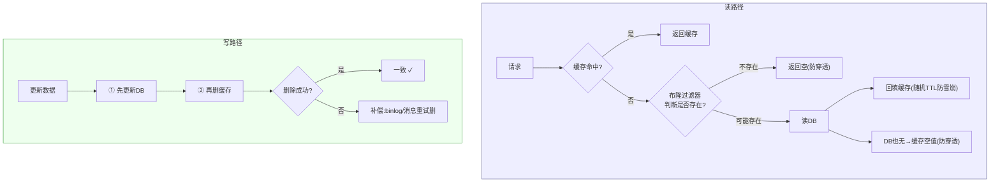
```mermaid
flowchart TD
    subgraph 读路径["读路径"]
        REQ["请求"] --> CACHE{"缓存命中?"}
        CACHE -- 是 --> RET1["返回缓存"]
        CACHE -- 否 --> BF{"布隆过滤器<br/>判断是否存在?"}
        BF -- 不存在 --> EMPTY["返回空(防穿透)"]
        BF -- 可能存在 --> DB_READ["读DB"]
        DB_READ --> FILL["回填缓存(随机TTL防雪崩)"]
        DB_READ --> MISS["DB也无→缓存空值(防穿透)"]
    end
    subgraph 写路径["写路径"]
        WRITE["更新数据"] --> UPD_DB["① 先更新DB"]
        UPD_DB --> DEL_CACHE["② 再删缓存"]
        DEL_CACHE --> SUCC{"删除成功?"}
        SUCC -- 是 --> DONE["一致 ✓"]
        SUCC -- 否 --> COMP["补偿:binlog/消息重试删"]
    end
    style 读路径 fill:#eef,stroke:#669
    style 写路径 fill:#efe,stroke:#393
```

**STAR 回答模板（缓存三连）**：
```text
S: 欧凡直播大促,热点商品QPS激增,Redis可能被打挂
T: 设计多级缓存+防护方案,保证p99<200ms
A: ① 穿透:布隆过滤器+缓存空值
   ② 击穿:热点key互斥重建(Caffeine+Redisson lock)
   ③ 雪崩:过期时间打散+多级缓存(Caffeine→Redis→DB)
   ④ 一致性:先更DB再删缓存+binlog(Canal)补偿删
R: 大促核心接口p99<200ms,0次雪崩事故
```

**追问**：Cache-Aside 为什么是"先更 DB 再删缓存"而不是反过来？
- **思路**：先删缓存→更新 DB 间隙，并发读把旧值回填缓存，脏数据长期存在；先更 DB 再删缓存，即使删失败，下次读也会因缓存无而回源（短暂脏，可接受），且可用消息补偿删除。

> **【深度拓展与项目支撑】**（缓存三连）穿透/击穿/雪崩要区分解法：穿透→布隆+空值；击穿→互斥重建/逻辑过期；雪崩→过期打散+多级缓存+集群高可用。Cache-Aside 必须「先更 DB 再删缓存」，删失败用 binlog/消息补偿。追问「为什么先更 DB」：先删缓存→更 DB 间隙并发读回填旧值，脏数据长期存在；反之即使删失败也只在短暂脏读后回源。
> **项目支撑**：欧凡「延迟双写 + Caffeine 二级 + 热点识别」是缓存三连 + 多级缓存标准解法（大促 p99<200ms）；XTransfer 读模型走 CQRS，写后发领域事件更新读模型，binlog/Outbox 保证事件不丢，和「删缓存失败用补偿」同源。
>
> **【面试官追问 · 逃生路线图】** 如果被追问缓存一致性细节：
> ```text
> 不会答时 → 按这个路线圆回来：
> ① "缓存三连核心是区分成因" → 先给框架
> ② "穿透用布隆,击穿用互斥,雪崩用打散" → 三句话覆盖
> ③ "一致性我们用先更DB再删缓存+Canal补偿" → 拉回项目
> ④ "极端并发下的残留窗口我可以回去画图分析" → 承认边界
> ```

## 四、限流算法选型

**问题**：漏桶和令牌桶怎么选？集群限流怎么做？
- **考察点**：算法本质差异与分布式实现。
- **回答思路**：漏桶=恒定速率流出（平滑、不允许突发，保护下游）；令牌桶=匀速发令牌、桶可积攒（允许突发、应对瞬时流量）。支付渠道调用多用令牌桶（应对用户集中支付高峰）。集群限流：Redis + Lua 原子计数（滑动窗口/令牌），或用网关（Sentinel/Gateway）统一限流。
- **易错坑**：单机限流在集群下总量不可控；令牌桶突发可能打垮下游→配合熔断。

**限流算法对比与选型决策图**：

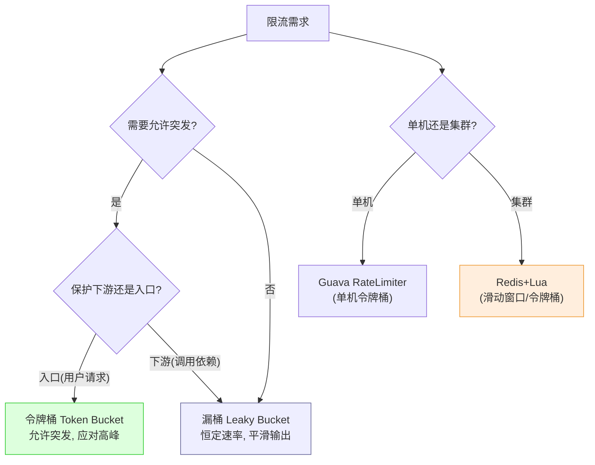
```mermaid
flowchart TD
    START["限流需求"] --> Q1{"需要允许突发?"}
    Q1 -- 是 --> Q2{"保护下游还是入口?"}
    Q1 -- 否 --> LB["漏桶 Leaky Bucket<br/>恒定速率, 平滑输出"]
    Q2 -- 入口(用户请求) --> TB["令牌桶 Token Bucket<br/>允许突发, 应对高峰"]
    Q2 -- 下游(调用依赖) --> LB
    START --> Q3{"单机还是集群?"}
    Q3 -- 单机 --> LOCAL["Guava RateLimiter<br/>(单机令牌桶)"]
    Q3 -- 集群 --> REDIS["Redis+Lua<br/>(滑动窗口/令牌桶)"]
    style TB fill:#dfd,stroke:#3c3
    style LB fill:#eef,stroke:#669
    style REDIS fill:#fed,stroke:#e93
```

**集群限流 Redis+Lua 代码示例**：

```lua
-- 滑动窗口限流: zset 存请求时间戳
local key = KEYS[1]
local now = tonumber(ARGV[1])
local window = tonumber(ARGV[2])  -- 窗口大小(ms)
local limit = tonumber(ARGV[3])   -- 最大请求数

redis.call('ZREMRANGEBYSCORE', key, 0, now - window)  -- 清窗口外
local count = redis.call('ZCARD', key)
if count >= limit then return 0 end  -- 限流

redis.call('ZADD', key, now, now .. math.random())
redis.call('PEXPIRE', key, window)
return 1  -- 放行
```

**STAR 回答模板（限流选型）**：
```text
S: 支付渠道在高峰期被大量并发调用,需要保护合作方渠道不被打爆
T: 设计限流策略,既允许合理突发又不打垮下游
A: ① 按渠道维度令牌桶限流(允许集中支付突发)
   ② 集群限流用Redis+Lua保证原子(滑动窗口zset)
   ③ 配合熔断(错误率超阈值快速失败)
R: 高峰期渠道成功率稳定,无因过载被渠道熔断
```

**追问**：滑动窗口怎么用 Redis 实现且原子？
- **思路**：zset 存请求时间戳，窗口外删除+计数；用 Lua 脚本保证"删+加+数"原子，避免并发多记；或 Redis 计数器+过期做固定窗口（简单但边界突刺）。

> **【深度拓展与项目支撑】**（限流算法选型）漏桶恒定速率（平滑、保护下游、不允许突发），令牌桶可积攒（允许突发、应对瞬时高峰）。支付渠道调用多用令牌桶应对集中支付。集群限流用 Redis+Lua 原子计数（zset 存时间戳窗口），或网关 Sentinel/Gateway 统一限流。追问「滑窗 Redis 原子实现」：zset 删窗外出+加+数用 Lua 保证原子，避免并发多记。
> **项目支撑**：XTransfer 支付网关按渠道限流（令牌桶应对支付高峰），内部 Dubbo 配熔断降级；欧凡大促用限流 + Caffeine 二级缓存 + 熔断兜底，商品接口 p99<200ms。

## 五、熔断 vs 降级

**问题**：熔断和降级是一回事吗？什么时候触发？
- **考察点**：概念边界与配合。
- **回答思路**：熔断=依赖故障率超阈值后**快速失败**避免雪崩（Closed/Open/Half-Open，半开探测恢复）；降级=系统压力大时**关闭非核心功能**保主链路（返回兜底/默认值）。关系：熔断是"依赖不可用"的应对，降级是"资源不够"的应对，二者常配合（熔断后走降级逻辑）。
- **易错坑**：认为降级=返回错误；降级应返回**有损但可用**的兜底；熔断阈值拍脑袋（应基于错误率+响应时间+最小请求数）。

**熔断降级配合流程图**：

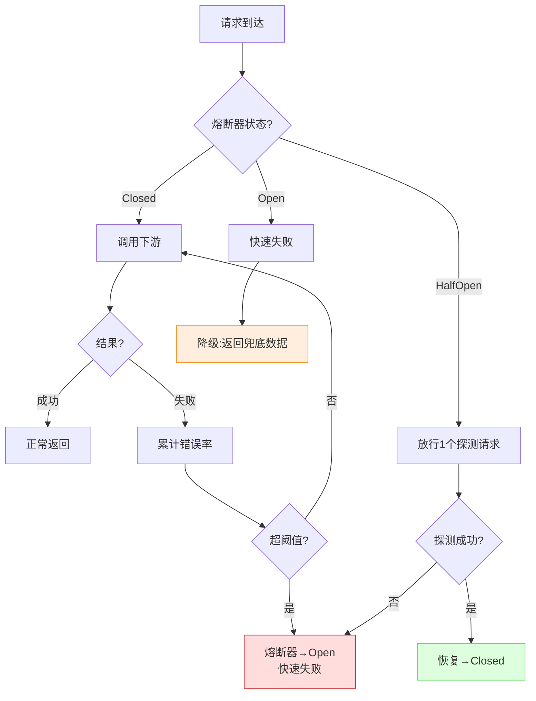
```mermaid
flowchart TD
    REQ["请求到达"] --> CB{"熔断器状态?"}
    CB -- Closed --> CALL["调用下游"]
    CALL --> RESULT{"结果?"}
    RESULT -- 成功 --> OK["正常返回"]
    RESULT -- 失败 --> ERR_COUNT["累计错误率"]
    ERR_COUNT --> THRESH{"超阈值?"}
    THRESH -- 是 --> OPEN["熔断器→Open<br/>快速失败"]
    THRESH -- 否 --> CALL
    CB -- Open --> FAST["快速失败"]
    FAST --> DEGRADE["降级:返回兜底数据"]
    CB -- HalfOpen --> PROBE["放行1个探测请求"]
    PROBE --> PROBE_R{"探测成功?"}
    PROBE_R -- 是 --> CLOSED["恢复→Closed"]
    PROBE_R -- 否 --> OPEN
    style OPEN fill:#fdd,stroke:#c33
    style DEGRADE fill:#fed,stroke:#e93
    style CLOSED fill:#dfd,stroke:#3c3
```

**STAR 回答模板（熔断降级）**：
```text
S: 支付核心链路依赖多个内部服务,某服务故障可能引发雪崩
T: 设计熔断降级策略,保证核心链路可用
A: ① Dubbo调用配熔断(错误率>50%持续10s→Open)
   ② 熔断后降级:非核心返回兜底,核心走补偿
   ③ HalfOpen放行1个探测,成功恢复Closed
   ④ 阈值基于错误率+响应时间+最小请求数(非拍脑袋)
R: 某次渠道故障,熔断降级保护了核心交易链路,无雪崩
```

> **【深度拓展与项目支撑】**（熔断 vs 降级）熔断是「依赖故障率超阈值快速失败」（Closed/Open/Half-Open 半开探测恢复），降级是「资源不够时关非核心保主链路（返回有损但可用的兜底）」。熔断后常走降级逻辑。阈值不能拍脑袋——基于错误率 + 响应时间 + 最小请求数。
> **项目支撑**：XTransfer 内部 Dubbo 调用配熔断降级；资金安全 BCP 告警是熔断/降级的监控延伸。欧凡大促熔断兜底返回兜底数据、限流保护 Redis，分层防护：网关限流→熔断→多级缓存→DB。

## 六、CAP 取舍

**问题**：支付系统你选 CP 还是 AP？凭什么？
- **考察点**：能否按业务分层决策，而非一刀切。
- **回答思路**：**核心账务/交易/扣款=CP**（钱不能错，用强一致+分布式事务）；**渠道对账/通知/积分/营销=AP**（可用优先，最终一致）。同一系统不同模块不同取舍，这就是 BASE 实践。
- **易错坑**：回答"全部 CP"（可用性差、用户体验崩）或"全部 AP"（钱错）。

**CAP 分层决策图**：

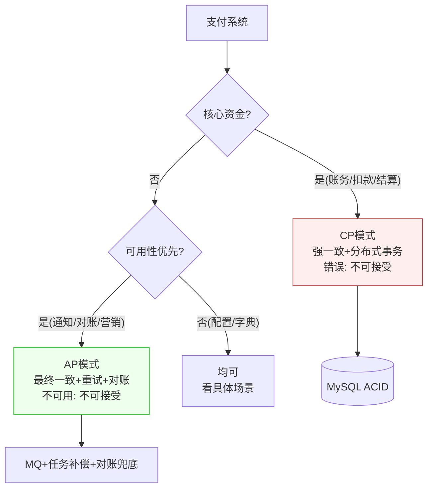
```mermaid
flowchart TD
    SYS["支付系统"] --> CP{"核心资金?"}
    CP -- "是(账务/扣款/结算)" --> CP_MODE["CP模式<br/>强一致+分布式事务<br/>错误: 不可接受"]
    CP -- "否" --> AP{"可用性优先?"}
    AP -- "是(通知/对账/营销)" --> AP_MODE["AP模式<br/>最终一致+重试+对账<br/>不可用: 不可接受"]
    AP -- "否(配置/字典)" --> EITHER["均可<br/>看具体场景"]
    CP_MODE --> DB[("MySQL ACID")]
    AP_MODE --> MQ["MQ+任务补偿+对账兜底"]
    style CP_MODE fill:#fee,stroke:#c33
    style AP_MODE fill:#efe,stroke:#3c3
```

**STAR 回答模板（CAP 取舍）**：
```text
S: 跨境支付系统涉及账务/对账/通知等多模块,一致性需求不同
T: 按模块分层决策CP/AP,不能一刀切
A: ① 核心账务/扣款→CP(强一致+复式记账+分布式事务)
   ② 渠道对账/通知/申报→AP(最终一致+任务补偿+T+1对账)
   ③ AP的风险用"最终一致+对账兜底"压到可接受
R: 0资损(CP保证钱不错),高可用(AP保证非核心不拖垮主链路)
```

> **【深度拓展与项目支撑】**（CAP 取舍）核心账务/交易/扣款 = CP（钱不能错，强一致+分布式事务）；渠道对账/通知/积分 = AP（可用优先，最终一致）。同一系统按模块分层，这正是 BASE 实践。追问「全 CP 或全 AP」都不对：全 CP 可用性崩、全 AP 钱错。
> **项目支撑**：XTransfer 账务/扣款 CP + 复式记账；渠道回调、风控通知、申报 AP 最终一致，靠任务补偿 + T+1 对账收敛，做到 0 资损。这是分层 CAP 取舍的真实样本。
>
> **【面试官追问 · 逃生路线图】** 如果被问到 CP/AP 细节：
> ```text
> 不会答时 → 按这个路线圆回来：
> ① "CAP核心是分区时选一致还是可用" → 先给定义
> ② "我项目按模块分层:核心CP,非核心AP" → 拉回项目
> ③ "AP的风险用对账兜底" → 给工程解法
> ④ "具体哪些模块走CP我可以展开讲" → 主动引导
> ```

## 七、分库分表后查询

**问题**：水平分表后，按非分片键怎么查？深分页怎么办？
- **思路**：① 冗余（异构索引表/ES）按查询维度再分；② 基因法（分片键里带查询维度，如用户 id 含地区基因）；③ 广播表/全局表（小字典）；④ 跨片聚合在应用层或 OLAP。深分页：游标/延迟关联（先查 id 再 JOIN）/最大 id 翻页。
- **易错坑**：用 offset 深翻（每页都扫前面所有）；跨片全表扫。

---

> **【深度拓展与项目支撑】**（分库分表后查询）非分片键查询靠：① 冗余异构索引表/ES；② 基因法（分片键带查询维度）；③ 广播/全局表；④ 跨片聚合在应用层或 OLAP。深分页用游标/延迟关联/最大 id 翻页，别用 offset（每页扫前面所有）。追问「跨片全表扫」要禁止。
> **项目支撑**：哈啰工单按创建时间分表，少数按车辆 ID 的查询走异构索引表或数仓；冷数据进数仓、主库只留热数据、读写分离。XTransfer 分片键选高频查询维度，低频维度走读模型/ES。

## 八、MQ 不丢不重不乱序

**问题**：怎么保证消息可靠？exactly-once 真能做到吗？
- **思路**：不丢——生产者 acks=all+重试、Broker 副本、消费者**先处理再提交 offset（或事务消息）**；不重——消费幂等（见幂等节）；不乱序——单分区有序、或业务键路由同分区。exactly-once：**端到端很难真正一次**，工程上用"at-least-once + 幂等"近似等价；Kafka 的事务/幂等生产者只保单分区内不重不丢，跨系统仍需消费幂等。
- **易错坑**：以为 Kafka 开了 exactly-once 就全局一次；先提交 offset 再处理导致丢。

**MQ 可靠性保障全景图**：

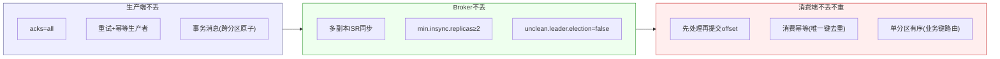
```mermaid
flowchart LR
    subgraph 生产端["生产端不丢"]
        P1["acks=all"]
        P2["重试+幂等生产者"]
        P3["事务消息(跨分区原子)"]
    end
    subgraph Broker端["Broker不丢"]
        B1["多副本ISR同步"]
        B2["min.insync.replicas≥2"]
        B3["unclean.leader.election=false"]
    end
    subgraph 消费端["消费端不丢不重"]
        C1["先处理再提交offset"]
        C2["消费幂等(唯一键去重)"]
        C3["单分区有序(业务键路由)"]
    end
    生产端 --> Broker端 --> 消费端
    style 生产端 fill:#eef,stroke:#669
    style Broker端 fill:#efe,stroke:#393
    style 消费端 fill:#fee,stroke:#c33
```

**STAR 回答模板（MQ 不丢不重不乱序）**：
```text
S: 支付领域事件驱动状态流转,MQ消息丢失/重复会导致资损
T: 保证消息不丢不重不乱序
A: ① 生产端:Outbox模式(本地事务写业务+事件表)保证不丢
   ② Broker:多副本+min.insync.replicas=2
   ③ 消费端:先处理再提交offset+状态机幂等
   ④ 不乱序:同一业务键路由同一分区
R: 超1000w笔事件驱动流转,0消息丢失,0重复入账
```

> **【深度拓展与项目支撑】**（MQ 不丢不重不乱序）不丢：生产者 acks=all+重试、Broker 副本、消费者先处理再提交 offset（或事务消息）；不重：消费幂等；不乱序：单分区有序或业务键同分区。exactly-once 端到端难，工程用 at-least-once + 幂等近似。追问「先提交 offset 再处理会丢」是经典坑。
> **项目支撑**：XTransfer 用 MQ 领域事件驱动状态流转，Outbox 模式（本地事务写业务+事件表，异步投递）保证事件不丢，消费端状态机+唯一约束保证幂等，最终一致靠重试+对账收敛。哈啰 Kafka 消费心跳做工单补偿，幂等+周期回扫补触发。

## 九、并发安全的 HashMap

**问题**：HashMap 并发会怎样？ConcurrentHashMap 怎么做的？
- **思路**：1.7 头插+扩容成环（死循环）、数据覆盖；1.8 尾插无环但仍数据竞争。ConcurrentHashMap 1.8 用 Node + **CAS 初始化 + synchronized 锁头节点 + volatile 读**，分段更细；size 用 baseCount+CounterCell。读几乎无锁。
- **易错坑**：说"HashMap 线程安全因为 1.8 尾插"——错，尾插只是不死循环，仍不安全。

**ConcurrentHashMap 1.8 结构与并发控制图**：

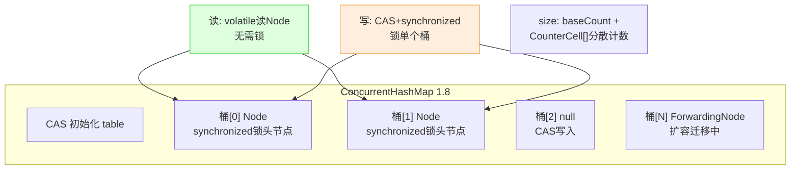
```mermaid
graph TD
    subgraph CHM["ConcurrentHashMap 1.8"]
        INIT["CAS 初始化 table"]
        B1["桶[0] Node<br/>synchronized锁头节点"]
        B2["桶[1] Node<br/>synchronized锁头节点"]
        B3["桶[2] null<br/>CAS写入"]
        B4["桶[N] ForwardingNode<br/>扩容迁移中"]
    end
    READ["读: volatile读Node<br/>无需锁"] --> B1
    READ --> B2
    WRITE["写: CAS+synchronized<br/>锁单个桶"] --> B1
    WRITE --> B2
    SIZE["size: baseCount +<br/>CounterCell[]分散计数"]
    style READ fill:#dfd,stroke:#3c3
    style WRITE fill:#fed,stroke:#e93
```

> **【深度拓展与项目支撑】**（并发安全的 HashMap）1.7 头插成环死循环、数据覆盖；1.8 尾插无环但仍数据竞争。ConcurrentHashMap 1.8 用 Node + CAS 初始化 + synchronized 锁头节点 + volatile 读，size 用 baseCount+CounterCell，读几乎无锁。易错坑：「1.8 尾插就线程安全」是错的，尾插只是不死循环，仍不安全。
> **项目支撑**：XTransfer 任务补偿调度、哈啰薪资批处理都用线程池并发，但共享状态（任务状态、计算中间结果）都走线程安全结构或数据库乐观锁/CAS，绝不在 HashMap 上并发读写。

## 十、线程池参数

**问题**：核心线程数怎么定？队列选哪个？拒绝策略选哪个？
- **思路**：CPU 密集≈N+1，IO 密集≈2N 或按 并发/（1-利用率）估算，结合压测；队列：IO 密集用有界队列防 OOM，配合理拒绝；拒绝：默认 Abort 抛（明确失败），或 CallerRuns 反向压背保护（让调用方自己跑，天然限流），看业务（支付核心用 CallerRuns 比丢请求好，但会拖慢上游）。监控队列堆积、活跃线程、拒绝数。
- **易错坑**：用 Executors.newFixedThreadPool（无界队列 OOM）；核心数拍脑袋；不监控。

**线程池参数选型决策图**：

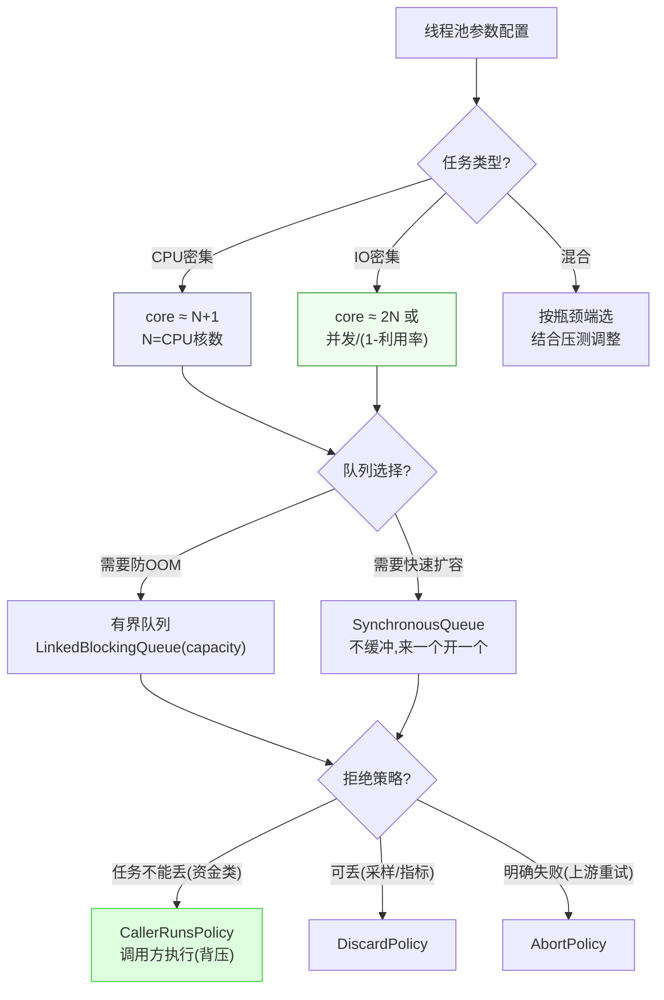
```mermaid
flowchart TD
    START["线程池参数配置"] --> TYPE{"任务类型?"}
    TYPE -- "CPU密集" --> CPU["core ≈ N+1<br/>N=CPU核数"]
    TYPE -- "IO密集" --> IO["core ≈ 2N 或<br/>并发/(1-利用率)"]
    TYPE -- "混合" --> MIX["按瓶颈端选<br/>结合压测调整"]
    CPU --> Q1{"队列选择?"}
    IO --> Q1
    Q1 -- "需要防OOM" --> BOUND["有界队列<br/>LinkedBlockingQueue(capacity)"]
    Q1 -- "需要快速扩容" --> SYNC["SynchronousQueue<br/>不缓冲,来一个开一个"]
    BOUND --> Q2{"拒绝策略?"}
    SYNC --> Q2
    Q2 -- "任务不能丢(资金类)" --> CR["CallerRunsPolicy<br/>调用方执行(背压)"]
    Q2 -- "可丢(采样/指标)" --> DISCARD["DiscardPolicy"]
    Q2 -- "明确失败(上游重试)" --> ABORT["AbortPolicy"]
    style CPU fill:#eef,stroke:#669
    style IO fill:#efe,stroke:#393
    style CR fill:#dfd,stroke:#3c3
```

**线程池监控配置示例**：

```java
ThreadPoolExecutor pool = new ThreadPoolExecutor(
    corePoolSize, maxPoolSize, keepAliveTime, TimeUnit.SECONDS,
    new LinkedBlockingQueue<>(1000),
    new ThreadFactoryBuilder().setNameFormat("pay-callback-%d").build(),
    new ThreadPoolExecutor.CallerRunsPolicy()
);

// 监控指标(定时上报)
Metrics.gauge("pool.active", pool.getActiveCount());
Metrics.gauge("pool.queue.size", pool.getQueue().size());
Metrics.gauge("pool.queue.remaining", pool.getQueue().remainingCapacity());
Metrics.counter("pool.rejected", rejectedCount.get());
// 告警: 队列使用率>80% 或 拒绝数>0
```

**STAR 回答模板（线程池参数）**：
```text
S: 支付回调处理需要并发调风控/账务,线程池配置不当导致OOM或回调堆积
T: 合理配置线程池,保证回调及时处理且不OOM
A: ① IO密集→core≈2N,有界队列(1000)防OOM
   ② 拒绝策略用CallerRuns(资金任务不能丢)
   ③ 监控队列堆积/活跃线程/拒绝数
   ④ 队列满时落库兜底(补偿框架重跑)
R: 回调p99<500ms,0次OOM,0次任务丢失
```

> **【深度拓展与项目支撑】**（线程池参数）核心数：CPU 密集 ≈ N+1，IO 密集 ≈ 2N 或按 并发/(1-利用率)，结合压测。队列：IO 密集用有界队列防 OOM，配合理拒绝。拒绝：默认 Abort 抛，或 CallerRuns 反向压背（支付核心用 CallerRuns 比丢请求好，但拖慢上游）。务必监控堆积/活跃/拒绝。
> **项目支撑**：XTransfer 任务补偿框架、哈啰薪资批处理都用有界队列 + CallerRuns（不丢补偿/计算任务）；支付核心链路拒绝策略倾向 CallerRuns 而非丢弃，避免资金动作丢失。

## 十一、TCP 为什么三次握手

**问题**：两次不行吗？TIME_WAIT 干嘛？服务端大量 TIME_WAIT 怎么调？
- **思路**：两次无法确认**双方收发能力**且防历史连接（失效报文被当成新连接）；三次同步双方初始序号。TIME_WAIT 等 2MSL：① 保证最后的 ACK 到对端；② 让旧报文在网络消亡，不复用连接号。大量 TIME_WAIT（短连接高并发）：SO_REUSEADDR/REUSEPORT、time_wait 复用、改长连接、调 net.ipv4.tcp_tw_reuse（客户端）。
- **易错坑**：把 TIME_WAIT 当 bug 直接关（有风险）；服务端 TW 多应查是否大量主动关闭（应让客户端关）。

**TCP 连接状态与 TIME_WAIT 分析图**：

```mermaid
stateDiagram-v2
    [*] --> ESTABLISHED: 三次握手完成
    ESTABLISHED --> FIN_WAIT_1: 主动关闭(send FIN)
    FIN_WAIT_1 --> FIN_WAIT_2: 收到ACK
    FIN_WAIT_2 --> TIME_WAIT: 收到FIN,回ACK
    TIME_WAIT --> CLOSED: 等待2MSL(60s-120s)
    ESTABLISHED --> CLOSE_WAIT: 收到FIN(被动关闭)
    CLOSE_WAIT --> LAST_ACK: 发FIN
    LAST_ACK --> CLOSED: 收到ACK
    note right of TIME_WAIT: 2MSL原因:<br/>① 最后ACK可能丢,等对端重发FIN<br/>② 旧报文在此期间消亡
    note right of CLOSE_WAIT: 比TIME_WAIT更危险!<br/>代码收到FIN但没close()<br/>→ 连接泄漏
```

**TIME_WAIT 优化配置示例**：

```bash
# /etc/sysctl.conf — TIME_WAIT 优化
net.ipv4.tcp_tw_reuse = 1          # 客户端安全复用TIME_WAIT socket
net.ipv4.tcp_tw_recycle = 0        # 已废弃! NAT下会出问题
net.ipv4.tcp_fin_timeout = 30      # FIN_WAIT_2 超时(默认60s)
net.ipv4.tcp_max_tw_buckets = 5000 # TIME_WAIT 上限(防耗尽内存)
# 根治方案: 用长连接+连接池,不从源头产生大量TIME_WAIT
```

**STAR 回答模板（TCP 三次握手）**：
```text
S: 支付网关对接境外渠道,高频短连接导致大量TIME_WAIT
T: 解决端口耗尽问题,保证渠道调用稳定
A: ① 短连接改长连接+连接池(根治)
   ② 开启tcp_tw_reuse(缓解)
   ③ 服务端让客户端主动关闭(减少服务端TW)
R: TIME_WAIT从数万降到数百,渠道调用稳定
```

> **【深度拓展与项目支撑】**（TCP 三次握手）两次握手无法确认双方收发能力且防不了历史连接（失效报文当新连接）；三次同步双方初始序号。TIME_WAIT 等 2MSL：保证最后 ACK 到对端 + 让旧报文消亡。大量 TIME_WAIT（短连接高并发）：SO_REUSEADDR/REUSEPORT、改长连接、调 tcp_tw_reuse。易错坑：把 TW 当 bug 直接关有风险。
> **项目支撑**：XTransfer 支付回调/渠道调用走长连接 + 连接池降 TIME_WAIT；欧凡海外弱网用 HTTP/3/QUIC（UDP，0-RTT，解决 TCP 队头阻塞 + 移动切换重连）优化体验，与 TCP 握手思想互补。

## 十二、HTTPS 过程

**问题**：HTTPS 怎么既安全又不慢？
- **思路**：TLS 握手：客户端随机数+支持的套件→服务端证书（含公钥）+随机数→客户端验证证书（CA 链）→生成预主密钥用公钥加密→双方算对称密钥→用对称加密传数据。TLS1.3 简化为 1-RTT、0-RTT 恢复。性能：非对称只在握手用，之后对称（快）；证书校验有 OCSP 缓存。
- **易错坑**：以为全程非对称（慢）；忽略证书校验（中间人）；0-RTT 重放风险。

---

> **【深度拓展与项目支撑】**（HTTPS 过程）TLS 握手交换随机数+证书→验 CA 链→公钥加密预主密钥→双方算对称密钥→对称传数据。TLS1.3 简化 1-RTT、0-RTT 恢复。性能：非对称只在握手用，之后对称（快）；证书校验有 OCSP 缓存。易错坑：以为全程非对称（慢）；忽略 0-RTT 重放风险。
> **项目支撑**：XTransfer 渠道回调/支付接口强制 TLS + 验签（HMAC/证书）防篡改；欧凡活动/优惠券接口用「签名防篡改（HMAC）」保护参数（防改金额/中奖），与 HTTPS 互为纵深。

## 十三、Spring 循环依赖与事务

**问题**：为什么构造器注入循环依赖报错，字段注入不报？
- **思路**：字段/setter 注入时 Spring 在"属性填充"阶段通过三级缓存提前暴露半成品对象，能闭环；构造器注入在"实例化"阶段就要完整依赖，互相拿不到→抛 BeanCurrentlyInCreationException。原型（prototype）_scope 也无法解决（无缓存）。
- **易错坑**：现场改构造器注入后启动报错，不知道原因；用 @Async/@Transactional 类上循环依赖失败（代理生成时机）。

**Spring 三级缓存解决循环依赖流程图**：

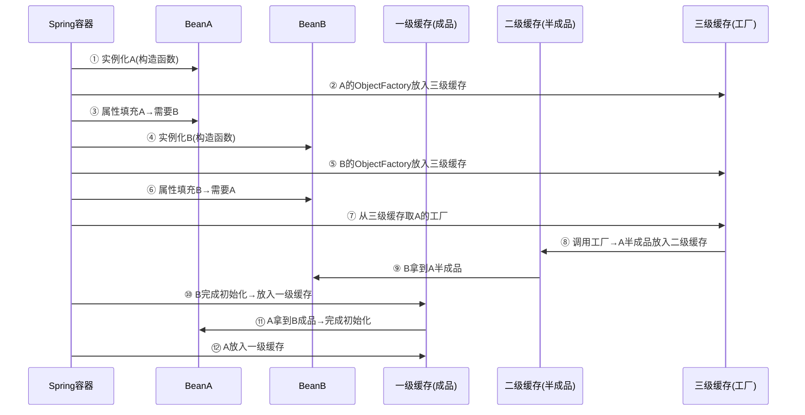
```mermaid
sequenceDiagram
    participant C as Spring容器
    participant A as BeanA
    participant B as BeanB
    participant L1 as 一级缓存(成品)
    participant L2 as 二级缓存(半成品)
    participant L3 as 三级缓存(工厂)
    C->>A: ① 实例化A(构造函数)
    C->>L3: ② A的ObjectFactory放入三级缓存
    C->>A: ③ 属性填充A→需要B
    C->>B: ④ 实例化B(构造函数)
    C->>L3: ⑤ B的ObjectFactory放入三级缓存
    C->>B: ⑥ 属性填充B→需要A
    C->>L3: ⑦ 从三级缓存取A的工厂
    L3->>L2: ⑧ 调用工厂→A半成品放入二级缓存
    L2->>B: ⑨ B拿到A半成品
    C->>L1: ⑩ B完成初始化→放入一级缓存
    L1->>A: ⑪ A拿到B成品→完成初始化
    C->>L1: ⑫ A放入一级缓存
```

**问题**：@Transactional 自调用为什么不回滚？
- **思路**：事务靠 AOP 代理，同类直接调用没走代理→没开启事务。解法：拆 Bean / 注入自己(@Lazy) / AopContext.currentProxy() / TransactionTemplate 编程式。
- **易错坑**：catch 吞异常导致不回滚；抛了受检异常（默认不回滚）；多线程里事务不共享。

**@Transactional 自调用失效与解决方案图**：

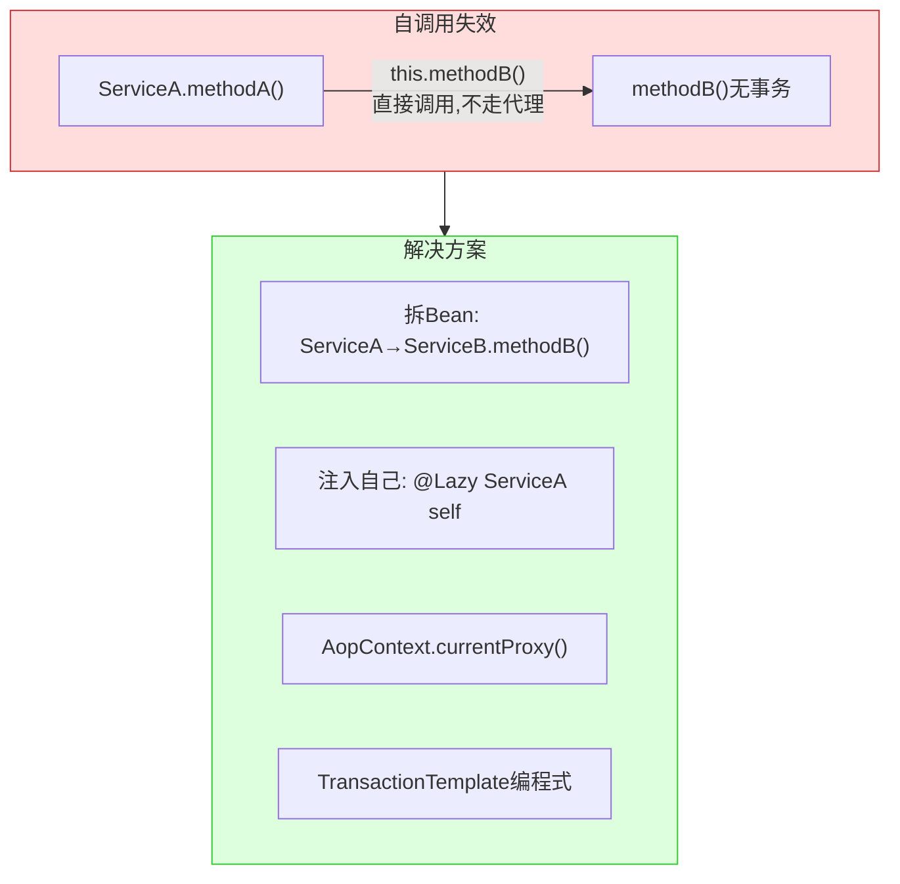
```mermaid
graph TD
    subgraph 失效["自调用失效"]
        M1["ServiceA.methodA()"] -->|"this.methodB()<br/>直接调用,不走代理"| M2["methodB()无事务"]
    end
    subgraph 解决["解决方案"]
        S1["拆Bean: ServiceA→ServiceB.methodB()"]
        S2["注入自己: @Lazy ServiceA self"]
        S3["AopContext.currentProxy()"]
        S4["TransactionTemplate编程式"]
    end
    失效 --> 解决
    style 失效 fill:#fdd,stroke:#c33
    style 解决 fill:#dfd,stroke:#3c3
```

> **【深度拓展与项目支撑】**（Spring 循环依赖与事务）字段/setter 注入靠三级缓存提前暴露半成品闭环；构造器注入在实例化阶段就要完整依赖，互相拿不到→抛异常；prototype 无缓存也无法解。@Transactional 自调用不回滚因没走 AOP 代理——解法是拆 Bean / 注入自己(@Lazy) / AopContext / TransactionTemplate。易错坑：catch 吞异常、抛受检异常默认不回滚、多线程事务不共享。
> **项目支撑**：XTransfer 六边形架构「领域层不依赖 Spring」正是 IoC/DI 极致——领域核心可脱离容器单测；AOP 做幂等/审计/事务切面；补偿任务与业务事务边界用 REQUIRED/REQUIRES_NEW 控制，避免自调用失效（拆 Bean/注入自己）。

## 十四、GC 调优

**问题**：线上 Full GC 频繁怎么排查？怎么选收集器？
- **思路**：① jstat -gcutil 看老年代/元空间是否涨、FGC 频率；② 开 HeapDumpOnOutOfMemoryError 拿 dump，MAT 找大对象/泄漏（缓存、ThreadLocal、连接）；③ 看是不是元空间满（动态类）、直接内存；④ 收集器：JDK11+ 默认 G1（可控停顿），低延迟大堆用 ZGC。调优：堆大小、MaxGCPauseMillis、Region、元空间、晋升阈值。
- **易错坑**：盲目调 -Xmx 不治本；只看 GC 日志不看业务（对象生命周期）；ZGC 不了解染色指针原理乱配。

**GC 调优排查流程图**：

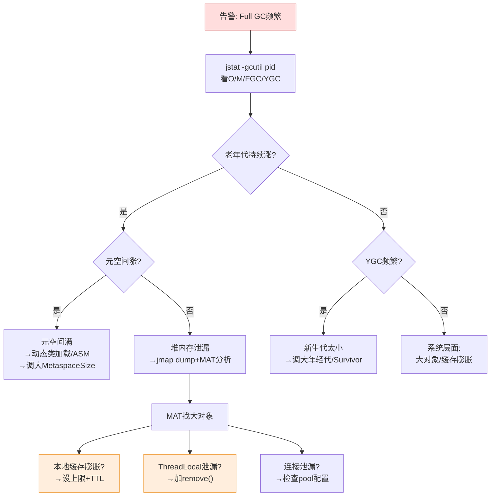
```mermaid
flowchart TD
    ALERT["告警: Full GC频繁"] --> JSTAT["jstat -gcutil pid<br/>看O/M/FGC/YGC"]
    JSTAT --> Q1{"老年代持续涨?"}
    Q1 -- "是" --> Q2{"元空间涨?"}
    Q1 -- "否" --> Q3{"YGC频繁?"}
    Q2 -- "是" --> META["元空间满<br/>→动态类加载/ASM<br/>→调大MetaspaceSize"]
    Q2 -- "否" --> HEAP["堆内存泄漏<br/>→jmap dump+MAT分析"]
    Q3 -- "是" --> YOUNG["新生代太小<br/>→调大年轻代/Survivor"]
    Q3 -- "否" --> SYS["系统层面:<br/>大对象/缓存膨胀"]
    HEAP --> FIND["MAT找大对象"]
    FIND --> CACHE["本地缓存膨胀?<br/>→设上限+TTL"]
    FIND --> TL["ThreadLocal泄漏?<br/>→加remove()"]
    FIND --> CONN["连接泄漏?<br/>→检查pool配置"]
    style ALERT fill:#fdd,stroke:#c33
    style CACHE fill:#fed,stroke:#e93
    style TL fill:#fed,stroke:#e93
```

**GC 收集器选型对比表**：

| 收集器 | 适用场景 | 停顿时间 | JDK版本 | 特点 |
|--------|---------|---------|---------|------|
| G1 | JDK9+默认,中大堆 | 100-200ms | JDK9+ | Region化,可控停顿 |
| ZGC | 大堆低延迟 | <10ms | JDK15+ | 染色指针,并发标记/转移 |
| Shenandoah | 大堆低延迟 | <10ms | JDK12+ | Brooks指针,并发压缩 |
| Parallel | 吞吐优先 | 长停顿 | JDK8默认 | 吞吐量高但停顿长 |

**STAR 回答模板（GC 调优）**：
```text
S: 支付核心服务线上Full GC频繁,影响交易响应时间
T: 排查根因并调优,消除Full GC
A: ① jstat看老年代持续涨→jmap dump+MAT分析
   ② 发现本地缓存无上限导致老年代膨胀
   ③ 缓存改Caffeine设maximumSize+TTL
   ④ 收集器G1+MaxGCPauseMillis=100ms
R: Full GC消除,交易p99恢复<200ms
```

> **【深度拓展与项目支撑】**（GC 调优）Full GC 频繁排查：jstat -gcutil 看老年代/元空间→HeapDump + MAT 找大对象/泄漏（缓存、ThreadLocal、连接）→看元空间/直接内存→收集器选型（JDK11+ G1 可控停顿，大堆低延迟 ZGC）。易错坑：盲目调 -Xmx 不治本；只看 GC 不看对象生命周期。
> **项目支撑**：XTransfer 支付核心服务 JVM 调优按「对象生命周期 + 停顿目标」选型（G1 + MaxGCPauseMillis），避免 Full GC 卡资金交易；ThreadLocal 传 traceId 全链路追踪，用完 remove 防泄漏（与 GC 排查同源）。

## 十五、锁升级

**问题**：synchronized 为什么越来越快？偏向锁有什么问题？
- **思路**：JDK6 后锁升级：无锁→偏向（同线程重入免 CAS）→轻量（CAS 自旋，短竞争）→重量（OS 互斥）。偏向锁在**高并发多线程竞争**下反而有撤销开销（批量重偏向/撤销），JDK15 起偏向锁默认禁用（因维护成本高、多数现代应用本就多线程）。
- **易错坑**：说"偏向锁总是快"——竞争下撤销更慢；不了解 JDK 版本差异。

**synchronized 锁升级与 Mark Word 变化图**：

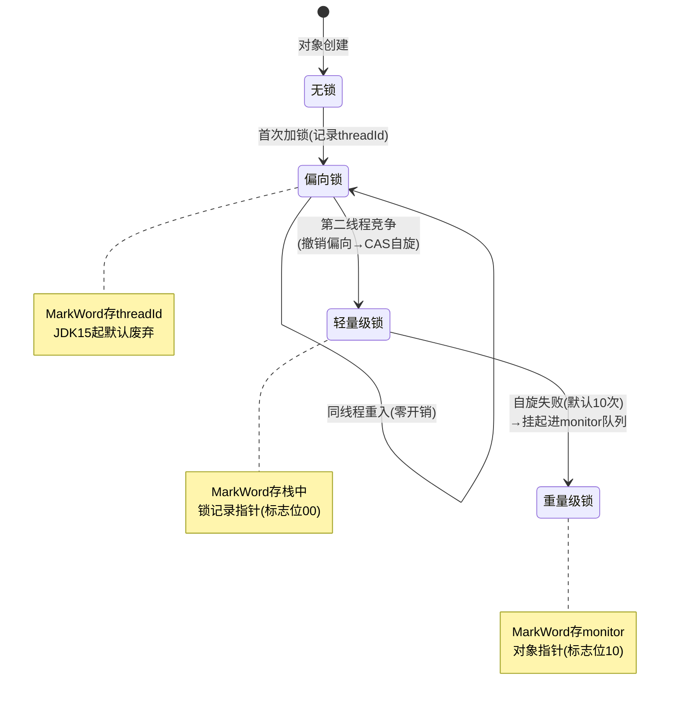
```mermaid
stateDiagram-v2
    [*] --> 无锁: 对象创建
    无锁 --> 偏向锁: 首次加锁(记录threadId)
    偏向锁 --> 偏向锁: 同线程重入(零开销)
    偏向锁 --> 轻量级锁: 第二线程竞争<br/>(撤销偏向→CAS自旋)
    轻量级锁 --> 重量级锁: 自旋失败(默认10次)<br/>→挂起进monitor队列
    note right of 偏向锁: MarkWord存threadId<br/>JDK15起默认废弃
    note right of 轻量级锁: MarkWord存栈中<br/>锁记录指针(标志位00)
    note right of 重量级锁: MarkWord存monitor<br/>对象指针(标志位10)
```

**STAR 回答模板（锁升级）**：
```text
S: 支付链路并发控制,需要理解锁机制做性能优化
T: 根据竞争程度选择合适的锁策略
A: ① 低竞争→偏向锁/轻量级锁(CAS自旋)
   ② 高竞争→不盲目用synchronized重量锁
   ③ 资金状态流转用DB CAS(WHERE status=旧值)替代Java锁
   ④ 热点账户拆分子账户降冲突
R: 状态机CAS+子账户拆分,吞吐提升且无锁竞争瓶颈
```

> **【深度拓展与项目支撑】**（锁升级）JDK6 后锁升级：无锁→偏向（同线程重入免 CAS）→轻量（CAS 自旋）→重量（OS 互斥）。但偏向锁在高并发竞争下撤销开销大，JDK15 起默认禁用。易错坑：「偏向锁总是快」——竞争下撤销更慢；不了解版本差异。
> **项目支撑**：XTransfer 任务补偿/状态机并发控制不用 synchronized 重量锁，而用状态机 CAS 更新（无锁乐观）+ 必要时 Redisson 分布式锁；热点账户拆分子账户降冲突，避免锁升级到重量级拖垮吞吐。

## 十六、RAG 幻觉与边界

**问题**：RAG 能根治幻觉吗？支付里 AI 能直接扣款吗？
- **思路**：RAG 缓解但不根治（检索错/拼错/模型仍可能编）。治理：引用溯源、置信度阈值、事实校验、人工复核、低置信转人工。支付强合规：**AI 只建议不决策**（如风控评分、对账异常归因、客诉分类），决策（扣款/放行）必须由确定性规则+人工。
- **易错坑**：宣称"上了 RAG 就不会错"；把 AI 放在资金决策主链路（合规+风险不可接受）。

**RAG 幻觉治理与 AI 决策边界图**：

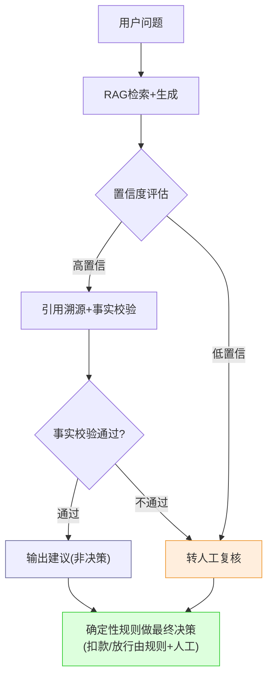
```mermaid
flowchart TD
    Q["用户问题"] --> RAG["RAG检索+生成"]
    RAG --> CONF{"置信度评估"}
    CONF -- "高置信" --> CITE["引用溯源+事实校验"]
    CONF -- "低置信" --> HUMAN["转人工复核"]
    CITE --> CHECK{"事实校验通过?"}
    CHECK -- "通过" --> OUT["输出建议(非决策)"]
    CHECK -- "不通过" --> HUMAN
    OUT --> RULE["确定性规则做最终决策<br/>(扣款/放行由规则+人工)"]
    HUMAN --> RULE
    style HUMAN fill:#fed,stroke:#e93
    style RULE fill:#dfd,stroke:#3c3
    style OUT fill:#eef,stroke:#669
```

**STAR 回答模板（RAG 幻觉与边界）**：
```text
S: 内部对账知识库用LLM+RAG,但金融场景对准确性要求极高
T: 设计AI治理方案,保证AI只建议不决策
A: ① RAG缓解幻觉(不根治),配引用溯源
   ② 置信度阈值+事实校验,低置信转人工
   ③ 生产交易链路:AI只做风控评分/对账归因
   ④ 扣款/放行由确定性规则+人工复核
R: AI辅助提升对账效率30%,0次AI误决策事件
```

**追问**：检索质量差怎么提升？
- **思路**：混合检索（向量+BM25）、重排（Cross-Encoder rerank）、查询改写/扩展、切片粒度调优、元数据过滤、知识库清洗去重、评测集驱动迭代（见《向量检索与RAG实践》）。

> **【深度拓展与项目支撑】**（RAG 幻觉与边界）RAG 缓解但不根治幻觉（检索错/拼错/模型仍编）。治理：引用溯源、置信度阈值、事实校验、人工复核、低置信转人工。支付强合规「AI 只建议不决策」——扣款/放行必须由确定性规则+人工。追问「检索质量差」：混合检索（向量+BM25）、Cross-Encoder 重排、查询改写、切片调优、评测集驱动。
> **项目支撑**：我做过 LLM+RAG 内部对账知识库（对账规则/差错案例检索增强），但生产交易链路绝不让 AI 直接决策。XTransfer 风控是「独立子状态机 + 确定性规则 + 人工复核」，AI 只做评分建议——符合金融强合规。

## 十七、支付对账差异

**问题**：本地和渠道对不上怎么办？长款短款怎么处理？
- **思路**：每日批量对账（本地流水 vs 渠道账单），按渠道流水号/金额匹配；差异分三类：① 本地有渠道无（可能掉单/未回调→主动查单补单）；② 渠道有本地无（漏记→补记账）；③ 金额不符（部分退款/手续费→按规则调账）。差错处理：挂账→核查→调账（红冲蓝补）→告警。长款（渠道多收，要退用户/挂应付）、短款（渠道少收，追款/挂应收）。
- **易错坑**：只做金额匹配不做状态匹配；对账失败影响结算时效；没留差错人工处理通道。

**对账差异分类与处理流程图**：

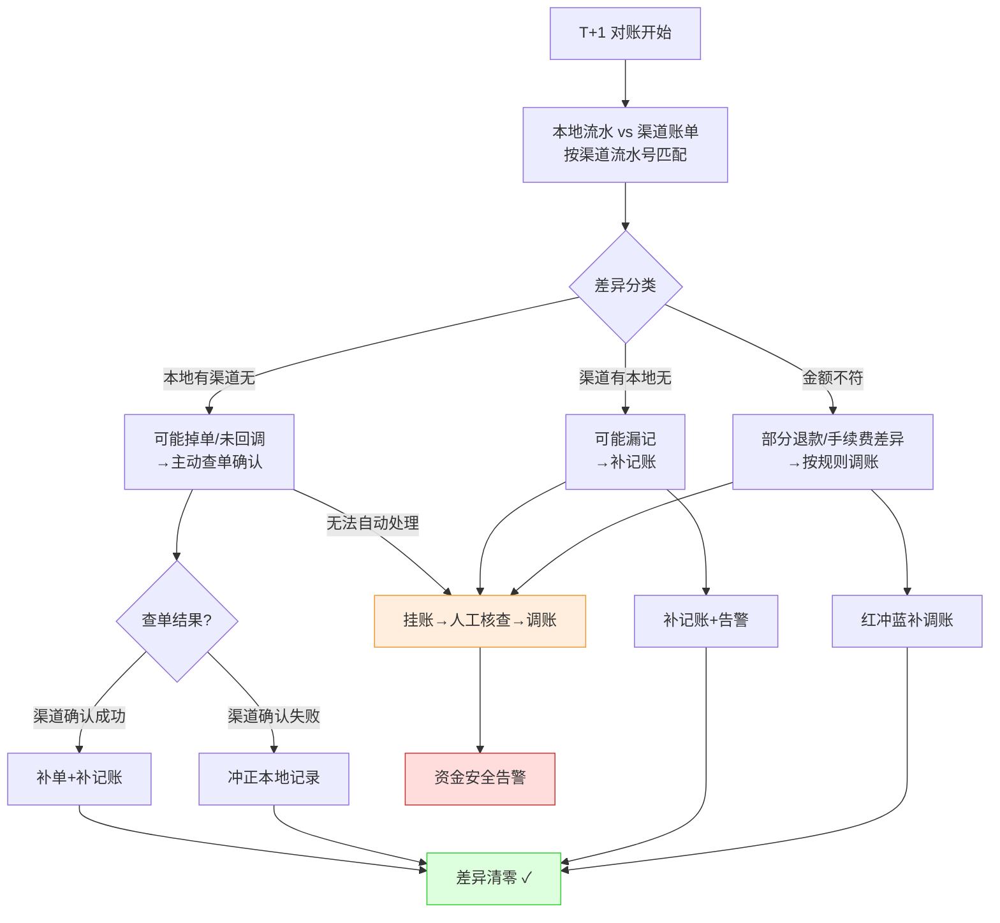
```mermaid
flowchart TD
    START["T+1 对账开始"] --> MATCH["本地流水 vs 渠道账单<br/>按渠道流水号匹配"]
    MATCH --> CAT{"差异分类"}
    CAT -->|"本地有渠道无"| D1["可能掉单/未回调<br/>→主动查单确认"]
    CAT -->|"渠道有本地无"| D2["可能漏记<br/>→补记账"]
    CAT -->|"金额不符"| D3["部分退款/手续费差异<br/>→按规则调账"]
    D1 --> Q1{"查单结果?"}
    Q1 -- "渠道确认成功" --> FIX1["补单+补记账"]
    Q1 -- "渠道确认失败" --> FIX2["冲正本地记录"]
    D2 --> FIX3["补记账+告警"]
    D3 --> FIX4["红冲蓝补调账"]
    FIX1 --> DONE["差异清零 ✓"]
    FIX2 --> DONE
    FIX3 --> DONE
    FIX4 --> DONE
    D1 -->|"无法自动处理"| MANUAL["挂账→人工核查→调账"]
    D2 --> MANUAL
    D3 --> MANUAL
    MANUAL --> ALERT["资金安全告警"]
    style DONE fill:#dfd,stroke:#3c3
    style MANUAL fill:#fed,stroke:#e93
    style ALERT fill:#fdd,stroke:#c33
```

**STAR 回答模板（支付对账差异）**：
```text
S: 跨境收款涉及100+渠道,每日对账发现本地与渠道数据不一致
T: 建立自动化对账体系,保证0资损
A: ① T+1多维对账(交易vs记账、我方vs渠道、总账vs明细)
   ② 差异自动分类进差错队列
   ③ 能冲正自动冲正,不能转人工
   ④ 长款挂应付,短款追款挂应收
R: 0资损,差异24h内自动处理率>95%
```

> **【深度拓展与项目支撑】**（支付对账差异）对账分类：① 本地有渠道无（掉单/未回调→主动查单补单）；② 渠道有本地无（漏记→补记账）；③ 金额不符（部分退款/手续费→按规则调账）。长款（渠道多收，退用户/挂应付）、短款（渠道少收，追款/挂应收）。易错坑：只做金额匹配不做状态匹配；对账失败影响结算时效；无差错人工通道。
> **项目支撑**：XTransfer 把对账作为「资金安全第三道防线」事后层：T+1 多维对账（交易 vs 记账、我方 vs 渠道、总账 vs 明细），差异自动分类进差错队列，能冲正自动冲正、不能转人工。这是 0 资损的闭环。哈啰薪资也对账（系统算 vs 人工抽检）发现并修正差错。

## 十八、热点账户

**问题**：大促时平台手续费汇总户写入瓶颈怎么破？
- **思路**：子账户拆分（按时间/业务维度拆 N 个，分散写入，查询时汇总）+ 缓冲记账（先记明细流水，异步定时归并到总户）+ 合并入账（攒批更新）。一致性：拆分子账户余额+总户，最终汇总校验；归并失败重试+告警。
- **易错坑**：只加锁（串行化，吞吐崩）；忽略拆分后总额校验；缓冲记账丢更新。

**热点账户解决方案图解**：

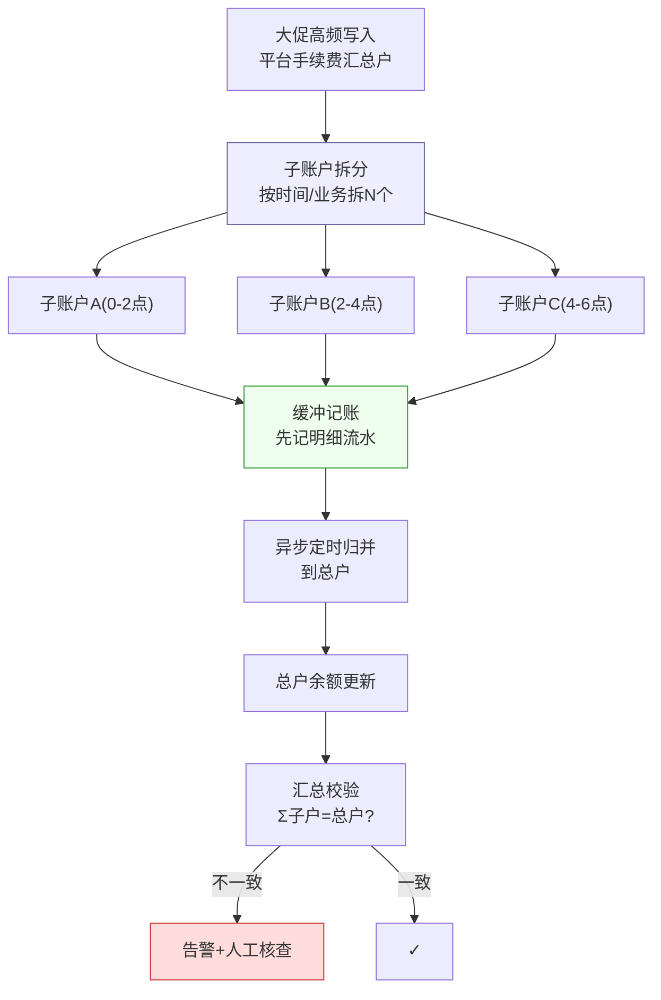
```mermaid
flowchart TD
    REQ["大促高频写入<br/>平台手续费汇总户"] --> SPLIT["子账户拆分<br/>按时间/业务拆N个"]
    SPLIT --> SA1["子账户A(0-2点)"]
    SPLIT --> SA2["子账户B(2-4点)"]
    SPLIT --> SA3["子账户C(4-6点)"]
    SA1 --> BUFFER["缓冲记账<br/>先记明细流水"]
    SA2 --> BUFFER
    SA3 --> BUFFER
    BUFFER --> MERGE["异步定时归并<br/>到总户"]
    MERGE --> TOTAL["总户余额更新"]
    TOTAL --> CHECK["汇总校验<br/>Σ子户=总户?"]
    CHECK -->|"不一致"| ALERT["告警+人工核查"]
    CHECK -->|"一致"| OK["✓"]
    style SPLIT fill:#eef,stroke:#669
    style BUFFER fill:#efe,stroke:#393
    style ALERT fill:#fdd,stroke:#c33
```

**STAR 回答模板（热点账户）**：
```text
S: 大促时平台手续费汇总户高频更新,单点写入成瓶颈
T: 解决热点账户写入瓶颈,保证账务一致性
A: ① 子账户拆分(按时间/业务维度分散写入)
   ② 缓冲记账(先记明细流水,异步归并总户)
   ③ 合并入账(攒批更新减少写入次数)
   ④ 定时汇总校验(Σ子户=总户)
R: 写入吞吐提升10x+,总额校验一致,0资损
```

> **【深度拓展与项目支撑】**（热点账户）大促平台手续费汇总户/营销户高频写入成瓶颈。解法：子账户拆分（按时间/业务拆 N 个分散写入，查询汇总）+ 缓冲记账（先记明细流水，异步归并总户）+ 合并入账（攒批更新）。一致性：拆分子户余额+总户最终汇总校验；归并失败重试+告警。易错坑：只加锁（串行化吞吐崩）；忽略拆分后总额校验；缓冲记账丢更新。
> **项目支撑**：XTransfer 账务侧对平台过渡户等热点用「子账户拆分 + 先记明细流水后异步归并总户」，归并失败重试+告警，既保一致又抗写热点；欧凡库存用 Redis+Lua 原子扣减挡高并发热点（秒杀同源）。

## 十九、二清合规

**问题**：你的支付系统怎么避免"二清"违规？
- **思路**：不替商户沉淀资金；用银行/持牌机构"大商户+子商户"模式，资金清分由持牌方完成；平台只做信息流与分账指令，结算到平台在银行的托管/监管户，按协议分账给子商户。明确资金流与信息流分离。
- **易错坑**：自建"资金池"先收后付（典型二清）；分账逻辑自己控制资金（需持牌或走持牌通道）。

---

> **【深度拓展与项目支撑】**（二清合规）二清是无牌照机构替商户沉淀资金再结算，监管红线。规避：资金流与信息流分离，平台只做信息流（订单、分账指令），资金由持牌「大商户+子商户」模式清分。平台绝不能自建资金池先收后付。易错坑：自建资金池（典型二清）；分账自己控制资金（需持牌/走持牌通道）。
> **项目支撑**：XTransfer 跨境收款平台，资金通过持牌通道/银行监管户处理，平台做收款/申报/记账信息流与指令；贸易订单系统提供贸易背景用于合规申报与 AML/KYC，绝不由平台自建资金池。合规动态表单（渠道→场景→字段）也是为此服务。

## 面试高频问答（标准回答）

**Q：被追问到答不上来怎么办？**
> 考察点：抗压、诚实、思维。思路：① 不慌，复述问题确认理解；② 给"我能确定的部分"+推理框架（"我不确定细节，但按 X 原则应该是…"）；③ 把话题拉回相关熟悉领域；④ 明确说"这块我回去会补"，别硬编。面试官常通过"答不上时怎么表现"看潜力。

**【深度拓展】** 答不上时的表现比答案更重要——面试官在测「抗压 + 诚实 + 框架」。稳的打法是「复述确认 → 给确定部分 + 推理 → 拉回熟悉 → 承认边界」。千万别硬编，一追问就崩比「不会」更致命。
**【项目支撑】** 我每次模拟面试后把新被问到的点补进这篇追问库，并回到 XTransfer/哈啰/欧凡的真实设计去验证；这样真被追问时，能快速从「支付一致性取舍」「状态机落地」等真做过的点找锚。

**Q：你怎么判断一个问题该用 CP 还是 AP？**
> 思路：问自己"数据错了的代价 vs 不可用的代价"。钱/账目/库存核心=不能错→CP；体验/通知/推荐=不能挂→AP。再叠加"能否用最终一致+对账兜底"把 AP 的风险压到可接受的低。

**【深度拓展】** 判断 CP/AP 的本质是「错的成本 vs 不可用的成本」。更进阶的回答是「按模块分层」而非整体一刀切，并说明「AP 的风险用最终一致 + 对账兜底压低」。面试官想听的是权衡过程，不是结论。
**【项目支撑】** XTransfer 账务/扣款 CP + 复式记账，渠道对账/通知/营销 AP 最终一致，靠任务补偿 + T+1 对账收敛——这正是「分层 CP/AP + 对账兜底」的真实落地，也是 0 资损的方法论基础。

**Q：为什么你讲每个点都提'代价/取舍'？**
> 思路（展示成熟度）：没有银弹。任何方案都有 trade-off（性能↔一致性↔复杂度↔成本）。面试官想看的是"在约束下做选择的能力"，而不只是知道名词。我会先讲它解决什么、再讲付出什么、最后讲项目里怎么权衡。

**【深度拓展】** 「提代价/取舍」是成熟工程师的标志——没有银弹，只有约束下的选择。讲清「解决什么 + 付出什么 + 项目怎么权衡」比堆名词高级。这也是把普通答案讲出高级感的统一方法（对比/取舍 + 量化 + 落地踩坑）。
**【项目支撑】** XTransfer 2.0 重构处处是取舍：任务补偿 vs TCC（选可补偿、可用性高）、SPI 配置化 vs 硬编码（选可扩展、改面小）、状态机 vs if/else（选资金安全、初期建模成本）。每个选型我都能讲清代价，这正是面试官认可的「架构判断力」。

**Q：你的这些追问准备怎么用？**
> 思路：不是背答案，是训练"被追问时的反应框架"——确认问题→分层给方案→落到项目→承认边界。每次模拟面试后把新被问到的点补进这篇，形成自己的"追问库"。

**【深度拓展】** 追问库是「活的知识库」——面一场补一场。关键不是背，而是训练「被追问的反应框架」：确认→分层→落地→承认边界。越练越能在压力下结构化表达。
**【项目支撑】** 我把博客每篇（XTransfer 复盘、哈啰/欧凡/携程实战、支付题集、术语详解）的「更多高频追问」当追问库维护，每次模拟面试后增量补点。准备面试的过程就是「螺旋上升」：过一遍→面一场→补短板→再过一遍。

---

## 更多高频追问（补充）

**Q：被问到一个你完全不会的问题，怎么应对？**
> 别装懂（面试官一追就露）。三步：① **诚实但不慌**——"这块我没有深入实践过，但我可以说说我的理解/思路"；② **展示思考方式**——从相近的知识/第一性原理推演，让面试官看到你的分析能力；③ **化被动为主动**——"如果给我时间我会怎么查证/学习"。不会某个点不致命，但胡编或一问就崩很致命。承认边界本身是成熟的表现。

**【深度拓展】** 不会不是失败，硬编才是。面试官通过「不会时怎么表现」看潜力。稳的打法：诚实定性 + 从第一性原理推演（展示分析能力）+ 化被动为主动（说清查证路径）。承认边界是成熟标志。
**【项目支撑】** 我的真实项目（XTransfer 跨境支付）本就覆盖极广，所以被追问时能快速锚定到「状态机/SPI/任务补偿/对账」等真做过的点；遇到真不会的（如某些底层存储内核细节），我会坦诚 + 给推演，不编造。

**Q：面试官不断追问"为什么、还有呢"，是什么意图？**
> 三种意图：① **探边界**——想知道你的知识深度到哪、是真懂还是背的；② **验真实**——项目是不是你真做的，一追细节就知道；③ **看反应**——压力下能否结构化表达。应对：先确认追问点，分层展开（原理→实现→取舍→项目），到边界了就坦诚"这是我目前的理解，再往下我需要查证"。稳住节奏比答满更重要。

**【深度拓展】** 「不断追问」多半是验证真实性——项目是不是你真做的，一追细节就露。所以应对核心是「用真实细节撑住」。原理→实现→取舍→项目逐层展开，到边界坦诚。稳住节奏比答满重要。
**【项目支撑】** XTransfer 2.0 重构、预入账 0→1 都是我主导，状态机/任务补偿/SPI 的每个设计细节（如状态机 CAS 更新、任务表死信转人工）都能展开，经得起「还有呢」的追问。行为故事（冲突/失败/领导力）也是真经历，不会被问穿。

**Q：怎么把一个普通答案讲出'高级感'？**
> 加三层：① **对比/取舍**——不只说 A，还说"为什么不用 B、A 的代价是什么"；② **量化**——用数字（QPS、延迟、成功率、成本）代替"很快、很稳"；③ **落地 + 踩坑**——"我们在 XX 项目这么用，踩过 YY 坑，后来怎么改的"。普通答案是"是什么"，高级答案是"是什么 + 为什么这么选 + 实际效果如何"。

**【深度拓展】** 高级感 = 对比/取舍 + 量化 + 落地踩坑。普通答案是「是什么」，高级答案是「是什么 + 为什么这么选 + 实际效果」。面试里把每个点都讲成这三层，立刻拉开差距。
**【项目支撑】** 讲 XTransfer 我会自然带出量化（+30% 人效、-80% 生产问题、0 资损、100+ 渠道、超 1000w 笔结算）和真实踩坑（一次幂等边界漏覆盖导致试算偏差，固化进三道防线）；讲欧凡带出（p99<200ms、召回>90%）；讲哈啰带出（日 200w 工单、正确率 95%+）。每篇都按这三层打磨。

**Q：反问环节问什么能加分？**
> 别问能自己查到的（如"公司几点下班"）。问能体现思考的：① **业务/技术挑战**——"团队当前最大的技术挑战是什么"；② **成长**——"这个岗位一年后期望达到什么水平"；③ **团队协作方式**——"技术决策怎么做、怎么应对技术债"。好的反问既帮你判断是否想去，也让面试官看到你在认真评估双向匹配。

**【深度拓展】** 反问是「展示你已经在想怎么干活」的机会。问业务/技术挑战、成长路径、协作方式，既帮自己判断是否匹配，也让面试官看到主动性。千万别问 JD 能查到的（薪资/加班）。
**【项目支撑】** 我准备的反问会锚定支付/一致性/高可用（我的主线），例如「团队当前支付核心链路最大的架构挑战」「这个岗位一年后在资金安全上的成功标尺」——既显思考，又自然衔接我的 XTransfer 经历。

---

## AI 模拟追问训练方法

> 面试不是背完即止，而是被追问时能结构化反应。用 AI 模拟面试官不断追问，训练的是「反应框架」而非「背答案」。

**AI 模拟追问流程图**：

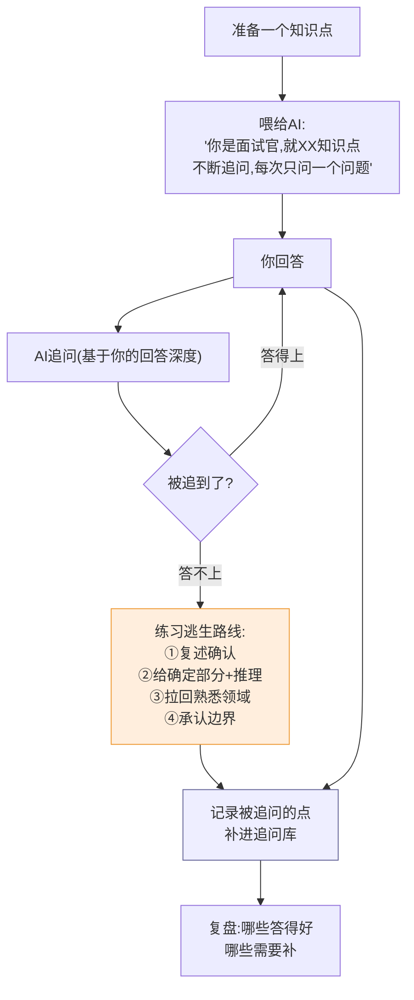
```mermaid
flowchart TD
    START["准备一个知识点"] --> FEED["喂给AI:<br/>'你是面试官,就XX知识点<br/>不断追问,每次只问一个问题'"]
    FEED --> ANSWER["你回答"]
    ANSWER --> AI_Q["AI追问(基于你的回答深度)"]
    AI_Q --> DEEP{"被追到了?"}
    DEEP -- "答不上" --> ESCAPE["练习逃生路线:<br/>①复述确认<br/>②给确定部分+推理<br/>③拉回熟悉领域<br/>④承认边界"]
    DEEP -- "答得上" --> ANSWER
    ESCAPE --> RECORD["记录被追问的点<br/>补进追问库"]
    ANSWER --> RECORD
    RECORD --> REVIEW["复盘:哪些答得好<br/>哪些需要补"]
    style ESCAPE fill:#fed,stroke:#e93
    style RECORD fill:#eef,stroke:#669
```

**AI 模拟追问 Prompt 模板**：

```text
你是资深技术面试官，正在面试一名有5年支付系统经验的Java后端工程师。
请就以下知识点不断追问，每次只问一个问题，基于我的回答决定追问方向。
追问策略：
1. 先问定义/原理
2. 再问项目里怎么用的
3. 然后问踩过什么坑、怎么解决的
4. 最后问极端场景/trade-off
如果我说"不确定"，换一个角度继续追问。

知识点：[填入具体知识点，如"分布式事务最终一致性"]
```

**逃生路线图（通用版）**：

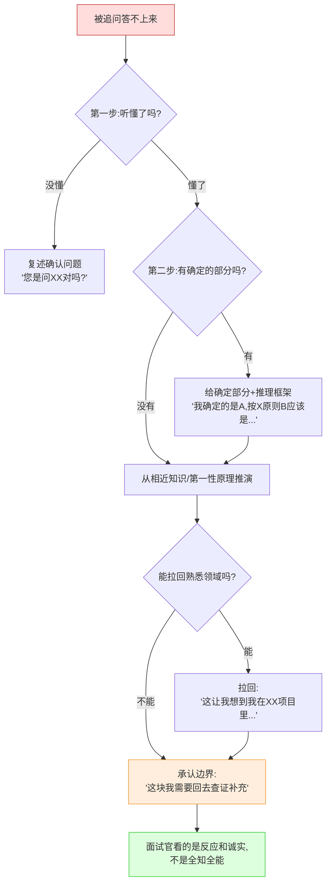
```mermaid
flowchart TD
    STUCK["被追问答不上来"] --> S1{"第一步:听懂了吗?"}
    S1 -- "没懂" --> REPEAT["复述确认问题<br/>'您是问XX对吗?'"]
    S1 -- "懂了" --> S2{"第二步:有确定的部分吗?"}
    S2 -- "有" --> GIVE["给确定部分+推理框架<br/>'我确定的是A,按X原则B应该是...'"]
    S2 -- "没有" --> S3["从相近知识/第一性原理推演"]
    GIVE --> S3
    S3 --> S4{"能拉回熟悉领域吗?"}
    S4 -- "能" --> PULL["拉回:<br/>'这让我想到我在XX项目里...'"]
    S4 -- "不能" --> ADMIT["承认边界:<br/>'这块我需要回去查证补充'"]
    PULL --> ADMIT
    ADMIT --> END["面试官看的是反应和诚实,<br/>不是全知全能"]
    style STUCK fill:#fdd,stroke:#c33
    style ADMIT fill:#fed,stroke:#e93
    style END fill:#dfd,stroke:#3c3
```

> **【深度拓展】** AI 模拟追问的核心价值不是「练答案」而是「练反应」。面试官通过追问验证三件事：① 知识深度到哪；② 项目是不是真做的；③ 压力下能否结构化表达。AI 模拟能覆盖前两点，第三点要靠真实模拟面试（找人面或录屏回看）。
>
> **【项目支撑】** 我每次模拟面试后把新被问到的点补进这篇追问库，并回到 XTransfer/哈啰/欧凡的真实设计去验证。准备面试的过程就是「螺旋上升」：过一遍→面一场→补短板→再过一遍。

---

## 二十、全新四个角度（落在"如何组织回答"）

> 前面十九节把每个知识点"被追问怎么答"讲透了。这一节再上一个层次——**不是讲知识点，而是讲"你怎么把任何知识点都讲出高级感"**。这是方法论的元层，十年工程师的核心竞争力是"结构化表达 + 量化意识 + 框架兜底"，而不是知道更多名词。

## 【故障复盘】面试中讲故障的黄金结构

> 普通候选人讲事故："有一次缓存挂了，后来加了个限流就好了。"十年候选人讲事故是**三段式 + 量化 + 角色 + 复盘**。面试官听的不是"你修过 bug"，而是"你有没有 owner 意识、能不能把混沌讲清楚"。

### 黄金结构（七段，背下来）

1. **背景量化**：什么系统、什么量级（QPS/数据量/用户数）、什么架构位置。"XTransfer 收款核心链路，日 1000w+ 笔，Dubbo 同步 RPC。"
2. **你的角色**：你是主导还是参与？"我主导了线程池隔离改造"比"我们做了"得分高 10 倍。
3. **触发**：什么具体动作点燃的（翻到第 5000 页 / 渠道 RT 8s / TTL 整点过期）。
4. **影响面量化**：必须给数字——"P99 从 400ms 涨到 9s、拒绝率 +40%、慢查询占比 62%。"没有数字 = 没发生过。
5. **定位（工具）**：用了什么工具（slow log / EXPLAIN / Arthas / Redis MONITOR / 链路追踪）。这体现你的"武器库"。
6. **止血 → 根因修复**：先止血保业务，再根治。两步都要讲，只讲根治显得没救过火。
7. **长效预防**：怎么让同类事故不再发生（监控/CI 校验/架构改造）。这是 owner 意识的终点。

```mermaid
flowchart TD
    A["①背景量化(系统/量级/架构)"] --> B["②你的角色(主导/参与)"]
    B --> C["③触发(具体动作)"]
    C --> D["④影响面量化(P99/错误率/占比)"]
    D --> E["⑤定位(工具: Arthas/EXPLAIN/MONITOR)"]
    E --> F["⑥止血→根因修复"]
    F --> G["⑦长效预防(监控/CI/架构)"]
    G --> H["面试官看到的: owner意识+结构化+可量化"]
    style A fill:#eef,stroke:#669
    style D fill:#fed,stroke:#e93
    style H fill:#dfd,stroke:#3c3
```

### 易错坑（讲故障时）

- **只讲结果不讲数字**："系统变慢了"→ 改成"P99 从 400ms 涨到 9s"。
- **分不清角色**："我们做了隔离"→ 改成"我主导把渠道调用拆成独立线程池"。
- **只讲根治不讲止血**：面试官会担心你"线上先折腾根因，业务先挂了"。
- **没有长效预防**：讲完修复就停 = 留给面试官"这人只会救火"的印象。

---

## 【横向对比】易混知识点对比表（表达武器）

> 面试里"你能不能把两个易混概念讲清边界"是区分度极高的题。下面给几组**高频易混对比**，用法是：被问到任何一个，先给"对比表 + 一句话 trade-off"，立刻显得条理清晰。

### 对比一：HashMap vs ConcurrentHashMap（必考题）

| 维度 | HashMap | ConcurrentHashMap 1.8 |
| --- | --- | --- |
| 线程安全 | ❌（1.7 成环死循环，1.8 仍数据竞争） | ✅ |
| 并发控制 | 无 | CAS 初始化 + synchronized 锁头节点 + volatile 读 |
| size 统计 | O(1) 但并发不准 | baseCount + CounterCell 分散计数 |
| 读性能 | 无锁 | 几乎无锁（volatile 读） |
| 易错点 | "1.8 尾插就安全"是错的 | 尾插只是不死循环，仍非线程安全 |

**一句话 trade-off**：HashMap 快但不安全；CHM 用"细粒度锁单桶 + CAS"换取线程安全且读几乎无锁，代价是写路径复杂度高、内存稍大。

### 对比二：缓存一致性方案（浓缩，呼应 MySQL+Redis 篇）

| 方案 | 一致性 | 何时选 |
| --- | --- | --- |
| 读写都走主库 | 强 | 资金余额 |
| 先更DB再删缓存 | 最终 | 大多数读多写少 |
| Canal 订阅 binlog | 最终+解耦 | 高一致+业务解耦 |
| 分布式锁串行化 | 强 | 极少（代价大） |

**一句话 trade-off**：强一致用锁/串行化换来正确性，但牺牲吞吐与可用性；最终一致+短 TTL 把脏窗口压到秒级，性价比最高。

### 对比三：锁升级三态（synchronized）

| 状态 | 适用 | 代价 |
| --- | --- | --- |
| 偏向锁 | 单线程重入 | JDK15 起默认禁用（撤销开销大） |
| 轻量级锁 | 低竞争 CAS 自旋 | 自旋消耗 CPU |
| 重量级锁 | 高竞争 | OS 互斥，线程挂起 |

**一句话 trade-off**：锁越"轻"越快但怕竞争；高并发下偏向锁撤销反而更慢，所以现代 JVM 默认不用它——**不要盲信"某锁总是快"**。

```mermaid
graph TD
    START["被问到易混概念"] --> Q1{"能列对比维度?"}
    Q1 -->|"是"| T["先画对比表<br/>(性能/一致性/复杂度/适用)"]
    Q1 -->|"否"| R["从第一性原理推演<br/>(读写/并发/一致)"]
    T --> TO["给一句话trade-off<br/>'为什么选A不选B'"]
    R --> TO
    TO --> EX["落到项目真实案例"]
    EX --> WIN["显得条理清晰+有深度"]
    style T fill:#eef,stroke:#669
    style TO fill:#fed,stroke:#e93
    style WIN fill:#dfd,stroke:#3c3
```

---

## 【量化指标】用数字量化你的回答质量

> 这是把"普通答案"变"高级答案"的最廉价杠杆。规则：**任何定性描述，都尝试换成数字**。下面给你一套"量化模板"和"量化雷达"。

### 量化替换模板（背下来，套任何题）

| 普通说法（❌） | 高级说法（✅ 量化） |
| --- | --- |
| "性能提升很大" | "P99 从 200ms 降到 30ms，降 85%" |
| "命中率很高" | "三层缓存命中率 98.5%，雪崩时跌到 21%" |
| "处理了很多笔" | "日 1000w+ 笔结算，0 资损" |
| "系统变稳定了" | "生产问题降 80%，MTTR 从 2h 到 15min" |
| "支持很多渠道" | "对接 100+ 银行/渠道，配置化新增 0 改核心" |
| "吞吐上去了" | "热点账户写入吞吐提升 10x，Σ子户=总户一致" |

### 你回答里的"量化雷达"（自检 5 问）

```mermaid
flowchart LR
    Q1["有延迟数字?<br/>(P99/RT)"] --> Q2["有量级数?<br/>(QPS/行数/笔数)"]
    Q2 --> Q3["有比例?<br/>(命中率/错误率/占比)"]
    Q3 --> Q4["有前后对比?<br/>(优化前vs后)"]
    Q4 --> Q5["有成本/收益?<br/>(TCO/人日/回本)"]
    Q5 --> OK["5项都沾→高级答案<br/>0项→像背题"]
    style OK fill:#dfd,stroke:#3c3
```

- **延迟**：P99 / P95 / RT 预算（如"渠道 400ms 预算，超时设 2s"）
- **量级**：QPS、数据行数、笔数、节点数（如"千万级大表、日 1000w 笔"）
- **比例**：命中率、错误率、慢查询占比（如"命中率 98.5%→21%"）
- **前后对比**：优化前 vs 后（如"P99 8.2s→35ms，降 99.6%"）
- **成本/收益**：TCO、人日、回本周期（如"三级缓存 TCO 半年回本"）

> 训练法：每次模拟面试录屏回看，凡是没有数字的句子，强迫自己补一个。坚持 3 场，表达质感立刻不同。

---

## 【答题框架】追问应对五步法 + 逃生话术库

> 前面各节零散给过逃生路线，这里给出**标准化的"追问应对五步法"评分标准**——面试官其实在按这五步默默打分。再加一个**可直接背的逃生话术库**。

### 五步法（评分标准）

| 步骤 | 动作 | 面试官在打分什么 | 反面教材 |
| --- | --- | --- | --- |
| ① 确认 | 复述/澄清问题 | 有没有听懂、是否急于抢答 | 没听清就开讲 |
| ② 分层 | 原理→实现→取舍→项目 | 结构化思维 | 一锅粥堆名词 |
| ③ 落地 | 拉回真实项目细节 | 项目是不是真做的 | 纯理论无案例 |
| ④ 边界 | 承认不知道的部分 | 诚实 + 成熟度 | 硬编被追穿 |
| ⑤ 反问 | 主动引导到擅长领域 | 主动权 + 思考深度 | 被动等问 |

```mermaid
flowchart TD
    S1["①确认: 复述问题<br/>'您是问XX对吗?'"] --> S2["②分层: 原理→实现→取舍→项目"]
    S2 --> S3["③落地: 拉回XTransfer/哈啰/欧凡真实细节"]
    S3 --> S4{"被追到边界?"}
    S4 -->|"能答"| S2
    S4 -->|"不能"| S5["④边界: 承认+给框架+第一性原理"]
    S5 --> S6["⑤反问: 引导到擅长领域<br/>'这块我理解是...您更想听取舍还是落地?'"]
    S6 --> END["评分: 结构化+诚实+真实+主动"]
    style S1 fill:#eef,stroke:#669
    style S5 fill:#fed,stroke:#e93
    style END fill:#dfd,stroke:#3c3
```

### 逃生话术库（按场景直接套）

**场景 A：完全不会**
> "这块我没有直接实践过，但我从第一性原理推演一下——[相关就近知识]，如果是我落地，我会先查证 X 再决定 Y。我们项目里 [锚定擅长点] 是类似思路。"

**场景 B：记得大概但细节模糊**
> "整体我清楚：选 A 是因为 [trade-off]，细节比如 [具体参数] 我得回去确认准确值，但方向是确定的。"

**场景 C：被追问"还有呢 / 为什么"**
> "您是想深挖原理层（为什么这么设计），还是落地层（我们怎么踩坑改的）？我两个都能展开，先讲哪边？"——**把球传回去，掌握节奏**。

**场景 D：被质疑（"你这不对吧"）**
> "您说的场景我理解是 [复述对方观点]，在我们 [特定前提] 下确实是这样；我前面讲的是 [我的前提]，前提不同结论会有差异。我可能漏了说明前提。"——**不硬杠、补前提、显严谨**。

**场景 E：被要求画白板**
> 先画"结构图/时序图/对比表"三选一，再讲。画图=给面试官喘息 + 给自己组织时间，永远优先于纯口述。

> **终极心法**：面试官通过"不会时怎么表现"看潜力，比"会不会"更重要。**不硬编、给框架、拉回项目、补前提**——做到这四条，即使有知识盲区，评分也不会低。

<!-- EXPANDED -->
