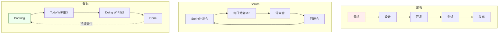
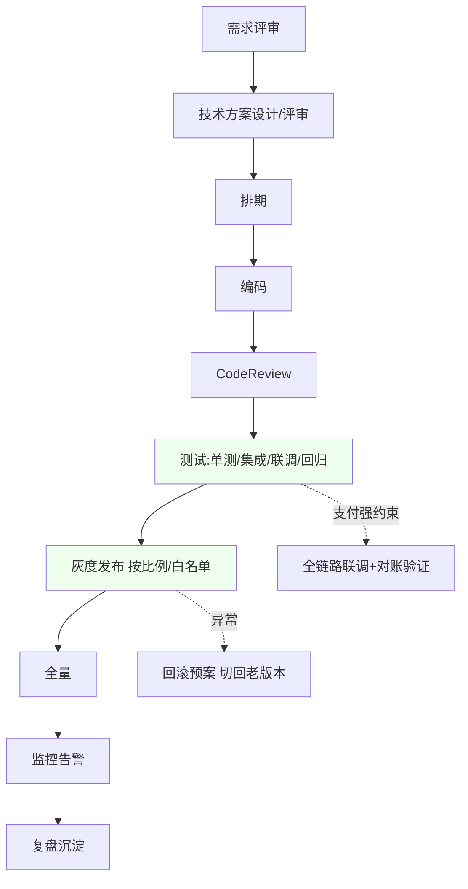
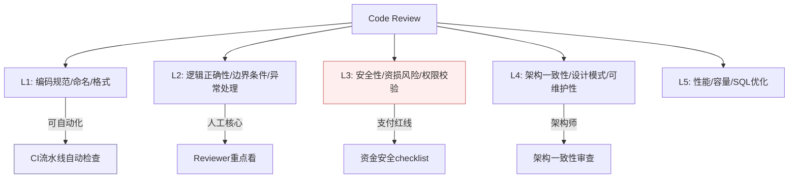
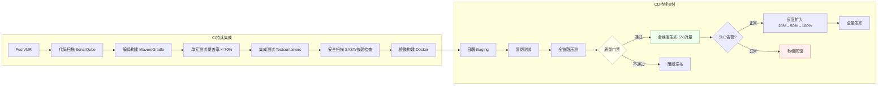
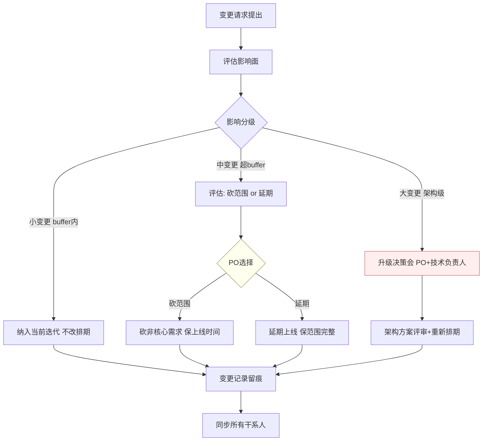
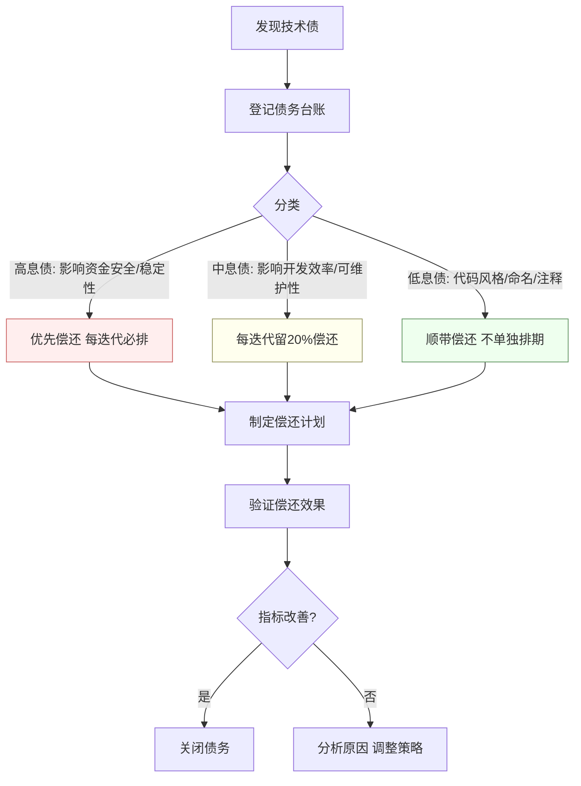
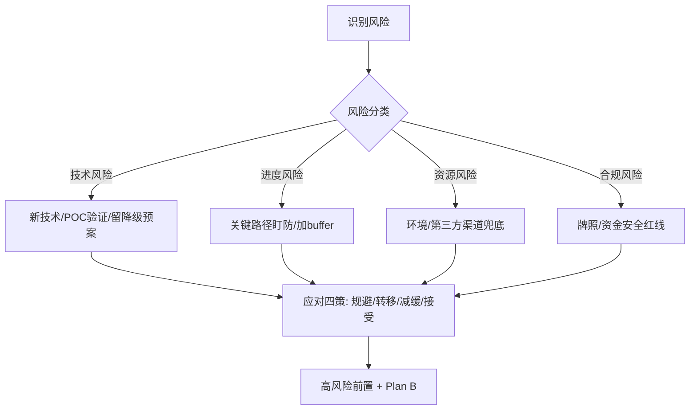
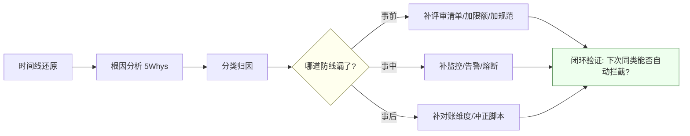
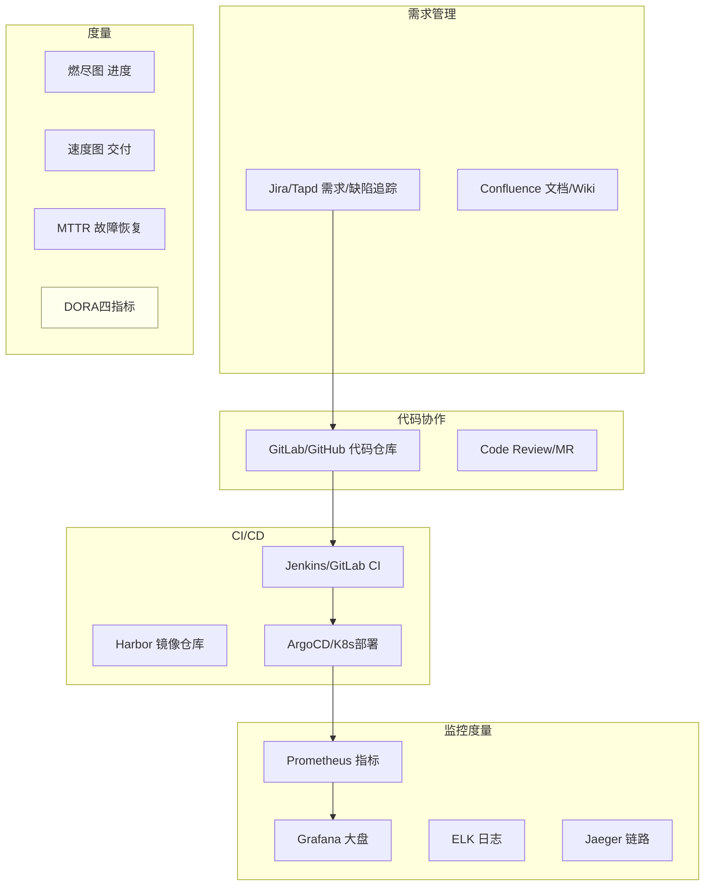

> 到了资深/骨干层级，面试不只问技术，还会问"你怎么推动一个项目落地、怎么应对失控"。本文从**研发流程 → 需求排期 → 风险进度 → 跨团队协作 → 真实问题复盘**展开，每节给面试**标准回答 + 考察点**。结合支付项目讲。

---

## 一、研发流程与方法论

### 1.1 敏捷 / Scrum / 看板
- **Scrum**：迭代（Sprint 1~2 周）、四会（计划会/每日站会/评审会/回顾会）、三角色（PO/SM/Team）、产出（Backlog/燃尽图）。
- **看板 Kanban**：可视化流动、限制在制品（WIP）、持续交付，适合运维/需求不定型团队。
- **瀑布 vs 敏捷**：需求明确、合规强（如金融核心）可局部瀑布；需求多变用敏捷。
- **考察点**：能否按团队/业务质素选流程，而不是照搬；燃尽图/WIP 的作用。

**敏捷 / Scrum / 看板 / 瀑布对比**：



| 维度 | 瀑布 | Scrum | 看板 |
| --- | --- | --- | --- |
| 节奏 | 一次性大交付 | 固定迭代（1~2周） | 持续流动 |
| 计划 | 前期全量 | 每Sprint计划 | 按需拉取 |
| 变更 | 变更成本高 | 迭代间可调 | 随时可调 |
| 角色 | PM/架构师/开发 | PO/SM/Team | 无强制角色 |
| 适合 | 合规强/需求明确 | 需求多变/产品研发 | 运维/支持/需求不定型 |
| 度量 | 里程碑达成率 | 速度velocity/燃尽图 | 周期时间/WIP |

> **【深度拓展】** 资深工程师选流程的关键不是"哪个先进"，而是"哪个匹配业务特点和团队成熟度"。支付核心系统（资金清结算）我倾向**Scrum + 局部瀑布**——迭代开发但每个迭代的方案评审更重（因为资金安全要求高、变更成本大）；而运维工具/内部平台用**看板**更灵活（需求来源杂、优先级变化快）。一个常见误区是"一个团队只能用一种流程"，实际上**同一团队不同模块可以混用**——核心模块用Scrum保质、工具模块用看板保活。

> **【面试官追问】** "Scrum 的四会你觉得哪个最有价值？" → 我的回答是"回顾会"。计划会确定做什么，站会同步进度，评审会展示成果——这些都是"执行"。但回顾会是唯一"改进执行方式"的会，它决定团队是否在持续进化。很多团队的回顾会流于形式（"下次注意"没有行动项），真正有价值的回顾会必须有**可落地的行动项 + 闭环验证（下个Sprint检查是否改了）**。

> **【项目支撑】** XTransfer 收款领域我用的是**Scrum + 重评审**模式：每个Sprint开始前做方案评审（支付方案必须过资金安全checklist），Sprint中每日站会同步阻塞，Sprint末做评审+回顾。但预入账子领域0→1阶段用的是更接近**看板**的模式——需求来源不确定（产品/合规/风控随时提），按优先级拉取，持续交付。同一团队不同阶段用不同流程，这是按实际需要选而非教条主义。

### 1.2 研发全流程（结合支付）
需求评审 → 技术方案设计（含评审）→ 排期 → 编码 → CodeReview → 测试（单测/集成/联调/回归）→ 灰度发布 → 全量 → 监控 → 复盘。
- **关键卡点**：方案评审（架构/容量/降级）、测试（支付要有全链路联调 + 对账验证）、灰度（按比例/白名单）、回滚预案。
- **考察点**：CR 和测试左移的价值；支付发布为什么必须灰度 + 可回滚。

**研发全流程（结合支付）**：



### 1.3 Code Review 最佳实践

> Code Review 是代码质量的第一道关，但很多团队的 CR 流于形式——"看一眼点 Approve"。资深工程师要能推动 CR 真正发挥作用。

**CR 关注层次**：



| 层次 | 关注点 | 谁来 Review | 自动化程度 |
| --- | --- | --- | --- |
| L1 编码规范 | 命名/格式/import/注释 | 全员 | SonarQube/Checkstyle 自动化 |
| L2 逻辑正确性 | 边界条件/空指针/异常处理/幂等 | 同模块开发 | 部分自动化（单测覆盖） |
| L3 安全性 | 越权/SQL注入/资损风险/敏感数据 | 安全Review + 资金域Owner | 部分自动化（安全扫描） |
| L4 架构一致性 | 是否符合分层/端口/状态机规范 | 架构师/Tech Lead | 人工为主 |
| L5 性能 | SQL慢查询/N+1/缓存命中率/线程池 | 性能Review | APM + 慢SQL扫描 |

**CR 规范化**（结合支付项目）：

```yaml
# Code Review 配置示例（GitLab/GitHub CI）
code_review:
  rules:
    # 资金相关代码必须2人以上Approval
    - path_match: "src/main/java/com/xtransfer/payment/**"
      min_approvals: 2
      required_reviewers: ["资金域Owner", "架构师"]
      checklist:
        - "幂等键是否定义？唯一约束是否建了？"
        - "状态机迁移是否合法？有没有非法跳变？"
        - "资金操作是否有限额兜底？"
        - "日志是否脱敏（卡号/VA账号）？"
    
    # 非资金代码1人Approval即可
    - path_match: "src/main/java/com/xtransfer/**"
      min_approvals: 1
    
    # 自动化检查
    auto_check:
      - sonarqube_quality_gate
      - unit_test_coverage_min_70
      - no_new_sql_injection_warnings
      - no_hardcoded_secrets
```

> **【深度拓展】** CR 最容易犯的错是"只看代码不看设计"。Reviewer 只关注"这行代码对不对"（L1/L2），不关注"这个设计合不合理"（L4）。资深做法是：**先看设计再看代码**——Reviewer 先理解这个 PR 的意图和方案，再判断实现是否合理。对于支付系统，CR 还要加一道"资金安全 checklist"：幂等键、状态机迁移、限额、日志脱敏——这四项是资金代码的"红线"，缺一项不许合并。

> **【面试官追问】** "你们 CR 的效率怎么样？会不会成为瓶颈？" → CR 效率关键在于**分层 + 自动化**。L1 编码规范用 SonarQube/Checkstyle 自动检查，不占人力；L2 逻辑正确性由同模块开发互评（1人足够）；L3/L4 才需要资深/架构师介入，且只在资金相关或架构变更时触发。这样大部分 PR 不会被 CR 卡住，只有高风险变更才走重 Review。我们的实践是：普通 PR 24小时内 Approve，资金 PR 48小时内（含安全 Review）。

> **【项目支撑】** XTransfer 收款 2.0 重构时我推行了**资金安全 CR Checklist**——所有涉及资金操作的 PR 必须过"幂等/状态机/限额/脱敏"四项检查，缺一项不许合并。这个 Checklist 后来固化进了 CI 流水线的模板检查（虽然部分只能人工审），是"生产问题 -80%"的前置保障之一。

### 1.4 CI/CD Pipeline 与发布管理

> CI/CD 是"代码到生产"的高速公路。资深工程师要能设计流水线、选择发布策略、控制发布风险。

**CI/CD Pipeline 全景**：



**发布策略对比**：

| 策略 | 原理 | 优点 | 缺点 | 适用场景 |
| --- | --- | --- | --- | --- |
| **滚动更新** | 逐批替换旧实例 | 零downtime、简单 | 无法控制流量比例、回滚慢 | 非核心服务 |
| **金丝雀** | 先放小比例流量验证 | 风险可控、可快速回滚 | 需要流量路由能力 | 核心/支付服务 |
| **蓝绿** | 两套环境切流量 | 切换瞬间完成、回滚快 | 资源翻倍 | 需要快速切换的场景 |
| **影子流量** | 新旧并行跑、只比对不落账 | 不影响生产、验证结果 | 额外资源消耗 | 资金系统重构验证 |

**金丝雀发布流程（支付场景）**：

```yaml
# 金丝雀发布配置示例
canary_release:
  stages:
    - stage: canary_5pct
      traffic_percentage: 5
      duration: 30min
      success_criteria:
        - error_rate < 0.1%
        - p99_latency < 500ms
        - financial_reconciliation: "balanced"  # 试算平衡
      rollback_on:
        - error_rate > 1%
        - financial_anomaly: true
    
    - stage: canary_20pct
      traffic_percentage: 20
      duration: 1h
      success_criteria:
        - error_rate < 0.05%
        - p99_latency < 300ms
        - financial_reconciliation: "balanced"
    
    - stage: canary_50pct
      traffic_percentage: 50
      duration: 2h
    
    - stage: full_release
      traffic_percentage: 100
  
  # 支付系统特殊配置
  financial_safety:
    shadow_mode: true          # 影子流量比对
    dual_write: true           # 新旧双写双算
    reconciliation_interval: 5min  # 高频对账
    rollback_seconds: 30       # 30秒内可回滚
```

> **【深度拓展】** 资金系统的发布与其他系统最大的区别是"**不只是验证功能正确，还要验证资金正确**"。普通系统金丝雀看错误率和延迟就够了；资金系统还要加：①**试算平衡**——金丝雀期间实时复式记账试算必须平衡；②**新旧双算比对**——新旧逻辑跑同一笔、结果必须一致；③**高频对账**——从T+1对账临时切换为5分钟级准实时对账。这些"资金安全门禁"是支付系统CI/CD的关键差异。

> **【面试官追问】** "发布出了问题怎么回滚？数据库变更怎么办？" → 应用层回滚简单（切回旧镜像），但**数据库变更回滚是难点**。策略：①DB变更必须**向前兼容**——新增字段而非改字段、新增表而非改表结构，这样旧代码跑新DB不会出错；②如果是DDL变更（如加索引），用 pt-online-schema-change 在线变更，不锁表；③极端情况下数据修复走冲正脚本（幂等可重跑），而非"改回去"。

> **【项目支撑】** XTransfer 收款 2.0 重构就是"边飞行边换引擎"的发布实践：①先用**影子流量**比对新旧逻辑（只比对不落账）；②确认结果一致后**金丝雀5%**真实流量；③金丝雀期间高频对账（5分钟级）；④逐步灰度到20%→50%→100%，每步都有SLO告警和试算平衡门禁；⑤全程30秒可回滚。这套发布流程是"0资损重构"的工程保障——不是"代码写对了就不丢钱"，而是"每一步发布都验证了资金正确性"。

---

## 二、需求管理与排期

### 2.1 需求怎么接？
- **步骤**：澄清目标与验收标准 → 拆解为可估算的任务 → 评估技术可行性与影响面 → 优先级排序（价值 vs 成本，如 RICE/MoSCoW）→ 排期承诺。
- **考察点**：能否对需求"挑战与澄清"而非照单全收；识别隐藏需求（幂等、对账、监控往往被漏）。

**【深度拓展】** 需求接入口最容易被忽略的是「**验收标准的可测性**」——很多需求写「提升用户体验」「保证资金安全」，但没法验收。资深做法是把验收标准翻译成「可观测指标 + 边界条件」（如「回调重复 3 次，账户只入账 1 次」）。隐藏需求里，**幂等、对账、监控、降级预案**是四类高频漏项，尤其资金系统——产品不会主动提「渠道回调重复怎么办」，但这是研发的默认清单。进阶：用「**5 Whys**」追问业务真实目标，避免把手段当需求。

**【项目支撑】** 在 XTransfer 接「预入账」需求时，产品最初只描述「钱先到、贸易背景后补」。我作为专项 owner 用 5 Whys 追出真实目标：解决「货未到、款已收」场景下的资金合规与冻结释放。进而把隐藏需求显式化——预入账资金必须**可冻结/可释放/可对账/可回溯**，并补上「贸易背景超时未补则原路退回」的补偿路径。这些都不是产品写的，是研发基于资金安全经验主动加的验收项。

### 2.2 怎么估时更准？
- **方法**：任务拆到 1~2 天粒度、加缓冲（buffer 20~30%）、三点估算（乐观/悲观/最可能）、参考历史速度（velocity）。
- **考察点**：为什么工程师普遍低估（漏了联调/测试/线上问题/依赖等待）；如何用历史数据校准。

### 2.3 需求变更怎么处理？
- **思路**：变更走正式流程（评估影响 → 重新排期 → 同步各方）；小变更纳入 buffer，大变更砍范围或延期，二选一别硬扛；用"变更影响清单"让 PO 做取舍。
- **考察点**：能否管理预期、把选择权还给业务方；避免"既要又要"。

**需求变更控制流程**：



> **【深度拓展】** 需求变更管理的核心不是"拒绝变更"，而是"**让变更的代价透明化**"。很多团队的痛点是：PO 加需求时不知道代价，开发默默加班扛，最后要么延期要么质量崩。资深做法是把每个变更量化成"工期+X天 / 风险+Y / 质量-Z"，让 PO 在"加需求=延期或砍其他"之间做选择。关键是**把选择权还给业务方**，而不是开发自己扛——开发扛的结果是"加班→疲劳→bug→事故"，最后还是业务方买单。

> **【面试官追问】** "PO 说这个变更很简单，加一下就行，你怎么回应？" → 不正面拒绝，而是说"可以评估一下，我看看影响面"。评估后给出量化影响："这个变更涉及3个接口改动+1个表结构变更，预计2天开发+1天测试，当前迭代会延2天。你看是延期2天还是砍掉XX需求腾出空间？"——让数据说话，让PO做选择。

> **【项目支撑】** XTransfer 预入账子领域开发中途，产品临时要求增加"预入账资金可部分释放"的能力（原来设计是全量冻结/全量释放）。我评估后发现需要改状态机（增加"部分释放"子状态）+ 改账务逻辑（拆分冻结金额），影响3天工期。我给产品两个选项：①当前迭代先上"全量冻结/释放"，"部分释放"放下一个迭代；②当前迭代延期3天加"部分释放"。产品选了①，因为"全量"能覆盖80%的场景，先上线验证价值更重要。这就是"变更管理"的实际操作。

### 2.4 技术债务管理策略

> 技术债像信用卡——越欠越多、利息越滚越大。资深工程师要能把技术债"可视化、可量化、可偿还"。

**技术债务管理全流程**：



| 债务类型 | 示例 | 利率（影响） | 偿还策略 |
| --- | --- | --- | --- |
| **高息债** | 资金操作无幂等/无对账/无限额 | 每天都可能资损 | 立即排期，最高优先级 |
| **高息债** | 无监控/无告警/无回滚预案 | 故障不可发现不可恢复 | 立即排期 |
| **中息债** | 代码耦合严重/缺少抽象/重复代码 | 每次改需求成本翻倍 | 每迭代留20%时间偿还 |
| **中息债** | 单测覆盖率低/无集成测试 | 回归成本高、容易改崩 | 结合需求开发逐步补 |
| **低息债** | 命名不规范/缺少注释/魔法值 | 可读性差但不影响功能 | 顺手改，不单独排期 |

**技术债务量化示例**：

```text
# 技术债务台账（示例）

## 高息债（必须在下个迭代偿还）
- TD-001: 渠道回调无幂等键 [资损风险] [影响: 资金安全] [预计: 2天]
- TD-002: 对账跑批单机6小时 [稳定性] [影响: 结算时效] [预计: 5天]
- TD-003: 无分渠道成功率告警 [可观测性] [影响: 故障发现延迟] [预计: 1天]

## 中息债（每迭代留20%偿还）
- TD-004: 收款领域 if/else 散落 [可维护性] [影响: 新渠道接入周期] [预计: 重构2.0]
- TD-005: 单测覆盖率35% [质量] [影响: 回归成本] [预计: 每迭代+5%]
- TD-006: 配置散落多文件 [可运维性] [影响: 排障效率] [预计: 3天]

## 低息债（顺手改）
- TD-007: 部分方法命名不规范 [可读性]
- TD-008: 魔法值未提取常量 [可维护性]
```

> **【深度拓展】** 技术债务管理的最大难点是"**说服业务方排期**"。业务方看不到技术债的"利息"（故障/延期/bug率），只看到"还债占用需求开发时间"。资深做法是**用业务语言翻译技术债**：不说"代码耦合严重"（业务方听不懂），说"每次加渠道要改200行代码、平均引入1.5个bug、上线要回滚2次"——把技术债翻译成"交付速度/质量/故障率"的业务指标，业务方才会理解还债的价值。

> **【项目支撑】** XTransfer 收款 2.0 重构本质就是"还高息技术债"——老架构 if/else 散落、状态管理混乱、无系统性对账，这些是"高息债"（每天都在产生资损风险和故障）。我用"每次加渠道改200行/平均1.5个bug/上线回滚2次"的数据说服排期，重构后这些指标分别降到"改50行/0.3个bug/0.2次回滚"——技术债偿还的效果用业务指标验证了。

---

## 三、风险与进度把控

### 3.1 风险管理
- **识别**：技术风险（新技术/性能/依赖）、进度风险（人力/需求变更）、资源风险（环境/第三方渠道）、合规风险（支付牌照/资金安全）。
- **应对**：规避 / 转移 / 减缓 / 接受；高风险项前置（先啃硬骨头）、做 POC 验证、留降级预案。
- **考察点**：能否提前识别并有 Plan B，而不是出事才救火。

**风险管理流程（识别 → 分类 → 应对 → 兜底）**：



### 3.2 进度把控
- **手段**：里程碑 + 每日站会同步阻塞 + 燃尽图看趋势 + 关键路径（CPM）盯最长链；风险项每日跟。
- **延期信号**：燃尽不降、阻塞堆积、依赖迟迟不到位。
- **考察点**：发现要延期时怎么办（见下）。

### 3.3 项目要延期了怎么办？（高频）
- **回答思路**：① 尽早暴露（越晚越被动）；② 分析原因（范围/人力/依赖/技术难点）；③ 给方案而非只报坏消息——砍范围（MVP 先上）/加人（注意布鲁克斯定律：加人反而更慢）/加班（短期）/降质量（技术债，慎）；④ 同步各方管理预期；⑤ 复盘避免再犯。
- **考察点**：主动性、方案能力、沟通、诚实。**忌**：瞒到 deadline 才爆。

---

## 四、跨团队协作

- **依赖管理**：明确接口契约（API/字段/时序）、联调时间窗、Mock 先行解耦、依赖方延期的兜底。
- **对齐机制**：需求/技术方案拉通评审、共享文档、定期同步会、决策留痕（谁在什么时候定了什么）。
- **冲突**：技术分歧用数据/POC 说话；资源冲突向上对齐优先级。
- **考察点**：结合支付——和渠道方/风控/财务/合规多方协作，怎么推动（用共同目标 + 数据 + 升级机制）。

**【深度拓展】** 跨团队协作的隐形杀手是「**接口契约模糊 + 联调时间窗没人认领**」。资深做法是**接口先行（API-First）**：先把接口 schema、字段、时序、错误码定死并写成共享文档，各方据此并行开发 + Mock 解耦，而不是「等我开发完你再联调」。冲突升级要有「**升级路径**」——平级推不动时，明确到哪一级、用什么数据说服共同上级拍板。还有一个容易漏的：**依赖方的延期兜底**——对方迟到时你有 Plan B（Mock/降级）不阻塞主线。

**【项目支撑】** 我在 XTransfer 主导「预入账」子领域时，就是典型的跨团队项目：要拉通**产品（研讨场景）、风控（预入账阶段的免关联/关联风控）、申报（合规要素）、账务（冻结/释放/记账）、渠道（资金到账）**多方。我的推进方式是：① 目标对齐——所有人认同「解决钱先到、贸易背景后补」的共同价值；② 接口先行——把预入账状态机、与各域的事件契约定成文档，各方并行开发；③ 定期同步 + 决策留痕——谁在何时定了什么白纸黑字；④ 升级机制——卡点用分渠道告警数据和资损风险向上对齐优先级。这正是「从 0 到 1 主导」里「项目管理」那一半的真实内容。

---

## 五、工作中真实遇到的问题与解法（STAR 复盘）

> 面试常问"讲一个你遇到的最难的问题/最大的挑战/一次失败"。准备 3~5 个真实故事，用 STAR（情境-任务-行动-结果）讲，带量化。

### 5.1 线上事故：支付成功率突降
- **S/T**：某渠道大促期间成功率从 99.5% 掉到 92%，用户投诉激增。
- **A**：① 监控告警定位到单一渠道超时率飙升；② 立即熔断该渠道、智能路由切换到备用渠道止血；③ 排查根因（渠道方限流 + 我方连接池不足）；④ 调连接池 + 加渠道降级预案；⑤ 复盘补充成功率分渠道告警。
- **R**：10 分钟止血，成功率恢复到 99.4%；沉淀渠道熔断切换 SOP。
- **考察点**：应急响应（先止血后根因）、监控体系、复盘沉淀。

**【深度拓展】** 线上事故处理有铁律：**先止血、后根因、再复盘**，顺序错就会扩大损失。很多工程师一上来想「查明原因再处理」，但在资金/交易系统里，每一分钟都在产生客诉和资损，优先级永远是「先让指标回血」。另一个深度点是「**复盘要 Blameless**」——聚焦流程漏洞而非追责，才能把 SOP 真正沉淀下来。进阶：事故后要区分「技术根因」和「流程根因」，后者（如「没有分渠道告警」）往往比前者更值得修。

**【项目支撑】** 这正是 XTransfer「资金安全三道防线」里「事中告警 + BCP（业务连续性）告警」的真实出处。我们事前有状态机约束非法流转、幂等防重复；事中靠「非终态卡单告警、幂等异常告警、渠道成功率分渠道告警」第一时间发现异常；事后靠 T+1 对账闭环。2.0 重构后生产问题下降 80%，很大一部分就来自这种「告警前置 + 熔断切换 SOP」把资损/卡单类问题在前置阶段消灭。

### 5.2 需求变更导致的返工
- **S/T**：账务需求中途大改记账规则，已开发一半。
- **A**：评估影响面 → 和 PO 对齐砍掉非核心分支先上 MVP → 抽象记账规则为可配置策略，隔离变化 → 重新排期同步。
- **R**：按新期上线，且后续同类变更改配置即可，减少 60% 返工。
- **考察点**：变更管理 + 用架构（策略模式/配置化）应对易变需求。

**【深度拓展】** 需求变更的本质是「**变化的成本谁承担**」。硬扛（加班改）把成本压给团队，硬顶（拒绝）把成本压给业务。成熟做法是「**把变更的影响量化并透明化**」，让 PO 在「加需求 = 延期 / 砍其他 / 降质量」之间做选择，把选择权还给业务方。架构层面的根治是「**识别易变点并外置**」——规则、表单、渠道差异这类高频变化的东西，从代码里抽成配置/策略/SPI，变更就变成「改配置」而非「改代码」，返工趋近于零。

**【项目支撑】** 同一个思路贯穿我的几段经历：XTransfer 用 **SPI 扩展收款产品 + 动态表单**应对渠道/合规的易变规则（新增产品零改核心、新增申报要素改配置）；哈啰工单/薪资用 **aviator 表达式引擎 + 多挡位计薪配置**让业务方自己改规则不用发版；欧凡合规用配置化。这些都不是临时补救，而是把「变更管理」做进了架构——这也正是 XTransfer 2.0 能做到「新需求改动面小、人效 +30%」的根因之一。

### 5.3 技术债与重构
- **S/T**：老对账系统单机跑批，数据量增长后 6 小时跑不完，影响结算。
- **A**：分片并行 + 流式处理重构；灰度切换双跑对比结果一致后切换。
- **R**：跑批从 6h 降到 40min；结算时效达标。
- **考察点**：如何在不停业务下重构（双跑/灰度/可回滚）、如何量化收益说服排期。

**【深度拓展】** 重构最难的不是写代码，是「**说服排期**」。技术债是隐形成本，业务方看不到，所以要用「**业务语言翻译技术债**」：不说「代码太乱」，说「每次加渠道要改 200 行、平均引入 1.5 个 bug、上线要回滚 2 次」。重构策略上，**绞杀者模式（Strangler）**比推倒重来稳——新逻辑旁路并行，验证一致后切流量，老逻辑逐步下线，全程可回滚。双跑对比是资金系统的硬要求：新旧两套跑批结果必须逐笔勾兑一致，才能放心切换。

**【项目支撑】** XTransfer 收款领域 2.0 重构就是「不停业务治理」的旗舰案例：不是推倒重写，而是把散落 if/else 资金流逐步替换成「状态机 + 事件 + 补偿 + SPI」的可演进架构。我用「重构前后同口径的需求交付周期、线上故障数、资损工单数对比」量化收益（人效 +30%、生产问题 -80%、0 资损），说服团队排期。灰度上靠「新流程旁路 + 双跑对账」保证切换零资损——这和我锚文里「事前幂等 + 事后对账闭环」是一套逻辑。

### 5.4 一次失败的经历（面试爱问）
- **原则**：选真实但不致命的失败，重点讲**反思与改进**。例：早期上线漏了幂等，回调重复导致重复记账 → 紧急冲正 + 补幂等 + 加对账 → 从此把"幂等/对账/监控"设为支付需求的默认清单。
- **考察点**：诚实、成长型思维、把教训制度化。

**【深度拓展】** 讲失败题有三个雷：① 选「致命失败」（如造成大额资损且没兜住）——暴露你不靠谱；② 把失败说成「都是别人锅」——暴露推诿；③ 只讲失败不给改进——等于承认没成长。正确姿势是「**真实的小失败 + 根因分析 + 制度化改进**」，让面试官看到你「吃一堑长三智」的能力。最高级的是把失败变成「团队级 checklist」，说明你不只自己长记性，还让组织长记性。

**【项目支撑】** 我的失败叙事和 XTransfer「资金安全三道防线」直接挂钩：早期（跨经历里）确实踩过「渠道回调重复触发重复处理」的坑，根因是「状态没用状态机约束、回调没幂等键」。补救是紧急冲正 + 补幂等 + 加对账。后来在 XTransfer 2.0 我把这个教训制度化——把「幂等 / 状态机拒绝非法迁移 / 对账」做成支付需求的**默认清单（definition of done）**，任何资金相关需求缺一项不许上线。这直接贡献了「0 资损」结果，也让 2.0 生产问题下降 80%。

---

## 六、面试高频问答（标准回答）

**Q：你怎么保证项目按时高质量交付？**
> 考察点：方法论 + 落地。回答：需求澄清定验收 → 方案评审防返工 → 任务拆细加 buffer 排期 → 每日站会 + 燃尽图盯进度 → 风险前置 + Plan B → CR/测试左移保质量 → 灰度可回滚保稳定 → 复盘持续改进。支付项目额外强调全链路联调 + 对账验证 + 灰度发布。

**Q：项目延期了你会怎么做？**
> 见 3.3。核心：尽早暴露 + 分析原因 + 给"砍范围/加资源/调质量"的选项让干系人取舍 + 管理预期 + 复盘。

**Q：需求方一直加需求怎么办？**
> 不硬扛也不硬顶：把每个变更的影响（工期/风险）量化列出，让业务方在"加需求就延期或砍其他"之间选择，把选择权和代价透明化。必要时向上对齐优先级。

**Q：怎么平衡技术债和业务需求？**
> 技术债像负债有利息（越拖越贵）。策略：把债量化（影响稳定性/效率多少）→ 争取每个迭代留 10~20% 还债 → 结合业务改造顺带重构 → 高风险债（影响资金安全）优先。用数据说服而非"我觉得该重构"。

**Q：讲一个你最有成就感/最难的项目。**
> 用 STAR + 量化：背景与难点 → 你的角色与关键决策 → 具体行动（技术 + 协作）→ 可量化结果（成功率/耗时/成本/稳定性）→ 沉淀。选能体现"你主导 + 有难度 + 有结果"的。

---

## 更多高频追问（补充）

**Q：项目延期了，你会怎么处理？**
> 不瞒不慌：① 先**量化现状**——还差多少、卡在哪、剩余风险；② **给方案而非只报问题**——列出"砍范围保上线 / 加人 / 延期"几个选项和各自代价，让决策者选；③ **及早暴露**——延期最忌到 deadline 才说，我会在风险出现时就同步；④ **复盘**——事后分析是评估不准、需求变更还是依赖阻塞，改进估算方法。关键是把"延期"变成"可控的、透明的决策"，而不是自己硬扛到爆。

**Q：怎么做需求评估和排期，估时不准怎么办？**
> ① 需求拆到"可估算的粒度"，用**三点估算**（乐观/悲观/最可能）而非拍脑袋；② 预留 buffer 应对不确定性（越不熟悉的领域 buffer 越大）；③ 识别**关键路径和依赖**，依赖别人的先约定好交付时间；④ 用历史迭代的实际速率（velocity）校准估算。估不准是常态，重点是"持续用实际数据校准 + 及早暴露偏差"，而非追求一次估准。

**Q：跨团队协作出现扯皮/职责不清怎么推进？**
> ① **对齐目标**——先让各方认同共同目标，而非各守边界；② **明确 RACI**——谁负责、谁审批、谁被咨询、谁被告知，白纸黑字定下来；③ **接口先行**——技术上先定好接口/协议，各自并行开发；④ **向上借力**——纯靠平级推不动时，让共同上级拍板优先级。我在支付里对齐风控/申报/账务多个团队，靠的就是"目标对齐 + 接口先行 + 定期同步"。

**Q：作为技术负责人，怎么保证团队交付质量？**
> 靠机制而非靠人盯：① **Code Review + 规范**——统一编码规范、关键改动强制评审；② **测试 + CI/CD**——单测覆盖核心逻辑、流水线卡质量门禁；③ **灰度 + 可观测**——新功能灰度上线、监控告警兜底；④ **复盘文化**——故障 Blameless 复盘、把坑变成 checklist。质量是"设计 + 流程 + 度量"出来的，不是最后测出来的。

---

## 七、更多高频追问（补充）

### Q：你在项目中是怎么做技术方案评审的？

> ① **先定评审范围**——架构变更/资金相关/性能敏感的方案必须评审，小改动可跳过；② **评审前置**——方案文档提前1天发出来，评审者有时间看；③ **评审聚焦"决策点"**——不讲实现细节（代码Review时看），讲"为什么这么选、放弃了什么、风险在哪"；④ **评审产出行动项**——每个修改意见有负责人和截止时间，不变成"说说就忘"。支付方案评审还加一道"资金安全 checklist"：幂等/状态机/对账/限额/回滚。

> **【深度拓展】** 技术方案评审最大的坑是"评审者没提前看方案，会上才开始理解"。资深做法是**前置阅读 + 聚焦讨论**：方案文档提前发出，评审者必须会前读完并标记疑问，会上只讨论"有分歧的决策点"，不重新讲方案。这样30分钟能评审完一个中等方案，而不是"讲1小时+讨论0分钟"。

> **【面试官追问】** "评审时意见分歧怎么处理？" → ① 数据/POC 说话——"你觉得A好我觉得B好，那我们各做一个POC验证"；② 如果不影响核心，**让提出者决策、Reviewer记录异议**（不阻塞但留痕）；③ 如果影响核心（如资金安全），**升级到架构师/Tech Lead拍板**。关键是"不因为分歧阻塞推进，也不因为回避分歧埋下隐患"。

### Q：你怎么做项目复盘？

> 复盘四步：① **时间线还原**——从问题发生到发现到止血到恢复，精确到分钟；② **根因分析**——5 Whys 追到设计缺陷，不停在"操作失误"；③ **分类归因**——是事前没防住/事中没发现/事后没兜底；④ **行动项闭环**——每个行动项有负责人、截止时间、可验证的闭环指标。复盘原则：**Blameless（不追责）、Focus on System（聚焦流程漏洞）**。



> **【项目支撑】** XTransfer 每次线上工单都走复盘流程，复盘结论固化进"资金安全三道防线"——很多本来T+1才发现的问题，复盘后补成了事中实时告警。比如"幂等边界漏覆盖"那次，复盘后我把"幂等异常告警"加进了事中防线，下次同类问题在发生瞬间就被拦截——这就是"每次资损都让系统变得更难再丢钱"。

### Q：你怎么平衡快速交付和代码质量？

> 不是二选一，而是**按风险分级**：① 资金/交易核心——质量优先，宁可慢也不能错（幂等/对账/灰度全加满）；② 业务功能——速度优先但保核心质量（单测覆盖核心逻辑、CR不跳过）；③ 工具/脚本——速度优先，后续迭代补质量。关键是**识别哪些代码"错了代价大"**（资金相关），哪些"错了能快速修"（工具类），按风险分配质量投入。

> **【面试官追问】** "老板说下周必须上线，但你觉得质量没保障，怎么办？" → ① 不硬刚"上不了"，而是给选项："可以上MVP版本（砍非核心功能），或者上全量但延期3天加测试"——让老板选；② 如果老板坚持全量+按时，那就**把风险透明化**："按当前进度上线，预计有X个已知问题、Y%的回滚概率，你确认接受？"——把决策权和风险都交还给决策者，同时做好回滚预案。

> **【项目支撑】** XTransfer 预入账子领域就是"快速交付+质量保障"平衡的实践：MVP版本先上"全量冻结/释放"（覆盖80%场景），质量保障上资金安全三道防线全开（不降标）；"部分释放"等非核心能力放后续迭代。结果是按时上线、0资损、核心场景覆盖——这就是"按风险分级交付"的价值。

### Q：你如何做跨团队的技术对齐？

> ① **接口先行（API-First）**——先把接口schema、字段、时序、错误码定死并写成共享文档，各方据此并行开发；② **定期同步会**——每周一次进度同步，只讨论"卡点和依赖"，不讨论实现细节；③ **决策留痕**——谁在什么时候定了什么，白纸黑字记录（会议纪要+邮件确认）；④ **升级路径**——平级推不动时，明确到哪一级、用什么数据说服共同上级拍板。

> **【深度拓展】** 跨团队对齐最大的坑是"口头共识不落地"。开会时大家说"好的没问题"，会后各做各的，联调时发现理解不一致。资深做法是**所有共识必须文档化+签字**——会议纪要发出来、各方确认"无异议"，后续以此为准。这不是"不信任"，而是"降低沟通噪声"——口头共识的丢失率极高，文档化是最低成本的保障。

> **【项目支撑】** 我在 XTransfer 主导预入账时，跨产品/风控/申报/账务/渠道五个团队。对齐方式就是"接口先行+定期同步+决策留痕"：预入账状态机和各域的事件契约定成文档、各方并行开发；每周一次30分钟同步会只过卡点；所有决策发邮件确认。这套机制让预入账在多方协作下按时上线，没有因为"联调时才发现理解不一致"而延期。

<!-- EXPANDED -->

---

## 八、项目管理工具链与度量

> 工具是手段不是目的，但选对工具能大幅提升协作效率。以下是支付项目中实际使用的工具链。

**项目管理工具全景**：



**DORA 四指标**（衡量研发效能的黄金标准）：

| 指标 | 定义 | 高绩效标准 | 我的实践 |
| --- | --- | --- | --- |
| **部署频率** | 多久发布一次生产 | 每天多次 | 支付核心按迭代（2周），工具类按需（每天） |
| **变更前置时间** | 从代码提交到生产部署 | <1小时 | 核心2-3天（含灰度），工具<1小时 |
| **变更失败率** | 导致故障的发布比例 | <15% | <5%（灰度+对账门禁） |
| **故障恢复时间(MTTR)** | 从故障到恢复 | <1小时 | <30分钟（熔断+回滚SOP） |

> **【深度拓展】** DORA 四指标是 Google 研究团队提出的研发效能度量框架，被业界广泛采用。但资金系统有其特殊性——**部署频率不是越高越好**。支付核心系统追求的是"每次部署都安全"而非"部署频率高"，所以我更看重"变更失败率"和"MTTR"——前者衡量发布质量，后者衡量应急能力。工具类系统则可以追求高频部署（持续交付）。

> **【项目支撑】** XTransfer 收款领域的 DORA 指标：部署频率按迭代（2周一次大发布+日常hotfix）；变更前置时间2-3天（含方案评审+灰度验证）；变更失败率<5%（金丝雀+对账门禁）；MTTR<30分钟（熔断SOP+秒级回滚）。这些指标不是"刻意优化DORA分数"的结果，而是"资金安全优先"理念的自然产物——宁可慢但安全。

> **【面试官追问】** "你怎么衡量你带的项目管理好不好？" → 不看"忙不忙"，看三个指标：① **交付可预测性**——说什么时候上就什么时候上（燃尽图趋势稳定）；② **质量稳定性**——发布后故障率下降（DORA变更失败率）；③ **团队成长**——团队成员能不能独立Owner一个子模块（不依赖你也能跑）。项目管理的好坏最终体现在"团队离了你能不能转"。
