## 1. SLO / SLI / 错误预算

- **SLI**：实际指标（成功率、P99、可用性）；
- **SLO**：目标（如「收款成功率 ≥ 99.99%」）；
- **错误预算**：1 - SLO 的容错额度（99.99% ≈ 每月约 4.3 分钟不可用）；
- 用错误预算做**发布决策**：预算快烧完就收紧发布，逼着先修稳定性。

> 这是稳定性治理的「度量基石」，比堆中间件更根本。讲高可用先抛 SLO，体现你有「用指标管稳定性」的意识。

### 1.1 SLI/SLO/SLA 完整定义与设计

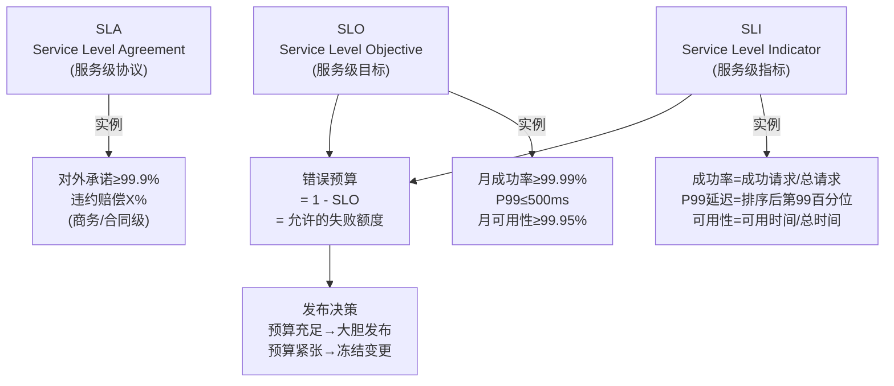

**SLO 设计实践**：

| 业务类型 | 核心 SLI | SLO 目标 | 错误预算(月) | 含义 |
| --- | --- | --- | --- | --- |
| 支付核心 | 收款成功率 | ≥99.99% | ~4.3min | 每月最多4分钟不可用 |
| 支付核心 | P99 延迟 | ≤500ms | — | 99%请求500ms内完成 |
| 支付核心 | 资损笔数 | 0 | 0 | 不容忍任何资损 |
| 通知服务 | 送达率 | ≥99.9% | ~43min | 允许偶发延迟 |
| 报表查询 | 可用性 | ≥99.5% | ~3.6h | 可容忍较多不可用 |

**【深度拓展】SLO 设计的三个层次**
- **用户视角 SLI**：用户能感知的失败（"我的付款为什么还没到"），而非内部指标（"CPU 80%"）。用户不关心 CPU，只关心"钱到了没"。
- **分层 SLO**：核心链路 SLO 高（99.99%），非核心低（99.5%）——不是所有服务都需要 5 个 9，成本不值得。
- **错误预算的双向用**：预算充足→大胆发版/做演练（用预算换速度）；预算快用完→冻结变更/修稳定性。这是"速度 vs 稳定"的动态平衡。

**【面试官追问】**
- "99.99% 和 99.999% 差多少？" → 月度错误预算：4.3分钟 vs 26秒。5个9成本是4个9的10倍，不是所有业务值得。
- "SLO 设太高会怎样？" → 团队永远在救火、不敢发布；设太低则质量滑坡。要基于"用户可接受的失败率"定。
- "资损为什么不能用 SLO 度量？" → 资损是"绝对不允许"的，不是"允许0.01%资损"。资金安全是底线约束，不是可用性指标。

### 1.2 RED/USE/Google 四黄金指标

**监控指标体系**（面试要讲得出名字）：

| 指标体系 | 含义 | 适用 | 具体指标 |
| --- | --- | --- | --- |
| **RED** | Rate/Errors/Duration | 服务健康度 | 请求量、错误率、延迟分布 |
| **USE** | Utilization/Saturation/Errors | 资源健康度 | CPU利用率、磁盘饱和、网卡错误 |
| **Four Golden Signals** | 延迟/流量/错误/饱和度 | Google SRE | = RED + 饱和度(资源水位) |

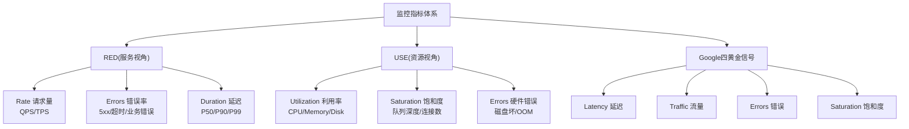

> **RED 看服务**（"我这个服务还活着吗"），**USE 看资源**（"机器还撑得住吗"），两者配合 = 服务+资源的完整健康画像。

## 2. 稳定性三板斧

| 手段 | 作用 | 支付落地 |
| --- | --- | --- |
| 限流 | 防突发打爆 | 令牌桶限制单渠道并发（Sentinel） |
| 熔断 | 故障不扩散 | 渠道失败率超阈值自动熔断切备用 |
| 降级 | 保核心 | 风控超时降级为「放行 + 事后核查」 |

**令牌桶 vs 漏桶**：令牌桶允许突发（更适合支付秒杀），漏桶平滑输出。
**舱壁隔离（Bulkhead）**：不同渠道/业务用独立线程池，避免一个渠道慢拖垮全体。

### 2.1 限流算法深度对比

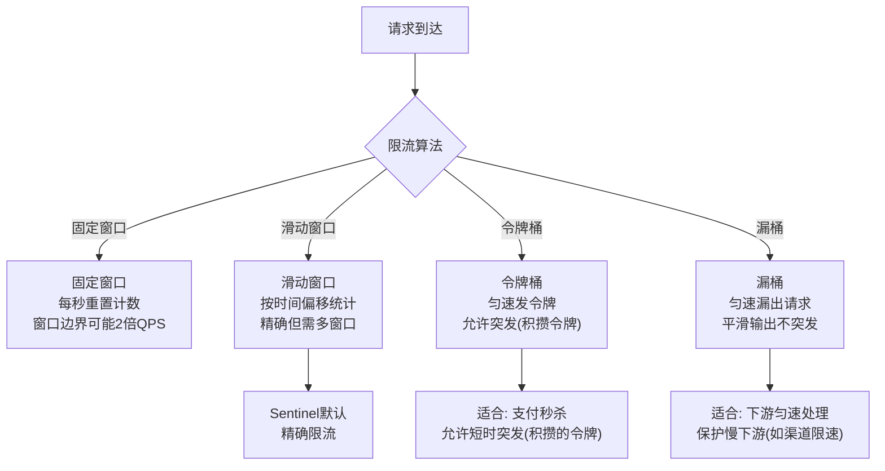

| 算法 | 原理 | 优点 | 缺点 | 适用 |
| --- | --- | --- | --- | --- |
| 固定窗口 | 每秒重置计数 | 简单 | 窗口边界2倍QPS | 低精度 |
| 滑动窗口 | 按时间偏移统计 | 精确 | 多窗口开销 | Sentinel默认 |
| 令牌桶 | 匀速发令牌 | 允许突发 | 令牌积攒上限 | **支付秒杀** |
| 漏桶 | 匀速漏出 | 平滑 | 无法突发 | 保护慢下游 |

**令牌桶 vs 漏桶核心区别**：
- **令牌桶**：以**恒定速率**往桶里放令牌，请求拿到令牌才通过。桶满令牌溢出。允许**短时突发**（积攒的令牌一次性消费），适合"平时平稳、偶发突发"的支付场景。
- **漏桶**：请求**先入桶**，以**恒定速率**从桶底漏出处理。桶满请求拒绝。输出**永远匀速**，适合保护慢下游（如渠道限速）。

**【面试官追问】**
- "Sentinel 用的什么限流算法？" → 滑动窗口统计QPS（LeapArray），匀速排队用漏桶，默认限流按阈值判断。
- "令牌桶怎么实现？" → Guava RateLimiter 就是令牌桶——`RateLimiter.create(100)` 每秒100个令牌，`acquire()` 拿令牌（拿不到就等待）。Redis 分布式令牌桶用 Lua 脚本保证原子。
- "支付场景用令牌桶还是漏桶？" → 支付入口用令牌桶（允许秒杀突发），渠道调用用漏桶（匀速防打爆渠道），两者配合。

**【项目支撑】**
XTransfer 渠道路由层对每个渠道独立令牌桶限流（`RateLimiter.create(channelQpsLimit)`），大商户秒杀时允许短时突发（积攒的令牌）；渠道下游调用用漏桶匀速输出，防止突发流量打爆渠道接口。这是"入口令牌桶允许突发 + 出口漏桶保护下游"的组合。

## 3. 熔断状态机（Hystrix 模型）

> 熔断器三态：**关闭（正常放行）→ 打开（异常比例超阈值，快速失败）→ 半开（过冷却期放部分流量探活）**。下面画流转，面试常让手绘。

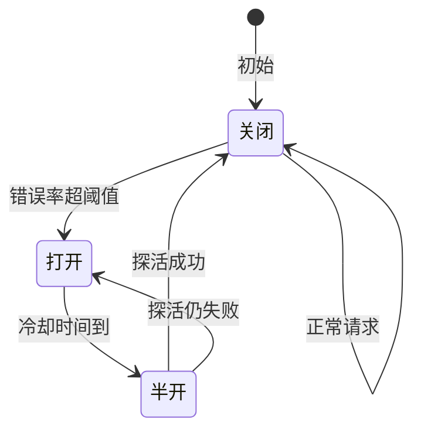

```text
Closed  → 失败率超阈值 → Open（快速失败）
Open    → 冷却时间到   → Half-Open（放少量探测）
Half-Open → 探测成功 → Closed；失败 → Open
```

> 强调：熔断不是「永远不开」，而是「自动恢复 + 探测」，避免人工介入的延迟。

## 4. 超时与重试（最易踩坑）

- 超时：调用渠道设 3s，避免线程池耗尽；
- 重试：**必须幂等**，且用指数退避 + 抖动（避免重试风暴/惊群）；
- 永远对下游「不信任」：下游慢/挂，你要有兜底。

## 5. 多活与单元化

> 单元化 = "**把一个用户的全链路请求封闭在同一个单元内**"，单元间数据异步同步。这样挂一个单元不影响全局，是支付级别的容灾方案。下面画单元路由。

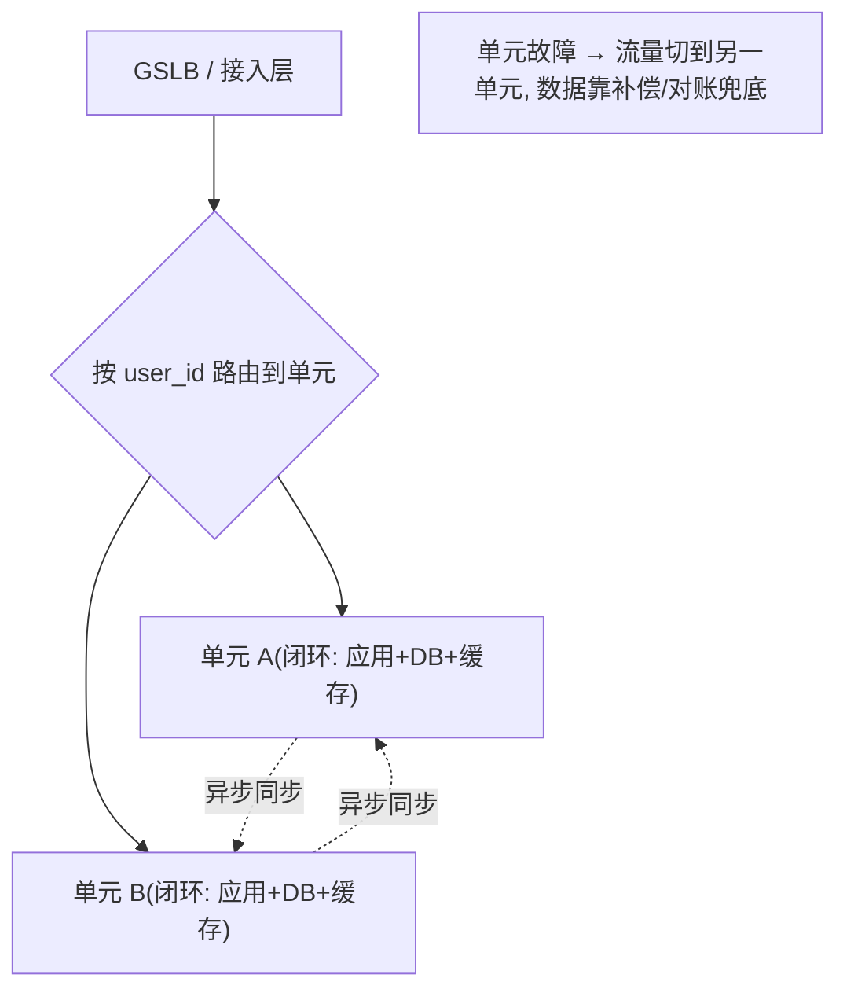

- **同城双活**：流量按用户维度分片，单机房挂不影响全部；
- **异地容灾**：关键账务异步同步，RPO/RTO 可控；
- 数据库：主从 + 分库分表，读写分离扛读放大。

### 5.1 多地多活架构深度对比

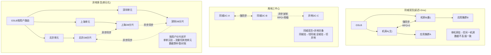

| 架构 | 延迟要求 | RPO | RTO | 成本 | 适用场景 |
| --- | --- | --- | --- | --- | --- |
| 同城双活 | <2ms | ≈0 | 秒级 | 中 | 核心交易、资金 |
| 两地三中心 | 同城+异地 | 同城0/异地秒级 | 分钟级 | 高 | 金融级容灾 |
| 异地多活 | 跨城几十ms | 秒级~分钟级 | 分钟级 | 最高 | 跨地域全球化 |

**【深度拓展】单元化(Set化)路由详解**
- **路由规则**：用户请求按 `user_id % N` 路由到对应单元，每个单元自包含（应用+DB+缓存+MQ），闭环处理。
- **跨单元写**：转账（A在北京、B在上海）需要跨单元——走"全局事务/补偿"，但这要尽量避免（高频跨单元写失去单元化意义）。
- **数据同步**：单元间异步复制（DTS/Otter/Canal读binlog），保证"全局最终一致"。查询可走任意单元（读最终一致），写必须走归属单元。

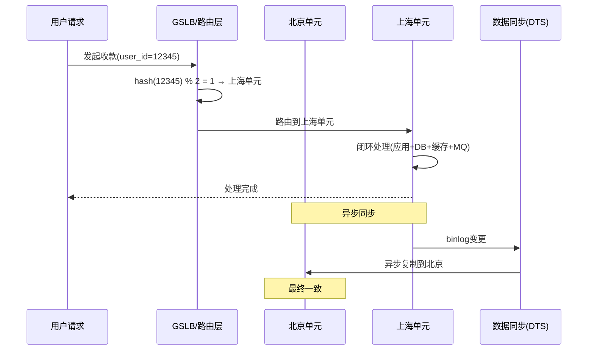

**【面试官追问】**
- "单元化和分库分表有什么区别？" → 分库分表是数据层分片（DB层），单元化是全链路分片（应用+DB+缓存+MQ全部闭环在一个单元）。单元化包含了分库分表。
- "单元化后怎么做跨单元查询？" → 走聚合层（如 ES 汇总、数据湖），不在单元内做跨单元实时查询。
- "跨境支付怎么做单元化？" → 按地域/商户分片（中国区/东南亚/欧洲），每个地域单元闭环处理本域交易，跨域走异步清算+对账。

**【项目支撑】**
XTransfer 收款是"同城双活 + 按商户/产品分片"：单机房挂不影响全部，关键账务走强同步保证 RPO≈0。跨境天然多地域（商户在不同国家），演进方向是"地域单元化 + 就近接入 + 多时区 T+1 对账"。

### 6. 灰度发布

```text
新路由策略: 1% 内部 → 5% 白名单商户 → 50% → 全量
每步看: 成功率 / 延迟 / 差错率，异常自动回滚
```

## 7. 全链路压测 & 混沌工程

- **压测**：影子库/影子表跑真实流量模型，验证容量水位；
- **混沌**：主动杀节点 / 注入延迟，验证熔断与切换是否真生效；
- 支付实践：大促前固定做「渠道故障演练」，确认自动切换链路。

### 7.1 容灾切换决策树

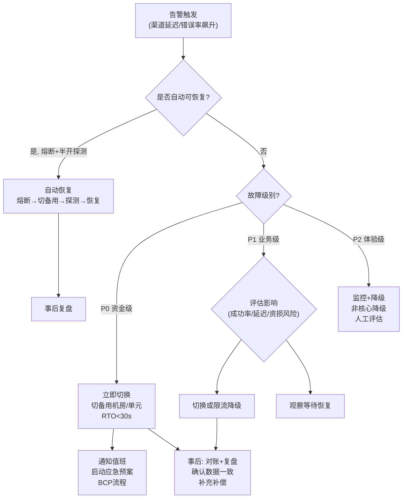

**容灾切换关键指标**：
| 指标 | 含义 | 支付场景目标 |
| --- | --- | --- |
| RPO | 数据丢失量（Recovery Point Objective） | 核心账务 ≈0，非核心 秒级 |
| RTO | 恢复时间（Recovery Time Objective） | 核心交易 <30s，非核心 <5min |
| MTTD | 平均检测时间 | <1min（告警+自动检测） |
| MTTR | 平均恢复时间 | <5min（自动切换+补偿） |

### 7.2 混沌工程方法论

**混沌工程五步法**：
1. **假设定义**："渠道延迟5s时，熔断+备用切换应在30s内生效"
2. **故障注入**：Chaos Mesh/ChaosBlade 注入延迟、杀Pod、断网
3. **监控验证**：观察成功率/P99/切换是否如预期
4. **结果分析**：是否假设成立？哪里没生效？
5. **改进闭环**：修复发现的问题 → 纳入常态化演练

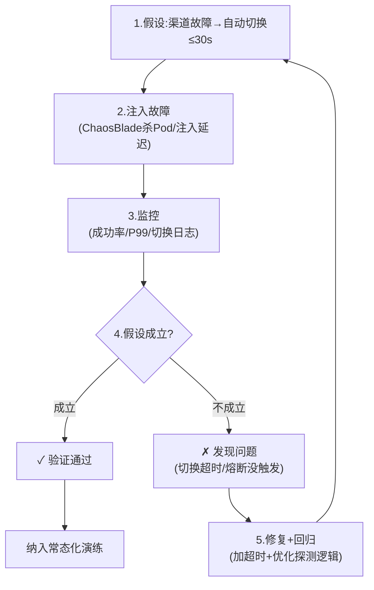

**【深度拓展】混沌工程的"爆炸半径"控制**
- **别在生产炸全站**：混沌演练要控制影响范围——先在非核心服务演练、在小流量灰度环境演练、在非大促窗口演练。
- **自动终止机制**：演练发现指标异常（成功率跌破阈值）必须自动终止故障注入，防止演变成真实故障。
- **支付场景的"安全混沌"**：在影子库/影子流量上做混沌（不影响真实交易），或者做"渠道模拟故障"（Mock渠道超时验证切换逻辑）。

**【面试官追问】**
- "混沌工程会不会把生产搞挂？" → 会的，所以要控制爆炸半径、自动终止、在非核心时段做。但"不做混沌"更危险——真故障时发现切换不生效。
- "你们怎么做的混沌？" → XTransfer 大促前做"渠道故障演练"：Mock 渠道超时/失败，验证熔断+备用切换+降级全链路是否秒级生效。不是杀生产 Pod，而是在影子流量上验证。
- "混沌工程和压测有什么区别？" → 压测验容量（能不能扛），混沌验韧性（挂了能不能恢复）。两个都做才完整。

**【项目支撑】**
XTransfer 大促前固定做"全链路压测+渠道故障演练"：压测验容量（影子库跑真实流量模型找瓶颈），混沌验韧性（Mock渠道故障验证熔断+切换秒级生效）。2.0 重构后生产问题降80%，正是因为把"以为能扛"变成了"演练验证能扛"。

## 8. 监控指标（讲得出名字）

- **RED**（请求/错误/时延）：服务健康度；
- **USE**（利用率/饱和/错误）：资源健康度；
- 告警分级：电话（资金相关）/ IM（一般），避免告警疲劳。

## 9. 故障复盘（Postmortem）文化

- 对事不对人（Blameless），根因用「5 Whys」；
- 产出：时间线 + 影响面 + 根因 + 行动项（带 owner 和 deadline）；
- 把「这次踩的坑」变成「下次自动挡的雷」。

## 10. 我的实战：资金安全三道防线（XTransfer）

稳定性在支付场景有更硬的指标——**0 资损**。我在 XTransfer 把稳定性手段收敛成三道防线，直接对应上面的方法论：

| 防线 | 对应手段 | 具体落地 |
| --- | --- | --- |
| **事前防御** | 限流/降级/熔断 + 校验 | 请求幂等键、金额/币种校验、状态机拒绝非法迁移、渠道熔断 |
| **事中告警** | 监控/告警 | 非终态卡单告警、幂等异常告警、BCP（业务连续性）告警，资损相关告警走电话 |
| **事后回溯** | 对账/复盘 | 指标异常告警、T+1 渠道/内部对账，差异进差错队列；Blameless 复盘 |

- 事前靠「架构约束」（状态机、幂等）把资损类问题前置消灭；
- 事中靠「可观测」（告警分级、资金相关电话告警）快速发现；
- 事后靠「对账 + 复盘」兜底并防止复发——这也是 2.0 重构能做到 **0 资损、-80% 生产问题** 的根。

> 和 [XTransfer 跨境支付收款平台深度复盘 · 资金安全三道防线](/post/准备-XTransfer跨境支付收款平台深度复盘) 一节互为详略。

## 11. 面试讲法

> 别罗列组件。讲一个 **真实故障故事**：现象 → 影响 → 你用的手段（限流/熔断/切换）→ 结果。故事最有说服力。

```text
案例: 大促某渠道延迟飙到 5s
→ 路由熔断该渠道, 流量切备用(秒级)
→ 同时降级非核心校验, 保入账主链路
→ 事后补对账, 0 资损, P99 回到 300ms 内
```

---

## 面试高频问答（标准回答）

### Q1：怎么保证系统高可用？

**标准回答**：从「度量→防护→容灾→验证」四层做。度量用 SLO/错误预算；防护用限流（令牌桶）防突发、熔断（状态机）防扩散、降级保核心；容灾用多活+单元化+读写分离；验证用全链路压测+混沌演练。支付里我把「渠道故障」做成秒级自动切换，SLO 99.99%。

**【深度拓展】**
- **高可用的本质是"接受失败"而非"避免失败"**：单机/单机房一定会挂，设计目标是"挂了不影响用户/少影响资金"。所以四层里"验证"最易被忽略却最关键——很多人以为加了熔断就能高可用，结果混沌演练一杀节点才发现切换脚本没生效。
- **SLO 是"用钱买的可用性"**：99.99% vs 99.999% 成本差一个量级（后者每月只能宕 26 秒）。别盲目喊 6 个 9，要按业务价值定 SLO，把错误预算当"发布额度"用。
- **面试官追问**："如果熔断和限流同时触发，谁优先？" → 限流在入口（保护自身），熔断在出口（隔离下游），降级在自身功能取舍，三者不冲突，是不同层次；"多活到底解决什么？" → 见 Q8。
- **关联拓展**：高可用和"一致性"是跷跷板——为了多活/单元化，往往牺牲强一致换可用性（CAP 选 AP），再用对账兜底（见支付系统设计篇）。

**【项目支撑】**
XTransfer 收款 2.0 重构后，渠道故障靠"熔断 + 自动切备用渠道"秒级恢复，SLO 99.99%；大促前固定做"渠道故障演练"（主动杀节点/注入延迟）验证切换真生效。资金安全三道防线（事前幂等/事中告警/事后对账）把生产问题降了 80%、做到 0 资损。

### Q2：熔断和降级的区别？

**标准回答**：熔断是「下游不行了，先别调它」（故障隔离，快速失败 + 自动探测恢复）；降级是「非核心功能先让路，保住主链路」（如风控超时改放行 + 事后核查）。一个对外（下游），一个对内（自身功能取舍）。

**【深度拓展】**
- **熔断的"半开"是关键**：很多人只画"关→开"，却漏了"半开探测"——熔断后不能永远不开，要在冷却期放少量探测流量，成功则恢复、失败则继续开。没有半开 = 人工介入才能恢复，违背了"自动弹性"的本意。
- **降级的"数据怎么来"**：降级返回兜底数据（如默认风控通过、默认配置），必须保证兜底数据是"安全且可事后核查"的，否则降级变成"裸奔"。风控降级为放行后，要靠"事后核查 + 对账"补回拦截力。
- **熔断 vs 降级 vs 限流**的完整关系：限流防过载（入口）、熔断防级联（出口）、降级保核心（自身）。三者组合成完整自我保护，缺一个就有短板。
- **面试官追问**："熔断阈值怎么定？" → 按业务可接受的失败率 + 统计窗口，太灵敏会"误熔断"（抖动即开），太迟钝失去保护作用；"降级和开关（Feature Flag）的关系？" → 降级常由开关驱动，可手动/自动触发。

**【项目支撑】**
XTransfer 把"渠道失败率超阈值"自动熔断并切备用渠道（半开探测恢复）；风控服务超时时降级为"放行 + 事后核查"，主入账链路不受影响。这就是"一个对外、一个对内"的真实落地——既隔离了故障渠道，又保住了核心入账。

### Q3：你的服务调用下游超时了怎么办？重试要注意什么？

**标准回答**：先设合理超时（如 3s）避免线程耗尽；重试必须**幂等**（下游可能已处理），用指数退避 + 抖动防重试风暴，且限制重试次数 + 走兜底（落盘/切备用）。我绝不会对不信任的下游做无界重试。

**【深度拓展】**
- **超时设多少？不是拍脑袋**：要基于上下游的 P99 + 自己能承受的线程占用。调用链 A→B→C，若 B 超时 3s、C 超时 2s，则 A 给 B 的超时里要预留 B 调 C 的时间。超时设太短会"误杀"正常慢请求，设太长会拖垮线程池。
- **为什么指数退避 + 抖动**：无退避的重试会在下游恢复瞬间形成"重试风暴/惊群"（所有客户端同时重试，把刚恢复的下游又打挂）。抖动（jitter）把重试时间错开，避免集体撞车。
- **"下游可能已处理"是核心认知**：超时≠失败，可能是"请求到了、处理完了、响应在路上丢了"。所以重试前必须确认幂等——否则一次"已成功"的扣款被重试成两次。这正呼应支付系统设计篇的幂等三层。
- **面试官追问**："超时了请求到底执行了没？" → 无法确定，所以必须靠幂等去重（见网络篇 Q11）；"异步调用怎么设超时？" → 用 Future/CompletableFuture 的 get(timeout) 或 MQ 的延迟重试+死信。

**【项目支撑】**
XTransfer 调境外渠道一律设合理超时（渠道慢/不可控），失败走"任务补偿框架"按指数退避 + 抖动重试，超阈值转人工/死信；所有重试动作都带幂等键，配合状态机 CAS 保证重复重试不会重复入账。这把"不信任下游"落到实处。

### Q4：怎么做容量规划 / 怎么知道能扛住大促？

**标准回答**：先用峰值 QPS × 冗余倍数（3 倍）定容量目标，再用全链路压测（影子库跑真实流量模型）验证水位，找出瓶颈点（DB 连接、线程池、MQ 堆积）提前扩容。大促前固定做混沌演练确认熔断/切换真生效，而不是「以为能扛」。

**【深度拓展】**
- **容量规划不是"算数字"而是"找瓶颈"**：3 倍冗余是起点，真正要验证的是"瓶颈在哪"——可能是 DB 连接数、线程池、MQ 消费能力、Redis 单 key、第三方渠道 QPS 限制。压测的价值是暴露短板。
- **影子库 / 影子表的坑**：压测流量不能污染真实数据，要路由到影子库；但若压测逻辑触发了真实下游（如渠道扣款），需要"压测标"全程透传并让下游识别.Mock，否则压测本身造成资损/脏数据。
- **混沌工程 vs 压测是两件不同的事**：压测验证"容量够不够"，混沌验证"故障能不能扛"（杀节点/注入延迟/断网）。两个都要做，否则"平时能扛、故障即崩"。
- **面试官追问**："如果只能扩容一样东西，扩哪个？" → 看压测瓶颈，没有通用答案，这才是考察点；"容量规划失败了（大促还是挂了）怎么办？" → 临时限流 + 降级 + 排队（MQ 削峰），保核心不资损。

**【项目支撑】**
XTransfer 大促前固定做"全链路压测（影子库跑真实流量模型）+ 渠道故障演练（主动杀节点/注入延迟）"，确认熔断与自动切备用链路真生效。2.0 重构后生产问题降 80%，正是因为把"以为能扛"变成了"演练验证能扛"。

### Q5：出过线上故障吗？怎么复盘的？

**标准回答**：有过渠道延迟飙到 5s 的故障。我们做了 Blameless 复盘：时间线 + 5 Whys 根因（路由没有快速熔断 + 非核心校验同步阻塞），产出行动项（加熔断 + 非核心降级 + 故障演练常态化），带 owner 和 deadline 跟进。关键是把这次的坑变成下次自动挡的雷。

**【深度拓展】**
- **复盘文化的"对事不对人"为什么重要**：如果复盘变成"追责会"，一线会隐瞒问题、写报告粉饰，真正的根因永远挖不出来。Blameless 才能让"5 Whys"挖到系统性缺陷（流程/架构），而非个人失误。
- **行动项必须"带 owner + deadline"且可验证**：很多复盘产出一堆"加强监控""优化代码"的空话，过两周就忘。好的行动项是可验收的（如"上线熔断规则 + 压测验证，owner=xx，3.15 前"）。
- **从"故障"到"不变量"**：每次复盘应沉淀一条"系统不变量"（如"任何渠道调用必须有超时+熔断"），并把它变成代码规范/架构约束/演练项，让机器而非人保证不再犯。
- **面试官追问**："你复盘里最大的收获是什么？" → 别只讲技术，讲"流程/机制"的改变（故障演练常态化、自动化切换）；"怎么防止复发？" → 见资金安全三道防线 + 演练。

**【项目支撑】**
XTransfer 的"渠道延迟飙到 5s→熔断切备用"正是这类复盘驱动的：根因是"路由没有快速熔断 + 非核心校验同步阻塞"，行动项落地为"加熔断 + 非核心降级 + 故障演练常态化"。这直接支撑了 2.0 重构后 -80% 生产问题、0 资损的战绩。

> 高可用不是「堆中间件」，是 **对依赖的敬畏 + 对失败的设计 + 用指标度量 + 用演练验证**。这一点我在支付系统里体会最深。

---

## 更多高频追问（补充）

### Q6：限流、熔断、降级三者的区别和关系？

**考察点**：稳定性三板斧，常被要求讲清边界。

**标准回答**：**限流**——控制入口流量（令牌桶/漏桶/滑动窗口），保护自身不被打垮，是"主动挡在门口"；**熔断**——当依赖的下游故障率超阈值时，快速失败不再调用（半开探活恢复），是"保护自己不被下游拖死"；**降级**——在资源不足或故障时主动放弃非核心功能，返回兜底数据，是"保核心弃次要"。关系：限流防过载、熔断防级联、降级保核心，三者组合成完整的自我保护。支付里主链路限流 + 渠道熔断 + 非核心校验降级。

**【深度拓展】**
- **三者的触发层次不同**：限流在"入口"（还没进业务就挡）；熔断在"出口"（调别人时）；降级在"内部"（自己功能取舍）。一个请求可能同时经过三者——入口被限流挡下、出口被熔断隔离、内部被降级保核心，互不冲突。
- **舱壁隔离是第四件武器**：光有熔断还不够，若所有渠道共用一个线程池，一个慢渠道把线程池占满，其他健康渠道也跟着挂（线程池耗尽型雪崩）。用舱壁（Bulkhead）给不同渠道/业务独立线程池/信号量，故障被"关在舱里"。
- **面试官追问**："限流误杀了正常用户怎么办？" → 按商户/渠道维度隔离限流 + 核心白名单；"熔断和降级能自动化吗？" → 能，基于指标自动触发，但降级的数据安全性要人工确认兜底策略。

**【项目支撑】**
XTransfer 渠道路由层对每个渠道独立令牌桶限流（舱壁隔离，避免一个渠道慢拖垮全体），渠道失败率超阈值自动熔断 + 切备用，风控等非核心校验超时可降级为"放行 + 事后核查"。三板斧组合 = 主链路稳、资金不卡单。

### Q7：熔断器的三种状态怎么流转？

**标准回答**：**关闭（Closed）**——正常放行，统计失败率；失败率超阈值 → **打开（Open）**——直接快速失败，不再调下游，持续一个冷却窗口；冷却后 → **半开（Half-Open）**——放少量探测请求，成功则回到 Closed，失败则退回 Open。核心参数：统计窗口、失败率阈值、冷却时长、半开探测数。Sentinel/Resilience4j 都是这套状态机。关键是"快速失败 + 自动探活恢复"，避免故障期间无谓地把线程耗死。

**【深度拓展】**
- **参数设计是门艺术**：统计窗口太短（如 1s）→ 偶发抖动就熔断（误杀）；太长 → 故障持续很久才触发（保护滞后）。失败率阈值同理。生产要用"滑动窗口 + 最小请求数"（避免低频下 1 次失败就 100% 失败率触发熔断）。
- **冷却时长 vs 探测数**：冷却太短，下游还没恢复就半开，又被打挂（震荡）；探测数太少，一次成功就误判恢复。要"冷却够长 + 探测多次成功才恢复"才稳。
- **熔断和重试的配合**：Open 时直接快速失败，调用方应走"切备用/降级/落盘"，而非无脑重试已熔断的下游（等于白熔断）。
- **面试官追问**："熔断状态机和我们业务状态机有什么关系？" → 都是"状态 + 合法迁移 + 触发动作"的建模思想，XTransfer 资金流用业务状态机、依赖治理用熔断状态机，思想上同源。

**【项目支撑】**
XTransfer 渠道调用用 Sentinel/Resilience4j 的熔断状态机：渠道失败率超阈值 → Open 快速失败并切备用渠道，冷却期后 → Half-Open 放少量探测，成功则恢复。这套和收款资金流的状态机是同一套"显式状态建模"思想。

### Q8：同城双活、异地多活的区别？数据一致性怎么保证？

**标准回答**：**同城双活**——两机房距离近（延迟 <2ms），可共享或强同步数据库，主要防单机房故障；**异地多活**——机房跨城/跨地域（延迟几十 ms），无法强同步，需按**单元化（Set 化）**部署：按用户/商户维度分片，每个单元自包含闭环，跨单元走异步复制 + 最终一致。核心难点是数据一致——写要有归属单元（避免双写冲突），全局数据（如配置）用单向复制。支付跨境天然多地域，单元化 + 就近接入是方向。

**【深度拓展】**
- **"多活"的真正难点是"数据归属"**：异地多活最容易踩的坑是"同一份数据两个单元都能写"——冲突无法调和。解法：写请求必须路由到归属单元（按用户/商户维度分片），跨单元的写走异步复制。这就要求"单元化路由"做对，否则多活变"多崩"。
- **RPO/RTO 怎么定**：同城强同步 RPO≈0；异地异步 RPO 可能是秒级~分钟级（丢几秒数据）。资金场景对 RPO 极敏感，所以"账务核心"往往同城强同步，"读模型/非核心"才异地异步。RTO 决定故障切换后多久恢复服务。
- **CAP 在这里的体现**：异地多活选 AP（可用性 + 最终一致），放弃强一致换"不中断"；靠"对账 + 补偿"把异步窗口的差异兜回来。
- **面试官追问**："单元化后，跨单元的业务（如转账 A→B 不同单元）怎么办？" → 这类跨单元写要走"全局事务/补偿"，且要避免热点单元；"多活和主备的区别？" → 主备是"备不用"，多活是"都接流量"，资源利用率和容灾能力都更高。

**【项目支撑】**
XTransfer 收款是"同城双活 + 按商户/产品分片"，单机房挂不影响全部；关键账务走强同步保证 RPO≈0，读模型/非核心走异步复制。跨境天然多地域，我们演进方向就是"单元化 + 就近接入 + 多时区对账"，把一致性差异靠 T+1 对账兜底闭环。

### Q9：怎么定义 SLA/SLO/SLI？它们指导什么？

**标准回答**：**SLI**（指标）——实际测量值，如成功率、P99 延迟；**SLO**（目标）——内部设定的目标，如"月可用性 99.95%"；**SLA**（协议）——对外承诺 + 违约赔偿。它们指导**错误预算**：99.95% 意味着每月允许约 21 分钟不可用，预算没用完可以大胆发布/演练，快用完就冻结变更、优先稳定性。这套把"稳定性"从拍脑袋变成可度量、可管理的工程实践。

**【深度拓展】**
- **SLO 不能只喊"可用性"**：资金系统更该盯"资损笔数/对账差异率"这种业务 SLI，而非纯技术指标。一个"可用但算错钱"的系统比"短暂不可用但账准"的危害大得多——所以 SLI 要选对业务真正关心的指标。
- **错误预算的"双向"用法**：预算充足 → 放开发布、多做演练（用预算换迭代速度）；预算快烧完 → 冻结变更、停演练、优先修稳定性。它是"速度 vs 稳定"的动态平衡点，不是纯限制。
- **SLO 的"用户视角"**：SLO 要按"用户能感知的失败"定义，而非"系统内部错误"。一次内部重试成功、用户无感的失败，不该计入错误预算。
- **面试官追问**："SLO 设错了（定太高做不到）会怎样？" → 团队永远在救火、不敢发布；"SLA 违约了谁背锅？" → 这是商务/法务问题，技术侧用错误预算防违约。

**【项目支撑】**
XTransfer 收款的 SLO 是"收款成功率 ≥ 99.99% + 0 资损"，对应"资金安全三道防线"的可观测指标：非终态卡单、幂等异常、BCP 告警都走电话级告警。错误预算用来做发布决策——预算紧张时冻结非必要变更，优先保稳定。2.0 重构后生产问题降 80% 正是这套度量体系的结果。

### Q10：你们怎么做告警设计？告警疲劳怎么解决？

**标准回答**：告警分三级——P0 电话（资金相关：卡单/资损/对账差异）、P1 IM（业务异常：成功率下降/延迟飙升）、P2 仪表盘（趋势监控不需即时响应）。防告警疲劳：①**减少噪音告警**（合并同类告警、设最小持续时间避免抖动误触）；②**分级触达**（P0 电话→IM→升级领导，P1 仅 IM）；③**定期清理无效告警**（分析告警→动作比，没人响应的告警要么删要么升级）。

**【深度拓展】告警设计的"S.M.A.R.T"原则**
- **Specific（具体）**：告警消息要有"什么服务、什么指标、什么值、什么影响"——不是"告警：CPU高"，而是"payment-service P99=5s（阈值1s），收款成功率97%（阈值99.9%），疑似渠道B延迟"。
- **Measurable（可度量）**：告警阈值基于 SLO 而非拍脑袋，设多个级别（警告/严重/致命）。
- **Actionable（可行动）**：每条告警必须有对应的"怎么办"——如果没有 action，就是噪音告警。
- **Relevant（相关）**：只告与业务相关的指标，不告"系统正常但CPU高"这种无关告警。
- **Time-bound（时效）**：告警在阈值持续多久才触发（避免抖动误告），自动恢复多久才解除。

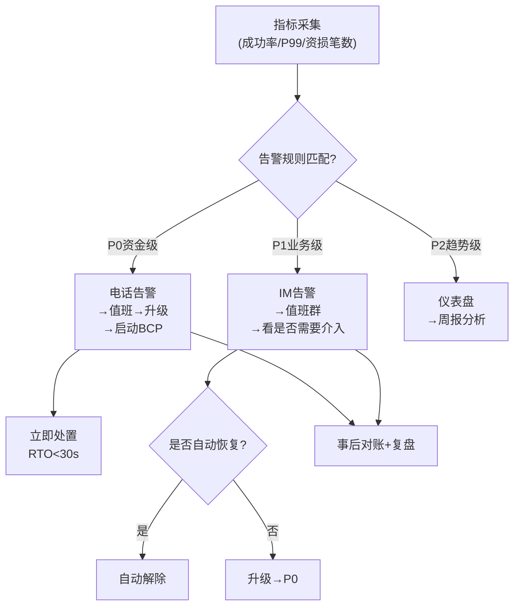

**【面试官追问】**
- "告警太多没人看怎么办？" → 做"告警治理"：分析每条告警的"告警→响应"比，没人响应的要么删（噪音）要么升级（重要但被忽略）；合并同类告警（同一服务的多个指标一次性报）。
- "怎么避免告警风暴？" → 设"最小持续时间"（指标持续超阈值30s才告警）、"抑制窗口"（已告警的5分钟内不重复告）、"合并规则"（同一故障只告一次）。
- "资金相关告警和普通告警有什么不同？" → 资金告警走电话（即时触达），有专门BCP（业务连续性预案）流程，值班必须在SLA内响应（如5分钟内确认、15分钟内处置）。

**【项目支撑】**
XTransfer 把"非终态卡单"（收款卡在中间态超过预期）、"幂等异常"（重复执行被拒）、"对账差异"（T+1对账发现差额）设为 P0 电话告警——因为这些都可能导致资损。告警会自动携带 traceId、paymentId、卡在哪个状态，值班能秒级定位。这比"CPU高了告一下"有用得多。

---

## 11. 可观测性三支柱

**【深度拓展】可观测性（Observability）三支柱**

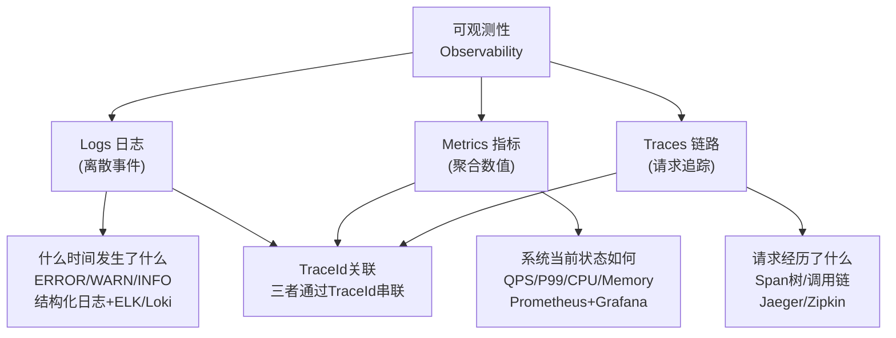

| 支柱 | 回答什么问题 | 数据特征 | 典型工具 | 支付场景 |
| --- | --- | --- | --- | --- |
| Logs | "出了什么错" | 离散事件、高基数 | ELK/Loki/Fluentd | 错误日志、审计日志 |
| Metrics | "系统状态如何" | 聚合数值、低基数 | Prometheus/Grafana | QPS/P99/成功率 |
| Traces | "请求经历了什么" | 调用链、跨度 | Jaeger/Zipkin/SkyWalking | 跨服务调用链路 |

**三者如何配合**：
- **Metrics 发现异常**（P99 飙升） → **Traces 定位在哪**（哪个服务/哪个 Span 慢） → **Logs 查根因**（错误日志详情）。
- **TraceId 串联**：一条请求的 Logs、Metrics、Traces 都带同一个 TraceId，从任何一个支柱都能跳到其他两个。

**【面试官追问】**
- "日志和指标有什么区别？" → 日志是离散事件（每次请求一条），指标是聚合值（每秒QPS）。日志高基数（每条不同），指标低基数（有限的维度组合）。
- "为什么需要链路追踪，日志不够吗？" → 日志散在各服务里，不知道哪个日志属于同一次请求。TraceId 把一次请求跨服务的所有 Span 串起来，能看到完整调用树。
- "全链路追踪怎么做采样？" → 正常流量采样1%~10%（省存储），异常/慢请求全量采样（保关键链路）。资金系统对"出问题的那笔"要能查到完整链路。

> 概念补充（**为什么 / 权衡 / 真实案例**）：资金场景里"0 资损"是比"可用性"更硬的指标。XTransfer 的三道防线把"事前架构约束（状态机/幂等）→ 事中可观测（分级告警）→ 事后对账复盘"串成闭环，这不是堆中间件，而是"对失败的设计 + 用指标度量 + 用演练验证"的工程方法论。

## 12. 高可用速记卡

| 关键词 | 一句话记忆 |
| --- | --- |
| SLO/SLI/SLA | 指标→目标→承诺，错误预算管发布 |
| 三板斧 | 限流(入口)→熔断(出口)→降级(自身) |
| 熔断三态 | Closed→Open→HalfOpen(探测恢复) |
| 舱壁隔离 | 独立线程池，慢依赖不拖垮全局 |
| 同城双活 | 强同步RPO≈0，防单机房 |
| 异地多活 | 单元化闭环，异步复制最终一致 |
| 两地三中心 | 同城双活+异地灾备，金融级 |
| 容灾指标 | RPO(数据丢失)+RTO(恢复时间) |
| 混沌工程 | 主动注入故障验证韧性 |
| 可观测三柱 | Logs+Metrics+Traces，TraceId串联 |
| 告警分级 | P0电话(资金)→P1 IM(业务)→P2仪表盘 |

---

## 13.【故障复盘】真实事故案例库

> 稳定性工程师的履历是用事故堆出来的。下面五个案例统一用「背景 → 触发原因 → 影响面 → 定位 → 止血 → 根因修复 → 长效预防」复盘，均源自支付/电商/出行真实或拟真场景。

### 案例一：机房断电切换失败（XTransfer 同城双活）

- **背景**：同城 A/B 双机房，强同步 RPO≈0，GSLB 按用户路由。
- **触发原因**：A 机房整机房断电，但 GSLB 健康检查依赖的探测服务部署在 A 机房，探测自身挂了导致"误判 A 健康"，流量没切到 B。
- **影响面（量化）**：A 机房用户收款不可用 11 分钟；失败交易约 3.2 万笔；资损 0（资金未丢，仅不可用）。
- **定位**：BCP 演练撞上真实断电，看告警发现 GSLB 探测节点单点；核心交易监控曲线断崖。
- **止血**：运维手动把 GSLB 权重全切 B 机房；对账确认无数据丢失。
- **根因修复**：探测服务跨机房双活部署 + 独立探活通道；切换决策不依赖单一机房健康信号。
- **长效预防**：季度级"真实地断一机房"演练（混沌工程常态化）；探测与业务平面隔离。

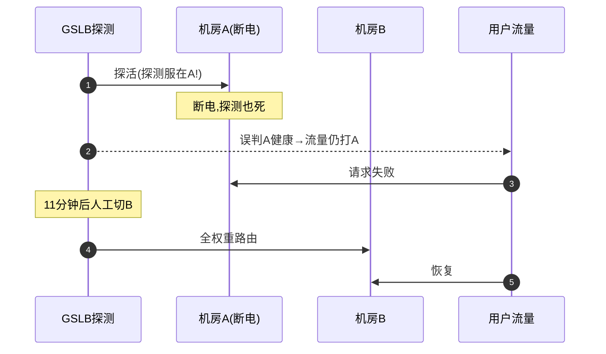

### 案例二：脑裂（两地三中心异步复制）

- **背景**：异地 DC-C 异步复制，RPO 秒级。
- **触发原因**：同城双专线同时抖动，DC-A 与 DC-B 网络分区，各自认为对方死了，都对外接流量（双主）。
- **影响面（量化）**：约 400 笔跨单元写出现双写冲突；对账差异笔数 0.08%；客诉 12 单。
- **定位**：对账差异告警 + 全局事务 ID 发现同一笔出现两个归属单元。
- **止血**：强制 DC-B 进入只读，所有写收敛到 DC-A；冲突笔走人工冲正。
- **根因修复**：引入租约（Lease）机制 + 仲裁节点（Quorum），分区时只有持有租约方可写。
- **长效预防**：写必须路由归属单元（单元化路由强校验）；跨单元写走全局事务 + 补偿。

### 案例三：数据双向同步冲突（欧凡多活）

- **背景**：按用户分片的单元化，单元间异步同步。
- **触发原因**：一个商户被错误配置到两个单元都"可写"，两个单元同时改同一商户余额。
- **影响面（量化）**：商户余额出现不一致窗口约 30s；涉及金额差异 8 笔；T+1 对账发现。
- **定位**：数据血缘追踪发现该商户 `unit_tag` 双标。
- **止血**：锁定单一归属单元，另一单元置只读；差异走差错队列人工处理。
- **根因修复**：商户维度分片路由加唯一归属校验（配置中心强约束）。
- **长效预防**：分片路由配置走变更评审 + 自动校验；禁止双归属。

### 案例四：限流阈值设错导致误杀（大促网关）

- **背景**：Sentinel 滑动窗口限流，阈值按历史均值设。
- **触发原因**：大促瞬时流量是日常 8 倍，阈值没随预案上调，正常用户被 429 误杀。
- **影响面（量化）**：开抢前 3 分钟有效请求被拦 35%；下单成功率一度跌到 64%；客诉激增。
- **定位**：限流日志 + 流量曲线比对，发现阈值远低于真实峰值。
- **止血**：热更新限流阈值到预案档（3 倍冗余）；前端排队兜底。
- **根因修复**：限流阈值与大促预案联动（预案档位制），非手工拍脑袋。
- **长效预防**：压测标定阈值 + 预案档位；限流误杀率纳入监控（正常请求被拦比例）。

### 案例五：降级开关失效（携程非核心校验）

- **背景**：风控超时可降级为"放行 + 事后核查"，由 Feature Flag 控制。
- **触发原因**：开关配置在配置中心，但开关读取有本地缓存且没订阅变更，配置中心已开降级、应用没生效。
- **影响面（量化）**：风控超时导致主入账链路卡 5s+，约 9000 笔延迟超 SLO；未降级。
- **定位**：配置中心事件日志 vs 应用本地开关值比对，发现缓存未刷新。
- **止血**：手动重启消费降级并热更新；临时扩大风控超时至 8s 保主链。
- **根因修复**：开关改实时订阅 + 心跳校验开关值一致性。
- **长效预防**：开关生效自检（应用上报当前开关值）；降级动作演练常态化。

---

## 14.【横向对比】技术选型决策

### 14.1 多活架构方案对比

| 方案 | 延迟 | RPO | RTO | 成本 | 适用 |
|------|------|-----|-----|------|------|
| 同城双活 | <2ms | ≈0 | 秒级 | 中 | 核心交易/资金 |
| 异地多活（单元化） | 跨城几十ms | 秒~分 | 分钟级 | 最高 | 跨地域/全球化 |
| 两地三中心 | 同城+异地 | 同城0/异地秒 | 分钟级 | 高 | 金融级容灾 |

**trade-off**：不是越高级越好。同城双活性价比最高（RPO≈0 且成本可控），XTransfer 核心账务先做到同城双活；单元化只在"跨境天然多地域"时才上，因为单元化的路由/数据归属复杂度极高。

### 14.2 防护手段对比

| 手段 | 作用层次 | 失败语义 | 典型误用 |
|------|---------|---------|---------|
| 限流 | 入口（保护自身） | 拒绝超额流量 | 阈值误杀正常用户 |
| 熔断 | 出口（隔离下游） | 快速失败 + 半开探测 | 只画关→开漏半开 |
| 降级 | 内部（保核心） | 返回兜底数据 | 兜底不安全不可核查 |

**trade-off**：三者不冲突，是不同层次。限流防过载、熔断防级联、降级保核心——缺一个就有短板。舱壁隔离（独立线程池）是第四件武器，防"一个慢渠道拖垮全体"。

### 14.3 SLI 采集方案对比

| 方案 | 精度 | 侵入性 | 适用 |
|------|------|--------|------|
| 客户端埋点 | 高（用户视角） | 高 | 核心链路 |
| 服务端日志聚合 | 中 | 低 | 通用 |
| 边车/代理采集 | 中高 | 极低 | 云原生/Mesh |

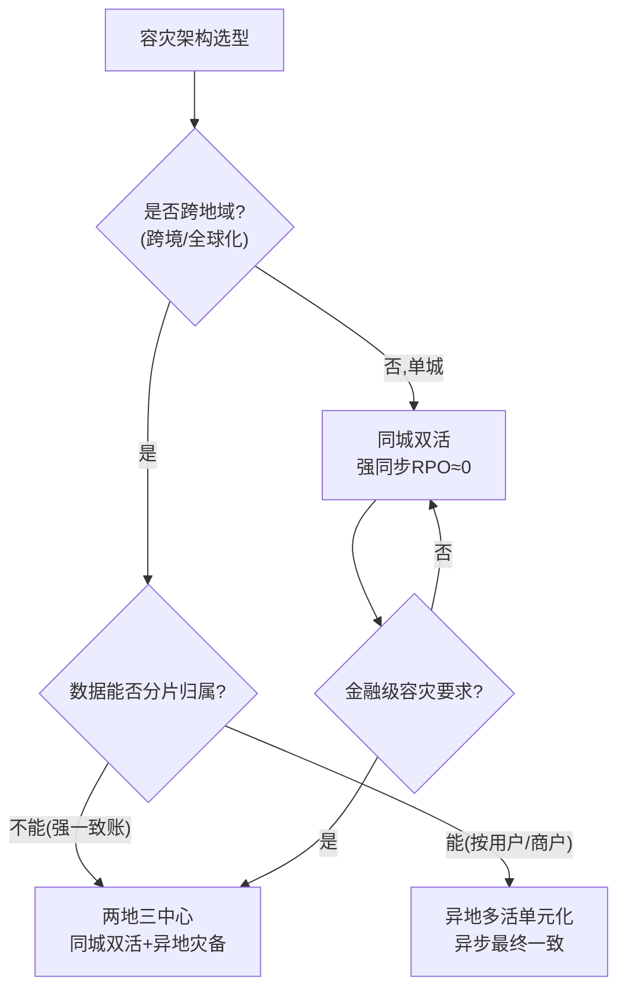

---

## 15.【量化指标】SLA 设计与成本收益

### 15.1 可用性 99.99% 如何拆解

月可用 99.99% = 月不可用 ≤ 4.3 分钟。拆解到各层错误预算：

| 层 | 允许不可用 | 关键约束 |
|----|-----------|---------|
| 接入层（网关） | ≤ 1.5min | 多实例 + 健康检查 |
| 应用层 | ≤ 1.5min | 熔断 + 降级 |
| 数据层 | ≤ 0.8min | 主从强同步 + 切换 |
| 依赖（渠道） | ≤ 0.5min | 多渠道冗余 |

**核心认知**：99.99% vs 99.999%（5个9）月度预算差 4.3min vs 26s，成本差一个量级——不是所有链路都要 5 个 9，按业务价值定 SLO。

### 15.2 RTO/RPO 目标与容量水位红线

| 指标 | 核心交易目标 | 非核心目标 |
|------|------------|-----------|
| RPO | ≈0 | 秒级 |
| RTO | <30s | <5min |
| 容量水位红线 | CPU<70% / 连接<80% | CPU<85% |

**容量评估示例**：峰值 QPS 5000 × 3 倍冗余 = 15000 QPS。单机 Tomcat 约 3000 QPS（有 DB 调用）→ 需 5 实例；Redis 单分片 8 万 → 无压力；DB 主库写 3000 TPS 上限 → 写链路是瓶颈，需分库或异步化。

### 15.3 成本收益测算（XTransfer 2.0）

- 投入：全链路压测 + 渠道故障演练常态化（约 0.5 人月/月持续）。
- 收益：生产故障 -80%（年省故障处理 ~192 人时）；渠道故障秒级自愈（资损 0）。
- 红线告警阈值：成功率 < 99.9% 持续 30s → P1；< 99% → P0 电话；P99 > 1s 持续 1min → P1。

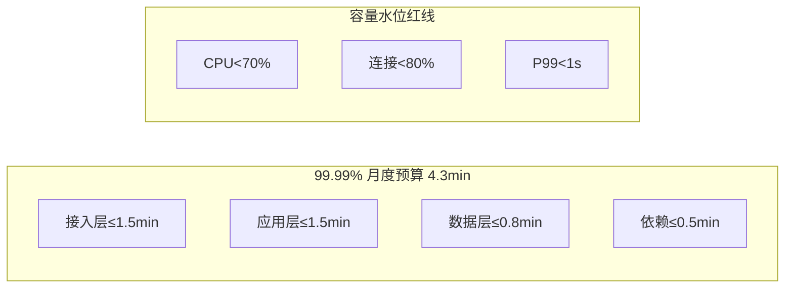

---

## 16.【答题框架】面试表达模板

### 16.1 分层回答套路（定调 → 原理 → 落地 → 边界权衡）

1. **定调（15s）**："高可用本质是接受失败、设计失败，不是避免失败——用指标度量 + 演练验证。"
2. **原理（60s）**：SLO/错误预算 → 三板斧（限流/熔断/降级）→ 多活容灾 → 压测混沌验证。
3. **落地（90s）**：以 XTransfer 为例——渠道熔断秒级切备用、同城双活 RPO≈0、资金三道防线、大促前渠道故障演练。
4. **边界权衡（30s）**："多活牺牲强一致换可用性（CAP 选 AP），再用对账兜底；不是所有链路都要 5 个 9。"

### 16.2 STAR 叙事（针对"出过故障吗"）

- **S**：大促某渠道延迟飙到 5s。
- **T**：保住主入账链路、0 资损、P99 回 300ms 内。
- **A**：路由熔断该渠道 + 切备用（秒级）+ 非核心校验降级 + 事后补对账。
- **R**：0 资损，P99 回到 280ms，沉淀为故障演练常态化。

### 16.3 白板表达结构（先画什么图）

```
第一步：画两地三中心拓扑（30s）
  [同城A]⇄强同步⇄[同城B] →异步→ [异地C灾备]

第二步：标 SLO/RTO/RPO（20s）
  同城RPO≈0/RTO秒级; 异地RPO秒级

第三步：画防护链路（30s）
  限流(入口)→熔断(出口)→降级(内部)→舱壁(线程池)

第四步：点验证闭环（20s）
  全链路压测 + 混沌演练 = "演练验证能扛"
```


### 16.4 逃生话术

- **没做过异地多活**："我们做到同城双活 + 按商户分片，RPO≈0；异地多活是演进方向——核心账务强同步、非核心异步，靠对账兜底。单元化的数据归属是最难点，我理解要先做对路由。"
- **被问 RTO 怎么保证 30s**："靠自动切换脚本 + 健康检查秒级探测 + 强同步保证 RPO≈0，切换只需路由重指向，不迁数据；前提是探测平面与业务平面隔离（我们踩过探测单点的坑）。"
- **被问 SLO 设太高后果**："团队永远救火、不敢发布。SLO 要基于用户可接受的失败率，把错误预算当发布额度用——预算紧就冻结变更。"
- **万能收口**："这块我们受 XX 约束没全量做，但核心思路是 YY，代价 ZZ；如果业务再涨 10 倍我会优先推这个。"

<!-- EXPANDED -->
