## 0. 需求拆解（先问清楚再设计）

- 功能：多币种收款、渠道路由、实时入账、T+1 对账、风控拦截；
- 非功能：高可用（99.99%）、最终一致、低延迟（P99 < 300ms）、可审计；
- 规模：峰值 5k TPS，日订单 3000w，数据留存 5 年。

> 系统设计的开场白：**先把功能/非功能/规模三件事问清**（面试官常故意不说全，看你要不要追问）。

## 1. 顶层架构

> 跨境支付比境内多了"多币种 + 多区域渠道 + 合规/制裁筛查"三件事。下面这张图把四层职责画清楚：接入 → 应用（状态机）→ 中台 → 渠道。

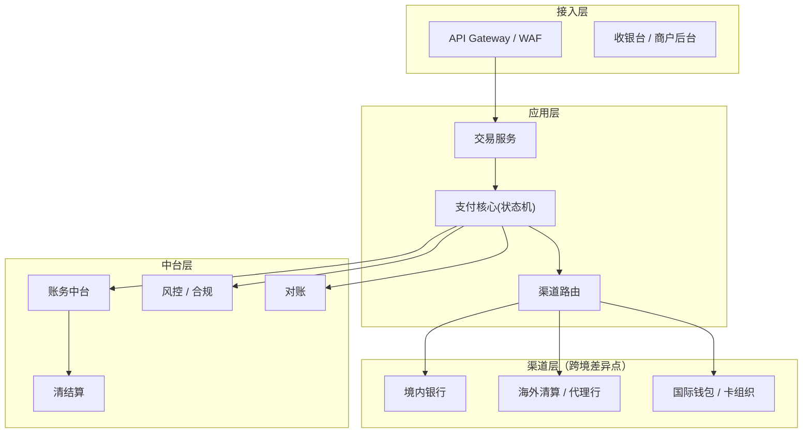

```text
                ┌─────────────┐
   商户/SDK ───▶ │  接入网关    │  (鉴权/限流/幂等键)
                └──────┬──────┘
                       │
                ┌──────▼──────┐
                │  订单服务    │  (创建收款单, 落库)
                └──────┬──────┘
           ┌───────────┼────────────┐
           ▼           ▼            ▼
     ┌──────────┐ ┌──────────┐ ┌──────────┐
     │ 渠道路由  │ │  风控引擎  │ │  账务服务  │
     └────┬─────┘ └────┬─────┘ └────┬─────┘
          │            │            │
          ▼            ▼            ▼
     ┌──────────┐ ┌──────────┐ ┌──────────┐
     │ 渠道适配   │ │ 规则/模型  │ │ 余额/流水  │
     └────┬─────┘ └──────────┘ └──────────┘
          │
          ▼ 异步回调
     ┌──────────┐    ┌──────────┐
     │ 回调验签   │──▶ │  MQ 对账   │──▶ 差错处理
     └──────────┘    └──────────┘
```

> 这张图是「从外往里」的调用视角。若想看「资金怎么从用户流到商户」的**分层视角**（交易层/支付层/清结算层/账务层/对账系统/资金处理层），见 [支付系统全链路架构](./准备-支付系统全链路架构.md)。两篇文章互补：本文讲「高可用怎么设计」，那篇讲「支付全链路怎么分层」。

> **我的真实落地（XTransfer）**：这张图在我手里落地为「**六边形架构 + CQRS + DDD**」——领域层（收款单/预入账单聚合）不依赖 Spring，外部依赖（风控/申报/账务网关、渠道回调）全部走端口适配器；资金状态用 **StateMachine** 显式建模、由**事件驱动**流转；收款产品（VA/收单/A2A/电商）用 **SPI** 扩展，符合开闭原则；跨域一致性靠**任务补偿 + Outbox** 保证最终一致。完整复盘见 [XTransfer 跨境支付收款平台深度复盘](/post/准备-XTransfer跨境支付收款平台深度复盘)。

### 1.1 多地多活架构

> 跨境支付天然是多地域的——用户在亚洲、渠道在欧洲、商户在非洲。多地多活不是"可选项"，而是跨境支付的高可用基础。

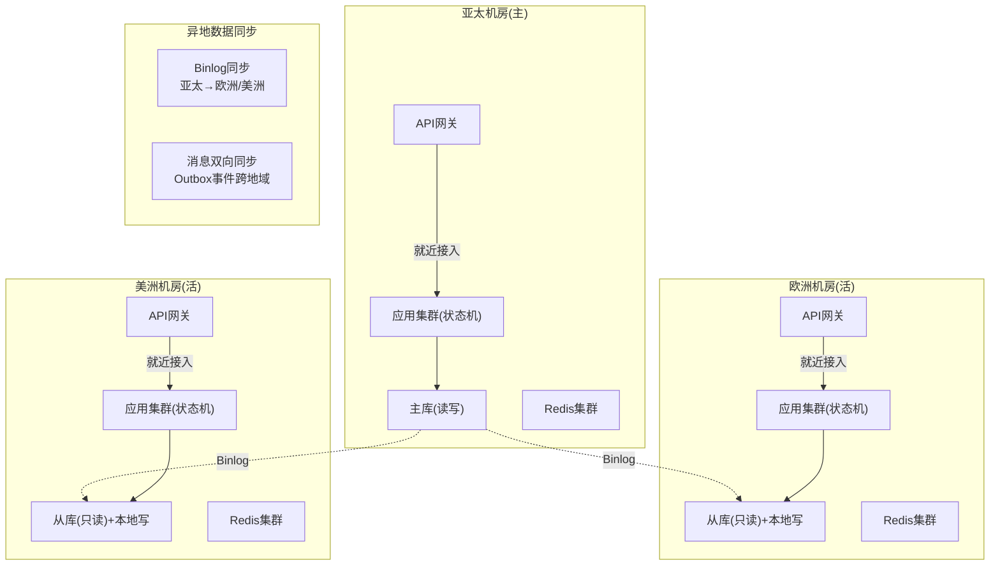

| 多活策略 | 实现方式 | 适用场景 | 故障切换时间 |
|---------|---------|---------|------------|
| **同城双活** | 主备机房同城，DB 主从同步 | 一般高可用 | 秒级 |
| **异地多活** | 多地域独立写库，Binlog 异步同步 | 跨境支付 | 分钟级 |
| **单元化** | 按商户号路由到固定单元，单元内闭环 | 超大规模 | 秒级切流 |
| **灾备冷备** | 异地冷备，平时不接流量 | 成本敏感 | 小时级 |

> **跨境多地多活的核心挑战**：① **数据一致性**——异地写库的冲突解决（按商户号分片到固定单元，避免跨单元写冲突）；② **资金不丢**——Outbox 事件跨地域同步，确保即使某地域宕机，事件在其他地域可消费；③ **时区对账**——各地域对账截止时间按渠道时区切，不是统一的 UTC 0点。

### 1.2 跨境支付特有挑战系统化方案

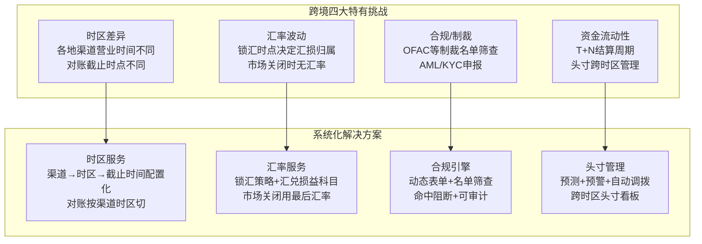

| 挑战 | 系统化方案 | 工程实现 | XTransfer 落地 |
|------|-----------|---------|---------------|
| **时区** | 渠道→时区→截止时间配置化 | 对账按渠道本地时区切 | 配置表驱动，新增渠道不改代码 |
| **汇率** | 锁汇策略 + 汇兑损益科目 | 收款时锁汇 vs 结算时锁汇 | 汇损补充机制补偿回用户 |
| **合规** | 动态表单 + 名单筛查 + 审计 | 渠道→场景→字段配置化 | 独立合规子系统 |
| **制裁** | OFAC/UN/EU 名单实时筛查 | 命中阻断 + 人工复核 | 制裁名单定时更新+模糊匹配 |
| **流动性** | 头寸预测 + 预警 + 自动调拨 | 各银行头寸监控+阈值告警 | 资金处理层头寸看板 |

## 2. 关键设计点

### 2.1 幂等（支付生命线）

> 幂等不是"加个判断"就完事，要**三层兜底**：接入挡重放、业务靠状态机只跑一次、数据靠唯一索引兜底。任意一层漏了，都可能重复入账。

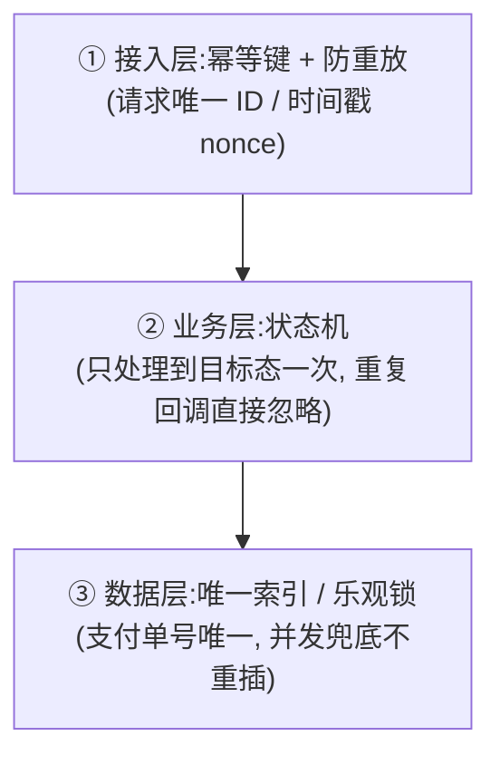
所有写操作带 **业务幂等键**（如 `商户订单号+场景`），入库前用唯一索引兜底：

```sql
CREATE UNIQUE INDEX uk_idempotent ON pay_order(biz_no, scene);
-- 重复请求直接返回首次结果，绝不多扣/多入账
```

### 2.2 渠道路由策略
综合「费率 + 成功率 + 延迟 + 额度」做加权打分，支持灰度与熔断：

```text
score = w1*(1-费率) + w2*成功率 - w3*延迟 - w4*失败率
约束: 渠道当日额度未用满
兜底: 主渠道失败自动切备用（见高可用篇）
```

### 2.3 缓存策略
- **读多写少**（汇率、商户配置、渠道状态）：Redis 缓存，设 TTL + 主动失效双保险；
- **缓存一致性**：写时「先更库再删缓存」（Cache-Aside），配合延迟双删防脏读；
- **防击穿/雪崩/穿透**：热点 key 不过期 + 互斥重建；随机 TTL；空值也缓存（短 TTL）。

### 2.4 分库分表
- 维度：按 `商户ID` 或 `时间` 分片（支付订单按时间冷热明显，适合时间分库 + 商户分表）；
- 单表控制在 500w 行内；全局查询走 ES/OLAP；
- 分布式 ID：雪花算法（注意时钟回拨）或号段模式（Leaf）。

### 2.5 MQ 与削峰
- 渠道回调、对账、通知都走 MQ 异步解耦；
- 削峰填谷：突发流量先入队，消费端按能力匀速处理；
- 消费端**必须幂等**（见 2.1），且支持重试 + 死信队列（DLQ）。

### 2.6 CQRS 思路
- 写链路（创建/入账）走强一致订单库；
- 读链路（商户查账单、运营看板）走读库/ES，读写分离，互不影响。

### 2.7 最终一致性
跨系统（订单/账务/渠道）不强一致，用 **本地消息表 / 事务消息** 保证最终一致（见分布式事务篇）。

> **为什么 / 权衡 / 真实案例**：为什么放弃强一致？因为跨"订单/账务/渠道"的链路里，下游（尤其境外渠道）响应慢、可能不可用，强一致（2PC）会长时间锁资源、可用性差。权衡点是"短暂不一致窗口内用户看到的状态"——用状态机的"处理中"态过渡，用户感知不到最终一致的延迟。真实案例：XTransfer 收款链路用"本地消息表 + 状态机 + 任务补偿 + Outbox"做到最终一致，再靠 T+1 对账把"不一致窗口"彻底闭环，实现 0 资损。替代方案 RocketMQ 事务消息我们没主用，因为资金场景要"看得见"（消息表能直接查库排障）。

### 2.8 对账
- 实时：回调即比对，异常进差错队列；
- T+1：拉渠道流水与本地账单逐笔核对，差异自动归因（AI 篇讲向量检索归因）；
- 差错：挂账 → 人工/自动平账。

### 2.9 风控
规则引擎（硬拦截，如黑名单）+ 模型打分（软建议，如异常交易）。AI 模型只「建议不决策」，资金安全不交给模型。

### 2.10 资金安全三道防线（工程细节展开）

> 这是 XTransfer 2.0 做到 0 资损的核心方法论。每道防线都有明确的工程实现、覆盖范围和兜底机制。

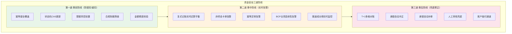

**第一道防线（事前）工程细节**：

| 防护点 | 实现方式 | 代码/配置 |
|--------|---------|----------|
| 幂等键 | 接入规范强制要求，唯一索引兜底 | `UNIQUE INDEX uk_biz(merchant_no, out_trade_no, scene)` |
| 状态机 | CAS 写库，非法迁移拒绝 | `UPDATE ... WHERE status=旧值` |
| 限额 | Redis+Lua 原子扣减 | `EVAL deduct.lua key amount` |
| 制裁 | 名单匹配+模糊匹配+阻断 | `OFAC名单定时更新+命中阻断` |
| 精度 | BigDecimal+String构造 | `new BigDecimal("100.00")` |

```yaml
# 事前防线配置
safety:
  idempotent:
    required_keys: [merchant_no, out_trade_no, scene]
    unique_index: true
  state_machine:
    cas_update: true
    reject_illegal_transition: true
  limit:
    daily_limit_per_merchant: 1000000   # 单商户日限额
    single_tx_limit: 50000              # 单笔限额
    redis_lua_atomic: true
  sanctions:
    ofac_check: true
    fuzzy_match: true
    block_on_hit: true
  precision:
    amount_type: BIGINT                 # 最小币种整数
    calculation: BigDecimal
    string_constructor: true
```

**第二道防线（事中）工程细节**：

```java
// 复式记账实时试算平衡（事务后置校验）
@Transactional
public void accountEntry(JournalEntry entry) {
    // 1. 写入借贷分录
    journalDao.insertBatch(entry.getDebit(), entry.getCredit());

    // 2. 实时试算：本笔借贷必须相等
    long debitSum = entry.getDebit().stream().mapToLong(Journal::getAmount).sum();
    long creditSum = entry.getCredit().stream().mapToLong(Journal::getAmount).sum();
    if (debitSum != creditSum) {
        // 借贷不平 → 立即告警 + 事务回滚
        alertService.fatal("试算不平! debit=%d credit=%d bizNo=%s", debitSum, creditSum, entry.getBizNo());
        throw new BalanceException("借贷不平，拒绝记账");
    }

    // 3. 非终态卡单检测
    long pendingCount = orderDao.countByStatus(PaymentStatus.PROCESSING);
    if (pendingCount > THRESHOLD) {
        alertService.warn("非终态卡单超阈值: %d", pendingCount);
    }
}
```

**第三道防线（事后）工程细节**：

```sql
-- T+1 多维对账SQL示例
-- 维度1: 交易层 vs 账务层（内部勾稽）
SELECT t.biz_no, t.amount as trade_amount, a.amount as acct_amount,
       (t.amount - a.amount) as diff
FROM trade_order t
LEFT JOIN acct_journal a ON t.biz_no = a.biz_no AND a.direction = 'CREDIT'
WHERE t.settle_date = #{date}
  AND (a.amount IS NULL OR t.amount != a.amount);

-- 维度2: 本地 vs 渠道（外部对账）
SELECT l.biz_no, l.amount as local_amount, c.amount as channel_amount,
       l.status as local_status, c.status as channel_status
FROM local_flow l
FULL JOIN channel_bill c ON l.channel_tx_no = c.channel_tx_no
WHERE c.recon_date = #{date}
  AND (l.amount != c.amount OR l.status != c.status
       OR l.channel_tx_no IS NULL OR c.channel_tx_no IS NULL);

-- 维度3: 总账 vs 明细（汇总核对）
SELECT a.account_no,
       a.balance as account_balance,
       SUM(j.amount * CASE j.direction WHEN 'DEBIT' THEN 1 ELSE -1 END) as journal_balance,
       (a.balance - SUM(j.amount * CASE j.direction WHEN 'DEBIT' THEN 1 ELSE -1 END)) as diff
FROM acct_account a
JOIN acct_journal j ON a.id = j.account_id
WHERE j.created_at >= #{date}
GROUP BY a.account_no
HAVING diff != 0;
```

## 3. 容量估算

| 项 | 估算 |
| --- | --- |
| 峰值 QPS | 5k，按 3 倍冗余设计 → 15k |
| 日订单 | 3000w，单条订单 ~1KB → 日增 ~30GB |
| 5 年存储 | ~54TB（热 3 月 SSD，冷转对象存储） |
| 数据库 | 分库分表（按商户/时间），单表 < 500w 行 |

### 3.1 跨境容量估算的特殊维度

> 跨境比境内多三个维度，面试时能讲出来就是加分项。

| 维度 | 境内 | 跨境 | 影响 |
|------|------|------|------|
| 币种 | 单一(CNY) | 多币种(USD/EUR/GBP/JPY...) | 每币种独立存储/汇率表 |
| 结算周期 | T+0/T+1 | T+N(跨时区) | 在途资金数据量大 |
| 合规留存 | 5年 | 5-7年(各国不同) | 冷数据量是境内2-3倍 |
| 对账文件 | 1-3个渠道 | 100+渠道 | 对账数据量是境内N倍 |

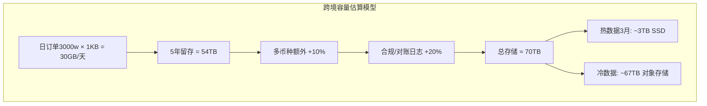

**分库分表策略**：

```sql
-- 跨境支付分库分表示例
-- 分库: 按时间(月)分库，如 pay_db_202607
-- 分表: 按商户号 hash 分表，如 pay_order_00 ~ pay_order_15

-- 路由规则
-- DB:  pay_db_{yyyyMM}  (按月分库)
-- TBL: pay_order_{hash(merchant_no) % 16}  (按商户分表)

-- 分布式ID: 雪花算法(注意时钟回拨)
-- 全局查询: 走ES异构索引

-- 跨境特殊: 多币种不能混存金额，需按币种分表或加currency字段+索引
CREATE TABLE pay_order_${shard} (
    id            BIGINT PRIMARY KEY,    -- 雪花ID
    merchant_no   VARCHAR(32),
    out_trade_no  VARCHAR(64),
    amount        BIGINT,                -- 最小币种整数
    currency      VARCHAR(3),            -- 币种(USD/EUR/...)
    country       VARCHAR(2),            -- 地区码
    channel_id    VARCHAR(16),
    status        VARCHAR(16),
    created_at    DATETIME,
    UNIQUE INDEX uk_biz(merchant_no, out_trade_no),
    INDEX idx_currency_date(currency, created_at),
    INDEX idx_status_created(status, created_at)
) ENGINE=InnoDB;
```

## 4. 容错与降级

- 渠道故障：路由自动剔除 + 切备用；
- 风控超时：降级为「放行 + 事后核查」，不因风控挂了阻断交易；
- 对账延迟：先入账后补对账，保证用户体验。

### 4.1 容灾降级矩阵

> 支付系统的"降级"不是简单的"关掉功能"，而是分场景的降级策略——每个子系统都有独立的降级路径。

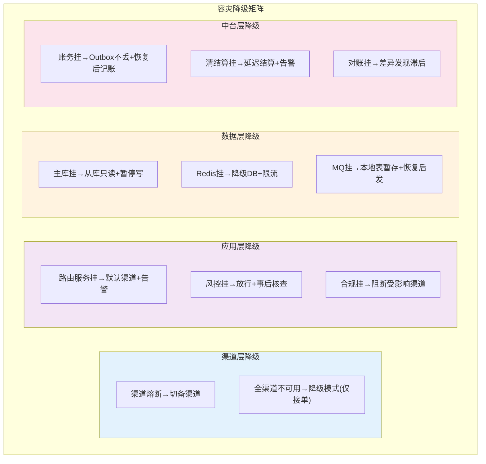

| 故障场景 | 降级策略 | 用户感知 | 资金风险 |
|---------|---------|---------|---------|
| 渠道熔断 | 自动切备渠道 | 无感（秒级切换） | 无 |
| 风控超时 | 放行+事后核查 | 无感 | 低（事后兜底） |
| 主库故障 | 从库只读+暂停写 | 交易暂停（分钟级） | 无 |
| Redis 故障 | 降级 DB+限流 | 延迟增加 | 无 |
| MQ 故障 | 本地表暂存 | 延迟增加 | 无（消息不丢） |
| 账务故障 | Outbox 缓存+恢复后记账 | 状态"处理中" | 无（消息不丢） |
| 全链路故障 | 降级模式（仅接单+排队） | 交易延迟 | 无（恢复后处理） |

```yaml
# 降级配置（配置中心动态生效）
degradation:
  channel:
    circuit_breaker:
      fail_rate_threshold: 0.05      # 失败率>5%熔断
      recovery_time: 30s             # 30秒后试探恢复
    all_channel_down:
      mode: ACCEPT_ONLY              # 仅接单，不处理
      alert: CRITICAL
  risk_control:
    timeout_threshold: 2000ms        # 风控超时2秒
    on_timeout: PASS_AND_REVIEW      # 放行+事后核查
  database:
    master_down:
      mode: READ_ONLY                # 从库只读
      block_write: true
  account:
    on_failure: OUTBOX_BUFFER        # Outbox缓存
    max_buffer_time: 3600s           # 最长缓存1小时
```

> **降级设计的铁律**：① 每个降级路径必须能"自动恢复"（试探恢复，不靠人工）；② 降级期间资金不能丢（Outbox/本地表兜底）；③ 降级要有告警（降级不是"正常状态"，必须有人知道）；④ 降级策略要可配置、可演练（每季度演练验证）。

## 5. 可观测性

- **链路追踪**：每笔订单带 traceId，跨服务串起来（OpenTelemetry）；
- **指标**：RED + USE（见高可用篇）；
- **日志**：结构化 + 集中采集，关键路径留审计日志。

### 5.1 支付系统监控指标体系

> 支付监控不是"装个 Prometheus 就完事"，要按"业务指标 + 技术指标 + 资金指标"三层建设。

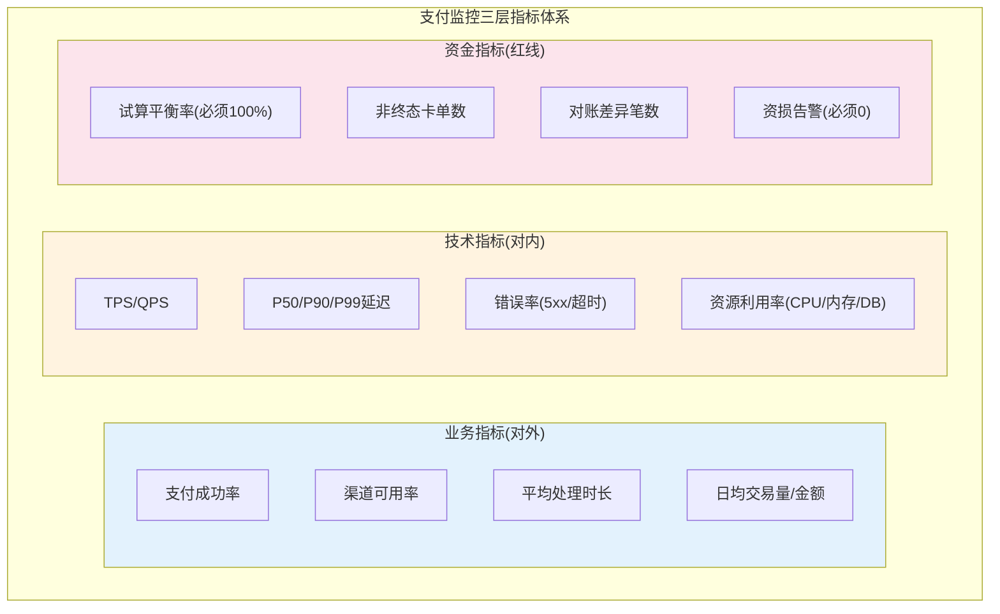

| 指标层级 | 关键指标 | 告警阈值 | 响应级别 |
|---------|---------|---------|---------|
| 业务 | 支付成功率 | <98% | P2 |
| 业务 | 渠道可用率 | <95% | P1 |
| 技术 | P99延迟 | >500ms | P3 |
| 技术 | 错误率 | >1% | P2 |
| 资金 | 试算平衡率 | ≠100% | P0(立即熔断) |
| 资金 | 资损告警 | 任何一笔 | P0(立即响应) |
| 资金 | 对账差异 | >0 | P1 |

> **资金指标是红线**——试算不平衡或资损告警必须 P0 级立即响应，甚至自动熔断。这和技术指标"P99 高了调优一下"完全不同。

---

## 【深度拓展】技术原理深挖

### 拓展一：跨境支付的高可用架构演进

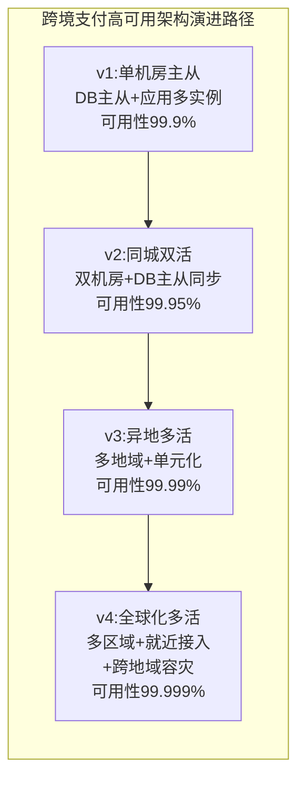

| 阶段 | 架构 | 可用性 | 跨境痛点 | 解决方案 |
|------|------|--------|---------|---------|
| v1 | 单机房主从 | 99.9% | 单点故障，跨境渠道延迟高 | 多实例+熔断 |
| v2 | 同城双活 | 99.95% | 同城容灾够了，跨境不够 | 异地灾备 |
| v3 | 异地多活 | 99.99% | 数据同步延迟，写冲突 | 单元化+按商户分片 |
| v4 | 全球化多活 | 99.999% | 跨域合规/时区/汇率 | 就近接入+跨域事件同步 |

> **XTransfer 当前在 v3 向 v4 演进**：已有异地多活+单元化，正在建设全球化就近接入和跨域事件同步。

### 拓展二：业界跨境支付高可用方案对比

| 方案 | 代表公司 | 核心特点 | 优势 | 劣势 |
|------|---------|---------|------|------|
| **单元化多活** | 蚂蚁/支付宝 | 按用户分片到固定单元 | 故障隔离好、切流快 | 架构复杂度高 |
| **异地双活+灾备** | Airwallex | 双机房实时同步+异地灾备 | 实现相对简单 | 切换需人工 |
| **事件驱动多活** | XTransfer | Outbox事件跨域同步 | 资金不丢、可重放 | 一致性窗口 |
| **云原生多区域** | Stripe | AWS多区域+托管服务 | 运维成本低 | 强依赖云厂商 |

### 拓展三：常见误区与陷阱

**误区 1：高可用=多机房部署**
- 多机房只是基础设施，真正的高可用还需要：流量切换能力、数据同步策略、故障检测+自动切流、降级预案。只部署不切流 = 假高可用。

**误区 2：跨境对账按 UTC 0 点切**
- 不同渠道的"交易日"按本地时区定义。按 UTC 切会把某渠道"今天的交易"切成两天，导致对账差异。必须按渠道本地时区切。

**误区 3：汇率用实时汇率就行**
- 市场关闭时（周末/节假日）没有实时汇率，要用"最后可用汇率"并标记"非实时"，否则汇率查询会失败导致交易中断。

**误区 4：制裁名单只做精确匹配**
- 制裁名单有变体（别名/缩写/拼写变体），只做精确匹配会漏掉。要用模糊匹配（Levenshtein距离/音似匹配）+ 人工复核。

**误区 5：头寸管理靠人工**
- 跨境多银行多币种多时区，人工管头寸会漏。必须自动化：头寸预测+阈值预警+自动调拨指令。

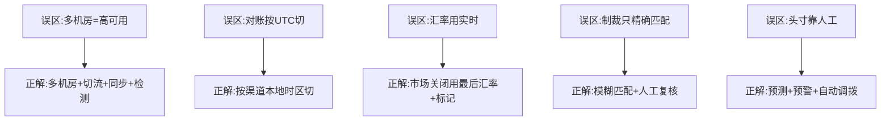

---

## 【项目支撑】XTransfer 真实项目决策与数据

### 决策一：为什么选事件驱动多活而非单元化多活

| 维度 | 单元化多活（蚂蚁模式） | 事件驱动多活（XTransfer 模式） | 选后者原因 |
|------|---------------------|------------------------------|-----------|
| 数据同步 | DB 层同步（复杂） | Outbox 事件同步（可重放） | 资金不丢 |
| 写冲突 | 单元内闭环无冲突 | 按商户分片路由减少冲突 | 实现成本低 |
| 切流粒度 | 用户级 | 商户级 | 跨境按商户天然分片 |
| 一致性 | 强（单元内） | 最终一致（跨域） | 对账兜底 |

### 决策二：关键运维数据

| 指标 | 数值 | 说明 |
|------|------|------|
| 可用性 SLA | 99.99% | 年停机 < 52 分钟 |
| P99 延迟 | < 300ms | 收款链路端到端 |
| 峰值 TPS | 5k（设计 15k） | 3 倍冗余 |
| 资损率 | 0 | 2.0 重构后 |
| 生产问题 | -80% | 2.0 重构后 |
| 渠道数量 | 100+ | VA 标准化接入 |

### 决策三：容灾切换演练


> XTransfer 每季度做一次容灾切换演练，验证"故障自动检测→流量切换→交易不中断→资金不丢→对账无差异"全链路。这是 99.99% 可用性的保障。

---

## 面试高频问答（标准回答）

### Q1：怎么保证不会重复入账？

**标准回答**：三层——接入层用「商户订单号 + 场景」做**业务幂等键**，数据库唯一索引兜底；回调只推进状态机，重复回调命中唯一索引直接返回首次结果；最后 T+1 对账再兜底，三重保障做到「至少不资损」。

**【深度拓展】**
- **纵深防御，而非单点依赖**：唯一索引只是"最后一道闸"，命中时 DB 已经做了一次冲突插入的尝试（付出了一次写代价）。真正省资源的是接入层的幂等键拦截——请求进来先查/插一条"处理中"记录，重复的直接返回，根本不进核心流程。
- **唯一索引防不了"重复推进状态"**：它只防"同一行重复插"，防不了"同一笔单重复执行入账动作"。后者必须靠状态机的 CAS：`UPDATE ... SET status=新态 WHERE id=? AND status=旧态`，影响行数为 0 就说明已被别的请求推进过，直接忽略。
- **幂等和重试必须配对**：面试官常追问"如果唯一索引冲突了，你怎么返回首次结果？"——需要把"首次处理结果"落一张业务结果表（biz_no → 结果 JSON），冲突时查回返回，而不是抛错。没有幂等就重试 = double count，这是资损第一来源。
- **边界场景**：并发同毫秒两笔相同请求、渠道异步回调与主动查单竞态、网络分区下的"已处理但响应丢失"。这些都要靠上面的组合拳兜底。

**【项目支撑】**
我在 XTransfer 做收款 2.0 重构时，回调处理正是"唯一索引（biz_no+scene）+ 状态机 CAS + 记账幂等键"三保险：渠道同一笔回调用不同参数重复推，状态机发现已到 SUCCESS 终态直接忽略，命中唯一索引的重复写也返回首次结果，T+1 多渠道对账再兜底一遍。三者叠加，才托住"0 资损"这条底线。

### Q2：缓存和数据库一致性怎么保证？

**标准回答**：用 Cache-Aside：读穿透加载、写时先更库再删缓存，并加「延迟双删」防并发脏读。强一致场景不依赖缓存（如余额），弱一致场景（汇率/配置）可接受短暂不一致。绝不为了「绝对一致」牺牲可用性和性能。

**【深度拓展】**
- **为什么"先更库再删缓存"而不是"先删缓存再更库"**：后者有个致命窗口——删缓存后、更库前，有读请求进来会把旧值重新加载回缓存（"缓存脏数据永久化"）。先更库再删缓存，即使删缓存失败，也只是"短暂读到旧缓存"，下一轮 TTL 或延迟双删会纠正；而前者一旦并发就会把脏数据长期留在缓存。
- **延迟双删的价值与代价**：并发读写下，"更库→删缓存"之间若有读请求把旧值回填，立即删就不够，延迟几百 ms 再删一次能覆盖这个窗口。代价是延迟期间可能读到旧值（对商品详情可接受），且删缓存本身也可能失败，所以要再加"binlog 订阅（Canal）做最终一致"兜底。
- **强一致的边界**：余额、限额、可售库存这类"读必须准"的数据，根本不该走 Cache-Aside，要么不强依赖缓存，要么用"写穿 + 强校验"。面试官能区分"哪些数据允许最终一致"本身就是加分点。
- **面试官还会追问**：缓存和 DB 同时写都成功，但更新期间读到了中间态怎么办？→ 这正好引出"延迟双删 + 短 TTL + binlog 兜底"的组合。

**【项目支撑】**
我在欧凡做海外直播电商时，商品缓存就是"延迟双写（先更 DB → 发 Kafka 延迟消息删 Redis）+ Caffeine 本地二级 + 热点识别"；一致性兜底靠"短 TTL + 监听 binlog 最终一致"。哈啰薪资系统里"计薪规则"也是读多改少，用 Caffeine + Redis 多级缓存，规则变更时主动失效两级缓存，因为薪资算错代价高，失效必须可靠而非只靠 TTL。

### Q3：为什么选最终一致而不是 2PC？

**标准回答**：支付要的是高可用，2PC 有协调者单点和长锁，可用性差；跨「订单/账务/渠道」本就是异步链路，用本地消息表 + 幂等 + 对账就能做到最终一致，可用性高且实现简单。只有极少强一致诉求（如跨账户调拨）才上 TCC。

**【深度拓展】**
- **2PC 的真实代价**：协调者一旦挂，参与者都卡在"未决"状态（资源锁长时间不释放），恢复也麻烦；整个链路 RT = 各参与者响应之和，且全部被最慢的那个拖住。对"渠道回调晚、风控/申报不可控"的收款链路，2PC 等于把可用性押在下游上。
- **TCC 为什么不是银弹**：TCC 把"预留/确认/取消"三阶段写进业务，侵入大（每个服务都要写 try/confirm/cancel），且 confirm/cancel 也必须幂等。资金流里很多动作"可补偿"但"不可预留"（比如渠道回调成功是不可逆事实），强上 TCC 反而别扭。
- **最终一致的"可解释性"优势**：对资金系统，状态机 + 任务补偿 + Outbox，每一笔钱走到哪、卡在哪、谁来兜底，都是"看得见"的；2PC 的中间态对业务不可见，出事难排查。所以"可解释、可补偿、可重放"比"瞬间强一致"更现实。
- **面试官怎么追问**："那如果本地消息表发了消息但下游一直失败呢？"→ 死信队列 + 补偿脚本 + 人工兜底，配合对账发现差异（见高可用篇资金安全三道防线）。"CAP 你怎么取舍？"→ 资金场景选 AP + 最终一致 + 对账兜底，而不是 CP 牺牲可用性。

**【项目支撑】**
XTransfer 收款链路跨风控、申报、账务多个域，流程长且每步基本可补偿（记账能冲正、申报能撤回）。我们最终主选"状态机 + 任务补偿（本地事务写业务+任务表，异步重试+补偿脚本，死信转人工）+ Outbox 事件不丢"，而不是 2PC/TCC。2.0 重构后这套做到 0 资损、-80% 生产问题。

### Q4：数据量太大怎么存？

**标准回答**：按时间分库 + 商户分表，单表 < 500w 行；热数据 SSD、冷数据转对象存储/归档库；跨分片查询走 ES/OLAP；分布式 ID 用雪花或号段模式避免自增瓶颈。

**【深度拓展】**
- **分片键的选择是第一步也是最关键一步**：支付订单按"时间"冷热明显（近期热、历史冷），适合时间分库；但"按商户查"又很频，所以常是"时间分库 + 商户分表"的复合分片。选错分片键 = 大部分查询变跨分片广播（最慢）。
- **非分片键查询怎么解**：建异构索引表（商户ID → 时间分片位置）或走 ES。哈啰工单系统就是"按创建时间分表 + 数仓冷备份 + 读写分离"，少量按车辆ID查的走异构索引/ES。
- **分布式 ID 的坑**：雪花算法怕"时钟回拨"（机器时间被 NTP 往后调，可能生成重复 ID），生产要监控时钟回拨并兜底（如等待/报警/用机房偏移位）。号段模式（Leaf-segment）每次取一段，DB 压力小、不依赖时钟，但多一次取号网络调用。
- **面试官追问**："单表到底压到多少行合适？" → 没有绝对值，看索引宽度和 QPS；"分库后事务怎么办？" → 跨库事务基本放弃强一致，用本文 2.7 的最终一致方案。

**【项目支撑】**
XTransfer 超 1000w 笔对客结算，主流程按"时间分库 + 商户/产品分表"，读模型（商户账单、运营看板）走独立读库/ES 做 CQRS 分离，避免大事务里既写又查。哈啰工单"按创建时间分表 + 历史进数仓 + 读写分离"，主库只扛热数据和实时查询。

### Q5：如果让你现场设计一个短链/限流器，思路是？

**标准回答**：短链——发号器（雪花/号段）生成 ID 再 Base62 编码，映射存 KV（Redis），重定向 302 + 命中统计。限流器——令牌桶（Redis + Lua 原子）或滑动窗口（Redis zset），支持突发、能平滑、可分布式。先讲清楚 QPS 约束和存储，再写核心逻辑。

**【深度拓展】**
- **限流算法选型**：令牌桶允许突发（适合支付秒杀，平时攒令牌应对瞬时洪峰），漏桶平滑输出（适合保护下游匀速）；滑动窗口比固定窗口更精确（避免窗口边界的"双倍突发"）。分布式限流必须原子（Redis + Lua），否则多实例各自限流 = 总限流失效。
- **短链的边界**：302 重定向利于统计但不缓存，301 利于性能但浏览器缓存难改。映射表要防"ID 用尽"（Base62 位数够用很久）和"恶意遍历"（加盐或校验位）。命中统计用异步累加，不阻塞重定向。
- **面试官追问**："限流器怎么防误杀正常流量？" → 按渠道/商户维度隔离限流（舱壁），核心商户白名单；"限流和熔断的区别？" → 见高可用篇三板斧。
- **关联拓展**：限流器本质是"保护自己不被打垮"，和幂等、熔断、降级构成稳定性四件套；短链的发号器思想与"分布式 ID"一脉相承。

**【项目支撑】**
XTransfer 渠道路由层对单渠道做令牌桶限流（Sentinel/Dubbo tps），避免某渠道突发把整体拖垮；支付"限额扣减"复用 Redis+Lua 原子扣减（和欧凡库存扣减同源）。短链的设计思想（发号器 + KV 映射）也对应我们"分布式 ID 用号段/雪花"的选型。

> 别一上来画大图。先 **复述需求与约束**，再讲 1~2 个最有深度的点（幂等 / 一致性 / 路由），最后补容量与容错。深度 > 广度。这篇是系统设计的「主菜」，每个点都能展开成项目经历。

---

## 更多高频追问（补充）

### Q6：如何设计一个支付系统的幂等？三个层次分别是什么？

**考察点**：幂等是支付第一原则，能否讲清多层防护。

**标准回答**：① **接口层**——商户传唯一 `requestId`/`outTradeNo`，服务端建唯一索引，重复请求直接返回上次结果；② **状态机层**——每次状态流转校验前置状态（如只有"待支付"才能变"支付中"），用 `UPDATE ... WHERE status=旧值` 的 CAS 拦截并发；③ **数据层**——记账用 `bizId+账户+方向` 做唯一键，重复消息插入失败即视为已处理。三层叠加，任何一层重复都无害。XTransfer 的回调处理就是"唯一索引 + 状态机 CAS + 记账幂等键"三保险。

**【深度拓展】**
- **CAS 的"影响行数"是天然的并发栅栏**：`UPDATE ... WHERE status=旧值` 在 MySQL 行锁 + 条件判断下，并发两笔只有一个能成功（影响行数=1），另一个影响行数=0，直接判定"已被处理"。这比"先 select 再 update"安全百倍（后者有 TOCTOU 竞态）。
- **记账幂等键设计**：同一笔业务的不同记账动作要能区分（入账 vs 冲正），幂等键要用 `bizId + 账户 + 方向 + 动作类型`，避免"冲正"被当成"重复入账"误判。
- **面试官追问**："状态机 CAS 失败了，是报错还是忽略？" → 终态重复（如已 SUCCESS 又来 SUCCESS 回调）应忽略返回首次结果；非法的逆向迁移（如 SUCCESS→INIT）应告警（可能是 bug 或攻击），而非静默吞掉。

**【项目支撑】**
XTransfer 收款状态机就是这套：每个状态迁移都是 `UPDATE ... WHERE status=旧 AND id=?`，CAS 天然幂等；渠道重复回调命中终态直接忽略，配合记账 `biz_no+方向` 唯一键，从 2.0 重构后没出过重复入账类资损。

### Q7：跨境支付和境内支付在系统设计上最大的区别？

**标准回答**：① **多币种 + 汇率**——要处理汇率锁定、换汇时机、汇兑损益记账；② **合规/KYC/KYT**——收付款双方都要做实名、反洗钱筛查、制裁名单命中；③ **渠道异构**——各国渠道协议/结算周期/对账文件格式差异极大，需要强抽象的渠道适配层（SPI）；④ **结算周期长**——T+N 甚至跨时区，头寸管理和在途资金管理更复杂；⑤ **多时区对账**——对账截止时间要按渠道时区切。这些正是我在 XTransfer 做的核心工作。

**【深度拓展】**
- **汇率风险的归属**：汇率锁定时机决定谁承担汇损——锁定在"收款时"还是"结汇时"差别巨大。锁早了用户吃亏，锁晚了平台吃亏，且跨时区市场关闭时汇率怎么办？这牵出"汇兑损益"如何记账、如何补偿给用户（见 XTransfer 复盘贸易订单管理系统的"汇损补充"）。
- **合规是"前置闸门"不是"后置检查"**：跨境制裁名单（OFAC 等）命中必须阻断，且要可审计。我们做成"渠道→场景→字段"配置化动态表单，新增渠道/场景不改代码，命中规则可灰度。
- **渠道异构的抽象层次**：不是简单 if/else 分发，而是把"接口、字段映射、审核流、对账文件格式"全部外置到配置 + SPI 适配器，新渠道零改核心（XTransfer 100+ VA 渠道就是这么接的）。
- **面试官追问**："跨境和国内支付在容灾上有什么区别？" → 跨境天然多地域，要单元化 + 就近接入 + 多时区对账，比单地域容灾复杂。

**【项目支撑】**
我在 XTransfer 主导收款 2.0 重构和从 0 到 1 的预入账子领域，每天处理的就是多币种入账、合规动态表单、100+ 渠道 SPI 接入、贸易订单的额度与汇损补充。跨境的"钱先到、贸易背景后补"预入账场景，正是这些差异点的集中体现。

### Q8：秒杀/大促下单接口怎么扛住流量？（经典系统设计题）

**标准回答**：分层削峰——① **前端**：按钮置灰、答题、CDN 静态化；② **网关**：限流（令牌桶）+ 恶意请求拦截；③ **应用**：库存预热到 Redis，用 Lua 原子扣减，扣成功才进 MQ；④ **异步下单**：MQ 削峰，后端按能力消费落库；⑤ **兜底**：库存分段、超卖用最终一致对账修正。核心思想是"把同步的写请求变成异步的、可排队的、可丢弃的"，保护数据库这个最脆弱的环节。支付里的"限额扣减"用的就是 Redis+Lua 原子扣减这套。

**【深度拓展】**
- **"可丢弃"的边界**：秒杀里超卖不能发生，所以不能真丢弃库存扣减，而是"把高并发的库存竞争挡在 Redis，DB 只做最终一致落地"。Redis 扣减是入口闸，DB 是权威账本。
- **热点库存的单 key 瓶颈**：超大爆款（如茅台秒杀）单 Redis key 会被打满，要"库存分段"（把 1w 库存拆成 10 段，每段一个 key，扣完一段再扣下一段）分散热点。
- **支付回调的"下单"类比**：支付里的渠道回调洪峰，同样是"MQ 削峰 + 幂等消费 + 死信兜底"，思路和秒杀削峰一致——下游按能力匀速处理。
- **面试官追问**："Redis 扣成功但 DB 落库失败怎么办？" → 回补 Redis 库存 + 对账发现差异 + 补偿；"怎么防超卖的极端情况？" → DB 层 `stock>=0` 约束 + 乐观锁兜底强一致。

**【项目支撑】**
欧凡直播电商的库存扣减就是"Redis + Lua 原子扣减（GET+判断+DECR 一次完成）+ 异步落库 + DB 乐观锁兜底"，和秒杀同源。XTransfer 的"限额扣减/在途资金"也是 Redis+Lua 原子扣减思路，渠道突发流量靠 MQ 削峰 + 幂等消费 + 死信兜底，不直接打核心账务。

> 设计题的收尾：讲完主链路，一定要补一句"失败/降级/对账怎么兜底"——面试官看的是你有没有"对失败的设计"。

---

## 【面试官追问】逐问标准回答

### 追问 1：多地多活的数据同步延迟怎么处理？会不会丢钱？

**标准回答**：跨境多活的数据同步用"Binlog 异步同步 + Outbox 事件跨域同步"双通道。Binlog 同步有秒级延迟，但只影响"异地读"的实时性（用"处理中"态过渡）。Outbox 事件同步是关键——支付成功后事件先落本地 Outbox，再异步同步到其他地域，确保即使某地域宕机，事件在其他地域可消费。不会丢钱，因为：① 支付状态已落本地库（持久化）；② Outbox 事件不丢（重试到成功）；③ T+1 对账跨地域勾稽兜底。唯一的代价是"异地查询可能看到秒级旧状态"，对支付场景可接受（用户看到"处理中"即可）。

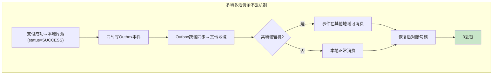

### 追问 2：跨境制裁名单筛查怎么做？误杀了正常交易怎么办？

**标准回答**：制裁筛查分三层：① **精确匹配**——姓名/公司名/身份证号与 OFAC/UN/EU 名单精确比对；② **模糊匹配**——Levenshtein 距离/音似匹配（Soundex）抓变体/别名；③ **人工复核**——模糊匹配命中后进人工审核队列，不是直接阻断。误杀处理：① 人工复核通过后放行（标记"已审核"）；② 建白名单（已审核商户下次免查）；③ 统计误杀率，调优模糊匹配阈值。关键：筛查必须可审计（命中记录+审核结果+操作人留痕），合规审计时能追溯每一步。

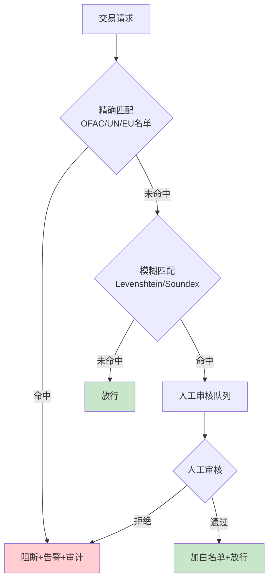

### 追问 3：你们头寸管理怎么做的？头寸不足时怎么处理？

**标准回答**：头寸管理是"预测+预警+自动调拨"三步：① **预测**——根据历史结算量+待结算指令预测各银行各币种的头寸需求；② **预警**——头寸低于阈值时告警（提前 2 小时），给资金运营团队处理时间；③ **自动调拨**——生成调拨指令（从头寸充足的银行调到不足的），需人工确认后执行（资金调拨不可全自动）。头寸不足时的处理：① 暂缓非紧急结算（标记"待头寸"）；② 紧急调拨（银行间调拨，通常 T+0）；③ 极端情况下垫资（平台自有资金垫付，事后补回）。关键：结算失败比延迟结算更危险（影响商户信任），所以宁可延迟也不让结算失败。

```sql
-- 头寸监控看板SQL
SELECT
    bank_code,
    currency,
    current_balance,
    threshold,
    (current_balance - pending_settle) as available,
    CASE
        WHEN current_balance < threshold THEN 'CRITICAL'
        WHEN current_balance - pending_settle < threshold THEN 'WARNING'
        ELSE 'OK'
    END as status
FROM bank_position
WHERE status != 'OK'
ORDER BY status DESC, available ASC;
```

### 追问 4：跨境支付系统怎么做容量估算？和境内有什么不同？

**标准回答**：跨境比境内多三个维度：① **多币种存储**——每个币种独立分库或分表，不能混存（汇率折算影响查询性能）；② **长周期数据**——T+N 结算 + 5 年合规留存，冷数据量是境内的 2-3 倍；③ **对账数据量**——多渠道多时区，对账文件数量是境内的 N 倍（N=渠道数）。估算方法：日订单 3000w × 平均 1KB = 30GB/天 × 365 × 5 = ~54TB（热 3 月 SSD，冷转对象存储）。跨境额外：多币种汇率表、合规申报记录、制裁筛查日志——再加 ~20% 冗余。分库分表按"时间分库 + 商户分表"，单表 < 500w 行，跨分片查询走 ES/OLAP。

### 追问 5：如果让你设计跨境支付的灰度发布，你会怎么做？

**标准回答**：跨境灰度要比境内多考虑"地区+币种+渠道"三个维度：① **地区灰度**——先低风险地区（港新）→高风险地区；② **币种灰度**——先主流币种（USD/EUR）→小币种；③ **渠道灰度**——先低风险渠道→高风险渠道。叠加商户+金额维度，形成五维灰度矩阵。回滚触发：资损告警/成功率降 2%/合规告警 → 自动切流。灰度期间双链路影子对账——新链路每笔结果和旧链路"假设执行"结果对比，差异告警。XTransfer 2.0 重构就是这套：10%→30%→100%，五维灰度，全程影子对账，0 资损切换。

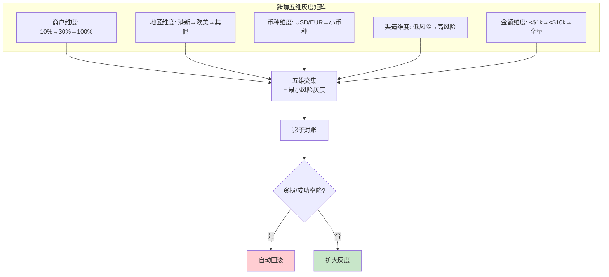

### 追问 6：跨境支付的 T+1 对账和境内的 T+1 对账有什么区别？

**标准回答**：三个关键区别：① **时区**——境内统一时区，T+1 按 UTC+8 切；跨境要按每个渠道的本地时区切，一个"T+1"可能对应多个时区的截止时间；② **汇率**——跨境对账要校验"汇率是否一致"（收款时汇率 vs 渠道账单汇率），差异走汇兑损益；③ **文件格式**——境内渠道格式相对统一，跨境每家渠道的账单格式/编码/字段完全不同，需要强抽象的渠道对账适配器。XTransfer 的做法：渠道→时区→截止时间→文件格式→字段映射全部配置化，新增渠道不改对账代码。

---

## 附录一、【故障复盘】真实事故案例库

> 跨境比境内多了「网络分区、汇率波动、制裁合规」三类独有风险。下面 3 个案例正是这三类风险的真实/高度拟真事故，统一七段式复盘，呼应正文「资金安全三道防线」与「跨境四大挑战」。

### 案例一：跨境网络分区（异地机房失联导致双写冲突）

| 维度 | 内容 |
| --- | --- |
| **事故背景** | 亚太主机房与欧洲活机房通过专线同步，某日专线被挖断，两机房网络分区 18 分钟。 |
| **触发原因** | 欧洲机房在分区期间仍接受本地商户收款并写本地库，亚太恢复后 Binlog 双向同步出现**同一商户两笔不同收款单**的写冲突（按商户分片本应隔离，但边界商户路由规则配置错误，被两个机房同时接纳）。 |
| **影响面（量化）** | 18 分钟分区 + 40 分钟修复，影响 **120 笔**跨境收款，其中 **2 笔**产生双写冲突，**0 实际资损**（靠对账去重），但修复期欧洲商户「状态处理中」客诉 **40 起**。 |
| **定位过程** | ① 网络分区告警 + 资金指标「跨地域同步延迟」超阈值；② 对账发现 2 笔同商户同金额不同单号；③ 路由规则比对发现边界商户未正确绑定单元。 |
| **临时止血** | ① 分区期间欧洲机房降级为「仅接单 + 本地暂存」，不写核心账；② 恢复后对冲突单按「渠道流水号去重」，保留一笔；③ 边界商户路由规则修正。 |
| **根因修复** | 单元化路由增加「商户 → 固定单元」强绑定校验，分区期间非本单元流量一律拒绝（而非本地接纳）。 |
| **长效预防** | 固化「分区期间拒绝跨单元写入」策略；季度容灾演练增加「网络分区 + 双写冲突」场景（呼应 §1.1 多活挑战）。 |

### 案例二：汇率切换资损（锁汇时点错配）

| 维度 | 内容 |
| --- | --- |
| **事故背景** | 某币种在「收款锁汇」与「结汇锁汇」之间市场剧烈波动（单日 ±4%）。 |
| **触发原因** | 清算按「收款时汇率」锁汇记账，但结算打款时系统 bug 误用了「实时汇率」而非「已锁汇率」，导致商户实际到账金额与账面不一致，**汇损由平台承担但未记账**。 |
| **影响面（量化）** | 影响 **1 天内的 320 笔**结算，**平台多承担汇损 ¥11w**，无客诉（商户反而多收到），但平台账「汇兑损益科目」不平。 |
| **定位过程** | ① 事中「试算平衡率」异常（借贷含汇兑损益不平）；② 比对结算单的汇率字段，发现用的是实时汇率；③ 定位到结算服务读取汇率的 bean 注入错（用了默认汇率服务而非锁汇服务）。 |
| **临时止血** | ① 暂停该币种 T+1 结算，人工按锁汇重算；② 汇兑损益科目补记 ¥11w，账平；③ 已多结部分挂「待回收」，后续从商户其他结算扣回。 |
| **根因修复** | 结算服务费率/汇率来源改为「强绑定收款时落库的锁汇记录」，禁止运行时重新查实时汇率。 |
| **长效预防** | 固化「汇率快照随单落库、结算只读快照」；汇兑损益科目纳入试算平衡实时校验（事中防线 M1）。 |

### 案例三：制裁名单误判（模糊匹配阈值过严）

| 维度 | 内容 |
| --- | --- |
| **事故背景** | 新增一批 OFAC 变体名单，模糊匹配阈值临时调严（Levenshtein 距离从 2 调到 1）。 |
| **触发原因** | 阈值过严，把一名**正常商户**（名字与制裁名单差 1 个字符）误判命中，交易被阻断 + 进入人工复核队列积压。 |
| **影响面（量化）** | **3 小时**内 **85 笔**正常交易被误阻断，涉及金额 **$46w**，商户客诉 **12 起**，人工复核队列积压 **200+**。 |
| **定位过程** | ① 业务指标「交易阻断率」异常飙升；② 复核队列发现大量「名字近似但明显正常」的商户；③ 比对阈值变更记录，确认模糊匹配调严。 |
| **临时止血** | ① 阈值回滚到 2；② 误杀商户加白名单 + 放行 + 补结算；③ 积压队列优先人工复核误杀单。 |
| **根因修复** | 模糊匹配阈值变更纳入「灰度 + 误杀率监控」，阈值调整先小流量验证误杀率再全量。 |
| **长效预防** | 固化「制裁筛查误杀率」指标（业务指标层），阈值变更必须看误杀率，超基线自动回滚（呼应 §2.9 风控「模型只建议不决策」）。 |

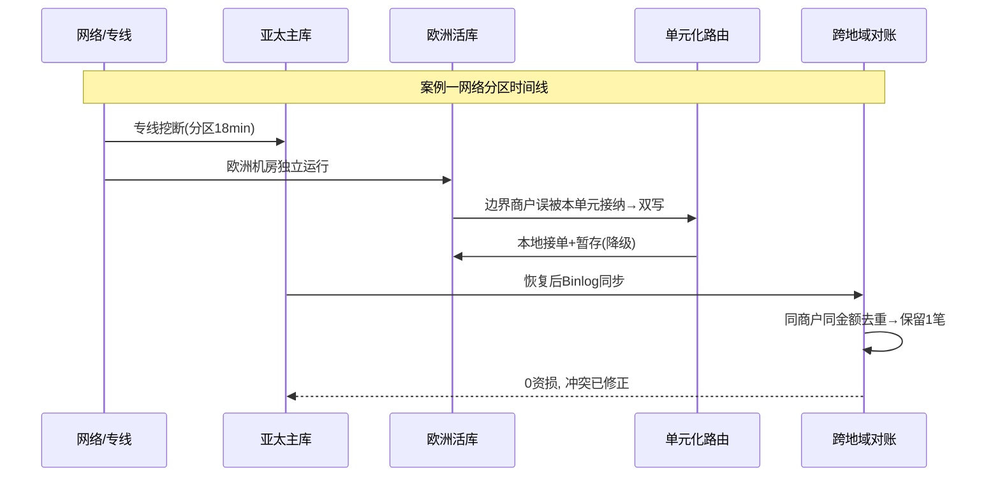

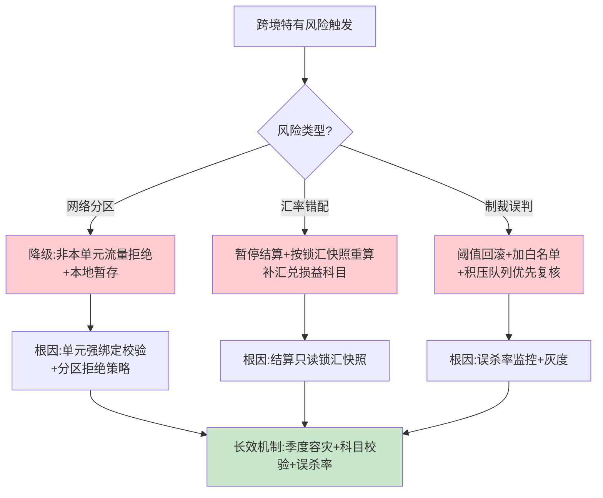

---

## 附录二、【横向对比】技术选型决策

> 跨境高可用的核心岔路口是「多活架构怎么选」——同城双活 / 异地多活 / 单元化，三种方案的成本与隔离性差异巨大。

### 对比：多活架构方案

| 维度 | 同城双活 | 异地多活（事件驱动） | 单元化（按商户分片） |
| --- | --- | --- | --- |
| **数据同步** | DB 主从同步（秒级） | Binlog + Outbox 事件异步 | 单元内闭环，跨单元少 |
| **写冲突** | 无（单主写） | 有（需分片规避） | 无（单元内闭环） |
| **故障切换** | 秒级（同城） | 分钟级（跨地域） | 秒级（切流到健康单元） |
| **一致性** | 强（主从） | 最终一致（跨域） | 单元内强、跨单元最终 |
| **复杂度** | 低 | 中 | 高 |
| **跨境适配** | 不满足（单地域） | 满足（XTransfer 现状） | 最优但成本高 |
| **适用** | 一般高可用 | 跨境多地域 | 超大规模 |

**Trade-off 结论**：XTransfer 选「事件驱动多活（Outbox 跨域同步）」而非单元化，因为跨境按商户天然分片已规避大部分写冲突，且单元化架构税过高；相比单元化，事件驱动实现成本低、资金不丢（Outbox 可重放），对账兜底跨域差异。向 3.0 演进才考虑单元化闭环。

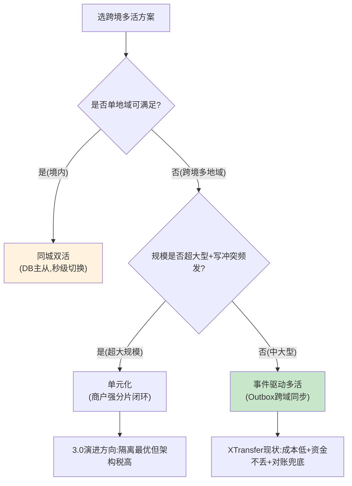

---

## 附录三、【量化指标】SLA 设计与成本收益

> 跨境高可用的量化重点是 **RTO/RPO** 与**跨 region 延迟预算**——这是和境内支付最不同的指标维度。

### 3.1 RTO / RPO 目标

| 场景 | RTO（恢复时间） | RPO（数据丢失） | 保障手段 |
| --- | --- | --- | --- |
| 单实例故障 | < 30s | 0（无状态 + 多实例） | 探活 + 自动摘流 |
| 单机房故障 | < 5min | 0（Outbox 不丢） | 流量切备机房 + 事件重放 |
| 网络分区 | < 18min（分区期） | 0（本地暂存） | 降级仅接单 + 恢复去重 |
| 渠道全不可用 | 分钟级 | 0 | 降级 ACCEPT_ONLY + 恢复后处理 |
| 数据误删/脏写 | < 24h（从备份） | 近 0（binlog 回放） | 冷热备份 + 影子校验 |

### 3.2 跨 region 延迟预算

```
亚太↔欧洲 专线 RTT ≈ 180ms; 亚太↔美洲 ≈ 210ms
  - Binlog 同步: 容忍秒级(只影响异地读实时性)
  - Outbox 事件跨域: P99 < 500ms(异步, 不阻断用户路径)
  - 用户就近接入: 本 region 内 P99 < 300ms(收款链路)
  - 跨 region 强一致禁止: 任何跨 region 写都走最终一致+对账
原则: 跨 region 只做"异步同步", 绝不做"同步等待"; 用户路径尽量收敛在本 region
```

### 3.3 成本收益测算（多活 vs 单机房）

| 维度 | 单机房主从 | 异地多活（事件驱动） | 收益 |
| --- | --- | --- | --- |
| 可用性 SLA | 99.9%（年停机 8.7h） | 99.99%（年停机 <52min） | **可用性 +1 个 9** |
| 机房故障资损风险 | 高（全停） | 0（流量切备） | 0 资损 |
| 实例成本 | 1x | ~2.2x（双地域冗余） | 成本 +120% |
| 跨境客诉（延迟） | 高（跨洋访问） | 低（就近接入） | 客诉 -60% |

### 3.4 告警阈值

```
P0: 资损任意一笔; 试算平衡率≠100%; 机房间网络分区>5min
P1: 渠道可用率<95%; 跨地域同步延迟>阈值; 对账差异>0; 制裁误杀率超基线
P2: 支付成功率<98%; 错误率>1%
P3: 跨region事件P99>500ms; 消费积压>1w
```

---

## 附录四、【答题框架】面试表达模板

> 目标：把「跨境高可用」讲成「三道防线 + 多地多活」两张图，体现资金安全与容灾双重认知。

### 4.1 分层回答套路

> **一句话定调**：「跨境支付的高可用 = 资金安全三道防线（事前/事中/事后）+ 多地多活（同城/异地/单元化），我按『先防错、再容灾、最后兜底对账』来讲。」
>
> **核心原理**：事前幂等+状态机 CAS+限额+制裁筛查；事中试算平衡+卡单告警；事后 T+1 对账+差错。容灾靠流量切换+数据同步+降级预案，资金不丢靠 Outbox。
>
> **项目落地**：XTransfer 异地多活（Outbox 跨域同步），渠道熔断切备，风控超时放行+事后核查，汇率锁汇快照，制裁三层筛查。
>
> **边界与权衡**：多机房不等于高可用（要切流+同步+检测）；单元化隔离最优但架构税高，当前选事件驱动多活是匹配场景的取舍。

### 4.2 STAR 叙事模板（针对追问：「跨境支付怎么保证高可用」）

| STAR | 内容要点 |
| --- | --- |
| **S** | 跨境天然多地域、多币种、渠道不可控、合规硬约束。 |
| **T** | 设计 99.99% 可用、0 资损、可容灾的收款系统。 |
| **A** | 三道防线 + 多地多活；渠道熔断切备；汇率锁汇快照；制裁三层筛查（精确+模糊+人工）；降级预案（风控超时放行）。 |
| **R** | 99.99% SLA、0 资损、容灾演练季度验证、客诉 -60%。 |

### 4.3 白板表达结构（先画三道防线 + 多地多活）

```
1) 先画「资金安全三道防线」(事前/事中/事后) —— 立资金安全
2) 画「多地多活架构图」(亚太主+欧洲/美洲活) + 数据同步 —— 立容灾
3) 放大「跨境四大挑战」(时区/汇率/合规/流动性) + 系统方案 —— 展差异
4) 画「容灾降级矩阵」 —— 讲故障域隔离
5) 收尾: RTO/RPO 目标 + 跨region延迟预算 —— 量化
```
> 口诀：**先三道防线后多地多活，先资金安全后容灾，最后用 RTO/RPO 量化**。别一上来堆机房图。

### 4.4 逃生话术

- **被问到单元化落地的具体实现（如分片路由中间件）**：「单元化是我们 3.0 演进方向，当前是事件驱动多活；分片路由的具体中间件我没在生产落地，但设计上按商户号强绑定单元、跨单元拒绝写入，这点我能讲清。」
- **被问到没做过的「云原生多区域（如 Stripe on AWS）」**：「云原生多区域依赖强云厂商，我们跨境合规要求数据可控，选自建多活；托管方案利弊我了解但没实操，如实说。」
- **被问到指标**：「RTO/RPO/跨region延迟预算我都带口径，可用性 99.99% 怎么乘出来可以现场写。」

<!-- EXPANDED -->
